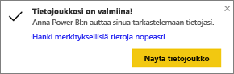
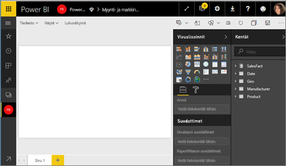
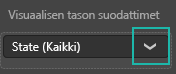
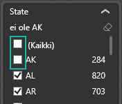
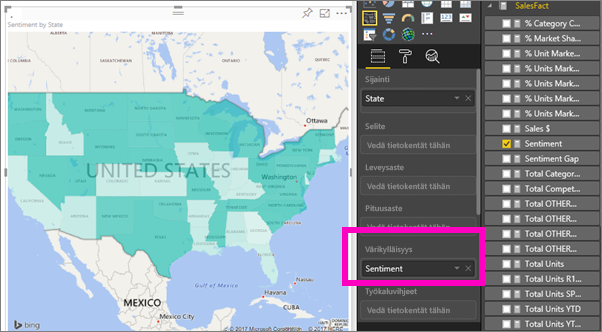
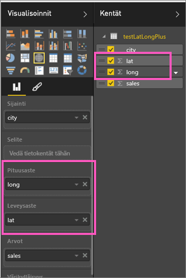

# Täytetyt kartat (koropleettikartat) Power BI:ssä
Täytetyssä kartassa käytetään sävytystä tai kuvioita esittämään, miten arvot vaihtelevat suhteellisesti maantieteellisellä alueella.  Suhteelliset erot hahmottuvat nopeasti, kun sävytys vaihtelee vaaleammasta (tarkoittaen harvinaisempaa/pienempää) tummempaan (yleisempi/enemmän).    

## Mitä Bingille lähetetään?
Power BI:n voi integroida Bingin kanssa, jotta käytettäviin saadaan oletusarvoiset karttakoordinaatit (prosessia kutsutaan geokoodaukseksi). Kun luot karttavisualisoinnin Power BI -palvelussa tai Power BI Desktopissa, Bingille lähetetään tiedot visualisoinnin luonnissa käytettävistä **Sijainti**-, **Leveysaste**- ja **Pituusaste**-säilöistä.

Palomuuri on ehkä päivitettävä, jotta Bingin geokoodauksessa hyödyntämiä URL-osoitteita voidaan käyttää.  Tässä on luettelo näistä URL-osoitteista:
    * https://dev.virtualearth.net/REST/V1/Locations
    * https://platform.bing.com/geo/spatial/v1/public/Geodata
    * https://www.bing.com/api/maps/mapcontrol

Lisätietoja Bingille lähetettävistä tiedoista sekä vinkkejä geokoodauksen parantamiseen saat ohjeaiheesta [Vihjeitä ja vinkkejä karttavisualisointeja varten](power-bi-map-tips-and-tricks.md).

## Milloin kannattaa käyttää täytettyä karttaa?
Täytetyt kartat ovat hyvä vaihtoehto, kun:

* haluat esittää kvantitatiivista tietoa kartalla.
* haluat esittää paikkaan liittyviä malleja ja paikkojen välisiä suhteita.
* kun tiedot on standardoitu.
* kun käsittelet sosioekonomisia tietoja.
* kun määritetyt alueet ovat tärkeitä.
* kun haluat yleiskuvan jakaumasta maantieteellisten sijaintien suhteen.

### Edellytykset
- Power BI -palvelu tai Power BI Desktop
- Myynti- ja markkinointimalli

Jos haluat tehdä samat toimet opetusohjelman mukana, opetusohjelmassa käytetään Power BI -palvelua, ei Power BI Desktopia.

## Perusluontoisen täytetyn kartan luominen
Tällä videolla Kim luo peruskartan ja muuntaa sen täytetyksi kartaksi.

<iframe width="560" height="315" src="https://www.youtube.com/embed/ajTPGNpthcg" frameborder="0" allowfullscreen></iframe>

1. Jos haluat luoda täytetyn kartan opetusohjelman mukana, [lataa itsellesi Myynti- ja markkinointimalli](sample-datasets.md) kirjautumalla sisään Power BI:hin ja valitsemalla **Nouda tiedot \> Mallit \> Myynti ja markkinointi\> Yhdistä**.
2. Kun näyttöön tulee sanoma onnistumisesta, valitse **Näytä tietojoukko**.

   
3. Power BI avaa tyhjän raporttipohjan [muokkausnäkymässä](service-interact-with-a-report-in-editing-view.md).

    
4. Valitse Kentät-ruudusta **Alue** \> **Osavaltio**.    

   
5. [Muuta kaavio](power-bi-report-change-visualization-type.md) täytetyksi kartaksi. Huomaa, että kohdassa **Sijainti** näkyy nyt **Osavaltio**. Bing Maps käyttää **Sijainti**-kohdan kenttää kartan luomiseen.  Sijainti voi tarkoittaa monenlaisia kelvollisia paikkatietoja: maita, osavaltioita, piirikuntia, kaupunkeja, postinumeroita ja niin edelleen. Bing Maps tarjoaa täytettävät karttamuodot sijainteja varten, olivatpa ne missä päin maailmaa tahansa. Jos Sijainti-kohdassa ei ole kelvollista merkintää, Power BI ei voi luoda täytettyä karttaa.  

   
6. Voit suodattaa kartan näyttämään vain Yhdysvaltojen mannerosat.

   a.  Etsi Visualisoinnit-ruudun alaosasta **Suodattimet**-alue.

   b.  Vie hiiren osoitin kohtaan **Osavaltio** ja napsauta laajennusnuolta.  
   

   c.  Valitse valintaruutu vaihtoehdon **Kaikki** vierestä ja poista valintamerkki vaihtoehdosta **AK**.

   
7. Valitse **SalesFact** \> **Asenne**, jolloin valittu vaihtoehto tulee näkyviin kohtaan **Värikylläisyys**. **Värikylläisyys**-kohdassa oleva kenttää määrittää kartan sävytyksen.  
   
8. Täytetty kartta sävytetään vihreällä niin, että vaaleanvihreä edustaa alempia asennearvoja ja tummanvihreät suurempia, positiivisempia asenteita.  Seuraavassa kuvassa näkyy korostettuna Wyomingin osavaltio (WY), josta voi nähdä, että sen asennearvo on erittäin hyvä, 74.  
   
9. [Tallenna raportti](service-report-save.md).

## Korostaminen ja ristiinsuodatus
Lisätietoja Suodattimet-paneelin käyttämisestä saat ohjeaiheesta [Suodattimen lisääminen raporttiin](power-bi-report-add-filter.md).

Yksittäisen sijainnin korostaminen täytetyssä kartassa ristiinsuodattaa muut raporttisivulla olevat visualisoinnit – ja päinvastoin.

Jos haluat tehdä samat toimet opetusohjelman mukana, kopioi täytetty kartta ja liitä se *Myynti- ja markkinointiraportin* **Asenne**-sivulle.

1. Valitse täytetystä kartasta jokin osavaltio.  Osavaltio korostuu myös muissa saman sivun visualisoinneissa. Jos valitsen esimerkiksi **Texas**, näen, että sen asennearvo on 74, se kuuluu alueeseen Central District \#23 ja suurin osa sen myyntimääristä on peräisin Moderation (maltillinen)- ja Convenience (päivittäistavara) ‑segmenteistä.   
   
2. Voit valita viivakaaviosta joko **Ei** tai **Kyllä**. Toiminto suodattaa täytetyn kartan niin, että se näyttää asennearvot vuoroin VanArsdelista ja vuoroin sen kilpailijasta.  
   

## Huomioon otettavat seikat ja vianmääritys
Karttatiedot saattavat olla epäselviä.  Esimerkiksi Ranskassa on Paris (Pariisi) mutta myös Texasissa on Paris. Olet luultavasti tallentanut maantieteelliset tiedot erillisiin sarakkeisiin: oma sarake kaupunkien nimille, oma osavaltion tai provinssin nimille ja niin edelleen. Bing ei välttämättä pysty sen vuoksi päättelemään, kumpi Paris on kyseessä. Jos tietojoukossasi on valmiiksi mukana leveys- ja pituusasteet, Power BI:ssä on erityiskenttiä, joiden avulla voit poistaa kartoista edellä kuvatun kaltaiset epäselvyydet. Vedä leveystiedot sisältävä kenttä Visualisoinnit \> Leveysaste-alue.  Tee sama pituusastetiedoille.  

Jos sinulla on oikeudet muokata tietojoukkoa Power BI Desktopissa, katso seuraava video, jossa käsitellään karttaepäselvyyksien vähentämistä.

<iframe width="560" height="315" src="https://www.youtube.com/embed/Co2z9b-s_yM" frameborder="0" allowfullscreen></iframe>

Jos sinulla ei käytettävissäsi leveys- ja pituusastetietoja [päivitä tietojoukkosi näiden ohjeiden mukaan](https://support.office.com/article/Maps-in-Power-View-8A9B2AF3-A055-4131-A327-85CC835271F7).

Lisäohjeita karttavisualisointien tekemiseen saat ohjeaiheesta [Vihjeitä ja vinkkejä karttavisualisointeja varten](power-bi-map-tips-and-tricks.md).

## Seuraavat vaiheet
[Täytetyn kartan lisääminen koontinäytön ruuduksi (visualisoinnin kiinnittäminen)](service-dashboard-tiles.md)    
 [Visualisoinnin lisääminen raporttiin](power-bi-report-add-visualizations-i.md)  
 [Visualisointityypit Power BI:ssä](power-bi-visualization-types-for-reports-and-q-and-a.md)    
 [Käytettävän visualisoinnin tyypin vaihtaminen](power-bi-report-change-visualization-type.md)      
Onko sinulla kysyttävää? [Kokeile Power BI -yhteisöä](http://community.powerbi.com/)
