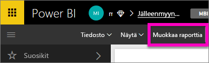
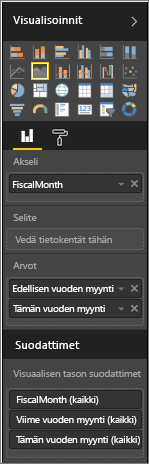
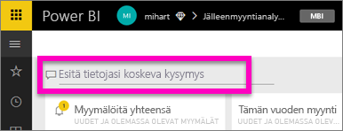
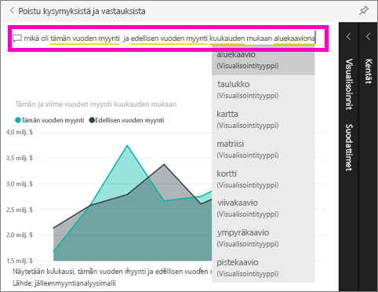

# Power BI Q&A:n käytön aloittaminen (pikaopas)
## Power BI Q&A:n käyttäminen Jälleenmyyntianalyysimallin kanssa
Joskus nopein tapa saada vastauksia tiedoista on esittää kysymyksiä luonnollisella kielellä.  Tässä pikaoppaassa tarkastelemme kahta eri tapaa luoda sama visualisointi: ensin se luodaan raportissa ja sen jälkeen esittämällä kysymys Q&A:ssa. Käytämme Power BI -palvelua, mutta prosessi on lähes samanlainen Power BI Desktopissa.

Esimerkkien seuraaminen edellyttää, että käytössäsi on raportti, jota voit muokata, joten käytämme yhtä Power BI:hin sisältyvistä malleista.

## Menetelmä 1: raporttieditorin käyttäminen
1. Valitse Power BI -työtilassa **Nouda tiedot** \> **Mallit** \> **Jälleenmyyntianalyysimalli**  >   **Yhdistä**.
   
    
2. Koontinäyttö sisältää alueen kaavioruudun Viime vuoden myynti ja tämän vuoden myynti.  Valitse kyseinen ruutu. 
   
   * Jos tämä ruutu on luotu Q&A:lla, ruudun valitseminen avaa Q&A:n. 
   * Tämä ruutu on kuitenkin luotu raportissa, joten raportista avautuu sivu, joka sisältää tämän visualisoinnin.
3. Avaa raportti muokkausnäkymässä valitsemalla **Muokkaa raporttia**.  Jos et ole raportin omistaja, et voi avata raporttia muokkausnäkymässä.
   
    
4. Valitse aluekaavio ja tarkista **Kentät**-ruudun asetukset.  Raportin tekijä loi kaavion valitsemalla nämä kolme arvoa (**Aika > Tilikauden kuukausi**, **Myynti > Tämän vuoden myynti**, **Myynti > Viime vuoden myynti > Arvo**) ja järjestämällä ne **Akseli**- ja **Arvot**-lähteiden mukaan.
   
    

## Menetelmä 2: Q&A:n käyttäminen
Miten tämä sama viivakaavio luodaan käyttämällä Q&A:ta?

1. Siirry takaisin Jälleenmyyntianalyysimallin koontinäyttöön.
2. Kirjoita käyttämällä luonnollista kieltä jotakin tällaista kysymysruutuun:
   
   **mikä oli tämän vuoden myynti ja edellisen vuoden myynti kuukauden mukaan aluekaaviona**
   
   Kun kirjoitat kysymystä, Q&A hakee parhaan visualisoinnin ja näyttää sen perusteella vastauksen; visualisointi muuttuu dynaamisesti kysymystä muokatessa. Q&A auttaa myös kysymyksen muotoilussa käyttämällä ehdotuksia, automaattista täydennystä ja oikeinkirjoituksen korjauksia.
   
   Kun olet kirjoittanut kysymyksen, tuloksena on täsmälleen sama kaavio kuin raportissa.  Tällä tavalla se kuitenkin syntyy paljon nopeammin!
   
   
3. Vastaavasti kuin raportteja käsiteltäessä Visualisoinnit-, Suodattimet- ja Kentät-ruudut ovat käytettävissä Q&A:ssa.  Avaamalla ruudut voit tutkia ja muokata visualisointia entisestään.
4. Jos haluat kiinnittää kaavion koontinäyttöösi, valitse Kiinnitä-kuvake .

## Seuraavat vaiheet
[Q&A Power BI:ssä](power-bi-q-and-a.md)

[Tietojen muokkaaminen toimimaan hyvin Power BI:n Q&A-toiminnon kanssa](service-prepare-data-for-q-and-a.md)

Onko sinulla muuta kysyttävää? [Kokeile Power BI -yhteisöä](http://community.powerbi.com/)

