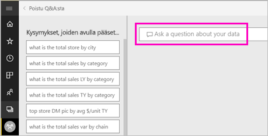

# Visualisoinnin luominen Power BI:n Q&A:n avulla

Joskus nopein tapa saada vastauksia tiedoista on esittää kysymyksiä luonnollisella kielellä.  Tässä artikkelissa tarkastelemme kahta eri tapaa luoda sama visualisointi: ensin esittämällä kysymys Q&A:ssa ja sitten luomalla se raportissa. Käytämme Power BI -palvelua visualisoinnin luomiseen raportissa, mutta prosessi on lähes samanlainen Power BI Desktopissa.

Esimerkkien seuraaminen edellyttää, että käytössäsi on raportti, jota voit muokata, joten käytämme yhtä Power BI:hin sisältyvistä malleista.

## Visualisoinnin luominen Q&A:n avulla

Miten tämä viivakaavio luodaan käyttämällä Q&A:ta?

1. Valitse Power BI -työtilassa **Nouda tiedot** \> **Mallit** \> **Jälleenmyyntianalyysimalli**  >   **Yhdistä**.

1. Avaa Jälleenmyyntianalyysimalli-koonti näyttö, siirrä sijoita kohdistin Q&A-ruutuun ja **esitä tietojasi koskeva kysymys**.

    

2. Kirjoita Q&A-ruutuun tämän tyyppinen kysymys:
   
    **tämän vuoden myynti ja edellisen vuoden myynti kuukauden mukaan aluekaaviona**
   
    Kun kirjoitat kysymystä, Q&A hakee parhaan visualisoinnin ja näyttää sen perusteella vastauksen; visualisointi muuttuu dynaamisesti kysymystä muokatessa. Q&A auttaa myös kysymyksen muotoilussa ehdotusten, automaattisen täydennyksen ja oikeinkirjoituksen korjausehdotusten avulla. Q&A ehdottaa vähäistä muutosta sanamuotoon: tämän vuoden myynti ja edellisen vuoden myynti *aika kuukauden* mukaan aluekaaviona.  

    

4. Hyväksy ehdotus valitsemalla lause. 
   
   Kun olet kirjoittanut kysymyksen, tuloksena on sama kaavio kuin koontinäytössä.
   
   

4. Jos haluat kiinnittää kaavion raporttinäkymään, valitse Kiinnitä-kuvake  oikeassa yläkulmassa.

## Visualisoinnin luominen raporttieditorissa

1. Siirry takaisin Jälleenmyyntianalyysimallin koontinäyttöön.
   
2. Koontinäyttö sisältää saman alueen kaavioruudun Viime vuoden myynti ja tämän vuoden myynti.  Valitse kyseinen ruutu. Älä valitse Q&A:lla luomaasi ruutua. Sen valitseminen avaa Q&A:n. Alkuperäinen aluekaavioruutu on kuitenkin luotu raportissa, joten raportista avautuu sivu, joka sisältää tämän visualisoinnin.

    

1. Avaa raportti muokkausnäkymässä valitsemalla **Muokkaa raporttia**.  Jos et ole raportin omistaja, et voi avata raporttia muokkausnäkymässä.
   
    
4. Valitse aluekaavio ja tarkista **Kentät**-ruudun asetukset.  Raportin tekijä loi kaavion valitsemalla nämä kolme arvoa (**Viime vuoden myynti** ja **Tämän vuoden myynti > Arvo** **Myynti**-taulukosta ja **Tilikauden Kuukausi** **Aika**-taulukosta) ja järjestämällä ne **Akseli**- ja **Arvot**-säilöjen mukaan.
   
    

    Näet, että päädyttiin samaan visualisointiin. Luominen tällä tavalla ei ollut kovin monimutkaista. Silti luominen Q&A:lla oli helpompaa!

## Seuraavat vaiheet

- [Q&A:n käyttäminen koontinäyttöissä ja raporteissa](power-bi-tutorial-q-and-a.md)  
- [Q&A kuluttajille](consumer/end-user-q-and-a.md)
- [Tietojen muokkaaminen toimimaan hyvin Power BI:n Q&A-toiminnon kanssa](service-prepare-data-for-q-and-a.md)

Onko sinulla muuta kysyttävää? [Kokeile Power BI -yhteisöä](https://community.powerbi.com/)

