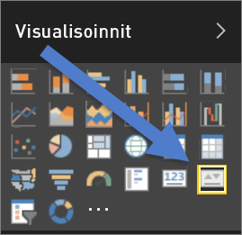
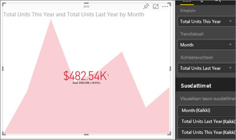

# Suorituskykyilmaisimien visualisoinnit
Suorituskykyilmaisin (KPI) on visuaalinen vihje, joka kertoo edistymisen määrän kohti mitattavissa olevaa tavoitetta. Katso lisätietoja suorituskykyilmaisimista [Microsoft Developer Networkista](https://msdn.microsoft.com/library/hh272050).

## Milloin suorituskykyilmaisinta kannattaa käyttää?
Suorituskykyilmaisin on hyvä vaihtoehto, kun halutaan

* mitata edistymistä (minkä edellä vai jäljessä olen?)
* mitata etäisyyttä tavoitteeseen (kuinka paljon edellä tai jäljessä olen?)   

## Suorituskykyilmaisimen visuaaliset vaatimukset
Suorituskykyilmaisin perustuu tiettyyn mittayksikköön, ja se on suunniteltu mittayksikön nykyisen arvon ja tilan arviointiin määritettyyn kohteeseen verrattuna. Siksi suorituskykyilmaisimen visualisointi edellyttää *perustason* mittayksikköä, joka tekee arvioinnin arvoon ja *kohde*mittayksikköön tai arvoon ja raja-arvoon tai tavoitteeseen.

> [!NOTE]
> Tällä hetkellä suorituskykyilmaisimen tietojoukon pitää sisältää suorituskykyilmaisimen tavoitearvoja. Jos tietojoukko ei sisällä niitä, voit luoda tavoitteita lisäämällä tietomalliin tai PBIX-tiedostoon Excel-taulukon, jossa on tavoitteita.
> 
> 

## Suorituskykyilmaisimen luominen
Seurataksesi kirjaudu Power BI -palveluun ja valitse **Nouda tiedot > Mallit > Jälleenmyyntianalyysimalli**. Luomme suorituskykyilmaisimen, joka mittaa edistymisen kohti myynnin tavoitetta.

Tai kello näyttää, miten voit luoda yksittäisten arvojen visualisoinnit: mittarit, kortit ja suorituskyvyn mittarit.

<iframe width="560" height="315" src="https://www.youtube.com/embed/xmja6EpqaO0?list=PL1N57mwBHtN0JFoKSR0n-tBkUJHeMP2cP" frameborder="0" allowfullscreen></iframe>

1. Avaa raportti [muokkausnäkymässä](service-reading-view-and-editing-view.md) ja [lisää uusi sivu](power-bi-report-add-page.md).    
2. Valitse **Myynti > Yksikköjen kokonaismäärä tänä vuonna**.  Tämä on ilmaisin.
3. Lisää **Kellonaika > Kuukausi**.  Tämä edustaa trendiä.
4. TÄRKEÄÄ: Lajittele kaavio **kuukauden** mukaan. Kun muunnat visualisoinnin suorituskykyilmaisimeksi, lajitteluvaihtoehtoa ei ole.

    
5. Muunna visualisointi suorituskykyilmaisimeksi valitsemalla suorituskykyilmaisimen kuvake Visualisointi-ruudusta.
   
    
6. Lisää tavoite. Lisää edellisen vuoden myynti tavoitteeksi. Vedä **Yksikköjen kokonaismäärä viime vuonna** **Kohdetavoitteet**-kenttään.
   
    
7. Vaihtoehtoisesti voit muotoilla suorituskykyilmaisimen avaamalla muotoiluruudun valitsemalla maalitelakuvakkeen.
   
   * **Ilmaisin** – ohjaa ilmaisimen näyttöyksiköitä ja desimaaleja.
   * **Trendiakseli** – kun arvona on **Käytössä**, trendiakseli näkyy suorituskykyilmaisimen visualisoinnin taustalla.  
   * **Tavoitteet** – kun arvona on **Käytössä**, visualisointi näyttää tavoitteen ja etäisyyden tavoitteesta prosenttilukuna.
   * **Värikoodaus > Suunta** – joitakin suorituskykyilmaisimia pidetään *parempina* suuremmille arvoille ja joitakin pidetään *parempina* pienemmille arvoille. Esimerkiksi tulot vs. odotusaika. Yleensä tulojen suurempi arvo on parempi verrattuna odotusajan suurempaan arvoon. Valitse **suuri on parempi**, ja voit myös muuttaa väriasetuksia.

1. Kun suorituskykyilmaisimessa on haluamasi asetukset, [kiinnitä se koontinäyttöön](service-dashboard-pin-tile-from-report.md).

Suorituskykyilmaisimet ovat myös käytettävissä mobiililaitteissa – voit siis aina olla yhteydessä liiketoimintasi sykkeeseen.

## Huomioon otettavat seikat ja vianmääritys
* Jos suorituskykyilmaisimesi ei näytä samalta kuin edellä, sinun täytyy ehkä lajitella kuukauden mukaan. Koska suorituskykyilmaisimissa ei ole lajitteluasetusta, sinun täytyy lajitella kuukauden mukaan *ennen* visualisoinnin muuntamista suorituskykyilmaisimeksi.

## Seuraavat vaiheet

[Visualisoinnit Power BI -raporteissa](power-bi-report-visualizations.md)

Onko sinulla kysyttävää? [Kokeile Power BI -yhteisöä](http://community.powerbi.com/)

