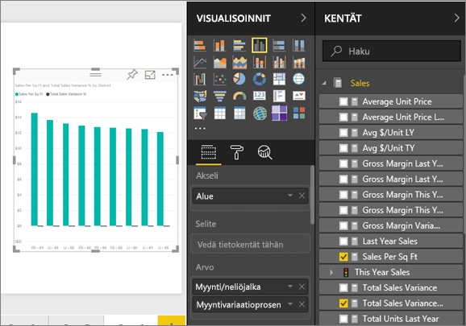
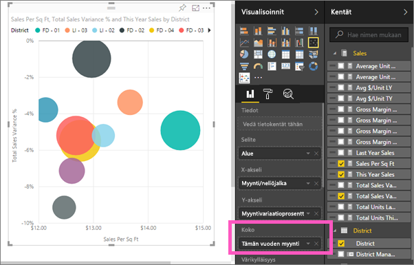
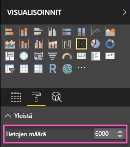
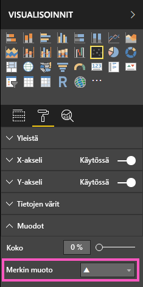
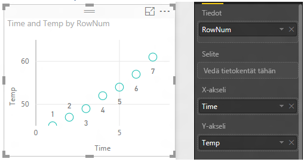
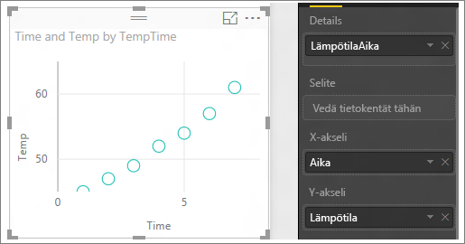

# Pistekaaviot ja kuplakaaviot Power BI:ssä (opetusohjelma)
Pistekaaviossa on aina kaksi arvoakselia, jotka näyttävät yhden numeerisen tietosarjan vaakasuuntaisella akselilla ja toisen numeerisen arvosarjan pystysuuntaisella akselilla. Kaaviossa näytetään arvopisteet numeerisen arvon X ja Y leikkauskohdassa yhdistämällä nämä kaksi arvoa yhdeksi arvopisteeksi. Nämä arvopisteet voidaan jakaa tasaisesti tai epätasaisesti vaakasuuntaiselle akselille tietojen mukaan.

Kuplakaaviossa arvopisteet korvataan kuplilla ja kuplan *koko* kuvastaa tietojen muuta dimensiota.

Voit määrittää arvopisteiden määrän  

## Milloin kannattaa käyttää pistekaaviota tai kuplakaaviota
### Pistekaavio on hyvä valinta:
* suhteiden osoittamiseen 2:n (piste) tai 3:n (kupla) **numeerisen** arvon välillä.
* kahden numeroryhmän piirtämiseen yhtenä XY-koordinaattien sarjana.
* viivakaavion sijaan silloin, kun halutaan muuttaa vaakasuuntaisen akselin asteikkoa    
* vaakasuuntaisen akselin muuttamiseen logaritmiseen asteikkoon.
* sellaisten laskentataulukon tietojen näyttämiseen, joihin sisältyy arvopareja tai ryhmiteltyjä arvosarjoja. Pistekaaviossa on mahdollista säätää akselien yksittäisiä asteikkoja lisätietojen saamiseksi ryhmitellyistä arvoista.
* toistuvien mallien osoittamiseen suurissa tietojoukoissa esimerkiksi osoittamalla lineaarisia tai epälineaarisia trendejä, klustereita ja poikkeavia arvoja.
* suurten arvopistemäärien vertailuun ajasta riippumatta.  Mitä enemmän tietoja sisällytät pistekaavioon, sitä parempia vertailuja voit tehdä.

### Kuplakaavio on hyvä valinta:
* jos tiedoissasi on 3 arvosarjaa, joista jokainen sisältää joukon arvoja.
* taloudellisten tietojen esittämiseen.  Erikokoiset kuplat ovat hyödyllisiä erityisten arvojen visuaaliseen korostamiseen.
* neljännesten kanssa käytettäväksi.

## Pistekaavion luominen
Katso tästä videosta, miten Will luo pistekaavion, ja noudata sitten seuraavia ohjeita luodaksesi sellaisen itse.

<iframe width="560" height="315" src="https://www.youtube.com/embed/PVcfPoVE3Ys?list=PL1N57mwBHtN0JFoKSR0n-tBkUJHeMP2cP" frameborder="0" allowfullscreen></iframe>

Näissä ohjeissa käytetään jälleenmyyntianalyysimallia. Jos haluat seurata ohjeita itse, [lataa malli](sample-datasets.md) joko Power BI ‑palveluun (app.powerbi.com) tai Power BI Desktopiin.   

1. Valitse keltainen plus-kuvake luodaksesi [tyhjän raporttisivun](power-bi-report-add-page.md).
 
2. Valitse Kentät-ruudusta seuraavat kentät:
   - **Myynti** > **Myynti/neliöjalka**
   - **Myynti** > **Myyntivariaatio-% yhteensä**
   - **Alue** > **Alue**

    

    Jos käytät Power BI ‑palvelua, varmista, että avaat raportin [muokkausnäkymässä](service-interact-with-a-report-in-editing-view.md).

3. Muunna pistekaavioksi. Valitse Visualisointi-ruudussa Pistekaavio-kuvake.

   .

4. Vedä **Alue** kohteesta **Tiedot** kohteeseen **Selite**. Tämä tuo esille pistekaavion, jossa **Myyntivariaatio-% yhteensä** on piirretty Y-akselille ja **Myynti/neliöjalka** X-akselille. Arvopisteiden värit edustavat alueita:

    

Nyt lisätään kolmas dimensio.

## Kuplakaavion luominen

1. Vedä **Kentät**-ruudusta **Myynti** > **Tämän vuoden myynti** > **Arvo** alueelle **Koko**. Arvopisteet laajenevat myynnin arvon mukaisiin kokoihin.
   
   

2. Pidä hiiren osoitinta kuplan päällä. Kuplan koko kuvastaa arvoa **Tämän vuoden myynti**.
   
    

3. Voit määrittää kuplakaaviossa näkyvien arvopisteiden määrän laajentamalla **Visualisoinnit**-ruudun **Muoto**-osiossa olevan kortin **Yleistä** ja säätämällä kohtaa **Tietojen määrä**. Voit määrittää tietojen enimmäismääräksi minkä tahansa luvun, joka on enintään 10 000 (oletusarvo on 3 500).

     

   > [!NOTE]
   > Enemmän arvopisteitä voi tarkoittaa pidempää latausaikaa, joten jos haluat julkaista raportteja, joiden rajat ovat asteikon yläpäässä, testaa raporttejasi myös verkossa ja mobiililaitteilla sen varmistamiseksi, että suorituskyky vastaa käyttäjien odotuksia. Ota huomioon, että suurempien arvopistemäärien osalta sinun on testattava tuloksia erilaisilla muototekijöillä hyvän suorituskyvyn varmistamiseksi.

4. Voit [muotoilla visualisoinnin värejä, nimiä, otsikoita, taustaa ja muuta](service-getting-started-with-color-formatting-and-axis-properties.md). Jos haluat [parantaa helppokäyttöisyyttä](desktop-accessibility.md), harkitse merkin muotojen lisäämistä kullekin riville. Erilaisten merkin muotojen käyttö kullekin riville helpottaa raporttien käyttäjiä erottamaan rivit (tai alueet) toisistaan. Voi valita merkin muodon laajentamalla **Muodot**-kortin ja valitsemalla sitten merkin muodon.

      

   Voit myös muuttaa merkin muodon vinoneliöksi, kolmioksi tai neliöksi:

   

## Huomioon otettavat seikat ja vianmääritys

### **Pistekaaviossasi on vain yksi arvopiste**
Onko pistekaaviossasi vain yksi arvopiste, joka koostaa kaikki arvot X- ja Y-akseleille?  Vai yhdistääkö kaavio kaikki arvot yhdelle vaaka- tai pystysuuntaiselle riville?

Lisää kenttä **Tiedot**-alueelle ja kerro näin Power BI:lle, miten arvot ryhmitetään. Kentän on oltava yksilöllinen jokaiselle arvopisteelle, jonka haluat piirtää.  
Esimerkiksi yksinkertainen rivin numero tai tunnuskenttä:

Tai jos tiedoissasi ei ole näitä, luo kenttä, joka liittää X- ja Y-arvot yhteen niin, että ne yksilöivät pisteen:

Jos haluat luoda uuden kentän, [käytä Power BI Desktopin kyselyeditoria lisätäksesi indeksisarakkeen](desktop-add-custom-column.md) tietojoukkoosi.  Lisää sitten tämä sarake visualisointisi **Tiedot**-alueelle.

## Seuraavat vaiheet
 [Visualisointityypit Power BI:ssä](power-bi-visualization-types-for-reports-and-q-and-a.md)

[Kokeile sitä – se on ilmainen!](https://powerbi.com/)  

Onko sinulla muuta kysyttävää? [Kokeile Power BI -yhteisöä](http://community.powerbi.com/)

