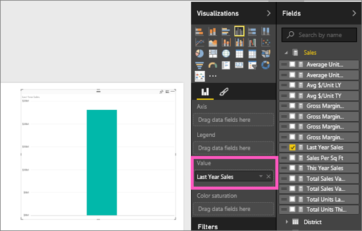
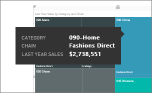
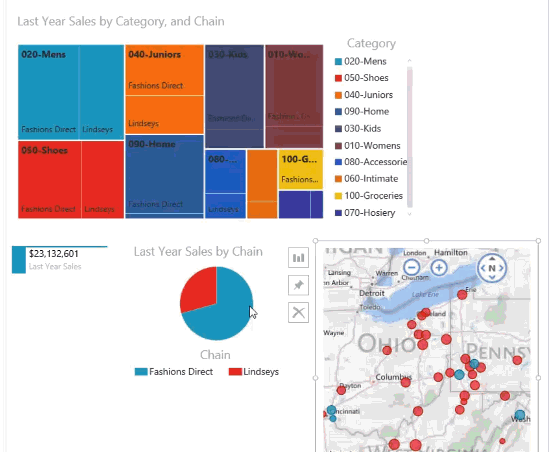

# Puukartat Power BI:ssä
Puukartoissa hierarkkiset tiedot näytetään sisäkkäisten suorakulmioiden joukkona.  Hierarkian kukin taso on edustettuna värillisenä suorakulmiona (jota kutsutaan usein ”haaraksi”), joka sisältää muita suorakulmioita (”lehtiä”).  Kunkin suorakulmion sisällä oleva alue määräytyy mitattavan kvantitatiivisen arvon perusteella, jolloin suorakulmiot järjestetään koon mukaan ylävasemmalta (suurin) alaoikealle (pienin).

Jos esimerkiksi analysoin yritykseni myyntilukuja, voin valita näytettäviksi ylätason suorakulmioita (haaroja) vaatetuskategorioiden mukaan: **Kaupunki**, **Maaseutu**, **Nuoriso** ja **Sekalaiset**.  Luokkasuorakulmat sisältävät tällöin pienempiä suorakulmioita (lehtiä), jotka edustavat kunkin luokan vaatevalmistajia. Nämä pienemmät suorakulmiot taas järjestetään koon mukaan ja niiden värisävy perustuu tuotteiden myyntimääriin.  Yllä olevassa **Kaupunki**-haarassa näkyy myytäneen paljon Maximus-merkkisiä vaatteita, vähemmän Naturaa ja Famaa, ja hyvin vähän Leo-merkkisiä.  Eli puukarttani **Kaupunki**-haarassa on tällöin suurin suorakulmio Maximukselle (vasemmassa yläkulmassa), hieman pienempiä suorakulmioita Naturalle ja Famalle, paljon muita suorakulmioita, jotka edustavat kaikkia muita myytyjä vaatteita sekä pieni suorakulmio Leolle.  Voin tällöin myös verrata myytyjen tuotteiden määrää kaikkien muiden vaateluokkien osalta vertaamalla kunkin lehtisolmun kokoa ja väriä: Mitä suurempi suorakulmio ja mitä tummempi sävy, sitä korkeampi arvo.

## Milloin puukarttaa kannattaa käyttää?
Puukartat ovat hyvä vaihtoehto seuraaville:

* kun halutaan näyttää suuria määriä hierarkkisia tietoja.
* kun palkkikaaviolla ei voida tehokkaasti käsitellä suuria määriä arvoja.
* kun halutaan näyttää kunkin osan väliset ja koko kokonaisuuden mittasuhteet.
* kun halutaan näyttää mittayksikön jakautuminen kuviona kussakin hierarkian luokkatasossa.
* kun halutaan näyttää määritteet käyttämällä kokovertailua ja värikoodausta.
* kun halutaan, että kuviot, poikkeavat arvot, tärkeimmät tekijät ja poikkeukset erottuvat selvästi.

### Edellytykset
 - Power BI -palvelu tai Power BI Desktop
 - Jälleenmyyntianalyysimalli

## Peruspuukartan luominen
Haluatko ensin seurata, kun joku luo puukartan?  Siirry videossa kohtaan 2:10, niin näet, kun Amanda luo puukartan.

<iframe width="560" height="315" src="https://www.youtube.com/embed/IkJda4O7oGs" frameborder="0" allowfullscreen></iframe>

Tai luo oma puukarttasi. Näissä ohjeissa käytetään jälleenmyyntianalyysimallia. Kirjaudu Power BI -palveluun (ei Desktopiin), jotta voit seurata ohjeita. Valitse **Nouda tiedot \> Mallit \> Jälleenmyyntianalyysimalli \> Yhdistä \> Siirry koontinäyttöön**. Visualisoinnin luominen raporttiin edellyttää tietojoukon ja raportin muokkausoikeuksia. Onneksi Power BI -mallit ovat muokattavia. Jos joku kuitenkin on jakanut raportin kanssasi, et pysty lisäämään uusia visualisointeja.

1. Avaa Jälleenmyyntianalyysimallin raportti valitsemalla koontinäytössä ”Myymälöitä yhteensä” -ruutu.    
2. Avaa [Muokkausnäkymä](service-interact-with-a-report-in-editing-view.md) ja valitse **Myynti** > **Viime vuoden myynti** -mittayksikkö.   
      
3. Muuta kaavio puukartaksi.  
      
4. Vedä **Kohde** > **Luokka** **Ryhmä**-kohtaan. Power BI luo puukartan, jossa suorakulmioiden koko kuvastaa kokonaismyyntiä ja väri edustaa luokkaa.  Olet periaatteessa luonut hierarkian, joka kuvaa visuaalisesti kokonaismyynnin suhteellista kokoa luokittain.  **Miehet**-luokassa myynti on suurinta ja **Sukkatuotteet**-luokassa se on alhaisinta.   
      
5. Vedä **Kauppa** > **Ketju** **Tiedot**-kohtaan puukartan viimeistelemiseksi. Nyt voit verrata viime vuoden myyntiä luokan ja ketjun mukaan.   
   
   
   > [!NOTE]
   > Värikylläisyyttä ja Tietoja ei voi käyttää samanaikaisesti.
   > 
   > 
5. Pidä osoitinta **Ketju**-alueen päällä, jolloin saat esiin työkaluvihjeen, joka koskee **Luokan** kyseistä osaa.  Esimerkiksi pitämällä osoitinta **Lindseyn** päällä **040-lapset**-suorakulmiossa tuo esiin työkaluvihjeen, joka koskee Lindseyn osaa Lasten luokassa.  
   
6. [Lisää puukartta koontinäytön ruutuna (kiinnitä visualisointi)](service-dashboard-tiles.md). 
7. [Tallenna raportti](service-report-save.md).

## Korostaminen ja ristiinsuodatus
Lisätietoja Suodattimet-paneelin käyttämisestä saat ohjeaiheesta [Suodattimen lisääminen raporttiin](power-bi-report-add-filter.md).

Luokan tai Tietojen korostaminen yhdistelmäkaaviossa ristiinkorostaa ja ristiinsuodattaa muut raporttisivulla olevat visualisoinnit... ja päinvastoin. Voit jatkaa joko lisäämällä visualisointeja samalle sivulle tai kopioida ja liittää puukartan raporttisivulle, jolla on jo muita visualisointeja.

1. Valitse puukartasta Luokka tai Ketju Luokan sisältä.  Se ristiinkorostaa muut sivulla olevat visualisoinnit. Valitsemalla esimerkiksi **050-Kengät**, näen, että edellisen vuoden kenkämyynti oli 3 640 471 dollaria, josta 2 174 185 dollaria tuli Fashions Directistä.  
   

2. Jos **Viime vuoden myynti ketjun mukaan** -ympyräkaaviossa valitaan **Fashions Direct** -sektori, tämä ristiinsuodattaa puukartan.  
       

3. Jos haluat määrittää, miten visualisoinnit ristiinkorostavat ja -suodattavat toisiaan, katso [visualisointien vuorovaikutukset Power BI -raportissa](service-reports-visual-interactions.md)

## Seuraavat vaiheet
[Visualisoinnin kiinnittäminen koontinäyttöön](service-dashboard-pin-tile-from-report.md)  
[Power BI:n peruskäsitteet](service-basic-concepts.md)  

Onko sinulla muuta kysyttävää? [Kokeile Power BI -yhteisöä](http://community.powerbi.com/)  

