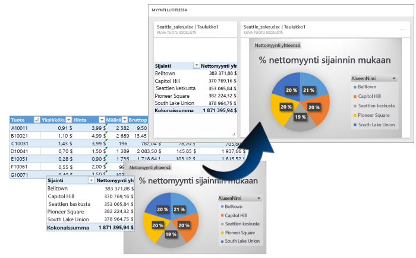
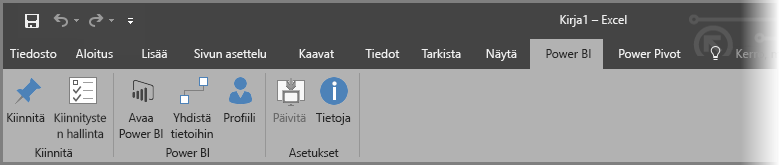
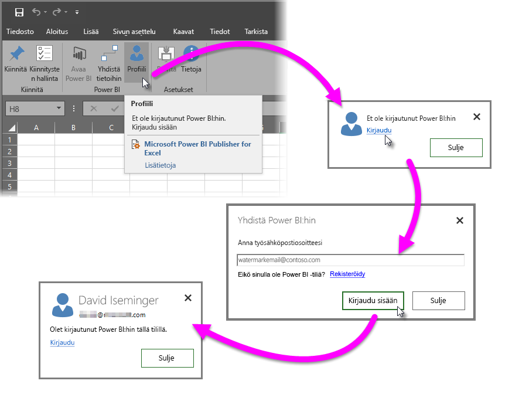
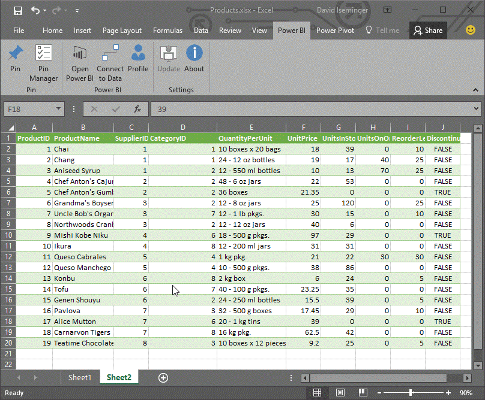
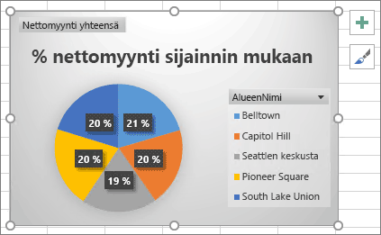
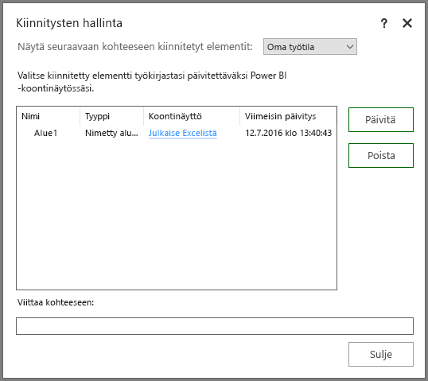
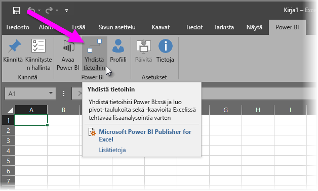
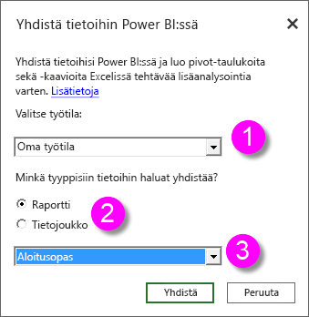
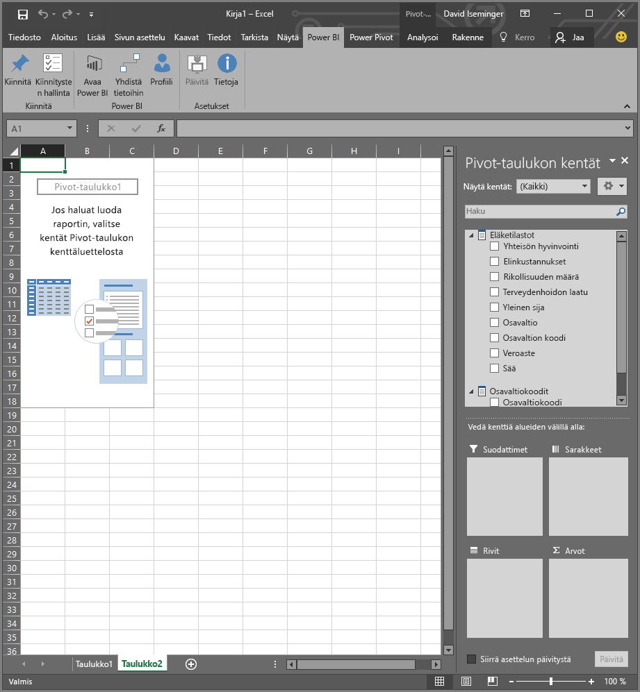
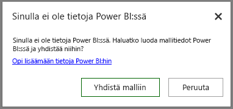

# Power BI Publisher for Excel
Microsoftin **Power BI Publisher for Excelin** avulla voit ottaa tilannevedoksia Excelin tärkeimmistä merkityksellisistä tiedoista, kuten pivot-taulukoista, kaavioista ja solualueista, ja kiinnittää niitä Power BI:n koontinäyttöihin.

Mitä voit kiinnittää? Melkeinpä mitä tahansa Excel-työkirjan sisältöä. Voit valita solualueen yksinkertaisesta taulukosta, pivot-taulukon tai pivot-kaavion, kuvituksia ja kuvia tai tekstiä.

Et voi kiinnittää 3D-karttoja tai Power View -taulukkojen visualisointeja. Voit kiinnittää myös sellaisia elementtejä, joiden kiinnittämisessä ei ole varsinaista järkeä, kuten osittajan tai aikajanasuodattimen.

Kun kiinnität elementin Excelistä, uusi ruutu lisätään Power BI:n uuteen tai aiemmin luotuun koontinäyttöön. Uusi ruutu on tilannevedos, joten se ei ole dynaaminen, mutta sitä voi silti päivittää. Jos esimerkiksi teet muutoksen jo kiinnitettyyn pivot-taulukkoon tai kaavioon, koontinäytön ruutua Power BI:ssä ei päivitetä automaattisesti, mutta voit päivittää kiinnitetyt elementit **kiinnitysten hallinnassa**. Lisätietoja **kiinnitysten hallinnasta** saat seuraavista osioista.

## Lataaminen ja asentaminen
Power BI Publisher for Excel on apuohjelma, jonka voi ladata ja asentaa Microsoft Excel 2007:n työpöytäversioon ja sitä uudempiin versioihin.

[Power BI Publisher for Excelin lataaminen](http://go.microsoft.com/fwlink/?LinkId=715729)

Kun olet asentanut Publisherin, näet Excelin valintanauhassa uuden **Power BI** -välilehden, jossa voit kirjautua sisään Power BI:hin ja ulos Power BI:stä, kiinnittää elementtejä koontinäyttöihin ja hallita jo kiinnitettyjä elementtejä.

**Power BI Publisher for Excel** -apuohjelma on oletusarvoisesti käytössä, mutta jos jostain syystä et näe Power BI -välilehteä Excelin valintanauhassa, se on otettava käyttöön. Valitse **Tiedosto**  >  **Asetukset**  >  **Apuohjelmat**  >  **COM-apuohjelmat**. Valitse **Microsoft Power BI Publisher for Excel**.

## Alueen kiinnittäminen koontinäyttöön
Voit valita laskentataulukosta minkä tahansa solualueen ja kiinnittää tilannevedoksen tästä alueesta uuteen tai aiemmin luotuun koontinäyttöön Power BI:ssä. Saman tilannevedoksen voi kiinnittää useisiin koontinäyttöihin.

Aloita varmistamalla, että olet kirjautuneena sisään Power BI:hin.

1. Valitse **Profiili** Excelin valintanauhan **Power BI** -välilehdeltä. Jos olet jo kirjautunut Power BI:hin, valintaikkuna näyttää, millä tilillä olet kirjautuneena sisään. Jos haluat käyttää tätä tiliä, siirry seuraaviin alueen kiinnittämisen vaiheisiin. Jos haluat käyttää toista Power BI -tiliä, valitse *Kirjaudu ulos*. Jos et ole kirjautunut sisään, siirry seuraavaan vaiheeseen (vaihe 2).
   
   
2. Jos et ole kirjautuneena sisään, valitse **Kirjaudu sisään** -linkki, jonka näet, kun valitset **Profiili**-kohdan Excelin valintanauhan **Power BI** -välilehdeltä. Anna **Yhdistä Power BI:hin** -valintaikkunassa käytettävän Power BI -tilin sähköpostiosoite ja valitse sitten **Kirjaudu sisään**.
   
   

Kun olet kirjautunut sisään, kiinnitä alue koontinäyttöön seuraavien ohjeiden avulla:

1. Valitse Excelin valintanauhasta **Power BI** -välilehti, niin näet **Kiinnitä**-painikkeen.
2. Valitse alue Excel-työkirjasta.
3. Napsauta **Kiinnitä**-painiketta **Power BI** -välilehdellä, niin näet **Kiinnitä koontinäyttöön** - valintaikkunan. Jos et ole kirjautuneena Power BI:hin, sinua kehotetaan kirjautumaan sisään. Valitse työtila avattavasta **Työtila**-luettelosta. Jos haluat kiinnittää omaan koontinäyttöösi, varmista, että valittuna on **Oma työtila**. Jos haluat kiinnittää koontinäyttöön ryhmän työtilassa, valitse ryhmä avattavasta luettelosta.
4. Valitse, haluatko kiinnittää *aiemmin luotuun koontinäyttöön* vai luoda *uuden koontinäytön*.
5. Kiinnitä valintasi koontinäyttöön valitsemalla **OK**.
6. Valitse **Kiinnitä koontinäyttöön** -valintaikkunassa aiemmin luotu koontinäyttö tai luo uusi koontinäyttö. Valitse sitten **OK**.
   
   

## Kaavion kiinnittäminen koontinäyttöön
Napsauta kaaviota ja valitse Kiinnitä .

## Kiinnitettyjen elementtien hallinta
**Kiinnitysten hallinnassa** voit päivittää (virkistää) kiinnitettyyn elementtiin liittyvän ruudun Power BI:ssä. Voit myös poistaa Power BI:n koontinäyttöön jo kiinnitetyn elementin kiinnityksen.

Kun haluat päivittää koontinäytön ruutuja, valitse **kiinnitysten hallinnassa** yksi tai useampia elementtejä ja valitse sitten **Päivitä**.

Jos haluat katkaista Excelistä kiinnitetyn elementin ja siihen liittyvän ruudun välisen yhteyden, valitse **Poista**. Kun valitset **Poista**, elementti *ei* poistu Excel-taulukosta eikä siihen liittyvä ruutu poistu koontinäkymästä. Poistat vain niiden välisen kiinnityksen eli *yhteyden*. Poistettu elementti ei enää näy **kiinnitysten hallinnassa**. Jos kiinnität elementin uudelleen, se näkyy uutena ruutuna.

Jos haluat poistaa kiinnitetyn elementin (ruudun) koontinäytöstä, se on tehtävä Power BI:ssä. Valitse poistettavassa ruudussa **Avaa valikko** -kuvake  ja valitse sitten **Poista ruutu**   .

## Yhdistä tietoihin Power BI:ssä
**Power BI Publisher for Excelin** heinäkuun 2016 versiosta alkaen (ylle linkitetty nykyinen versio mukaan lukien) on ollut mahdollista muodostaa yhteys suoraan Power BI -palvelussa oleviin tietoihin ja analysoida näitä tietoja Excelissä pivot-taulukoilla ja pivot-kaavioilla. Ominaisuus helpottaa Power BI -tietojen ja Excelin käyttämisen yhdessä tärkeimpien tietojen analysoimiseksi.

Tässä on muutamia parannuksista:

* Kaikki ohjaimet, joita tarvitaan yhteyden muodostamiseen Power BI:ssä oleviin tietoihin, päivitetään automaattisesti jokaisen version yhteydessä. Ohjaimia ei tarvitse asentaa tai hallita itse.
* Yhteyksien luominen ei enää edellytä .odc-tiedostojen lataamista, sillä **Power BI Publisher for Excel** luo yhteydet nyt automaattisesti, kun valitset käytettävän raportin tai tietojoukon.
* Voit luoda useita yhteyksiä ja pivot-taulukkoja samaan työkirjaan.
* Virhesanomia on parannettu ja kohdennettu **Power BI Publisher for Exceliin** sen sijaan, että käytettäisiin Excelin oletussanomia.

### Yhteyden muodostaminen Power BI -tietoihin Excelissä
Muodosta yhteys Power BI -tietoihin **Power BI Publisher for Exceliä** käyttämällä noudattamalla näitä helppoja ohjeita:

1. Varmista, että ole kirjautunut Power BI:hin. Kirjautumisen ja kirjautumistilin vaihtamisen vaiheet on kuvattu aiemmin tässä artikkelissa.
2. Kun olet kirjautunut Power BI:hin haluamallasi tilillä, valitse **Yhdistä tietoihin** Excelin valintanauhan **Power BI** -välilehdellä.
   
   
3. Excel muodostaa HTTPS-yhteyden Power BI:hin ja näyttää **Yhdistä tietoihin Power BI:ssä** -valintaikkunan. Siinä voit valita *työtilan*, josta haluat valita tiedot (kohta 1 alla olevassa kuvassa) ja *tietotyypin*, johon haluat muodostaa yhteyden. Valittavina ovat joko **raportti** tai **tietojoukko** (2). Avattavasta valikosta (3) voit valita, mihin *käytettävissä olevaan raporttiin tai tietojoukkoon* yhteys muodostetaan.
   
   
4. Kun olet tehnyt tarvittavat valinnat ja valitset **Yhdistä tietoihin Power BI:ssä** -valintaikkunassa **Yhdistä**, Excel valmistelee pivot-taulukon ja näyttää **Pivot-taulukon kentät** -ruudun. Valitse ruudussa tarvittavat kentät yhdistetyistä Power BI -tiedoista ja luo taulukot tai kaaviot, jotka auttavat datan analysoimisessa.
   
   

Jos sinulla ei ole tietoja Power BI:ssä, Excel havaitsee sen ja ehdottaa mallitietojen luomista yhteyden muodostamista ja kokeilemista varten.

Tässä **Power BI Publisher for Excelin** versioissa on muutamia huomioon otettavia seikkoja:

* **Jaetut tiedot** – kanssasi jaetut tiedot, jotka eivät ole suoraan nähtävissäsi Power BI:ssä, eivät ole käytettävissä **Yhdistä tietoihin** -toiminnolla.
* **Paikallinen SSAS** – Jos valitsemasi tietojoukko on peräisin paikallisesta SQL Server Analysis Servicesistä (SSAS) ja Power BI:ssä oleva tietojoukko käyttää DirectQuerya tietojen käyttämiseen, **Power BI Publisher for Excel** yhdistää näihin tietoihin paikallisen verkkoyhteyden kautta. Se *ei* siis muodosta yhteyttä tietoihin Power BI:n kautta. Tällaisiin tietojoukkoihin yhteyttä muodostavan käyttäjän on oltava yhteydessä paikalliseen verkkoon. Käyttäjän käyttöoikeus tietoihin todennetaan tietojen tallennuspaikkana toimivan Analysis Services -esiintymän käyttämällä todennusmenetelmällä.
* **Pakolliset ohjaimet**  -  **Power BI Publisher for Excel** asentaa kaikki ominaisuuden toiminnan edellyttämät ohjaimet automaattisesti. Automaattisesti asennettuihin ohjaimiin sisältyy Excel OLE DB -ohjain Analysis Servicesille. Jos tämä ohjain poistetaan käyttäjän toimesta tai jostain muusta syystä, yhteys Power BI -tietoihin ei toimi.
* **Tietojoukossa on oltava mittayksiköitä** – Tietojoukkoon on määritettävä mittayksikkömalleja, jotta Excelin käsitellä voi mittayksikköjä pivot-taulukkojen arvoina ja analysoida tietoja oikein. Lue lisätietoja [mittayksiköistä](desktop-measures.md).
* **Tuki ryhmille** – tietyn ryhmän ulkopuolisille henkilöille jaettuja tietojoukkoja ei tueta, eikä sellaisiin voi muodostaa yhteyttä.
* **Maksuttoman tilauksen ja Pro-tilauksen erot** – ryhmiin liittyviä toimintoja ei tueta Power BI:n maksuttoman tilauksen käyttäjille. He eivät siksi näe ryhmälle jaettuja tietojoukkoja tai raportteja omassa työtilassaan.
* **Jaetut raportit tai tietojoukot** – käyttäjälle jaettuihin raportteihin tai tietojoukkoihin ei voi muodostaa yhteyttä.
* **Taulukoiden käyttäminen tietomallien sijaan** – Tällä hetkellä ei tueta tietojoukkoja tai raportteja, jotka luodaan tuomalla vain taulukot Excelistä (ilman tietomallia). Niihin ei myöskään voi muodostaa yhteyttä.

Kun olet luonut vaikuttavia kaavioita tai muita visualisointeja, kuten tietoalueen, voit helposti kiinnittää ne Power BI:n koontinäyttöön tässä artikkelissa aiemmin kuvatulla tavalla.

## Aiheeseen liittyvät artikkelit
Exceliä ja Power BI:tä voi käyttää yhdessä monilla tavoin ja hyötyä molempien parhaista puolista. Lisätietoja saat seuraavista artikkeleista.

* [Analysoi Excelissä](service-analyze-in-excel.md)
* [Analyysien vianmääritys Excelissä](desktop-troubleshooting-analyze-in-excel.md)

