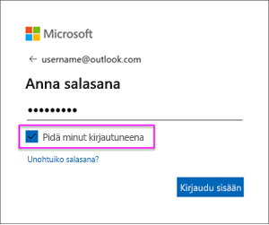

# OneDriven .csv-tiedostosta tai SharePoint Onlinesta luodun tietojoukon päivittäminen
## Mitkä ovat edut?
Kun muodostat yhteyden OneDriven .csv-tiedostoon tai SharePoint Onlineen, Power BI:ssa luodaan tietojoukko. Tämän jälkeen .csv-tiedosto tuodaan Power BI -tietojoukkoon. Power BI muodostaa sitten automaattisesti yhteyden tiedostoon ja päivittää mahdolliset muutokset Power BI:n tietojoukossa. Jos haluat muokata .csv-tiedostoa Onedrivessa tai SharePoint Onlinessa, kerran niitä tallennetaan, muutokset näkyvät Power BI:ssa yleensä noin tunnin kuluessa. Tietojoukkoon perustuvat Power BI:n kaikki visualisoinnit päivittyvät myös automaattisesti.

Jos tiedostot ovat OneDrive for Business- tai SharePoint Onlinen jaetussa kansiossa, muut käyttäjät voivat työstää samaa tiedostoa. Kun muutokset on tallennettu, tehdyt muutokset päivitetään automaattisesti Power BI -palveluun yleensä tunnin kuluessa.

Monet organisaatiot suorittavat prosesseja, jotka kyselevät automaattisesti tietokannoista tietoja, jotka sitten tallennetaan .csv-tiedostoon päivittäin. Jos tiedosto on tallennettu OneDriveeen tai SharePoint Onlineen ja sama tiedoston korvataan joka päivä sen sijaan, etä luotaisiin uusi tiedosto kunakin päivänä eri nimellä, voit muodostaa yhteyden tähän tiedostoon Power BI:ssä. Tietojoukkosi, joka muodostaa yhteyden tiedostoon, synkronoidaan pian sen jälkeen, kun tiedosto on päivitetty Onedriveen tai SharePoint Onlineen. Tietojoukkoon perustuvat kaikki visualisoinnit päivittyvät myös automaattisesti.

## Tuetut toiminnot:
Pilkuilla erotetut arvotiedostot ovat yksinkertaisia tekstitiedostoja, joten yhteyksiä ulkoisiin tietolähteisiin ja raportteihin ei tueta. Et voi ajoittaa pilkulla erotetusta tiedostosta luodun tietojoukon päivitystä. Kun tiedosto on OneDrivessa tai SharePoint Onlinessa, Power BI synkronoi tietojoukon sisältämän tiedoston muutokset automaattisesti noin tunnin välein.

## OneDrive tai OneDrive for Business? Mikä niiden ero on?
Jos sinulla on sekä henkilökohtainen OneDrive että OneDrive for Business, on suositeltavaa säilyttää tiedostot, jotka haluat yhdistää BI:ssa OneDrive for Business -palveluun. Syynä on se, että käytät todennäköisesti kahta eri tiliä niille kirjautumista varten.

Yhteyden muodostaminen OneDrive for Business -palveluun Power BI:ssa on yleensä saumaton, koska tili, jota käytit Power BI -kirjautumiseen on usein sama tili, jota käytetään kirjauduttaessa OneDrive for Business -palveluun. Henkilökohtaisen OneDrive olet todennäköisesti kuitenkin kirjautunut sisään toisella [Microsoft-tilillä](https://account.microsoft.com).

Kun olet kirjautunut sisään Microsoft-tilillesi, muista valita Pysy kirjautuneena -vaihtoehto. Power BI voi sitten synkronoida kaikki päivitykset Power BI:n tietojoukkoihin

Jos teet muutoksia OneDrive .csv-tiedostoon, joita ei voi synkronoida tietojoukkoon Power BI:ssa, koska Microsoft-tilisi tunnistetiedot ovat ehkä muuttuneet, sinun pitää muodostaa yhteys tiedostoon ja tuoda se takaisin omasta OneDrivesta.

## Jos ilmenee ongelmia
Jos .csv-tiedoston tiedot OneDrivessa muuttuvat eivätkä kyseiset muutokset heijastu Power BI -palveluun, se johtuu siitä todennäköisimmin siitä, ettei Power BI pysty yhdistämään OneDriveesi. Yritä muodostaa yhteys tiedostoon ja tuoda se uudelleen. Jos sinua pyydetään kirjautumaan sisään, varmista, että valitset vaihtoehdon **Pysy kirjautuneena**.

## Seuraavat vaiheet
[Työkalut päivitysongelmien vianmääritysohjeita varten](service-gateway-onprem-tshoot.md)
[Päivityksiä koskeva vianmääritys](refresh-troubleshooting-refresh-scenarios.md)

Onko sinulla kysyttävää? [Voit esittää kysymyksiä Power BI -yhteisössä](https://community.powerbi.com/)

