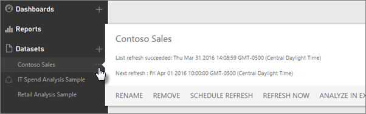
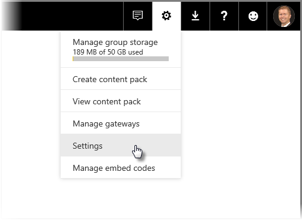
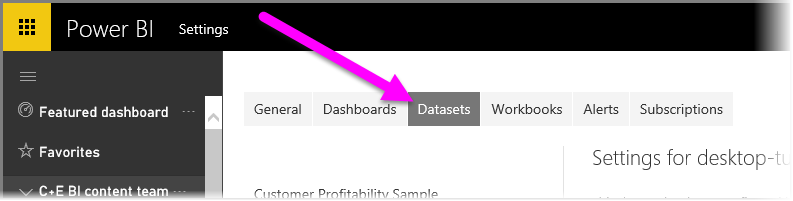
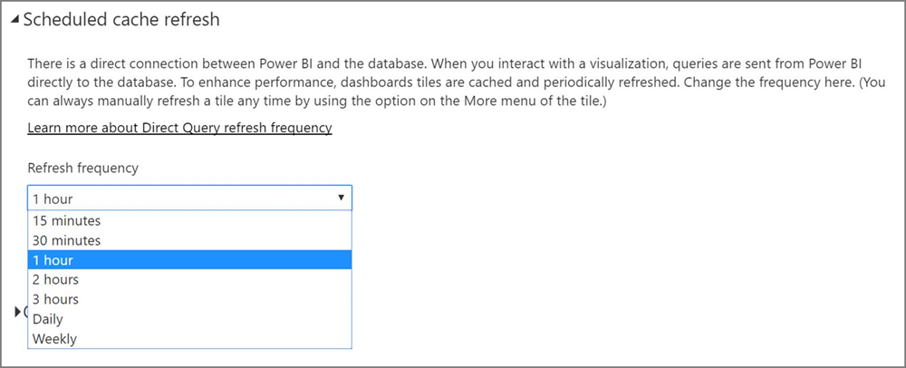

# Tietojen päivittäminen Power BI:ssä
Varmista, että saat käyttöösi aina uusimmat tiedot päätöksenteon tueksi. Olet todennäköisesti jo käyttänyt Nouda tiedot -toimintoa Power BI:ssä yhteyden muodostamiseksi ja tietojen lataamiseksi sekä luonut raportteja ja raporttinäkymän. Nyt haluat varmistaa, että tiedot todella ovat uusimpia ja ajan tasalla.

Monissa tapauksissa se ei edellytä sinulta mitään toimia. Jotkin tiedot, kuten Salesforce- tai Marketo-sisältöpaketista saapuvat tiedot, päivitetään automaattisesti puolestasi. Jos yhteytesi käyttää reaaliaikaista yhteyttä tai DirectQueryä, tiedot pysyvät ajan tasalla. Muissa tapauksissa, kuten käsiteltäessä Excel-työkirjoja tai Power BI Desktop -tiedostoja, jotka muodostavat yhteyden ulkoiseen tietolähteeseen joko verkossa tai paikallisesti, sinun on päivitettävä tiedot manuaalisesti tai laadittava päivitysaikataulu, jotta Power BI voi päivittää raporttiesi ja raporttinäkymiesi tiedot puolestasi.

Tämä (ja muutama muu) artikkeli auttaa sinua ymmärtämään, kuinka tietojen päivitys toimii Power BI:ssä riippumatta siitä, onko sinun määritettävä päivitysaikataulu. Saat myös tietää, mitä tietojen onnistunut päivittäminen edellyttää.

## Tietojen päivityksen ymmärtäminen
Ennen kuin aloitat tietojen päivityksen, sinun tulee tietää, mitä olet päivittämässä ja mistä tiedot tulevat.

*Tietolähde* on paikka, josta raporttiesi ja raporttinäkymiesi tiedot tulevat. Se voi olla esimerkiksi Google Analyticsin tai QuickBooksin kaltainen online-palvelu, Azure SQL -tietokannan kaltainen pilvitietokanta tai paikallisessa organisaation tietokoneessa tai palvelimessa sijaitseva tietokanta tai tiedosto. Nämä kaikki ovat tietolähteitä. Tietolähteen tyyppi määrittää, miten tietolähteen tiedot päivitetään. Perehdymme tarkemmin kunkin tietolähdetyypin päivitystapoihin hieman edempänä [Mitä voidaan päivittää?](#what-can-be-refreshed) -osassa.

*Tietojoukko* luodaan automaattisesti Power BI:ssä, kun käytät Nouda tiedot -toimintoa yhteyden luomiseen ja sisältöpakkauksen tai tiedoston sisältämien tietojen lataamiseen tai kun muodostat yhteyden live-tietolähteeseen. Power BI Desktopissa ja Excel 2016:ssa voit myös julkaista tiedoston käyttöoikeuden Power BI -palveluun, joka toimii avain kuten Nouda tiedot -toiminto.

Kummassakin tapauksessa luodaan tietojoukko, joka tukee näkyviin Power BI -palvelun Oma työtila- tai Ryhmä -säilössä. Kun valitset tietojoukon **kolmen pisteen valikon (...)** , voit tarkastella raportin tietoja, muokata asetuksia ja määrittää päivityksen.

Tietojoukko voi hankkia tietoja yhdestä tai useammasta tietolähteestä. Voit esimerkiksi käyttää Power BI Desktopia tietojen noutamiseen organisaation SQL-tietokannasta ja noutaa muita tietoja verkosta OData-syötteellä. Kun julkaiset tiedoston Power BI:hin, järjestelmään luodaan yksi tietojoukko, jonka tietolähteitä ovat sekä SQL-tietokanta ja OData-syöte.

Tietojoukko sisältää tietoa tietolähteistä, tietolähteen tunnistetiedot ja useimmissa tapauksissa tietojen alijoukon, joka on kopioitu tietolähteestä. Kun luot visualisointeja raportteihin ja raporttinäkymiin, näet tietojoukon tiedot. Jos käytössä on Azure SQL-tietokannan kaltainen reaaliaikainen yhteys, tietojoukko määrittää näytettävät tiedot suoraan tietolähteestä. Jos käytössä on reaaliaikainen yhteys Analysis Servicesiin, tietojoukon määritys saadaan suoraan Analysis Servicesistä.

> *Tietojen päivitys päivittää siten tiedot tietojoukossa, joka on tallennettu Power BI:hin tietolähteestäsi. Tämä päivitys on täydellinen eikä lisäävä.*
> 
> 

Aina, kun päivität tietojoukon tiedot joko käyttämällä Päivitä nyt -toimintoa tai määrittämällä päivitysaikataulun, Power BI käyttää tietojoukon tietoja muodostaakseen yhteyden määritettyihin tietolähteisiin, kyselläkseen päivitettyjä tietoja ja ladatakseen päivitetyt tiedot takaisin tietojoukkoon. Kaikki raporttiesi tai raporttinäkymiesi visualisoinnit, jotka perustuvat kyseisiin tietoihin, päivitetään automaattisesti.

Ennen kuin jatkamme, on tärkeää ymmärtää eräs toinen asia:

> *Riippumatta siitä, kuinka usein päivität tietojoukon tai kuinka usein tarkastelet reaaliaikaisia tietoja, tietolähteen tietojen on oltava ensin ajan tasalla.*
> 
> 

Useimmissa organisaatioissa tiedot käsitellään kerran päivässä, yleensä iltaisin. Jos ajoitat päivityksen paikalliseen tietokantaan yhdistetystä Power BI Desktop -tiedostosta luodulle tietojoukolle, ja IT-osastosi suorittaa kyseisen SQL-tietokannan käsittelyajon kerran päivässä iltaisin, sinun tarvitsee määrittää ajoitettu päivitys suoritettavaksi vain kerran päivässä. Käsittely voidaan tehdä esimerkiksi tietokannan käsittelyn jälkeen, mutta ennen kuin palaat töihin. Tämä ei tietenkään ole aina mahdollista. Power BI tarjoaa useita tapoja muodostaa yhteyden tietolähteisiin, jotka päivitetään usein tai jopa reaaliaikaisesti.

## Päivitystyypit
Power BI:ssä on neljä päivityksen päätyyppiä. Pakettipäivitys, mallin/tietojen päivitys, ruudun päivitys ja visualisointisäilön päivitys.

### Pakettipäivitys
Tämä synkronoi Power BI Desktop- tai Excel-tiedoston Power BI-palvelun ja OneDriven tai SharePoint Onlinen välillä. Tämä tapa ei nouda tietoja alkuperäisestä tietolähteestä. Power BI:n tietojoukko päivitetään vain niillä tiedoilla, jotka ovat saatavana tiedostossa OneDrivessa tai SharePoint Onlinessa.

### Mallin/tietojen päivitys
Tämä viittaa tietojoukon päivittämiseen Power BI -palvelussa alkuperäisen tietolähteen tiedoilla. Päivitys tehdään käyttämällä joko ajoitettua päivitystä tai Päivitä nyt -toimintoa. Tämä edellyttää yhdyskäytävää paikallisia tietolähteitä varten.

### Ruudun päivitys
Ruudun päivitys päivittää ruudun visualisointien välimuistin raporttinäkymässä, kun tiedot muuttuvat. Tämä tapahtuu noin 15 minuutin välein. Voit myös pakottaa ruudun päivityksen valitsemalla **kolmen pisteen valikon (...)**  raporttinäkymän oikeassa yläkulmassa ja valitsemalla **Päivitä raporttinäkymän ruudut**.

Lisätietoja yleisistä ruudun päivityksen virheistä on kohdassa [Ruutuvirheiden vianmääritys](refresh-troubleshooting-tile-errors.md).

### Visualisointisäilön päivitys
Visualisointisäilön päivitys päivittää välimuistissa olevat raporttien visualisoinnit raporttiin, kun tiedot muuttuvat.

## Mitä voidaan päivittää?
Power BI:ssä käytetään yleensä Nouda tiedot -toimintoa tietojen tuomiseksi paikallisessa asemassa, OneDrivessa tai SharePoint Onlinessa olevasta tiedostosta, tai yhteys muodostetaan suoraan organisaation pilvipalvelussa olevaan tietokantaan. Power BI:ssä voidaan päivittää lähes mitä tahansa tietoja, mutta päivitystarve määräytyy sen mukaan, miten tietojoukkosi on luotu ja mihin tietolähteisiin se on yhteydessä. Katsotaan seuraavaksi, miten tietoja päivitetään.

Ennen kuin jatkamme, tässä on joitakin tärkeitä määritelmiä, jotka sinun on tunnettava:

**Automaattinen päivitys** – Tämä tarkoittaa, että mitään käyttäjän määrityksiä ei tarvita, jotta tietojoukko päivitetään säännöllisin väliajoin. Power BI määrittää tietojen päivitysasetukset puolestasi. Online-palveluntarjoajat päivittävät tiedot yleensä kerran päivässä. OneDrivesta ladattujen tietojen automaattinen päivitys tapahtuu noin tunnin välein tiedoille, jotka eivät ole peräisin ulkoisesta tietolähteestä. Vaikka voit määrittää erilaisia ajoitettuja päivitysasetuksia ja päivittää tietoja manuaalisesti, sinun ei todennäköisesti tarvitse tehdä niin.

**Käyttäjän määrittämä manuaalinen tai ajoitettu päivitys** – Tämä tarkoittaa, että voit päivittää tietojoukon manuaalisesti käyttämällä Päivitä nyt -toimintoa tai ajoitettua päivitystä tietojoukon asetuksissa. Tämäntyyppistä päivitystä tarvitaan sellaisia Power BI Desktop -tiedostoja ja Excel-työkirjoja varten, jotka muodostavat yhteyden ulkoisiin verkkotietolähteisiin ja paikallisiin tietolähteisiin.

> [!NOTE]
> Kun määrität ajan ajoitettua päivitystä varten, päivityksen alkamiseen voi tulla enintään tunnin viive.
> 
> 

**Reaaliaikainen/DirectQuery** – Tämä tarkoittaa, että Power BI:n ja tietolähteen välillä on reaaliaikainen yhteys. Paikallisia tietolähteitä varten järjestelmänvalvojien on määritettävä yritysyhdyskäytävän sisällä oleva tietolähde, mutta käyttäjän toimia ei välttämättä tarvita.

> [!NOTE]
> Suorituskyvyn parantamiseksi raporttinäkymät, joissa on DirectQueryllä yhdistettyjä tietoja, päivittyvät automaattisesti. Voit myös päivittää ruudun manuaalisesti milloin tahansa käyttämällä ruudun **Lisää**-valikkoa.
> 
> 

## Paikalliset tiedostot ja OneDrivessa tai SharePoint Onlinessa olevat tiedostot
Tietojen päivitystä tuetaan sellaisia Power BI Desktop -tiedostoja ja Excel-työkirjoja varten, jotka muodostavat yhteyden ulkoisiin verkkotietolähteisiin tai paikallisiin tietolähteisiin. Tämä päivittää ainoastaan Power BI -palvelun sisällä olevan tietojoukon tiedot. Se ei päivitä paikallista tiedostoa.

Kun säilytät tiedostosi OneDrivessa tai SharePoint Onlinessa ja muodostat niihin yhteyden Power BI:stä, saat käyttöösi joustavan ratkaisun. Joustavuuden vuoksi ratkaisun ymmärtäminen voi olla kuitenkin haastavaa. OneDriveen tai SharePoint Onlineen tallennettujen tiedostojen ajoitettu päivitys poikkeaa pakettipäivityksestä. Lisätietoja on [Päivitystyypit](#types-of-refresh)-osassa.

### Power BI Desktop -tiedosto
| **Tietolähde** | **Automaattinen päivitys** | **Käyttäjän määrittämä manuaalinen tai ajoitettu päivitys** | **Yhdyskäytävä tarvitaan** |
| --- | --- | --- | --- |
| Nouda tiedot -toiminnolla (valintanauhassa) muodostetaan yhteys mihin tahansa listattuun verkkotietolähteeseen ja tehdään siellä tietokyselyjä. |Ei |Kyllä |Ei (katso alla) |
| Nouda tiedot -toiminnolla muodostetaan yhteys reaaliaikaiseen Analysis Services -tietokantaan ja tutkitaan sen sisältöä. |Kyllä |Ei |Kyllä |
| Nouda tiedot -toiminnolla muodostetaan yhteys tuettuun paikalliseen DirectQuery-tietolähteeseen ja tutkitaan sen sisältöä. |Kyllä |Ei |Kyllä |
| Nouda tiedot -toiminnolla muodostetaan yhteys Azure SQL -tietokantaan, Azure SQL Data Warehouseen tai Azure HDInsight Sparkiin ja tehdään siellä tietokyselyjä. |Kyllä |Kyllä |Ei |
| Nouda tiedot -toiminnolla muodostetaan yhteys mihin tahansa listattuun paikalliseen tietolähteeseen ja tehdään siellä tietokyselyjä, lukuun ottamatta Hadoop-tiedostoja (HDFS) ja Microsoft Exchangea. |Ei |Kyllä |Kyllä |

> [!NOTE]
> Jos käytät [**Web.Page**](https://msdn.microsoft.com/library/mt260924.aspx)-toimintoa, tarvitset yhdyskäytävän, jos olet julkaissut tietojoukon tai raportin myöhemmin kuin 18. marraskuuta 2016.
> 
> 

Lisätietoja on kohdassa [Power BI Desktop -tiedostosta luodun tietojoukon päivittäminen – OneDrive](refresh-desktop-file-onedrive.md).

### Excel-työkirja
| **Tietolähde** | **Automaattinen päivitys** | **Käyttäjän määrittämä manuaalinen tai ajoitettu päivitys** | **Yhdyskäytävä tarvitaan** |
| --- | --- | --- | --- |
| Laskentataulukon taulukoiden tietoja ei ladattu Excel-tietomalliin. |Kyllä, tunneittain *(vain OneDrive / SharePoint Online)* |Vain manuaalinen *(vain OneDrive / SharePoint Online)* |Ei |
| Laskentataulukon taulukoiden tiedot linkitetty taulukkoon Excel-tietomallissa (linkitetyt taulukot). |Kyllä, tunneittain *(vain OneDrive / SharePoint Online)* |Vain manuaalinen *(vain OneDrive / SharePoint Online)* |Ei |
| Power Query* -toiminnolla muodostetaan yhteys mihin tahansa listattuun verkkotietolähteeseen ja tehdään siellä tietokyselyjä sekä ladataan tiedot Excel-tietomalliin. |Ei |Kyllä |Ei |
| Power Query* -toiminnolla muodostetaan yhteys mihin tahansa listattuun paikalliseen tietolähteeseen ja tehdään siellä tietokyselyjä, lukuun ottamatta Hadoop-tiedostoja (HDFS) ja Microsoft Exchangea, sekä ladataan tiedot Excel-tietomalliin. |Ei |Kyllä |Kyllä |
| Power Pivot -toiminnolla muodostetaan yhteys mihin tahansa listattuun verkkotietolähteeseen ja tehdään siellä tietokyselyjä sekä ladataan tiedot Excel-tietomalliin. |Ei |Kyllä |Ei |
| Power Pivot -toiminnolla muodostetaan yhteys mihin tahansa listattuun paikalliseen tietolähteeseen ja tehdään siellä tietokyselyjä sekä ladataan tiedot Excel-tietomalliin. |Ei |Kyllä |Kyllä |

*\* Power Query tunnetaan Excel 2016:ssa nimellä Hae ja muunna.*

Lisätietoja on kohdassa [OneDriven Excel-työkirjasta luodun tietojoukon päivittäminen](refresh-excel-file-onedrive.md).

### Pilkuin eroteltuja arvoja sisältävä tiedosto (.csv) OneDrivessa tai SharePoint Onlinessa
| **Tietolähde** | **Automaattinen päivitys** | **Käyttäjän määrittämä manuaalinen tai ajoitettu päivitys** | **Yhdyskäytävä tarvitaan** |
| --- | --- | --- | --- |
| Yksinkertainen pilkulla eroteltu arvo |Kyllä, tunneittain |Vain manuaalinen |Ei |

Lisätietoja on kohdassa [OneDriven .csv-tiedostosta luodun tietojoukon päivittäminen](refresh-csv-file-onedrive.md).

## Sisältöpaketit
Power BI:ssä on kahdenlaisia sisältöpaketteja:

**Sisältöpaketit online-palveluista**: esimerkiksi Adobe Analytics, SalesForce ja Dynamics CRM Online. Online-palveluista luodut tietojoukot päivitetään automaattisesti kerran päivässä. Vaikka se ei todennäköisesti ole tarpeellista, voit päivittää tiedot manuaalisesti tai määrittää ajoitetun päivityksen. Koska online-palvelut ovat pilvessä, yhdyskäytävää ei tarvita.

**Organisaation sisältöpaketit**: oman organisaatiosi käyttäjien luomat ja jakamat sisältöpaketit. Sisältöpaketin käyttäjät eivät voi määrittää ajoitettua päivitystä tai tehdä manuaalista päivitystä. Ainoastaan sisältöpaketin tekijä voi määrittää sisältöpaketin tietojoukkojen päivityksen. Päivitysasetukset periytyvät tietojoukon kanssa.

### Sisältöpaketit online-palveluista
| **Tietolähde** | **Automaattinen päivitys** | **Käyttäjän määrittämä manuaalinen tai ajoitettu päivitys** | **Yhdyskäytävä tarvitaan** |
| --- | --- | --- | --- |
| Online-palvelut Nouda tiedot &gt; -palveluissa |Kyllä |Kyllä |Ei |

### Organisaation sisältöpaketit
Organisaation sisältöpakettiin kuuluvan tietojoukon päivitysominaisuudet määräytyvät tietojoukon mukaan. Katso edeltä lisätietoja paikallisista tiedostoista, OneDrivesta tai SharePoint Onlinesta.

Lisätietoja on kohdassa [Organisaation sisältöpakettien esittely](service-organizational-content-pack-introduction.md).

## Reaaliaikaiset yhteydet ja DirectQuery-kyselyt paikallisiin tietolähteisiin
Paikallisen tietoyhdyskäytävän avulla voit tehdä kyselyjä Power BI:stä paikallisiin tietolähteisiin. Kun käytät visualisointia, kyselyt lähetetään Power BI:stä suoraan tietokantaan. Sen jälkeen päivitetyt tiedot palautetaan ja visualisoinnit päivitetään. Koska Power BI:n ja tietokannan välillä on suora yhteys, päivitystä ei tarvitse ajoittaa.

Kun SQL Service Analysis Services (SSAS) -tietolähteeseen muodostetaan reaaliaikainen yhteys, se voidaan toteuttaa välimuistissa (toisin kuin DirectQuery) myös raportin lataamisen yhteydessä. Tämä nopeuttaa raportin latautumista. Voit pyytää uusimmat tiedot SSAS-tietolähteestä käyttämällä **Päivitä**-painiketta. SSAS-tietolähteiden omistajat voivat määrittää tietojoukon välimuistin ajoitetun päivitystiheyden varmistaakseen, että raportit ovat ajan tasalla. 

Kun määrität tietolähteen käyttämään paikallista tietoyhdyskäytävää, voit käyttää kyseistä tietolähdettä ajoitettuna päivitysvaihtoehtona. Tämä korvaa henkilökohtaisen yhdyskäytävän.

> [!NOTE]
> Jos tietojoukkosi on määritetty käyttämään reaaliaikaista yhteyttä tai DirectQuery-yhteyttä, tietojoukot päivitetään noin tunnin välein tai kun tietoja käytetään. Voit muuttaa *päivitystiheyttä* manuaalisesti Power BI -palvelun *Ajoitettu välimuistin päivitys* -asetuksella.
> 
> 

| **Tietolähde** | **Reaaliaikainen yhteys / DirectQuery** | **Käyttäjän määrittämä manuaalinen tai ajoitettu päivitys** | **Yhdyskäytävä tarvitaan** |
| --- | --- | --- | --- |
| Analysis Services -taulukkomuoto |Kyllä |Kyllä |Kyllä |
| Analysis Services Multidimensional |Kyllä |Kyllä |Kyllä |
| SQL Server |Kyllä |Kyllä |Kyllä |
| SAP HANA |Kyllä |Kyllä |Kyllä |
| Oracle |Kyllä |Kyllä |Kyllä |
| Teradata |Kyllä |Kyllä |Kyllä |

Lisätietoja on kohdassa [Paikallinen tietoyhdyskäytävä](service-gateway-onprem.md)

## Pilvipalveluissa olevat tietokannat
DirectQuery muodostaa suoran yhteyden Power BI:n ja pilvipalvelussa olevan tietokannan välille. Kun käytät visualisointia, kyselyt lähetetään Power BI:stä suoraan tietokantaan. Sen jälkeen päivitetyt tiedot palautetaan ja visualisoinnit päivitetään. Koska sekä Power BI -palvelu että tietolähde ovat pilvipalvelussa, henkilökohtaista yhdyskäytävää ei tarvita.

Jos visualisointia ei käytetä, tiedot päivitetään automaattisesti noin kerran tunnissa. Voit muuttaa päivitystiheyttä käyttämällä *Ajoitettu välimuistin päivitys* -asetusta ja määrittämällä päivitystiheyden.

Jos haluat määrittää päivitystiheyden, valitse **rataskuvake** Power BI -palvelun oikeassa yläkulmassa ja valitse sitten **Asetukset**.

**Asetukset**-sivulla voit valita tietojoukon, jonka päivitystiheyden haluat määrittää. Valitse Asetukset-sivun yläreunasta **Tietojoukot**-välilehti.

Valitse tietojoukko, niin oikeanpuoleiseen ruutuun tulee näkyviin kyseisen tietojoukon asetukset. Voit määrittää DirectQuery-yhteyden tai reaaliaikaisen yhteyden päivitystiheyden (15 minuutin välein – viikoittain) käyttämällä avattavaa valikkoa seuraavan kuvan mukaisesti.

| **Tietolähde** | **Reaaliaikainen yhteys / DirectQuery** | **Käyttäjän määrittämä manuaalinen tai ajoitettu päivitys** | **Yhdyskäytävä tarvitaan** |
| --- | --- | --- | --- |
| SQL Azure Data Warehouse |Kyllä |Kyllä |Ei |
| Spark HDInsight |Kyllä |Kyllä |Ei |

Lisätietoja on kohdassa [Azure ja Power BI](service-azure-and-power-bi.md).

## Reaaliaikaiset raporttinäkymät
Reaaliaikaiset raporttinäkymät hyödyntävät Microsoft Power BI REST -ohjelmointirajapintaa tai Microsoft Stream Analyticsia varmistaakseen, että tiedot ovat ajan tasalla. Koska reaaliaikaiset raporttinäkymät eivät edellytä käyttäjien määrittämää päivitystä, niitä ei käsitellä tässä artikkelissa.

| **Tietolähde** | **Automaattinen** | **Käyttäjän määrittämä manuaalinen tai ajoitettu päivitys** | **Yhdyskäytävä tarvitaan** |
| --- | --- | --- | --- |
| Power BI Rest -ohjelmointirajapinnalla tai Microsoft Stream Analyticsilla kehitetyt mukautetut sovellukset |Kyllä, reaaliaikainen virtautus |Ei |Ei |

Lisätietoja on artikkelissa [Reaaliaikaisen raporttinäkymän luonti Power BI:ssä](https://msdn.microsoft.com/library/mt267603.aspx).

## Ajoitetun päivityksen määrittäminen
Lisätietoja ajoitetun päivityksen määrittämisestä on kohdassa [Ajoitetun päivityksen määrittäminen](refresh-scheduled-refresh.md)

## Yleiset tietojen päivittämisen esimerkkitilanteet
Joskus paras perehtyä tietojen päivittämiseen on tarkastella Power BI -esimerkkejä. Tässä on joitakin yleisiä tietojen päivittämisen esimerkkitilanteita:

### Excel-työkirja, jossa on tietoja sisältäviä taulukoita
Sinulla on Excel-työkirja, jossa on useita tietoja sisältäviä taulukoita, mutta mitään niistä ei ole ladattu Excel-tietomalliin. Lataat työkirjatiedoston paikallisesta asemasta Power BI:hin Nouda tiedot -toiminnolla ja luot raporttinäkymän. Nyt olet kuitenkin tehnyt joitakin muutoksia paikallisessa asemassa sijaitsevan työkirjan taulukoihin ja haluat päivittää Power BI -raporttinäkymän uusilla tiedoilla.

Valitettavasti päivittämistä ei tueta tässä tilanteessa. Jotta voit päivittää tietojoukon raporttinäkymään, sinun on ladattava työkirja uudelleen. Onneksi tähän on erinomainen ratkaisu: siirrä työkirjatiedostosi OneDriveen tai SharePoint Onlineen.

Kun muodostat yhteyden OneDrivessa tai SharePoint Onlinessa olevaan tiedostoon, raporttisi ja raporttinäkymäsi näyttävät tiedot juuri sellaisina kuin ne ovat tiedostossa. Tässä tapauksessa tiedot näytetään Excel-työkirjastasi. Power BI tarkistaa tiedoston päivitykset automaattisesti noin tunnin välein. Jos teet muutoksia OneDriveen tai SharePoint Onlineen tallennettuun työkirjaan, kyseiset muutokset näkyvät raporttinäkymissäsi ja raporteissasi tunnin sisällä. Sinun ei tarvitse määrittää päivitystä. Jos haluat nähdä päivitykset heti Power BI:ssä, voit päivittää tietojoukon manuaalisesti käyttämällä Päivitä nyt -toimintoa.

Lisätietoja on artikkeleissa [Excel-tiedot Power BI:ssä](service-excel-workbook-files.md) ja [OneDriven Excel-työkirjasta luodun tietojoukon päivittäminen](refresh-excel-file-onedrive.md).

### Excel-työkirja muodostaa yhteyden yrityksesi SQL-tietokantaan
Oletetaan, että sinulla on Excel-työkirja nimeltä SalesReport.xlsx paikallisessa tietokoneessasi. Olet muodostanut yhteyden yrityksesi palvelimella olevaan SQL-tietokantaan Excelin Power Query -toiminnolla ja tehnyt kyselyn myyntitiedoista, jotka on ladattu tietomalliin. Joka aamu avaat työkirjan ja päivität Pivot-taulukot painamalla Päivitä-painiketta.

Haluat nyt tarkastella myyntitietojasi Power BI:ssä, joten käytät Nouda tiedot -toimintoa yhteyden muodostamiseen ja SalesReport.xlsx-työkirjan lataamiseen paikallisesta asemasta.

Tässä tapauksessa voit päivittää manuaalisesti SalesReport.xlsx-tietojoukon tiedot tai määrittää ajoitetun päivityksen. Koska tiedot ovat peräisin yrityksesi SQL-tietokannasta, sinun on ladattava ja asennettava yhdyskäytävä. Kun olet asentanut ja määrittänyt yhdyskäytävän, sinun täytyy määrittää SalesReport-tietojoukon asetukset ja kirjautua tietolähteeseen. Tämä on kuitenkin tehtävä vain kerran. Voit sen jälkeen ajoittaa päivityksen, jolloin Power BI muodostaa automaattisesti yhteyden SQL-tietokantaan ja noutaa päivitetyt tiedot. Myös raporttisi ja raporttinäkymäsi päivittyvät automaattisesti.

> [!NOTE]
> Tämä päivittää ainoastaan Power BI -palvelun sisällä olevan tietojoukon tiedot. Paikallista tiedostoa ei päivitetä.
> 
> 

Lisätietoja on artikkeleissa [Excel-tiedot Power BI:ssä](service-excel-workbook-files.md), [Power BI Gateway – henkilökohtainen](personal-gateway.md), [Paikallinen tietoyhdyskäytävä](service-gateway-onprem.md) ja [Paikallisen aseman Excel-työkirjasta luodun tietojoukon päivittäminen](refresh-excel-file-local-drive.md).

### Power BI Desktop -tiedosto, jossa on tietoja OData-syötteestä
Tässä tapauksessa käytät Power BI Desktopin Nouda tiedot -toimintoa yhteyden muodostamiseen ja laskentatietojen tuomiseen OData-syötteestä.  Luo useita raportteja Power BI Desktopissa, annat tiedostolle nimeksi WACensus ja tallennat sen jaettuun asemaan yrityksessäsi. Sen jälkeen julkaiset tiedoston Power BI -palveluun.

Tässä tapauksessa voit päivittää manuaalisesti WACensus-tietojoukon tiedot tai määrittää ajoitetun päivityksen. Koska tietolähteen tiedot ovat peräisin OData-syötteestä, sinun ei tarvitse asentaa yhdyskäytävää, mutta sinun on määritettävä WACensus-tietojoukon asetukset ja kirjauduttava OData-tietolähteeseen. Voit sen jälkeen ajoittaa päivityksen, jolloin Power BI muodostaa automaattisesti yhteyden OData-syötteeseen ja noutaa päivitetyt tiedot. Myös raporttisi ja raporttinäkymäsi päivittyvät automaattisesti.

Lisätietoja on artikkeleissa [Power BI Desktopista julkaiseminen](desktop-upload-desktop-files.md), [Paikallisen aseman Power BI Desktop -tiedostosta luodun tietojoukon päivittäminen](refresh-desktop-file-local-drive.md) ja [OneDriven Power BI Desktop -tiedostosta luodun tietojoukon päivittäminen](refresh-desktop-file-onedrive.md).

### Jaettu sisältöpaketti toiselta käyttäjältä organisaatiossasi
Olet muodostanut yhteyden organisaation sisältöpakettiin. Se sisältää raporttinäkymän, useita raportteja ja tietojoukon.

Tässä tilanteessa et voi määrittää tietojoukon päivittämistä. Sisältöpaketin luonut analyytikko on vastuussa tietojoukon päivittämisestä käytettävien tietolähteiden mukaan.

Jos sisältöpaketin raporttinäkymäsi ja raporttisi eivät päivity, ota yhteyttä sisältöpaketin luoneeseen analyytikkoon.

Lisätietoja on artikkeleissa [Organisaation sisältöpakettien esittely](service-organizational-content-pack-introduction.md) ja [Työskentely organisaation sisältöpakettien kanssa](service-organizational-content-pack-copy-refresh-access.md).

### Sisältöpaketti online-palveluntarjoajalta, kuten Salesforcelta
Käytät Power BI:n Nouda tiedot -toimintoa yhteyden muodostamiseen ja tietojen tuomiseen online-palveluntarjoajalta, kuten Salesforcelta. Tämä onkin helppoa. Salesforce-tietojoukko on ajoitettu päivittymään automaattisesti kerran päivässä. 

Kuten useimmat online-palveluntarjoajat, Salesforce päivittää tiedot kerran päivässä, yleensä yöllä. Voit halutessasi päivittää Salesforce-tietojoukkosi manuaalisesti tai ajoittaa päivityksen, mutta se ei ole tarpeen, koska Power BI päivittää tietojoukon automaattisesti ja myös raporttisi ja raporttinäkymäsi päivitetään.

Lisätietoja on artikkelissa [Salesforce-sisältöpaketti Power BI:tä varten](service-connect-to-salesforce.md).

## Vianmääritys
Ongelmat johtuvat yleensä siitä, että Power BI ei voi kirjautua sisään tietolähteisiin tai tietojoukko muodostaa yhteyden paikalliseen tietolähteeseen, mutta yhdyskäytävä on offline-tilassa. Varmista, että Power BI voi kirjautua sisään tietolähteisiin. Jos tietolähteeseen kirjautumisen salasana muuttuu tai jos Power BI kirjataan ulos tietolähteestä, yritä kirjautua uudelleen sisään tietolähteisiin Tietolähteen tunnistetiedot -kohdassa.

Lisätietoja vianmäärityksestä on artikkeleissa [Välineet päivitysongelmien vianmääritykseen](service-gateway-onprem-tshoot.md) ja [Päivitystilanteiden vianmääritys](refresh-troubleshooting-refresh-scenarios.md).

## Seuraavat vaiheet
[Välineet päivitysongelmien vianmääritykseen](service-gateway-onprem-tshoot.md)  
[Päivitystilanteiden vianmääritys](refresh-troubleshooting-refresh-scenarios.md)  
[Power BI -yhdyskäytävä – henkilökohtainen](personal-gateway.md)  
[Paikallinen tietoyhdyskäytävä](service-gateway-onprem.md)  

Ilmenikö muuta kysyttävää? [Voit esittää kysymyksiä Power BI -yhteisössä](http://community.powerbi.com/)

