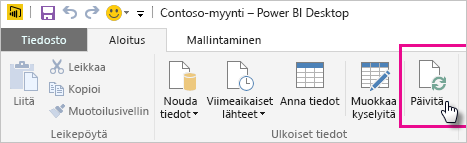
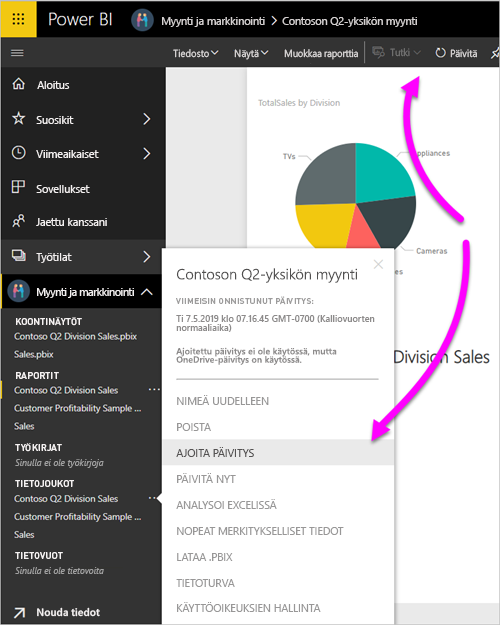

# Päivitä Onedriveen tai SharePoint Onlineen tallennettuja tietojoukkoja
Tiedostojen tuominen OneDrivesta tai SharePoint Onlinesta Power BI -palveluun on mainio tapa varmistaa, että Power BI Desktop -työsi synkronoidaan Power BI -palvelun kanssa.

## Power BI Desktop -tiedoston tallennuksesta OneDriveen tai SharePoint Onlineen saatavat edut
Kun tallennat Power BI Desktop -tiedoston OneDriveen tai SharePoint Onlineen, tiedoston malliin lataamasi kaikki tiedot tuodaan tietojoukkoon. Tiedostoon luomasi kaikki raportit ladataan **Raportit**-kohtaan Power BI -palvelussa. Oletetaan, että teet muutoksia tiedostoosi OneDrivessa tai SharePoint Onlinessa. Nämä muutokset voivat sisältää uusien mittayksiköiden lisäämisen, sarakkeiden nimien muuttamisen tai visualisointien muokkaamisen. Kun tiedosto on tallennettu, Power BI -palvelu synkronoi myös nämä muutokset yleensä noin tunnin kuluessa.

Voit suorittaa manuaalisen kertapäivityksen suoraan Power BI Desktopissa valitsemalla **Aloitus**-valintanauhasta **Päivitä**. Kun valitset **Päivitä**, päivität tiedoston malliin päivitetyt tiedot alkuperäisestä tietolähteestä. Tällainen päivitys tapahtuu kokonaan itse Power BI Desktop -sovelluksesta. Se poikkeaa Power BI:n manuaalisesta tai ajoitetusta päivityksestä, ja on tärkeää ymmärtää niiden ero.

Kun tuot Power BI Desktop -tiedoston OneDrivesta tai SharePoint Onlinesta, lataat tiedot ja mallin tiedot Power BI:n tietojoukkoon. Haluat varmasti päivittää tietojoukon Power BI -palveluun, koska raporttisi perustuvat siihen. Koska tietolähteet ovat ulkoisia, voit päivittää tietojoukon manuaalisesti valitsemalla **Päivitä nyt**. Vaihtoehtoisesti voit asettaa päivityksen ajoituksen valitsemalla **Ajoita päivitys**. 

Kun päivität tietojoukon, Power BI ei muodosta yhteyttä OneDriven tai SharePoint Onlinen tiedostoon kyselemään päivitettyjä tietoja. Se käyttää tietojoukon tietoja ja muodostaa suoraan yhteyden tietolähteisiin päivitettyjen tietojen kyselyä varten. Sen jälkeen se lataa tiedot tietojoukkoon. Näitä tietojoukon päivitettyjä tietoja ei synkronoida takaisin OneDriven tai SharePoint Onlinen tiedostoon.

## Tuetut toiminnot:
Power BI tukee **Päivitä**- ja **Ajoita päivitys** -komentoja tietojoukoille, jotka on luotu sellaisista Power BI Desktop -tiedostoista, jotka tuotu paikallisesta asemasta, jossa **Nouda tiedot**- tai **Kyselyeditori**-kohtaa käytetään yhteyden muodostamiseen ja tietojen lataamiseen seuraavista tietolähteistä.

### Power BI Gateway - Personal
* Kaikki online-tietolähteet, jotka näkyvät Power BI Desktopin **Nouda tiedot**- ja **Kyselyeditori**-kohdassa.
* Kaikki paikalliset tietolähteet, jotka näkyvät Power BI Desktopin **Nouda tiedot**- ja **Kyselyeditori**-kohdassa lukuun ottamatta Hadoop-tiedostoa (HDFS) ja Microsoft Exchangea.

<!-- Refresh Data sources-->
[!INCLUDE [refresh-datasources](./includes/refresh-datasources.md)]

> [!NOTE]
> Yhdyskäytävä on oltava asennettuna ja käynnissä, jotta Power BI voi muodostaa yhteyden paikallisiin tietolähteisiin ja päivittää tietojoukon.
> 
> 

## OneDrive vai OneDrive for Business? Mikä niiden ero on?
Jos sinulla on sekä henkilökohtainen OneDrive että OneDrive for Business, sinun kannattaa säilyttää tiedostot, jotka haluat tuoda Power BI:hin OneDrive for Businessissa. Syynä on se, että käytät todennäköisesti kahta eri tiliä niille kirjautumista varten.

Kun muodostat yhteyden OneDrive for Businessiin Power BI:ssä, yhteyden muodostaminen on helppoa, koska Power BI -tili on usein sama tili kuin OneDrive for Business -tili. Voit henkilökohtaisen OneDriven avulla yleensä kirjautua sisään eri [Microsoft-tilillä](https://account.microsoft.com).

Kun olet kirjautunut sisään Microsoft-tilillesi, muista valita **Pysy kirjautuneena** . Power BI voi tämän jälkeen synkronoida mitä tahansa tekemiäsi päivityksiä Power BI Desktop -tiedostoon ja Power BI -tietojoukkoihin.

Jos olet muuttanut Microsoft-tunnistetietosi, muutoksia ei voi synkronoida OneDrive-tiedostosi ja Power BI -tietojoukkosi välillä. Sinun on muodostettava yhteys tiedostoon ja tuotava se uudelleen OneDrivesta.

## Kuinka päivitys ajoitetaan?
Kun asetat päivitysaikataulun, Power BI muodostaa yhteyden suoraan tietolähteisiin. Power BI käyttää tietojoukon yhteystietoja ja tunnistetietoja kyselemään päivitettyjä tietoja. Power BI lataa sitten päivitetyt tiedot tietojoukkoon. Se päivittää sen jälkeen kaikki raporttivisualisoinnit ja koontinäytöt tämän tietojoukon perusteella Power BI -palvelussa.

Lisätietoja ajoitetun päivityksen määrityksestä on artikkelissa [Ajoitetun päivityksen määrittäminen](refresh-scheduled-refresh.md).

## Jos ilmenee ongelmia
Jos ilmenee ongelmia, se johtuu yleensä siitä, että Power BI ei voi kirjautua sisään tietolähteisiin. Asiat voivat myös mennä pieleen, jos tietojoukko yrittää muodostaa yhteyden paikalliseen tietolähteeseen, mutta yhdyskäytävä on offline-tilassa. Varmista näiden ongelmien välttämiseksi, että Power BI voi kirjautua sisään tietolähteisiin. Yritä kirjautua sisään tietolähteisiin **tietolähteen tunnistetiedoissa**. Joskus salasana, jota käytät kirjautuessasi sisään tietolähteeseen, muuttuu, tai Power BI kirjataan ulos tietolähteestä.

Kun tallennat muutoksesi Power BI Desktop -tiedostoon OneDrivessa, eivätkä kyseiset muutokset näy Power BI:ssa noin tunnin kuluessa, se voi johtua siitä, että Power BI ei pysty muodostamaan yhteyttä OneDriveen. Yritä muodostaa yhteys uudelleen tiedostoon OneDrivessa. Jos sinua pyydetään kirjautumaan sisään, varmista, että valitset vaihtoehdon **Pysy kirjautuneena**. Koska Power BI ei pystynyt muodostamaan yhteyttä OneDriveen tiedoston synkronoimiseksi, sinun on tuotava tiedosto uudelleen.

Varmista, että jätät kohtaan **Lähetä päivitysvirheen ilmoitusviesti sähköpostiini** valintamerkin. Haluat tietää heti, jos ajoitettu päivitys epäonnistuu.

## Vianmääritys
Joskus tietojen päivittäminen ei mene odotetulla tavalla. Kohtaat yleensä tietojen päivitysongelmia, kun olet muodostanut yhteyden yhdyskäytävään. Tutustu yhdyskäytävän vianmääritystä koskeviin artikkeleihin, joissa on esitetty työkaluja ja tunnettuja ongelmia.

[Paikallisen tietoyhdyskäytävän vianmääritys](service-gateway-onprem-tshoot.md)

[Power BI -yhdyskäytävän vianmääritys – Personal](service-admin-troubleshooting-power-bi-personal-gateway.md)

Onko sinulla kysyttävää? Voit esittää kysymyksiä [Power BI -yhteisössä](https://community.powerbi.com/).

