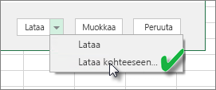
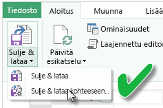
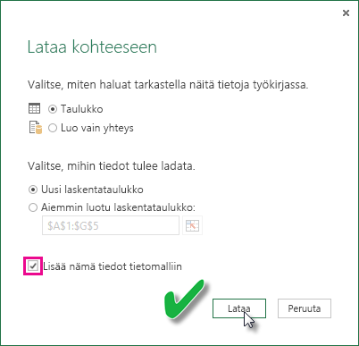

# Excel-työkirjasta luodun tietojoukon päivittäminen paikallisessa asemassa
## Tuetut toiminnot:
Power BI, Päivitä nyt ja Ajoita päivitys ovat tuettuja tietojoukkoja, jotka on luotu Excel-työkirjoista, jotka on tuotu paikallisesta asemasta, jossa Power Query (hae ja muunna tiedot Excel 2016:ssa) tai Power Pivot  käytetään yhteyden muodostamiseen ja tietojen lataamiseen Excel-tietomalliin:  

### Power BI Gateway - Personal
* Kaikki Power Queryssä näkyvät online tietolähteet.
* Kaikki paikalliset tietolähteet, jotka näkyvät Power Queryssä, lukuun ottamatta Hadoop-tiedostoa (HDFS) ja Microsoft Exchangea.
* Kaikki Power Pivotissa näkyvät online-tietolähteet.\*
* Kaikki paikalliset tietolähteet, jotka näkyvät Power Pivotissa, lukuun ottamatta Hadoop-tiedostoa (HDFS) ja Microsoft Exchangea.

<!-- Refresh Data sources-->
[!INCLUDE [refresh-datasources](./includes/refresh-datasources.md)]

> **Huomautukset:**  
> 
> * Yhdyskäytävä on oltava asennettuna ja käynnissä, jotta Power BI voi muodostaa yhteyden paikallisiin tietolähteisiin ja päivittää tietojoukon.
> * Kun käytät Excel 2013:a varmista, että olet päivittänyt Power Queryn uusimpaan versioon.
> * Päivittämistä ei tueta Excel-työkirjoissa, jotka on tuotu paikallisesta asemasta, jossa on tietoja vain laskentataulukoissa tai linkitetyissä taulukoissa. Päivitystä tuetaan laskentataulukon tiedoille, jos ne on tallennettu ja tuotu OneDrivesta. Lue lisää kohdasta [Excel-työkirjasta luodun tietojoukon päivittäminen OneDrivessa tai SharePoint Onlinessa](refresh-excel-file-onedrive.md).
> * Kun päivität tietojoukon, joka on luotu Excel-työkirjasta tai tuotu paikallisesta asemasta, vain tietolähteistä kysellyt tiedot päivitetään. Jos muutat tietomallin rakennetta Excelissä tai Power Pivotissa esimerkiksi luomalla uuden toimenpiteen tai muuttamalla sarakkeen nimeä, näitä muutoksia ei kopioida tietojoukkoon. Jos olet tehnyt tällaisia muutoksia, työkirja pitää julkaista tai ladata uudelleen. Jos aiot tehdä säännöllisesti muutoksia työkirjan rakenteeseen ja haluat, että ne näkyisivät tietojoukon Power BI:ssä ilman uudelleen lataamista, harkitse työkirjan viemistä OneDriveen. Power BI päivittää automaattisesti rakenne- ja työkirjatiedot, jotka tallennetaan ja tuodaan OneDrivesta.
> 
> 

## Miten voin varmistaa, että tiedot on ladattu Excel-tietomalliin?
Kun käytät Power Querya (Hae ja Muunna tiedot Excel 2016:ssa) muodostaaksesi yhteyden tietolähteeseen, sinulla on useita vaihtoehtoja, minne tiedot ladataan. Jotta voit varmistaa, että lataat tiedot tietomalliin, sinun täytyy valita **Lisää nämä tiedot tietomalliin** -vaihtoehto **Lataa kohteeseen** -valintaikkunassa.

> [!NOTE]
> Nämä kuvat esittävät Excel 2016:a.
> 
> 

Valitse kohdasta **Siirtymistoiminto** **Lataa kohteeseen...**  
    

Jos napsautat **Muokkaa**, Query Editor avautuu. Siellä voit napsauttaa **Sulje ja lataa kohteeseen...**  
    

Varmista sitten valinnassa **Lataa kohteeseen**, että valitset **Lisää nämä tiedot tietomalliin**.  
    

### Entä jos käytän Nouda ulkoiset tiedot Power Pivotissa?
Se onnistuu helposti. Aina, kun käytät Power Pivotia yhteyden muodostamiseen ja kyselyn tietoja paikallisesta tai online-tietolähteestä, tiedot ladataan automaattisesti tietomalliin.

## Kuinka päivitys ajoitetaan?
Kun asetat päivitysaikataulun, Power BI muodostaa suoraan yhteyden tietolähteisiin käyttämällä tietojoukon yhteystietoja ja tunnistetietoja päivitettyjen tietojen kyselyyn ja lataa sitten päivitetyt tiedot tietojoukkoon. Kaikki visualisoinnit raportteihin ja koontinäyttöihin, jotka perustuvat Power BI-palvelussa oleviin tietojoukkoihin, päivitetään myös.

Lisätietoja ajoitetun päivityksen määrityksestä on kohdassa [Ajoitetun päivityksen määrittäminen](refresh-scheduled-refresh.md).

## Jos ilmenee ongelmia
Ongelmat johtuvat yleensä siitä, että Power BI ei voi kirjautua sisään tietolähteisiin tai jos tietojoukko muodostaa yhteyden paikalliseen tietolähteeseen, mutta yhdyskäytävä on offline-tilassa. Varmista, että Power BI voi kirjautua sisään tietolähteisiin. Jos tietolähteeseen kirjautumisen salasana muuttuu tai jos Power BI kirjataan ulos tietolähteestä, yritä kirjautua uudelleen sisään tietolähteisiin Tietolähteen tunnistetiedot -kohdassa.

Varmista, että jätät kohtaan **Lähetä päivitysvirheen ilmoitusviesti sähköpostiini** valintamerkin. Haluat tietää heti, jos ajoitettu päivitys epäonnistuu.

>[!IMPORTANT]
>Päivitystä ei tueta OData-syötteissä, jotka liittyvät Power Pivotiin. Kun käytetään OData-syötettä tietolähteenä, käytä Power Queryä.

## Vianmääritys
Joskus tietojen päivittäminen ei mene odotetulla tavalla. Yleensä tämä on yhdyskäytävään liittyvä ongelma. Tutustu yhdyskäytävän vianmääritystä koskeviin artikkeleihin, joissa on esitetty työkaluja ja tunnettuja ongelmia.

[Paikallisen tietoyhdyskäytävän vianmääritys](service-gateway-onprem-tshoot.md)

[Power BI -yhdyskäytävän vianmääritys – Personal](service-admin-troubleshooting-power-bi-personal-gateway.md)

## Seuraavat vaiheet
Onko sinulla muuta kysyttävää? [Kokeile Power BI -yhteisöä](http://community.powerbi.com/)

