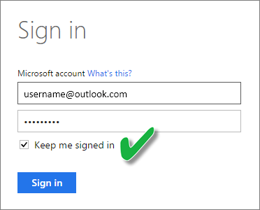

# Excel-työkirjasta luodun tietojoukon päivittäminen OneDrivessa tai SharePoint Onlinessa

Voit tuoda Excel-työkirjoja, jotka on tallennettu paikalliseen tietokoneeseesi tai pilvitallennustilaan, kuten OneDrive for Business- tai SharePoint Online -palveluun. Tutustumme pilvitallennustilan käytön etuihin Excel-tiedostoja tallennettaessa. Katso lisätietoja Excel-tiedostojen tuomisesta Power BI:iin kohdasta [Nouda tiedot Excel-työkirjatiedostosta](service-excel-workbook-files.md).

## Mitkä ovat edut?

Tiedostojen tuominen Onedrivesta tai SharePoint Onlinesta on hyvä tapa varmistaa, että työ, jota olet tekemässä Excelissä pysyy synkronoituna Power BI -palveluun. Tiedoston malliin lataamasi tiedot tuodaan tietojoukkoon, ja tiedostoon luomasi raportit ladataan Raportit-kohtaan Power BI -palvelussa. Jos teet muutoksia tiedostoon OneDrivessa tai SharePoint Onlinessa, esimerkiksi lisäämällä uusia mittareita, muuttamalla sarakenimiä tai muokkaamalla visualisointeja ja kun tallennat, muutokset päivitetään myös Power BI-palveluun yleensä noin tunnin kuluessa.

Kun tuot Excel-työkirjan omasta Onedrivesta, kaikki työkirjan tiedot kuten taulukot, laskentataulukot ja/tai tiedot, jotka on ladattu Excel-tietomalliin sekä tietomallin tiedot ja rakenne tuodaan uuteen tietojoukkoon Power BI:ssa. Kaikki Power View -visualisoinnit luodaan uudelleen kohdassa Raportit. Power BI muodostaa automaattisesti yhteyden OneDriven tai SharePoint Onlinen työkirjan tietoihin noin tunnin välein päivitysten tarkistamiseksi. Jos työkirja on muuttunut, Power BI päivittää tietojoukon ja raportit Power BI-palvelussa.

Voit päivittää tietojoukon Power BI -palvelussa. Kun päivität manuaalisesti tai suoritat ajoitettua päivitystä tietojoukolle, Power BI muodostaa yhteyden suoraan ulkoisiin tietolähteisiin suorittamaan kyselyä päivitettyjä tietoja varten, ja lataa sen sitten tietojoukkoon. Tietojoukon päivittäminen Power BI:ssa ei päivitä OneDriven tai SharePoint Onlinen työkirjan tietoja. 

## Tuetut toiminnot:

Power BI:n **Päivitä nyt** ja **Ajoita päivitys** ovat tuettuja tietojoukoille, jotka on luotu sellaisista Power BI Desktop -tiedostoista, jotka tuotu paikallisesta asemasta, jossa Nouda tiedot/Kyselyeditoria käytetään yhteyden muodostamiseen ja tietojen lataamiseen mistä tahansa seuraavista tietolähteistä:  

### Power BI Gateway - Personal

* Kaikki online-tietolähteet, jotka näkyvät Power BI Desktopin kohdassa Nouda tiedot ja Kyselyeditorissa.
* Kaikki paikalliset tietolähteet, jotka näkyvät Power BI Desktopin kohdassa Nouda tiedot ja Kyselyeditorissa lukuun ottamatta Hadoop-tiedostoa (HDFS) ja Microsoft Exchangea.

<!-- Refresh Data sources-->
[!INCLUDE [refresh-datasources](./includes/refresh-datasources.md)]

> [!NOTE]
> Yhdyskäytävä on oltava asennettuna ja käynnissä, jotta Power BI voi muodostaa yhteyden paikallisiin tietolähteisiin ja päivittää tietojoukon.
>
>

## OneDrive vai OneDrive for Business? Mikä niiden ero on?

Jos sinulla on sekä henkilökohtainen OneDrive että OneDrive for Business, on suositeltavaa säilyttää tiedostot, jotka haluat tuoda Power BI:ssa OneDrive for Business -palveluun. Syynä on se, että käytät todennäköisesti kahta eri tiliä niille kirjautumista varten.

Yhteyden muodostaminen OneDrive for Business -palveluun Power BI:ssä on yleensä saumaton, koska tili, jota käytit Power BI -kirjautumiseen on usein sama tili, jota käytetään kirjauduttaessa OneDrive for Business -palveluun. Henkilökohtaisen OneDrive olet todennäköisesti kuitenkin kirjautunut sisään toisella [Microsoft-tilillä](https://account.microsoft.com).

Kun olet kirjautunut sisään Microsoft-tilillesi, muista valita **Pysy kirjautuneena** . Power BI voi tämän jälkeen synkronoida mitä tahansa tekemiäsi päivityksiä Power BI Desktop -tiedostoon ja Power BI -tietojoukkoihin.  

Jos teet muutoksia OneDrive-tiedostoon, joita ei voi synkronoida tietojoukkoon tai raporttiin Power BI:ssa, koska Microsoft-tilisi tunnistetiedot ovat ehkä muuttuneet, sinun pitää muodostaa yhteys ja tuoda tiedostosi takaisin omasta OneDrivesta.

## Yhteyden muodostamisen asetukset Excel-tiedostoon

Kun muodostat yhteyden Excel-työkirjaan OneDrive for Business- tai SharePoint Online -palvelussa, sinulla on kaksi vaihtoehtoa saada työkirjan sisältö Power BI:iin.

[**Excel-tietojen tuominen Power BI:lle** ](service-excel-workbook-files.md#import-or-connect-to-an-excel-workbook-from-power-bi) – kun tuot Excel-työkirjan OneDrive for Business- tai SharePoint online -palvelusta, se toimii edellä kuvatulla tavalla.

[**Yhdistä, Hallitse ja Näytä Excel Power BI:ssä**](service-excel-workbook-files.md#one-excel-workbook--two-ways-to-use-it) – tätä asetusta käytettäessä luot yhteyden Power BI:stä suoraan työkirjaasi OneDrive for Business- tai SharePoint Online -palveluissa.

Kun yhdistät Excel-työkirjan tällä tavalla, tietojoukkoa ei luoda Power BI:ssa. Työkirja näkyy kuitenkin Power BI-palvelussa raporttien kohdalla Excel-kuvake nimen vieressä. Toisin kuin Excel Onlinessa, kun muodostat yhteyden työkirjaan Power BI:sta, jos työkirjassa on yhteyksiä ulkoisiin tietolähteisiin, jotka lataavat tietoja Excel-tietomalliin, voit asettaa päivitysaikataulun.

Kun asetat päivitysaikataulun tällä tavalla, ainoa ero on siinä, että päivitetty tieto siirtyy työkirjan tietomalliin OneDrivessa tai SharePoint Onlinessa Power BI:n tietojoukon sijaan.

## Miten voin varmistaa, että tiedot on ladattu Excel-tietomalliin?

Kun käytät Power Querya (**Hae ja muunna** Excel 2016:ssa) muodostaaksesi yhteyden tietolähteeseen, voi valita useista vaihtoehdoista, minne tiedot ladataan. Jotta voit varmistaa, että lataat tiedot tietomalliin, sinun täytyy valita **Lisää nämä tiedot tietomalliin** -vaihtoehto **Lataa kohteeseen** -valintaikkunassa.

> [!NOTE]
> Nämä kuvat esittävät Excel 2016:a.
>
>

Valitse kohdasta **Siirtymistoiminto** **Lataa kohteeseen...**  

Jos napsautat **Siirtymistoiminnossa** **Muokkaa**, Kyselyeditori avautuu. Siellä voit napsauttaa **Sulje ja lataa kohteeseen...**  

Varmista sitten valinnassa **Lataa kohteeseen**, että valitset **Lisää nämä tiedot tietomalliin**.  

### Entä jos käytän Nouda ulkoiset tiedot Power Pivotissa?

Se onnistuu helposti. Aina, kun käytät Power Pivotia yhteyden muodostamiseen ja kyselyn tietoja paikallisesta tai online-tietolähteestä, tiedot ladataan automaattisesti tietomalliin.

## Kuinka päivitys ajoitetaan?

Kun asetat päivitysaikataulun, Power BI muodostaa yhteyden suoraan tietolähteisiin käyttämällä tietojoukon yhteyden tietoja sekä tunnistetietoja päivitettyjen tietojen kyselyyn ja lataa sitten päivitetyt tiedot tietojoukkoon. Kaikki visualisoinnit raportteihin ja koontinäyttöihin, jotka perustuvat Power BI-palvelussa oleviin tietojoukkoihin, päivitetään myös.

Lisätietoja ajoitetun päivityksen määrityksestä on kohdassa [Ajoitetun päivityksen määrittäminen](refresh-scheduled-refresh.md).

## Jos ilmenee ongelmia

Ongelmat johtuvat yleensä siitä, että Power BI ei voi kirjautua sisään tietolähteisiin tai jos tietojoukko muodostaa yhteyden paikalliseen tietolähteeseen, mutta yhdyskäytävä on offline-tilassa. Varmista, että Power BI voi kirjautua sisään tietolähteisiin. Jos tietolähteeseen kirjautumisen salasana muuttuu tai jos Power BI kirjataan ulos tietolähteestä, yritä kirjautua uudelleen sisään tietolähteisiin Tietolähteen tunnistetiedot -kohdassa.

Varmista, että jätät kohtaan **Lähetä päivitysvirheen ilmoitusviesti sähköpostiini** valintamerkin. Haluat tietää heti, jos ajoitettu päivitys epäonnistuu.

## Tärkeä huomautus

Päivitystä ei tueta OData-syötteissä, jotka liittyvät Power Pivotiin. Kun käytetään OData-syötettä tietolähteenä, käytä Power Queryä.

## Vianmääritys

Joskus tietojen päivittäminen ei mene odotetulla tavalla. Yleensä tämä on yhdyskäytävään liittyvä ongelma. Tutustu yhdyskäytävän vianmääritystä koskeviin artikkeleihin, joissa on esitelty työkaluja ja tunnettuja ongelmia:

- [Paikallisen tietoyhdyskäytävän vianmääritys](service-gateway-onprem-tshoot.md)
- [Power BI -yhdyskäytävän vianmääritys – Personal](service-admin-troubleshooting-power-bi-personal-gateway.md)

Onko sinulla muuta kysyttävää? [Kokeile Power BI -yhteisöä](https://community.powerbi.com/)

