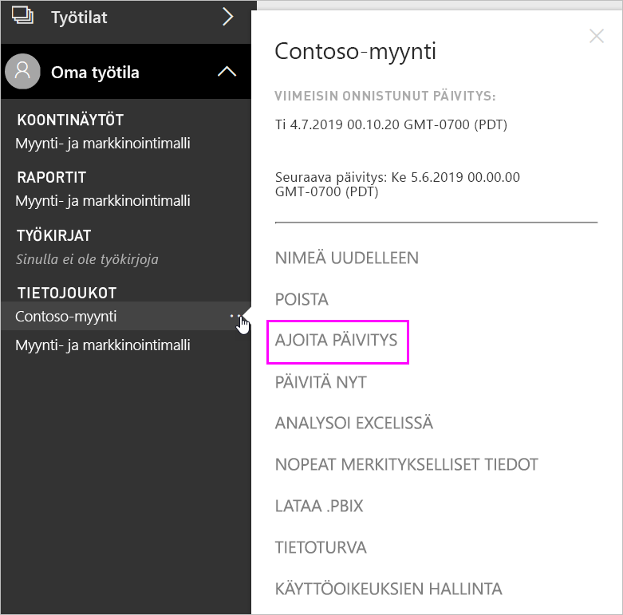
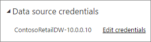
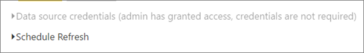
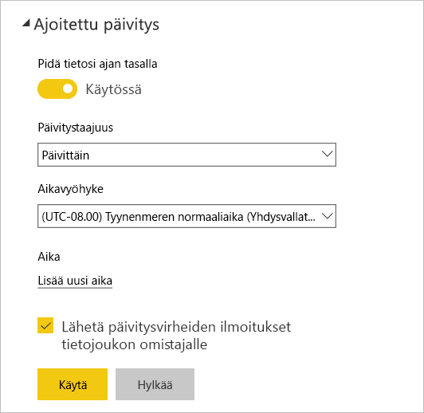

# Ajoitetun päivityksen määrittäminen

>[!NOTE]
>Tietojoukon ajoitettu päivitys keskeytetään kahden kuukauden käyttämättömyyden jälkeen. Katso lisätietoja kohdasta [*Ajoitettu päivitys*](#scheduled-refresh) alempana tässä artikkelissa.
>
>

Jos tietojoukkosi tukee ajoitettua päivitystä, käyttämällä toimintoja **Päivitä nyt** ja **Ajoita päivitys** on huomioitava muutama vaatimus ja asetus onnistunutta päivitystä varten. Näitä ovat **Yhdyskäytävän yhteys**, **Tietolähteen tunnistetiedot** ja **Ajoitettu päivitys**. Alla on kunkin käsitteen kuvailu:

Tässä kuvataan vaihtoehtoja, jotka ovat käytössä vaihtoehdoissa [Paikallinen tietoyhdyskäytävä (henkilökohtainen tila)](service-gateway-personal-mode.md) ja [Paikallinen tietoyhdyskäytävä](service-gateway-onprem.md).

Pääset **Ajoitettu päivitys** -näkymään seuraavasti.

1. Valitse **Enemmän vaihtoehtoja** (...) tietojoukon vierestä kohdasta **Tietojoukot**.
2. Valitse **Ajoita päivitys**.

    

## Yhdyskäytäväyhteys
Näet eri vaihtoehtoja sen mukaan, onko kyseessä henkilökohtainen tai yrityksen yhdyskäytävä verkossa ja käytettävissä.

Jos yhdyskäytävää ei ole käytettävissä, näet **Yhdyskäytäväyhteys**-kohdan poistettuna käytöstä. Näkyviin tulee myös sanoma henkilökohtaisen yhdyskäytävän asentamisesta.

Jos sinulla on henkilökohtainen yhdyskäytävä määritettynä, voi valita sen, jos se on online-tilassa. Se näkyy offline-tilassa, jos se ei ole käytettävissä.

Voit myös valita yritysyhdyskäytävän, jos sellainen on käytettävissäsi. Näkyviin tulee vain yritysyhdyskäytävä, joka on käytettävissä, jos tilisi on luettelossa tietolähteen **Käyttäjät**-välilehdellä kyseisen yhdyskäytävän kohdalla.

## Tietolähteen tunnistetiedot
### Power BI Gateway - Personal
Jos käytät henkilökohtaista yhdyskäytävää tietojen päivittämiseen, sinun on annettava tunnistetiedot muodostaaksesi yhteyden taustajärjestelmän tietolähteeseen. Jos olet muodostanut yhteyden sisältöpakettiin online-palvelusta, yhteyden muodostamiseksi antamasi tunnistetiedot säilytetään ajoitettua päivitystä varten.

Sinua pyydetään kirjautumaan tietolähteeseen vain kun päivität kyseisen tietojoukon ensimmäistä kertaa. Kun tunnistetiedot on syötetty, kyseiset tunnistetiedot säilyvät tietojoukossa.

> [!NOTE]
> Jotkin todennusmenetelmät, jos käytät kirjautuessasi tietolähteeseen vanhentunutta salasanaa tai ne on muutettu, edellyttävät sen muuttamista tietolähteeseen **Tietolähteen tunnistetiedoissa**.
>
>

Jos ilmenee ongelmia, ongelmalla on yleensä jotain tekemistä sen kanssa, että yhdyskäytävä on offline-tilassa, koska sitä ei voitu kirjata sisään Windowsiin ja palvelua käynnistää tai Power BI ei voinut kirjautua tietolähteisiin tietojen päivittämistä koskevaa kyselyä varten. Jos päivitys epäonnistuu, tarkista tietojoukon asetukset. Jos yhdyskäytäväpalvelu on offline-tilassa, näet virheen **Tila**-kohdassa. Jos Power BI ei voi kirjautua sisään tietolähteeseen, näet virheen Tietolähteen tunnistetiedot -kohdassa.

### Paikallinen tietoyhdyskäytävä
Jos käytössäsi on paikallinen tietoyhdyskäytävä tietojen päivittämiseen, sinun ei tarvitse antaa tunnistetietoja sellaisina kuin ne on määritelty tietolähdettä varten yhdyskäytävän järjestelmänvalvojan toimesta.

> [!NOTE]
> Muodostettaessa yhteyttä paikalliseen SharePointiin tietojen päivittämiseksi, Power BI tukee vain *Anonyymi-* , *Perus-* , ja *Windows (NTLM/Kerberos)* -todennusmekanismeja. Power BI ei tue *ADFS:a* tai mitään *lomakepohjaisen todentamisen* mekanismia  tietojen päivittämiseksi paikallisessa SharePoint-tietolähteessä.
>
>

## Ajoitettu päivitys
**Ajoitettu päivitys** -osassa määritetään aikavälit tietojoukon päivittämiseksi. Joidenkin tietolähteiden päivittäminen ei edellytä määritettävää yhdyskäytävää, joidenkin taas edellyttää.

Aseta **Pidä tietosi ajan tasalla** -liukusäätimen asetukseksi **Kyllä**, jotta voit määrittää asetukset.

> [!NOTE]
> Power BI -palvelu pyrkii aloittamaan tietojen päivittämisen **15 minuutin kuluessa** ajoitetusta päivitysajasta.
>
>

> [!NOTE]
> Tietojoukon ajoitettu päivitys keskeytetään kahden kuukauden käyttämättömyyden jälkeen. Tietojoukkoa pidetään epäaktiivisena, kun kukaan käyttäjä ei ole käynyt koontinäytössä tai sille rakennetussa raportissa. Samaan aikaan tietojoukon omistajalle lähetetään sähköpostiviesti, joka kertoo ajoitetun päivityksen olevan keskeytetty, ja tietojoukon päivitysaikataulu näytetään muodossa **pois käytöstä**. Jatka ajoitettua päivitystä käymällä millä tahansa koontinäytöllä tai raportissa, joka on rakennettu tietojoukkoon.
>
>

## Tuetut toiminnot:
Tiettyjä tietojoukkoja tuetaan ajoitettua päivitystä varten eri yhdyskäytäviä vastaan. Seuraavassa kerrotaan, mitä on saatavana.

### Power BI Gateway - Personal
**Power BI Desktop**

* Kaikki online-tietolähteet, jotka näkyvät Power BI Desktopin kohdassa **Nouda tiedot** ja Kyselyeditorissa.
* Kaikki paikalliset tietolähteet, jotka näkyvät Power BI Desktopin **Nouda tiedot** -kohdassa ja Kyselyeditorissa lukuun ottamatta Hadoop-tiedostoa (HDFS) ja Microsoft Exchangea.

**Excel**

> [!NOTE]
> Excel 2016:ssa ja sitä uudemmissa versioissa Power Query näkyy nyt valintanauhan **Tiedot**-osiossa kohdassa **Hae ja muunna tiedot**.
>
>

* Kaikki Power Queryssä näkyvät online tietolähteet.
* Kaikki paikalliset tietolähteet, jotka näkyvät Power Queryssä, lukuun ottamatta Hadoop-tiedostoa (HDFS) ja Microsoft Exchangea.
* Kaikki Power Pivotissa näkyvät online-tietolähteet.
* Kaikki paikalliset tietolähteet, jotka näkyvät Power Pivotissa, lukuun ottamatta Hadoop-tiedostoa (HDFS) ja Microsoft Exchangea.

<!-- Refresh Data sources-->
[!INCLUDE [refresh-datasources](./includes/refresh-datasources.md)]

## Vianmääritys
Joskus tietojen päivittäminen ei mene odotetulla tavalla. Yleensä tämä on yhdyskäytävään liittyvä ongelma. Tutustu yhdyskäytävän vianmääritystä koskeviin artikkeleihin, joissa on esitetty työkaluja ja tunnettuja ongelmia.

- [Paikallisen tietoyhdyskäytävän vianmääritys](service-gateway-onprem-tshoot.md)
- [Power BI -yhdyskäytävän vianmääritys – Personal](service-admin-troubleshooting-power-bi-personal-gateway.md)

## Seuraavat vaiheet
- [Tietojen päivittäminen Power BI:ssä](refresh-data.md)  
- [Power BI -yhdyskäytävä – Personal](service-gateway-personal-mode.md)  
- [Paikallinen tietoyhdyskäytävä (henkilökohtainen tila)](service-gateway-onprem.md)  
- [Paikallisen tietoyhdyskäytävän vianmääritys](service-gateway-onprem-tshoot.md)  
- [Power BI -yhdyskäytävän vianmääritys – Personal](service-admin-troubleshooting-power-bi-personal-gateway.md)  

Onko sinulla muuta kysyttävää? [Voit esittää kysymyksiä Power BI -yhteisössä](https://community.powerbi.com/)

