# Jaettujen tietojoukkojen käyttö Power BI:n raportin muodostimessa

Voit käyttää Power BI Desktopissa luomaasi tietojoukkoa tietolähteenä Power BI raportin muodostimen sivutetuissa raporteissa. Kuvittele seuraava skenaario: Olet luonut Power BI -raportin Power BI Desktopissa. Käytit paljon aikaa tietomallin suunnitteluun ja loit kauniin Power BI -raportin, jossa on kaikenlaisia hienoja visualisointeja. Raportissasi on matriisi, jossa on useita rivejä, joten sinun täytyy vierittää nähdäksesi ne kaikki. Raportin lukijat haluavat raportin, jonka he voivat tulostaa ja joka näyttää kaikki kyseisen matriisin rivit. Power BI:n sivutetun raportin avulla se onnistuu: voit tulostaa usean sivun mittaisen taulukon tai matriisin, niin että siinä on sivun ylä-ja alatunnisteet ja suunnittelemasi täydellinen sivun asettelu. Se täydentää Power BI Desktop -raporttia. Haluat raporttien perustuvan täsmälleen samoihin tietoihin ilman eroavuuksia, joten käytät samaa tietojoukkoa.

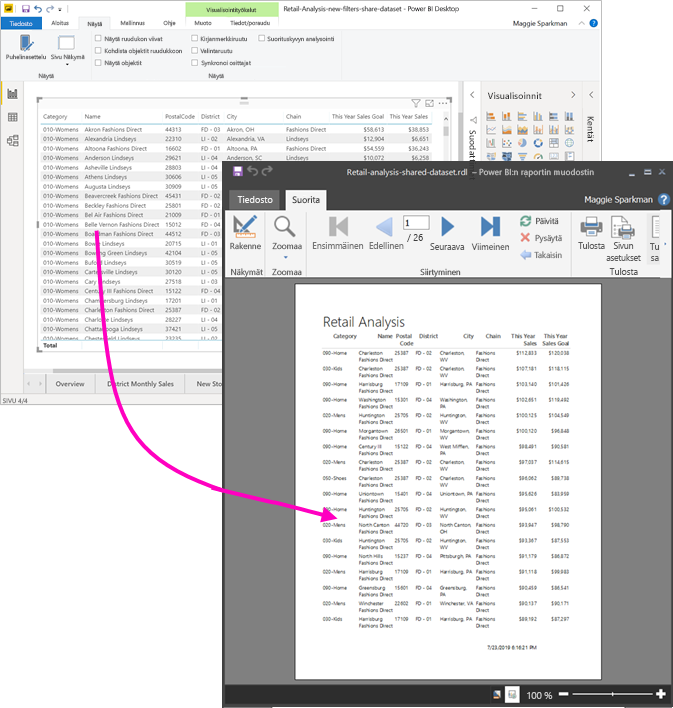

Tietojoukon ei tarvitse olla Premium-kapasiteetin työtilassa, eikä sinun tarvitse olla kyseisen työtilan jäsen. Sinulla pitää olla vain tietojoukon [muodostamisen käyttöoikeus](service-datasets-build-permissions.md). Jos haluat julkaista raportin, tarvitset Power BI Pro -käyttöoikeuden. Tarvitset työtilaan myös vähintään osallistujan roolin Premium-kapasiteetissa.

## Mitä tarvitset

Seuraavassa on luettelo asioista, joita tarvitset ja joita et tarvitse jaetun tietojoukon käyttöön Power BI:n raportin muodostimessa.

- Power BI:n raportin muodostin. [Power BI:n raportin muodostimen lataaminen ja asentaminen](https://go.microsoft.com/fwlink/?linkid=2086513).
- Sinulla on oltava tietojoukon muodostamisen käyttöoikeus, jotta voit käyttää Power BI -tietojoukkoa. Lue [muodostamisen käyttöoikeudesta](service-datasets-build-permissions.md).
- Jos haluat luoda sivutetun raportin raportin muodostimessa, et tarvitse Power BI Pro -käyttöoikeutta. 
- Tarvitset Power BI Pro -käyttöoikeuden sivutetun raportin julkaisemiseen. Tarvitset työtilaan myös vähintään osallistujan roolin Premium-kapasiteetissa. 
- Valinnainen: Jos haluat seurata tämän artikkelin ohjeita, lataa Power BI Desktopin [Jälleenmyyntianalyysimallin .pbix](https://download.microsoft.com/download/9/6/D/96DDC2FF-2568-491D-AAFA-AFDD6F763AE3/Retail%20Analysis%20Sample%20PBIX.pbix)-tiedosto, avaa se Power BI Desktopissa ja lisää taulukko, jossa on paljon sarakkeita. Poista **Muotoilu**-ruudussa käytöstä **Yhteensä**. Julkaise se sitten työtilaan Power BI-palvelussa.

    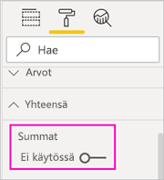

## Yhteyden muodostaminen Power BI -tietojoukkoon

1. Avaa Power BI:n raportin muodostin.
1. Kirjaudu Power BI -tiliisi valitsemalla raportin muodostin oikeasta yläkulmasta **Kirjaudu sisään**.
1. Valitse raporttitietoruudussa **Uusi** > **Power BI -tietojoukkoyhteys**.

    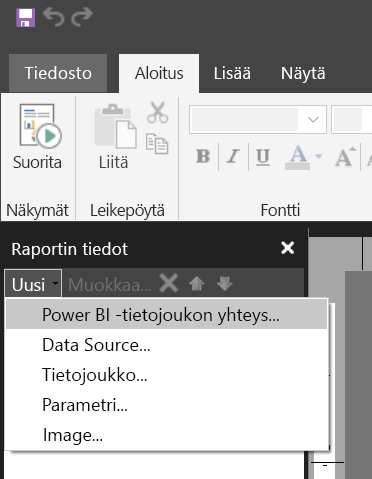

    > [!NOTE]
    > Tietolähdettä tai tietojoukkoa ei voi luoda Power BI -tietojoukolle käyttämällä raportin muodostimen ohjattua taulukko-, matriisi-tai kaavio-toimintoa. Kun olet luonut ne, voit luoda niihin perustuvia taulukoita, matriiseja tai kaavioita ohjatun toiminnon avulla.

1. Hae tai selaa tietojoukkoa tai työtilaa, jossa se sijaitsee > **Valitse**.
    Raportin muodostin täyttää tietojoukon nimen.

    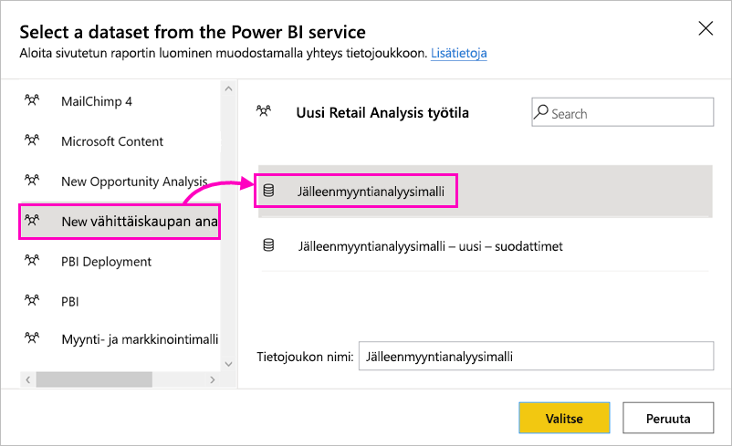
    
1. Tietojoukko näkyy raporttitietoruudun tietolähdeluettelossa.

    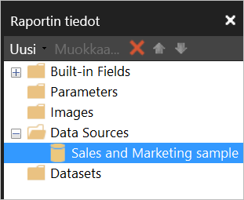

    Muista, että voit muodostaa yhteyden useisiin saman sivutetun raportin Power BI -tietojoukkoihin ja muihin tietolähteisiin.

## Tietojoukon kyselyn hakeminen

Kun haluat, että Power BI -raportin ja raportin muodostimen-raportin tiedot ovat samat, yhteyden muodostaminen tietojoukkoon ei riitä. Tarvitset myös kyseiselle tietojoukolle luodun kyselyn.

1. Avaa Power BI -raportti (.pbix) Power BI Desktopissa.
1. Varmista, että raportissasi on taulukko, joka sisältää kaikki sivutettuun raporttiisi haluamasi tiedot.

1. Valitse **Näytä**-valintanauhasta **Suorityskyvyn analysointi**.

    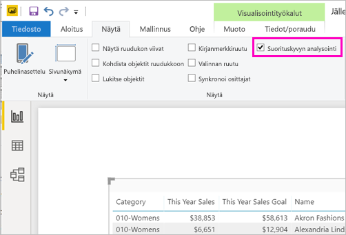

1. Valitse **Suorityskyvyn analysointi** -ruudussa **Aloita tallennus** ja sitten **Päivitä visualisoinnit**.

    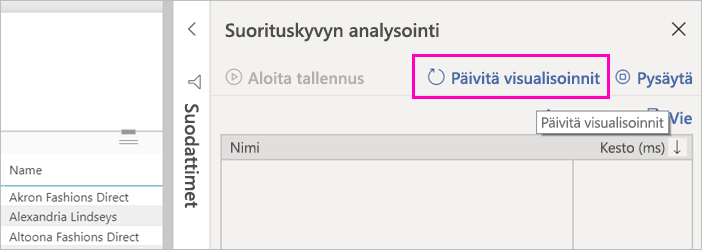

1. Laajenna taulukon nimen vieressä oleva plusmerkki ( **+** ) ja valitse **Kopioi kysely**. Kysely on DAX-kaava, jonka tarvitset Power BI raportin muodostimen tietojoukkoa varten.

    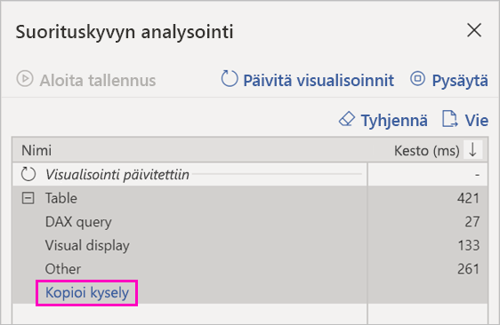

## Luo tietojoukko kyselyn avulla

1. Palaa Power BI:n raportin muodostimeen.
1. Napsauta **Tietolähteet**-kohdan tietolähdettä hiiren kakkospainikkeella ja valitse **Lisää tietojoukko**.

    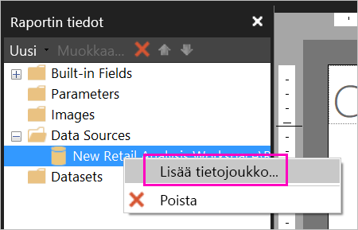

1. Anna sille nimi Tietojoukon ominaisuudet -kohdassa ja valitse **Kyselyjen suunnittelutyökalu**.

4. Varmista, että **DAX** on valittuna, ja poista **suunnittelutila**-kuvakkeen valinta.

    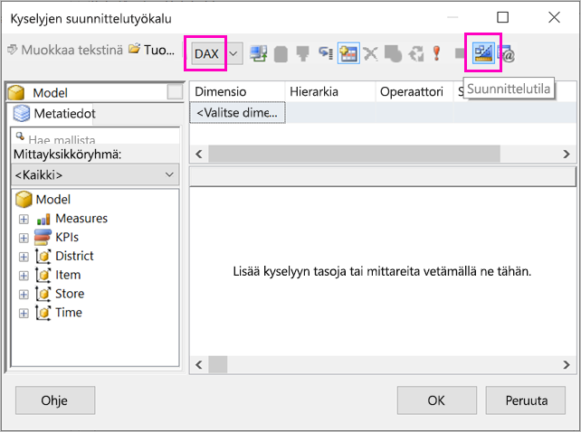

1. Liitä ylempään ruutuun Power BI Desktopista kopioimasi kysely.

1. Valitse **Suorita kysely** (punainen huutomerkki, !) varmistaaksesi, että kysely toimii. 

    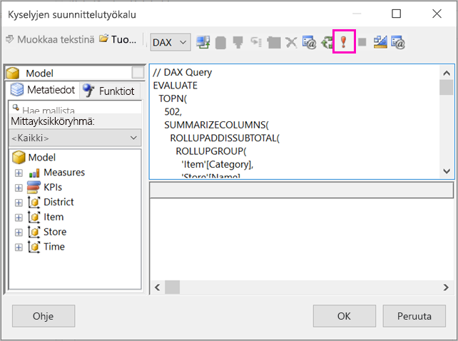

    Näet kyselyn tulokset alemmassa ruudussa.

    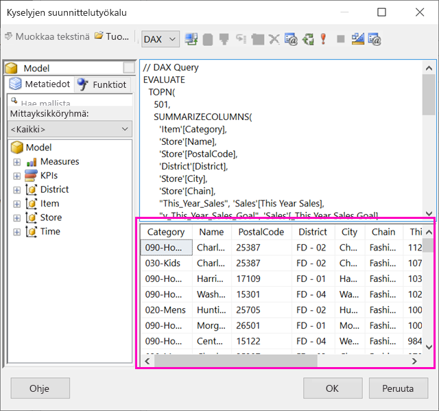

1. Valitse **OK**.

    Näet kyselysi **Tietojoukon ominaisuudet** -valintaikkunan **Kysely**-ikkunassa.

    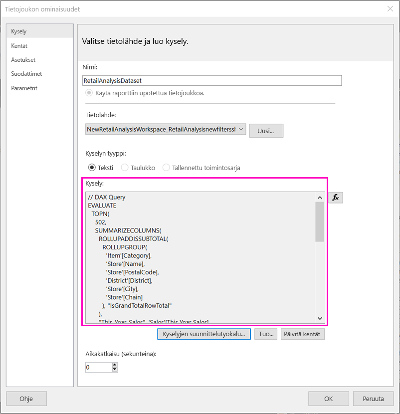

1. Valitse **OK**.

    Näet uuden tietojoukkosi ja sen kenttien luettelon raporttitietoruudussa.

    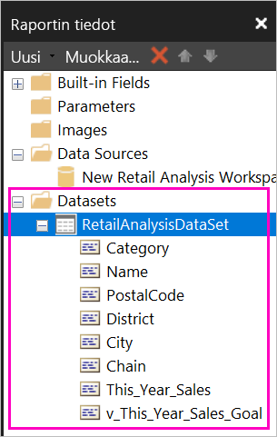

## Luo raporttiin taulukko

Nopea tapa luoda taulukko on käyttää ohjattua taulukon luomista.

1. Valitse **Lisää**-valintanauhasta **Taulukko** > **Ohjattu taulukon luominen**.

    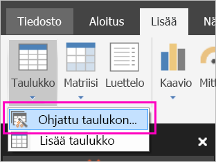

1. Valitse DAX-kyselyllä luomasi tietojoukko > **Seuraava**.

    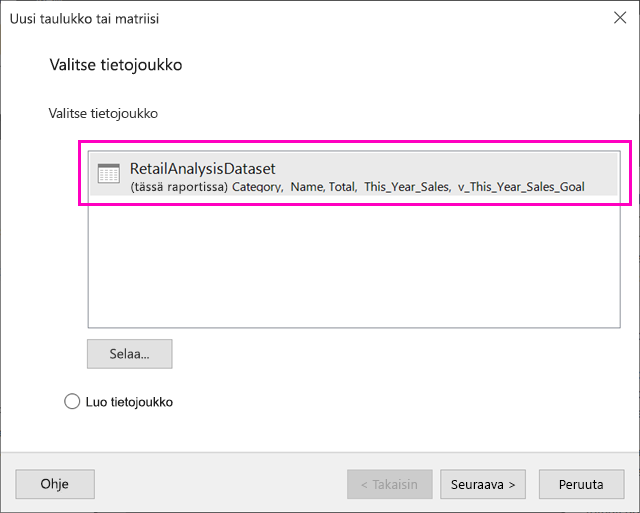

1. Jos haluat tehdä ulkoasultaan litteän taulukon, valitse haluamasi kentät kohdassa **Käytettävissä olevat kentät**. Voit valita useita kenttiä kerrallaan valitsemalla ensimmäisen haluamasi kentän, pitämällä Vaihto-näppäintä painettuna ja valitsemalla viimeisen.

    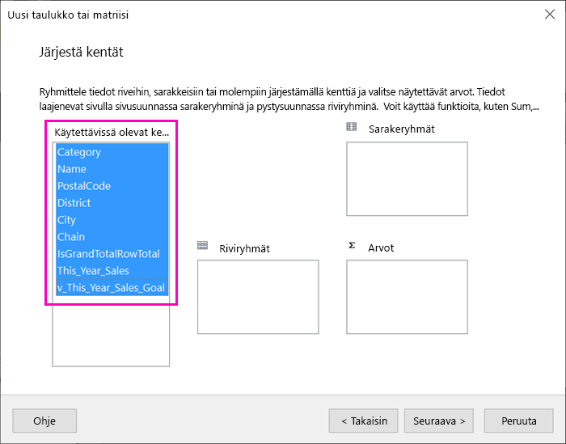

1. Vedä kentät **Arvot**-ruutuun > **Seuraava**.

    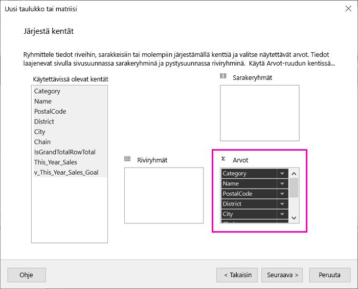

1. Valitse haluamasi ulkoasu-asetukset > **Seuraava**.

1. Valitse **Valmis**.
    Taulukko näkyy suunnittelunäkymässä.

    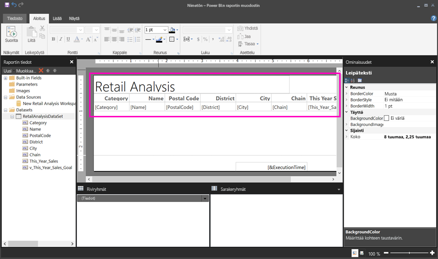

1. Valitse **Lisää otsikko napsauttamalla** ja lisää otsikko.

1. Esikatsele raporttiasi valitsemalla **Suorita**.

    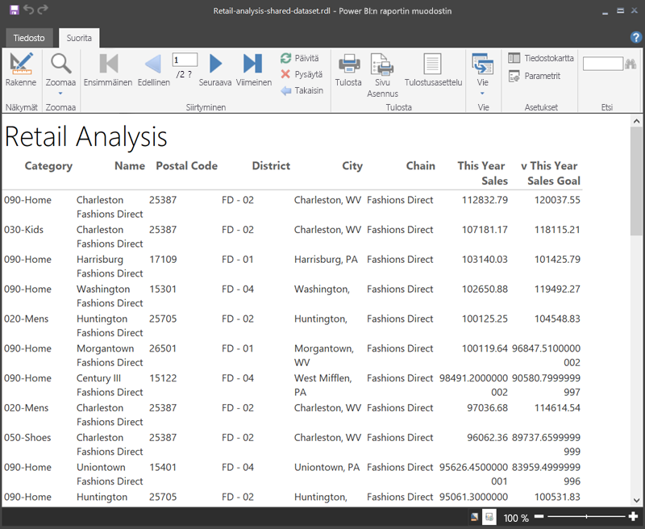

1. Valitse **Tulostusasettelu**, jos haluat nähdä, miltä raporttisi näyttää tulostettuna. 

    Tämän raportin asettelu kaipaa muokkausta. Siinä on 54 sivua, koska sarakkeet ja reunukset tekevät taulukosta kaksi sivua leveän.

    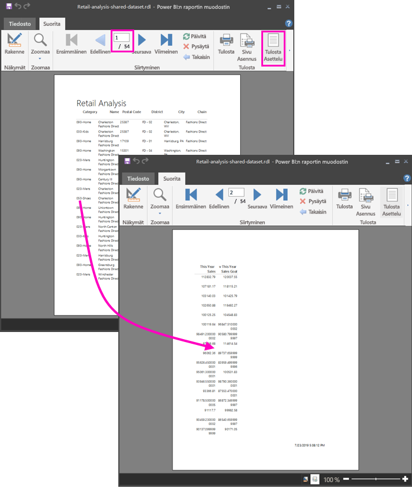

## Raportin muotoilu

Sinulla on useita muotoiluasetuksia, joilla voit sovittaa taulukon yhdelle sivulle. 

1. Voit rajata sivun reunuksia Ominaisuudet-ruudussa. Jos Ominaisuudet-ruutua ei näy, valitse **Näytä**-valintanauhasta **Ominaisuudet**-valintaruutu.

1. Valitse raportti, älä taulukkoa tai otsikkoa.
1. Laajenna **Reunukset** **Raportin ominaisuudet**-ruudun **Sivu**-kohdassa ja muuta kunkin arvoksi **0,75 tuumaa**.

    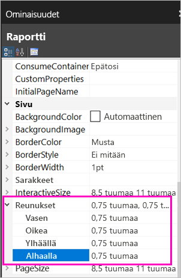

1. Voit myös kaventaa sarakkeita. Valitse sarakkeen reuna ja vedä oikea puoli vasemmalle.

    

1. Toinen vaihtoehto on varmistaa, että lukuarvot on muotoiltu oikein. Valitse solu, jolla on lukuarvo. 
    > [!TIP]
    > Voit muotoilla useamman kuin yhden solun kerrallaan pitämällä Vaihto-näppäintä painettuna samalla, kun valitset muita soluja.

    

1. Muuta **Aloitus**-valintanauhan **Luku**-osassa **Oletus**-muodoksi numeromuoto, kuten **Valuutta**.

    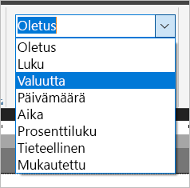

1. Muuta **paikkamerkin** tyyliksi **Malliarvot**, jotta voit tarkastella solun muotoilua. 

    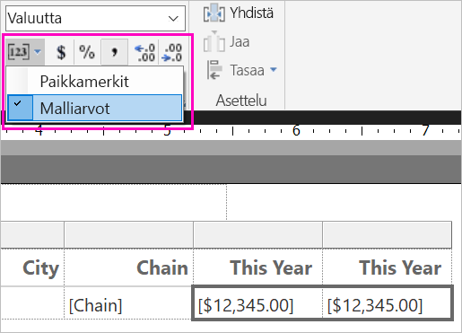

1. Jos se on tarkoituksenmukaista ja haluat säästää enemmän tilaa, vähennä desimaaleja **Luku**-osiossa.

### Tyhjien sivujen poistaminen

Vaikka olisit määrittänyt reunukset ja taulukon sarakkeet kapeammaksi, joka toinen sivu saattaa silti olla tyhjä. Miksi? Matematiikan vuoksi. 

Kun lasket yhteen määrittämäsi sivun reunukset sekä raportin *leipätekstin* leveyden, sen on oltava pienempi kuin raportin muodon leveys.

Oletetaan esimerkiksi, että raporttisi muoto on 8.5" X 11"ja että olet määrittänyt sivureunusten arvoksi 0,75 tuumaa. Kaksi reunusta yhdessä tekevät 1,5 tuumaa, joten leipätekstin on oltava alle 7 tuumaa leveä.

1. Valitse raportin suunnittelualueen oikea reuna ja vedä se niin, että se on pienempi kuin haluttu luku viivaimessa. 

    > [!TIP]
    > Voit säätää sen tarkemmin **leipätekstin** ominaisuuksissa. Valitse **Koko**-kohdassa **Leveys**-ominaisuus.

    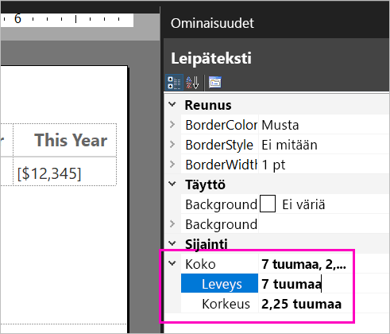

1. Esikatsele raporttiasi valitsemalla **Suorita** ja varmista, että olet päässyt eroon tyhjistä sivuista. Tässä raportissa on nyt vain 26 sivua alkuperäisen 54 sijaan. Onnistui!

    

## Rajoitukset ja huomioitavat asiat 

- Tietojoukoissa, jotka käyttävät reaaliaikaista yhteyttä Analysis Servicesiin, voit muodostaa yhteyden suoraan käyttämällä pohjana olevaa Analysis Services -yhteyttä jaetun tietojoukon sijaan.
- Tietojoukot, joissa on ylennettyjä tai sertifioituja tukia, näkyvät käytettävissä olevien tietojoukkojen luettelossa, mutta niitä ei ole merkitty sellaiseksi. 

## Seuraavat vaiheet

- [Mitä ovat sivutetut raportit Power BI Premiumissa?](paginated-reports-report-builder-power-bi.md)