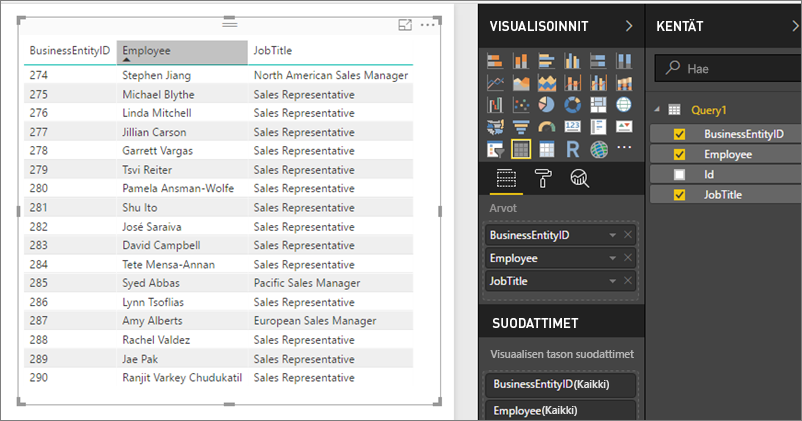

# Jaettujen tietojoukkojen käyttö OData-syötteinä Power BI-raporttipalvelimessa
Voit käyttää jaettuja tietojoukkoja OData-syötteellisellä Power BI Desktopilla.

1. OData syötteen URL-osoitteen avulla voit muodostaa yhteyden OData-lähteeseen.
   
    
2. Kun tuot tiedot Power BI Desktopiin, voit muokata niitä kyselyeditorissa.
   
    
3. Nyt voit käyttää tietoja raporttien suunniteluun.
   
    

Muista ottaa käyttöön **Lisäasetukset**, niin voit ottaa käyttöön avoimen tyypin sarakkeet ja muotoilla niitä vastaavasti sarakkeet Power Queryssa tarpeidesi mukaan.

Lue lisää [yhteyden muodostamisesta OData-syötteisiin Power BI Desktopissa](../desktop-connect-odata.md).

Onko sinulla muuta kysyttävää? [Voit esittää kysymyksiä Power BI -yhteisössä](https://community.powerbi.com/)

