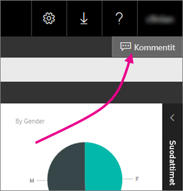
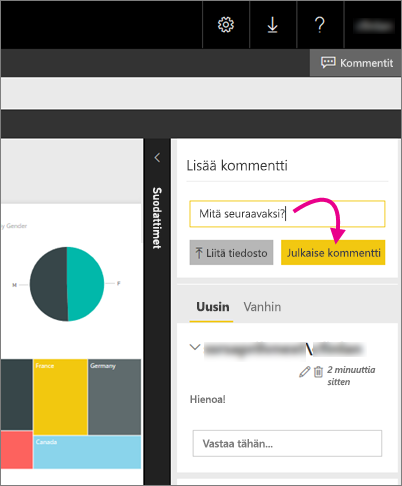

# Lisää kommentteja raporttiin raporttipalvelimessa – Power BI -raporttipalvelin
Voit lisätä kommentteja raportteihin, mukaan lukien Power BI -raportteihin, raporttipalvelimen verkkoportaalissa. Kommentit näkyvät raportissa reaaliajassa, kaikki, joilla on tarvittavat oikeudet, näkevät raportin kommentit. Katso lisätietoja alla olevasta [Käyttöoikeudet](#permissions)-kohdasta.

## Lisää tai tarkastele kommentteja
1. Avaa sivutettu tai Power BI -raportti raporttipalvelimessa.
2. Valitse oikeassa yläkulmassa **Kommentit**.
   
    
   
    Kommentit-ruudussa näet olemassa olevat kommentit.
3. Kirjoita kommenttisi ja valitse sitten **Julkaise kommentti**.
   
    
   
    Kommentti sekä mahdolliset edelliset kommentit ovat näkyvissä verkkoportaalin ruudussa. Ne eivät näy raportin yhteydessä Power BI -mobiilisovelluksissa.
   
   > [!TIP]
   > Tiesitkö? Voit [lisätä huomautuksia Power BI -raportteihin Power BI -mobiilisovelluksissa](../consumer/mobile/mobile-annotate-and-share-a-tile-from-the-mobile-apps.md) ja jakaa huomautuksia sisältävät raportit muiden kanssa.
   > 
   > 

## Käyttöoikeudet
Käyttöoikeuksistasi riippuen:

* Kommentit eivät ole näkyvissä.
* Näet kaikki kommentit ja voit julkaista, muokata ja poistaa omia kommentteja.
* Näet kaikki kommentit, voit julkaista, muokata ja poistaa omia kommentteja ja voit poistaa muiden käyttäjien kommentteja.

## Seuraavat vaiheet
* [Mikä on Power BI -raporttipalvelin?](get-started.md)  

Onko sinulla kysyttävää? [Voit esittää kysymyksiä Power BI -yhteisössä](https://community.powerbi.com/)

