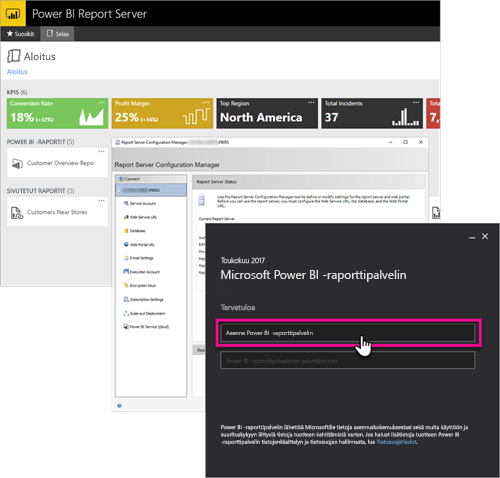

# Hallinnan yhteenveto, Power BI -raporttipalvelin
Tämä on Power BI -raporttipalvelimen hallinnan yhteenveto. Power BI -raporttipalvelin on raporttien paikallinen tallennustila, jonka kautta voit hallita Power BI- ja mobiiliraportteja sekä sivutettuja raportteja. Tässä artikkelissa esitellään Power BI -raporttipalvelimen suunnittelu, käyttöönotto ja hallinta sekä tarjotaan linkkejä lisätietoihin.

## Asentaminen ja siirto
Sinun on asennettava Power BI -raporttipalvelin, jotta voit aloittaa sen käyttämisen. Tämä tehtävä on esitelty muissa artikkeleissa.

Ennen kuin aloitat asentamisen, päivittämisen tai siirtämisen Power BI -raporttipalvelimeen, tutustu raporttipalvelimen [järjestelmävaatimuksiin](system-requirements.md).

### Asentaminen
Jos olet ottamassa käyttöön uutta Power BI -raporttipalvelinta, voit käyttää apuna seuraavaa asiakirjaa. 

[Power BI -raporttipalvelimen asentaminen](install-report-server.md)

### Siirto
SQL Server Reporting Servicesille ei ole paikallista päivitystä. Jos sinulla on aiemmin luotu SQL Server Reporting Services -esiintymä, josta haluat tehdä Power BI -raporttipalvelimen, sinun on siirrettävä se. Saatat haluta suorittaa siirron myös muista syistä. Lisätietoja on siirtotiedostossa.

[Raporttipalvelimen asennuksen siirtäminen](migrate-report-server.md)

## Raporttipalvelimen määrittäminen
Sinulla on useita vaihtoehtoja raporttipalvelinta määritettäessä. Käytätkö SSL:ää? Oletko määrittämässä sähköpostipalvelinta? Haluatko integroida Power BI -palvelun kanssa visualisointien kiinnittämiseksi?

Suurin osa määrityksistäsi tapahtuu raporttipalvelimen määritysten hallinnassa. Lisätietoja on [määritysten hallinnan](https://docs.microsoft.com/sql/reporting-services/install-windows/reporting-services-configuration-manager-native-mode) asiakirjassa.

## Tietoturva
Tietoturva ja suojaus ovat tärkeitä jokaiselle organisaatiolle. Saat lisätietoja todentamisesta, käyttöoikeuksien myöntämisestä, rooleista ja oikeuksista [tietoturvaa](https://docs.microsoft.com/sql/reporting-services/security/reporting-services-security-and-protection) käsittelevistä ohjeista.

## Seuraavat vaiheet
[Power BI -raporttipalvelimen asentaminen](install-report-server.md)  
[Raporttipalvelimen tuoteavaimen löytäminen](find-product-key.md)  
[Asenna Power BI Desktop (optimoitu Power BI -raporttipalvelimelle)](install-powerbi-desktop.md)  
[Raportin muodostimen asentaminen](https://docs.microsoft.com/sql/reporting-services/install-windows/install-report-builder)  
[SQL Server Data Tools (SSDT) -työkalujen lataaminen](http://go.microsoft.com/fwlink/?LinkID=616714)

Onko sinulla muuta kysyttävää? [Voit esittää kysymyksiä Power BI -yhteisössä](https://community.powerbi.com/)

