# <a name="configure-power-bi-report-server-with-azure-application-proxy"></a>Power BI -raporttipalvelimen määrittäminen Azure-sovellusvälityspalvelimen avulla

Tässä artikkelissa käsitellään Azure Active Directory -sovellusvälityspalvelimen käyttöä yhteyden muodostamiseen Power BI -raporttipalvelimeen sekä SQL Server Reporting Services (SSRS) 2016 -versioon ja uudempiin. Tämän integraation avulla yritysverkon ulkopuolella olevat käyttäjät voivat käyttää Power BI -raporttipalvelimen ja raportointipalvelun raportteja asiakasselaimilta ja pysyä suojassa Azure Active Directoryn (AD) avulla. Lue lisätietoja paikallisten sovellusten etäkäytöstä [Azure Active Directory -sovellusvälityspalvelimen](https://docs.microsoft.com/azure/active-directory/manage-apps/application-proxy) kautta.

## <a name="environment-details"></a>Ympäristön tiedot

Näitä arvoja käytettiin luomassamme esimerkissä. 

- Toimialue: umacontoso.com
- Power BI -raporttipalvelin: PBIRSAZUREAPP.umacontoso.com
- SQL Serverin tietolähde: SQLSERVERAZURE.umacontoso.com

## <a name="configure-power-bi-report-server"></a>Power BI -raporttipalvelimen määrittäminen

Kun olet asentanut Power BI -raporttipalvelimen (olettaen, että Azure-näennäiskone on käytössä), määritä Power BI -raporttipalvelimen verkkopalvelun ja verkkoportaalin URL-osoitteet noudattamalla seuraavia vaiheita:

1. Luo saapuvan ja lähtevän liikenteen säännöt näennäiskoneen palomuurissa portille 80 (portti 443, jos https-URL-osoitteita on määritetty). Luo myös Azure-näennäiskoneen saapuvan ja lähtevän liikenteen säännöt Azure-portaalista TCP-protokollalle – portti 80.
2. Näennäiskoneelle määritetty DNS-nimi on ympäristössämme `pbirsazureapp.eastus.cloudapp.azure.com`.
3. Määritä Power BI -raporttipalvelimen ulkoisen verkkopalvelun ja verkkoportaalin URL-osoite valitsemalla **Lisäasetukset**-välilehti > **Lisää**-painike > **Valitse isäntäotsikon nimi** ja lisää isäntänimi (DNS-nimi) tässä esitetyllä tavalla.

    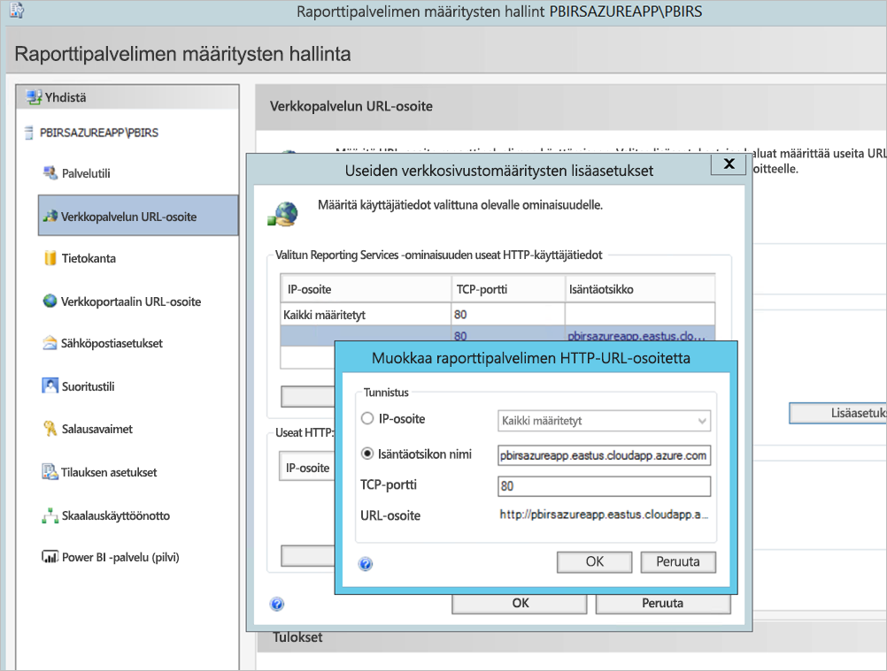

1. Edellinen vaihe suoritettiin sekä Verkkopalvelu- että Verkkoportaaliosalle, minkä ansiosta URL-osoitteet rekisteröitiin raporttipalvelimen määritysten hallintaan:

    - `https://pbirsazureapp.eastus.cloudapp.azure.com/ReportServer`
    - `https://pbirsazureapp.eastus.cloudapp.azure.com/Reports`

2. Azure-portaalissa näkyy kaksi IP-osoitetta näennäiskoneelle verkko-osassa 

    - **Julkinen IP-osoite**. 
    - **Yksityinen IP-osoite**. 
    
    Julkista IP-osoitetta käytetään pääsyyn näennäiskoneen ulkopuolelta.

3. Näin ollen lisäsimme näennäiskoneen (Power BI -raporttipalvelimen) isäntätiedostokohtaan julkisen IP-osoitteen ja isännän nimen `pbirsazureapp.eastus.cloudapp.azure.com`.
4. Huomaa, että kun käynnistät näennäiskoneen uudelleen, dynaaminen IP-osoite saattaa muuttua, ja saatat joutua lisäämään oikean IP-osoitteen uudelleen isäntätiedostossa. Voit välttää tämän määrittämällä julkisen IP-osoitteen staattiseksi Azure-portaalissa.
5. Verkkopalvelun ja verkkoportaalin URL-osoitteiden täytyy olla käytettävissä edellä mainittujen muutosten tekemisen jälkeen.
6. Kun URL-osoitetta `https://pbirsazureapp.eastus.cloudapp.azure.com/ReportServer` yritetään käyttää palvelimessa, tunnistetietoja kysytään kolme kertaa, ja esiin tulee tyhjä näyttö.
7. Lisää seuraava rekisterimerkintä:

    Rekisteriavain `HKEY\_LOCAL\_MACHINE \SYSTEM\CurrentControlset\Control \Lsa\ MSV1\_0`

1. Lisää uusi arvo `BackConnectionHostNames`, usean merkkijojon arvo ja anna isäntänimi `pbirsazureapp.eastus.cloudapp.azure.com`.

Sen jälkeen me voimme myös käyttää palvelimen URL-osoitteita.

## <a name="configure-power-bi-report-server-to-work-with-kerberos"></a>Määritä Power BI -raporttipalvelin toimimaan Kerberoksen kanssa

### <a name="1-configure-the-authentication-type"></a>1. Todennustyypin määrittäminen

Sinun on määritettävä raporttipalvelimen todennustyyppi sallimaan Kerberoksen rajoitettu delegointi. Tämä määritys tehdään **rsreportserver.config**-tiedostossa.

Etsi rsreportserver.config-tiedostosta **Authentication/AuthenticationTypes**-osa.

Haluamme varmistaa, että RSWindowsNegotiate on listattu ja että se on ensimmäisenä todennustyyppien luettelossa. Näkymän kuuluu näyttää seuraavankaltaiselta.

```
<AuthenticationTypes>

    <RSWindowsNegotiate/>

</AuthenticationTypes>
```

Jos sinun on muutettava määritystiedostoa, **pysäytä ja käynnistä raporttipalvelimen palvelu uudelleen** raporttipalvelimen määritysten hallinnassa ja varmista, että muutokset tulevat voimaan.

### <a name="2-register-service-principal-names-spns"></a>2. Palvelun päänimien rekisteröinti

Avaa komentorivi järjestelmänvalvojana ja suorita seuraavat vaiheet.

Rekisteröi seuraavat palvelun päänimet **Power BI -raporttipalvelimen palvelutilillä** seuraavien komentojen avulla

```
setspn -s http/ Netbios name\_of\_Power BI Report Server\_server<space> Power BI Report Server\_ServiceAccount

setspn -s http/ FQDN\_of Power BI Report Server\_server<space> Power BI Report Server\_ServiceAccount
```

Rekisteröi seuraavat palvelun päänimet SQL Server -palvelutilillä seuraavien komentojen avulla (oletusesiintymää varten SQL Serverissä):

```
setspn -s MSSQLSVC/FQDN\_of\_SQL\_Server: 1433 (PortNumber) <SQL service service account>

setspn -s MSSQLSVC/FQDN\_of\_SQL\_Server<SQL service service account>
```

### <a name="3-configure-delegation-settings"></a>3. Delegointiasetusten määrittäminen

Raporttipalvelimen palvelutilin delegointiasetukset täytyy määrittää.

1. Avaa Active Directory -käyttäjät ja -tietokoneet.
2. Avaa raporttipalvelimen palvelutilin ominaisuudet Active Directory Users and Computers -työkalussa.
3. Rajoitettu delegointi on määritettävä protokollan siirtämisellä. Rajoitettu delegointi edellyttää, että delegoitavat palvelut täytyy eritellä.
4. Napsauta **raporttipalvelimen palvelutiliä** hiiren kakkospainikkeella ja valitse **Ominaisuudet**.
5. Valitse **Delegointi**-välilehti.
6. Valitse **Luota tähän tietokoneeseen vain määritettyihin palveluihin delegointia varten**.
7. Valitse **Käytä mitä tahansa todennusprotokollaa**.
8. Valitse **Palvelut, joille tämä tili voi esittää delegoidut tunnistetiedot:** -kohdassa **Lisää**.
9. Valitse uudessa valintaikkunassa **Käyttäjät tai tietokoneet**.
10. Anna **SQL Server -palvelun palvelutili** ja valitse **OK**.

    Se alkaa kirjaimilla MSSQLSVC.

1. Lisää palvelun päänimet.
2. Valitse **OK**. Palvelun päänimen pitäisi näkyä nyt luettelossa.

Näiden vaiheiden avulla Power BI -raporttipalvelin voidaan määrittää toimimaan Kerberos-todennusmekanismin kanssa ja saada tietolähteen testiyhteys toimimaan paikallisessa koneessasi.

## <a name="configure-azure-application-proxy-connector"></a>Määritä Azure-sovellusvälityspalvelimen liitin

Lisätietoja on [sovellusvälityspalvelimen liittimeen liittyvässä](https://docs.microsoft.com/azure/active-directory/manage-apps/application-proxy-add-on-premises-application#add-an-on-premises-app-to-azure-ad) artikkelissa

Sovellusvälityspalvelin asennettiin Power BI -raporttipalvelimelle, mutta voit määrittää sen erilliselle palvelimelle ja varmistaa, että delegointi on määritetty oikein.

### <a name="ensure-the-connector-is-trusted-for-delegation"></a>Varmista, että liitin on luotettu delegointia varten

Varmista, että liitin on luotettu delegointia varten raporttipalvelimen sovellussarjatiliin lisätyssä palvelun päänimessä.

Määritä rajoitettu Kerberos-delegointi niin, että Azure AD -sovellusvälityspalvelin voi delegoida käyttäjätietoja raporttipalvelimen sovellussarjatilille. Määritä rajoitettu Kerberos-delegointi ottamalla sovellusvälityspalvelimen liitäntä käyttöön, jotta voit noutaa Kerberos-lippuja käyttäjille, jotka on todennettu Azure AD:ssä. Tämän jälkeen palvelin välittää kontekstin kohdesovellukseen tai tässä tapauksessa Power BI -raporttipalvelimeen.

Voit määrittää rajoitetun Kerberos-delegoinnin toistamalla seuraavat vaiheet kullekin liitinkoneelle.

1. Kirjaudu toimialueen ohjauskoneeseen toimialueen järjestelmänvalvojana ja avaa sitten **Active Directory -käyttäjät ja -tietokoneet**.
2. Etsi tietokone, jossa liitin on käynnissä.
3. Kaksoisnapsauta tietokonetta ja valitse sitten **Delegointi**-välilehti.
4. Valitse delegointiasetuksissa **Luota tähän tietokoneeseen vain määritettyihin palveluihin delegointia varten**. Valitse sitten **Käytä mitä tahansa todennusprotokollaa**.
5. Valitse **Lisää** ja valitse sitten **Käyttäjät tai tietokoneet**.
6. Anna palvelutili, jota käytät Power BI -raporttipalvelimessa. Kyseessä on se tili, johon lisäsit palvelun päänimen raporttipalvelimen määrityksen aikana.
7. Valitse **OK**. 
8. Tallenna muutokset valitsemalla **OK** uudelleen.

## <a name="publish-through-azure-ad-application-proxy"></a>Julkaise Azure AD -sovellusvälityspalvelimen kautta

Voit nyt määrittää Azure AD -sovellusvälityspalvelimen.

Julkaise Power BI -raporttipalvelin sovellusvälityspalvelimen kautta käyttämällä seuraavia asetuksia. Vaiheittaiset ohjeet sovelluksen julkaisemiseen sovellusvälityspalvelimen kautta löytyvät kohdasta [Sovellusten julkaiseminen Azure AD -sovellusvälityspalvelimen avulla](https://docs.microsoft.com/azure/active-directory/manage-apps/application-proxy-add-on-premises-application#add-an-on-premises-app-to-azure-ad).

- **Sisäinen URL**: Anna sen raporttipalvelimen URL-osoite, jonka liitin pystyy tavoittamaan yritysverkossa. Varmista, että tämä URL-osoite on tavoitettavissa siitä palvelimesta, johon liitin on asennettu. Paras käytäntö on käyttää ylimmän tason toimialuetta, kuten `https://servername/`, jotta voidaan välttää ongelmat, jotka johtuvat sovellusvälityspalvelimen kautta julkaistuista alipoluista. Käytä esimerkiksi palvelinta `https://servername/` palvelimen `https://servername/reports/` tai `https://servername/reportserver/` sijaan. Ympäristömme on määritetty palvelimella `https://pbirsazureapp.eastus.cloudapp.azure.com/`.

    > [!NOTE]
    > Suosittelemme suojatun HTTPS-yhteyden käyttämistä raporttipalvelimessa. Lisätietoja on artikkelissa [SSL-yhteyksien määrittäminen alkuperäistilassa olevassa raporttipalvelimessa](https://docs.microsoft.com/sql/reporting-services/security/configure-ssl-connections-on-a-native-mode-report-server?view=sql-server-2017).

- **Ulkoinen URL**: Anna julkinen URL-osoite, johon Power BI ‑mobiilisovellus muodostaa yhteyden. Se voi esimerkiksi näyttää tältä `https://reports.contoso.com`, jos käytössä on mukautettu verkkotunnus. Jos haluat käyttää mukautettua verkkotunnusta, lataa toimialueelle varmenne ja osoita DNS-tietue sovelluksen oletusarvoiseen msappproxy.net-toimialueeseen. Tarkat ohjeet löytyvät artikkelista [Mukautettujen verkkotunnusten käyttäminen Azure AD -sovellusvälityspalvelimessa](https://docs.microsoft.com/azure/active-directory/manage-apps/application-proxy-configure-custom-domain).

Ympäristömme ulkoiseksi URL-osoitteeksi on määritetty `https://pbirsazureapp-umacontoso2410.msappproxy.net/`.

- **Esitodennusmenetelmä**: Azure Active Directory.
- **Liitinryhmä:** Oletus.

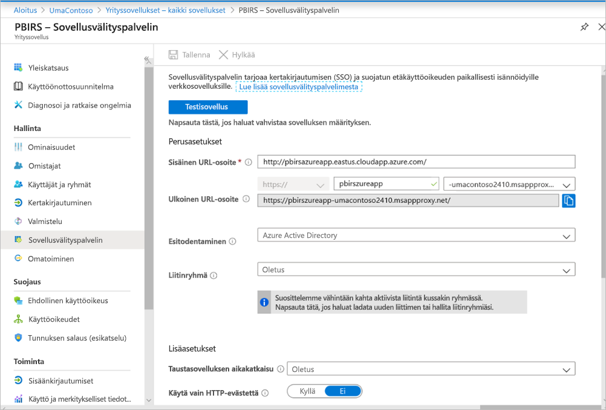

**Lisäasetukset-** osassa ei ole tehty muutoksia. Se on määritetty toimimaan oletusasetusten kanssa:


### <a name="configure-single-sign-on"></a>Kertakirjautumisen määrittäminen

Kun sovelluksesi on julkaistu, määritä kertakirjautumisen asetukset noudattamalla seuraavia vaiheita:

1. Valitse portaalin sovellussivulla **Kertakirjautuminen**.
2. Valitse **Kertakirjautumistila**-kohdassa **Integroitu Windows-todennus**.
3. Aseta **Sisäisen sovelluksen päänimen** arvoksi aiemmin määrittämäsi arvo. Voit tunnistaa tämän arvon noudattamalla seuraavia vaiheita:

    - Kokeile ajaa raportti tai muodostaa testiyhteys tietolähteeseen, jotta Kerberos-lippu luodaan.
    - Kun raportti on luotu tai testiyhteydet on muodostettu, avaa komentorivi ja suorita komento: `klist`. Tulososiossa pitäisi näkyä lippu, jossa on palvelun päänimi `http/`. Jos se on sama kuin Power BI -raporttipalvelimessa määrittämäsi palvelun päänimi, käytä sitä tässä osassa.

1. Valitse **Delegoitu kirjautumistunnus**, jota liitin voi käyttää käyttäjiesi puolesta. Lisätietoja on artikkelissa [Erilaisten paikallisten ja pilvipalveluiden käyttäjätietojen käsitteleminen](https://docs.microsoft.com/azure/active-directory/manage-apps/application-proxy-configure-single-sign-on-with-kcd#working-with-different-on-premises-and-cloud-identities).

    Suosittelemme käyttämään täydellistä käyttäjätunnusta. Määritimme esimerkkimme toimimaan **Täydellinen käyttäjätunnus** -asetuksen kanssa:

    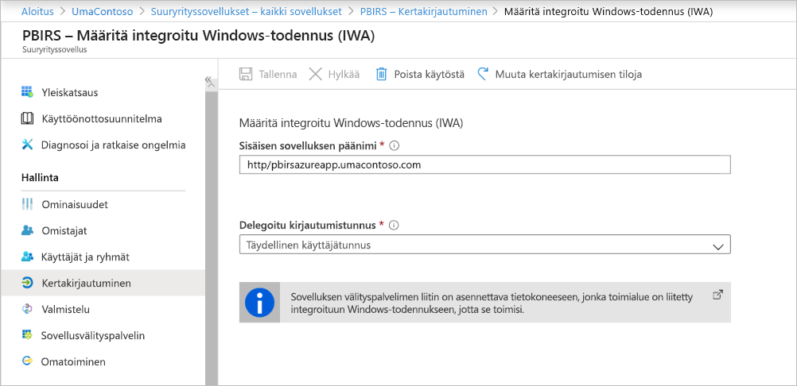

1. Tallenna muutoksesi valitsemalla **Tallenna**.

### <a name="finish-setting-up-your-application"></a>Sovelluksen määrityksen viimeistely

Viimeistele sovelluksen määrittäminen siirtymällä **Käyttäjät ja ryhmät** -osaan ja määrittämällä käyttäjät, jotka voivat käyttää tätä sovellusta.

1. Määritä sovelluksen rekisteröinnin **Todentaminen**-osa Power BI-raporttipalvelinsovellukselle seuraavasti **Uudelleenohjausosoitteet**- ja **Lisäasetukset**-kohdissa:

    - Luo uusi uudelleenohjauksen URL-osoite ja määritä sille **Tyyppi** = **Verkko** ja **Uudelleenohjauksen-URI-osoite** = `https://pbirsazureapp-umacontoso2410.msappproxy.net/`
    - Määritä **Lisäasetukset**-osassa **Uloskirjautumisen URL-osoitteeksi** `https://pbirsazureapp-umacontoso2410.msappproxy.net/?Appproxy=logout`

    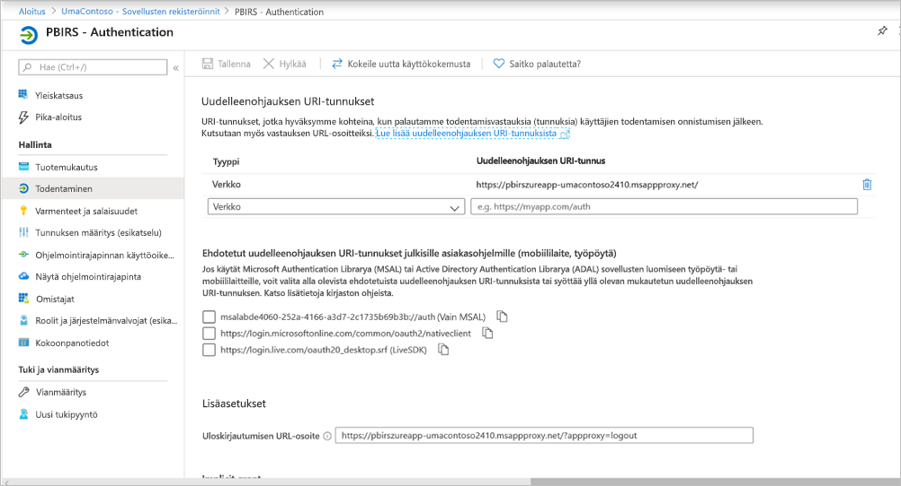

1. Jatka sovelluksen rekisteröinnin **Todentaminen**-osan määrittämistä Power BI -raporttipalvelinsovellukselle seuraavasti **Implisiittinen myöntäminen**-,**Oletusarvoinen asiakastyyppi**- ja **Tuetut tilityypit** -kohdissa:

    - Määritä **Implisiittisen myöntämisen** arvoksi **ID-tunnukset**.
    - Määritä **Oletusarvoisen asiakastyypin** arvoksi **Ei**.
    - Määritä **Tuettujen tilityyppien** arvoksi **Vain tämän organisaatiohakemiston tilit (vain UmaContoso – yksittäinen vuokraaja)** .

    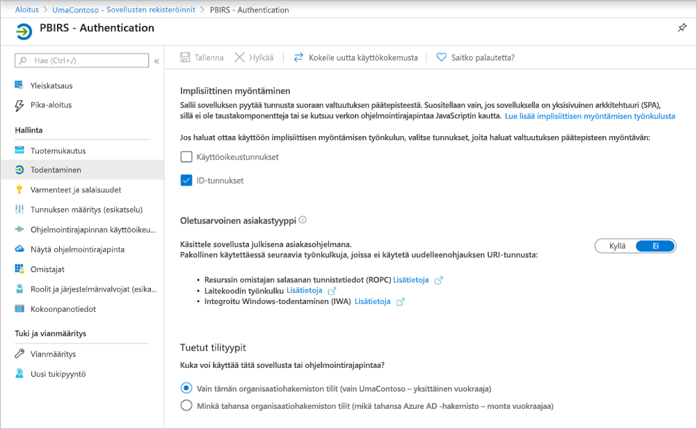

1. Kun kertakirjautuminen on määritetty ja URL-osoite `https://pbirsazureapp-umacontoso2410.msappproxy.net` toimii, seuraavaksi täytyy varmistaa, että kirjautumiseen käytettävä tili on synkronoitu sen tilin kanssa, jolle on myönnetty oikeudet Power BI -raporttipalvelimessa.

1. Ensin täytyy määrittää mukautettu verkkotunnus, jota sisäänkirjautumisessa aiotaan käyttää, ja sitten on varmistettava, että se on todennettu
2. Tässä tapauksessa ostettiin toimialue nimeltä umacontoso.com ja tiedot määritettiin DNS-vyöhykkeeseen. Voit myös yrittää käyttää toimialuetta `onmicrosoft.com` ja synkronoida sen paikallisen AD:n kanssa.

    Lisätietoja on artikkelissa [Opetusohjelma: Olemassa olevan mukautetun DNS-nimen yhdistäminen Azure-sovelluspalveluun](https://docs.microsoft.com/Azure/app-service/app-service-web-tutorial-custom-domain).

1. Kun olet vahvistanut mukautetun verkkotunnuksen DNS-tiedot, sen tilana pitäisi näkyä **Vahvistettu** vastaten portaalin toimialuetta.

    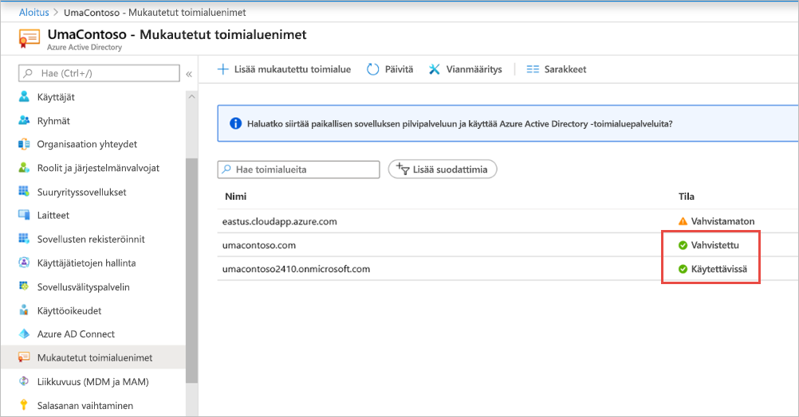

1. Asenna Microsoft Azure AD Connect toimialueen ohjauskoneen palvelimeen ja määritä se synkronoitumaan Azure AD:n kanssa.

    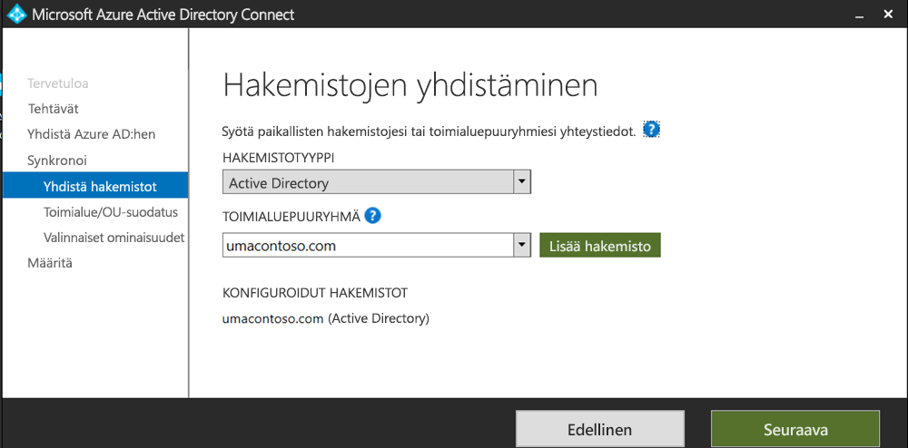

1. Kun Azure AD on synkronoitu paikallisen AD:n kanssa, Azure-portaalissa näkyy seuraava tila:

    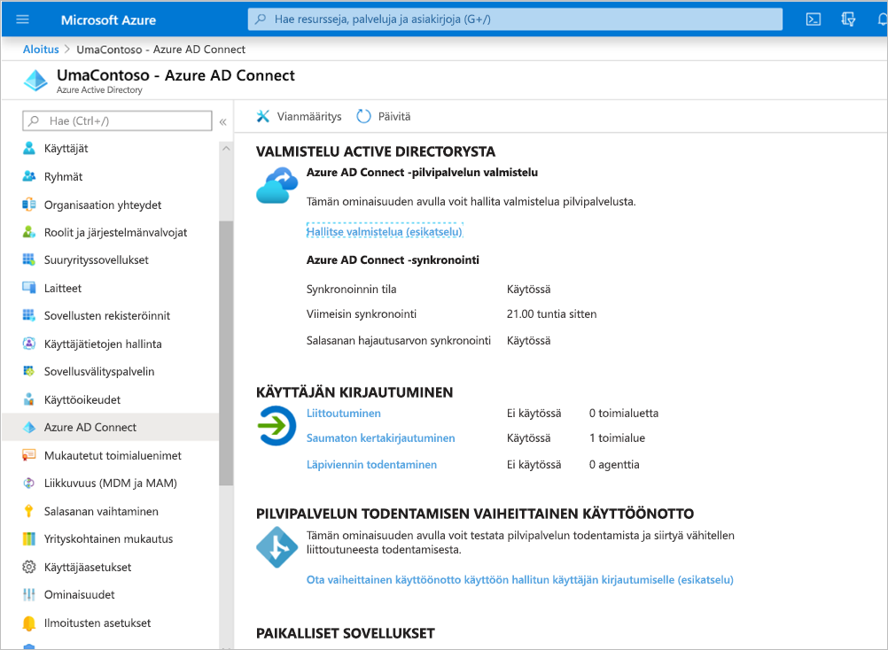

1. Kun synkronointi onnistuu, avaa AD-toimialueet ja luottamukset Toimialueen ohjauskoneessa. Napsauta hiiren kakkospainikkeella Active Directory toimialueet ja luottamukset > Ominaisuudet ja lisää täydellinen käyttäjätunnus. Ympäristössämme `umacontoso.com` on ostettu mukautettu verkkotunnus.

1. Kun olet lisännyt täydellisen käyttäjätunnuksen, sinun pitäisi pystyä määrittämään käyttäjätilit täydellisellä käyttäjätunnuksella niin, että Azure AD -tili ja paikallinen AD-tili ovat yhdistettynä ja että tunnus tunnistetaan todennuksen aikana.

    AD-toimialueen nimi näkyy **Käyttäjän kirjautumisnimi** -osan avattavassa luettelossa, kun edellinen vaihe on tehty. Määritä käyttäjänimi ja valitse toimialue AD-käyttäjän ominaisuuksien **Käyttäjän kirjautumisnimi** -osan avattavasta luettelosta.

    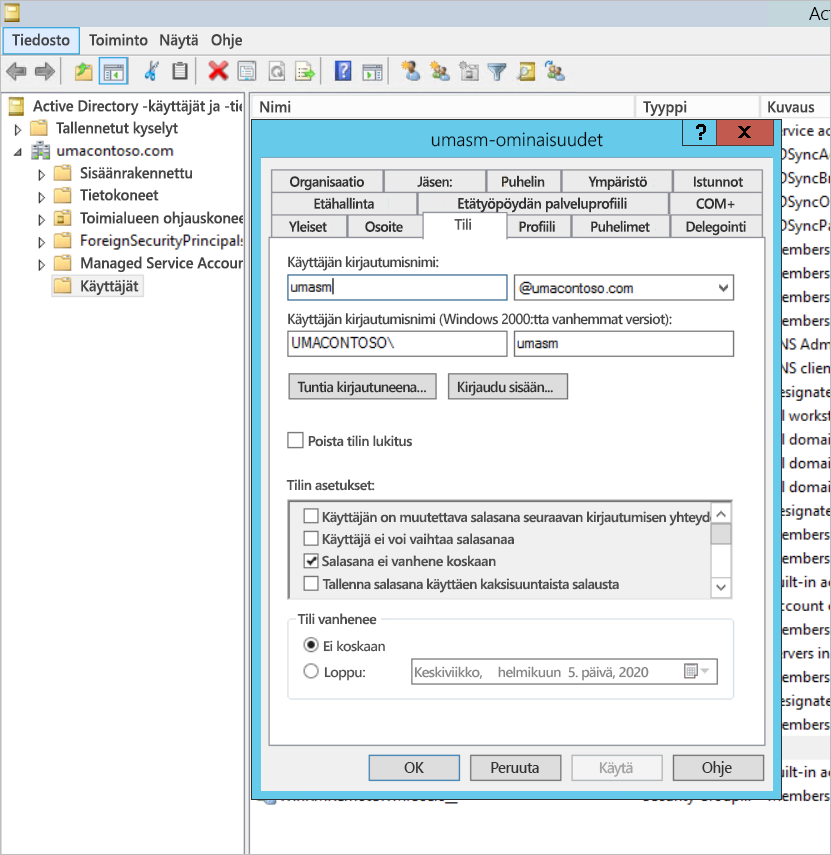

1. Kun AD-synkronointi onnistuu, paikallinen AD-tili tulee näkyviin Azure-portaalissa sovelluksen **Käyttäjät ja ryhmät** -osassa. Tilin lähde on **Windows Server AD.**
2. Tilillä `umasm@umacontoso.com` kirjautuminen on sama kuin Windows-tunnistetietojen `Umacontoso\umasm` käyttäminen.

    Nämä edelliset vaiheet pätevät, jos olet määrittänyt paikallisen AD:n ja aiot synkronoida sen Azure AD:n kanssa.

    Onnistunut sisäänkirjautuminen yllä olevien vaiheiden toteuttamisen jälkeen:

    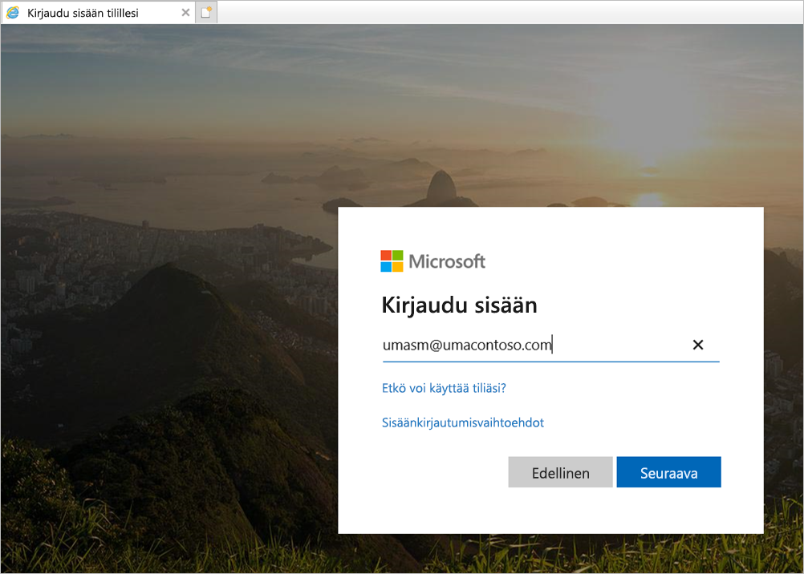

    Seuraavaksi näkyy verkkoportaali:

    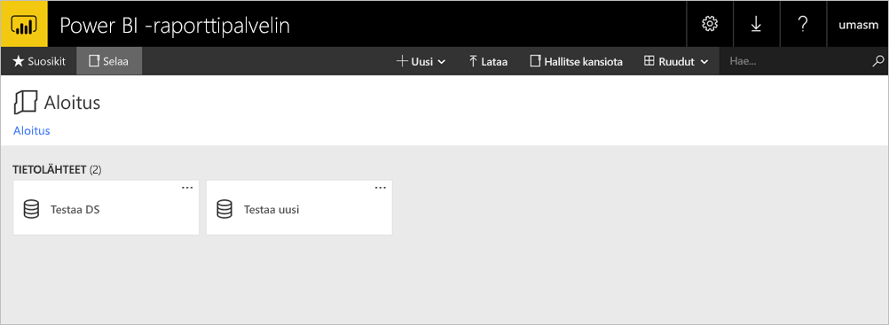

    Onnistunut testiyhteys tietolähteeseen, kun Kerberosta käytetään todentamiseen:

    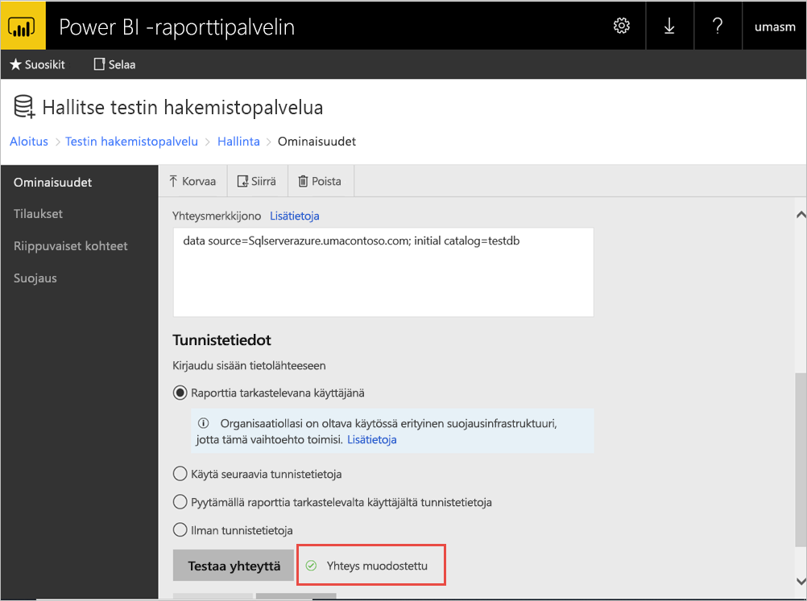

## <a name="access-from-power-bi-mobile-apps"></a>Käyttö Power BI -mobiilisovelluksista

### <a name="configure-the-application-registration"></a>Sovelluksen rekisteröinnin määrittäminen

Ennen kuin Power BI -mobiilisovellus voi muodostaa yhteyden Power BI -raporttipalvelimeen ja käyttää sitä, sinun on määritettävä sovelluksen rekisteröinti, joka luotiin puolestasi automaattisesti tämän artikkelin kohdassa [Julkaise Azure AD -sovellusvälityspalvelimen kautta](#publish-through-azure-ad-application-proxy).

1. Valitse Azure Active Directoryn **Yleiskatsaus**-sivulta **Sovellusrekisteröinnit**.
2. Etsi **Kaikki sovellukset** -välilehdeltä Power BI -raporttipalvelimelle luomasi sovellus.
3. Valitse sovellus ja valitse sitten **Todentaminen**.
4. Lisää seuraavat uudelleenohjauksen URI-osoitteet käyttämäsi ympäristön perusteella.

    Kun määrität sovellusta Power BI -mobiilisovelluksen **iOS-** versiolle, lisää seuraavat Public Client -tyyppiset uudelleenohjauksen URI-osoitteet (mobiili ja työpöytä):

    - `msauth://code/mspbi-adal%3a%2f%2fcom.microsoft.powerbimobile`
    - `msauth://code/mspbi-adalms%3a%2f%2fcom.microsoft.powerbimobilems`
    - `mspbi-adal://com.microsoft.powerbimobile`
    - `mspbi-adalms://com.microsoft.powerbimobilems`

    Kun määrität sovellusta Power BI -mobiilisovelluksen **Android-** versiolle, lisää seuraavat Public Client -tyyppiset uudelleenohjauksen URI-osoitteet (mobiili ja työpöytä):

    - `urn:ietf:wg:oauth:2.0:oob`
    - `mspbi-adal://com.microsoft.powerbimobile`
    - `msauth://com.microsoft.powerbim/g79ekQEgXBL5foHfTlO2TPawrbI%3D`
    - `msauth://com.microsoft.powerbim/izba1HXNWrSmQ7ZvMXgqeZPtNEU%3D`

    Kun määrität sovellusta Power BI -mobiilisovelluksen iOS- ja Android-versiolle, lisää seuraava Public Client -tyyppinen uudelleenohjauksen URI-osoite (mobiili ja työpöytä) iOS:lle määritettyjen uudelleenohjauksen URI-osoitteiden luetteloon:

    - `urn:ietf:wg:oauth:2.0:oob`

    > [!IMPORTANT]
    > Uudelleenohjauksen URI-osoitteet on lisättävä, jotta sovellus toimii oikein.

### <a name="connect-from-the-power-bi-mobile-apps"></a>Yhteyden muodostaminen Power BI -mobiilisovelluksista

1. Muodosta Power BI -sovelluksessa yhteys raporttipalvelimen esiintymään. Muodosta yhteys antamalla sovellusvälityspalvelimen kautta julkaistavan sovelluksen **ulkoinen URL-osoite**.
2. Valitse **Muodosta yhteys**. Sinut ohjataan Azure Active Directoryn kirjautumissivulle.
3. Anna käyttäjän kelvolliset tunnistetiedot ja valitse **Kirjaudu sisään**. Näet raporttipalvelimesta peräisin olevat elementit.

## <a name="next-steps"></a>Seuraavat vaiheet

[Power BI -mobiilisovelluksen etäkäytön käyttöönotto Azure Active Directory -sovellusvälityspalvelimen avulla](https://docs.microsoft.com/azure/active-directory/manage-apps/application-proxy-integrate-with-power-bi)

Onko sinulla kysyttävää? [Voit esittää kysymyksiä Power BI -yhteisössä](https://community.powerbi.com/)

                