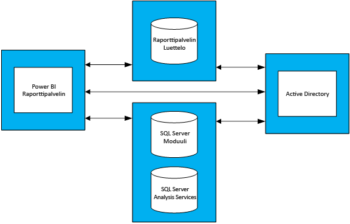

# Ohjeita kapasiteetin suunnitteluun Power BI -raporttipalvelimella
Power BI -raporttipalvelin on omatoiminen liiketoiminta- ja yritystietojen raportointiratkaisu, jota asiakkaat voivat käyttää paikallisesti yrityksensä palomuurin suojaamana. Siinä yhdistyvät Power BI Desktopin vuorovaikutteinen raportointiominaisuus ja paikallinen SQL Server Reporting Services -palvelinympäristö. Yritysten raskas ja kasvava analytiikan käyttö ja raportointi ja yrityksen käyttäjäkannan skaalaamiseen tarvittavan laitteisto-infrastruktuurin ja ohjelmistolisenssien budjetointi voi olla haastavaa. Tämän artikkelin tarkoituksena on antaa ohjeita kapasiteetin suunnitteluun Power BI -raporttipalvelimen avulla jakamalla eri kuormituksille tehtyjen erilaisten kuormitustestien tuloksia. Organisaatioiden raportit, kyselyt ja käyttötavat vaihtelevat suuresti, mutta tässä artikkelissa esitetyt tulokset yhdessä varsinaisten testien ja niiden suoritustapojen yksityiskohtaisen kuvauksen kanssa toimivat vertailukohtana kaikille, jotka ovat aloittamassa suunnittelua Power BI -raporttipalvelimen käyttöönottamiseksi.

## Yhteenveto
Suoritimme kahdenlaisia kuormituksia Power BI -raporttipalvelimen avulla. Jokainen kuormitus muodostui erityyppisten raporttien hahmontamisesta ja erilaisista verkkoportaalitoiminnoista. 

* Raskas Power BI -raportti - kuormituksessa useimmin suoritettu toiminto (eli toimintoa suoritettiin 60 % ajasta) oli Power BI -raporttien hahmontaminen.
* Raskas sivutettu raportti -kuormituksessa useimmin suoritettu toiminto oli sivutettujen raporttien hahmontaminen.

Seuraavassa taulukossa kuvataan käyttäjien enimmäismäärä, jonka Power BI -raporttipalvelin pystyy käsittelemään vähintään 99 prosentin luotettavuudella. Taustaoletuksena on, että käytössä on neljän palvelimen topologia ja että enintään 5 prosenttia käyttäjistä käyttää raporttipalvelinta samanaikaisesti. 

| Kuormitus | 8 ydintä / 32 Gt:n RAM-muisti | 16 ydintä / 64 Gt:n RAM-muisti |
| --- | --- | --- |
| **Raskas Power BI -raportti** (>60 %) |1 000 käyttäjää |3 000 käyttäjää |
| **Raskas sivutettu (RDL)-raportti** (>60 %) |2 000 käyttäjää |3 200 käyttäjää |

Jokaisessa ajossa kuormitetuin resurssi oli suoritin. Tämän vuoksi Power BI -raporttipalvelimen ydinten määrän lisääminen tuottaisi järjestelmän paremman luotettavuuden, kuin muistin tai kiintolevytilan lisääminen. 

## Testausmenetelmät
Käytetty testaustopologia perustui Microsoft Azuren näennäiskoneisiin toimittajakohtaisten fyysisten laitteiden sijaan. Kaikkia koneita isännöitiin Yhdysvaltain alueilla. Tämä kuvastaa laitteistovirtualisoinnin yleistä trendiä sekä paikallisesti että julkisissa pilvipalveluissa. 

### Power BI -raporttipalvelimen topologia
Power BI -raporttipalvelimen käyttöönotto muodostui seuraavista näennäiskoneista:

* Active Directory -toimialueen ohjauskone: SQL Server -tietokantamoduuli, SQL Server Analysis Services ja Power BI -raporttipalvelin tarvitsivat tätä, jotta kaikki pyynnöt voitiin todentaa turvallisesti.
* SQL Server -tietokantamoduuli ja SQL Server Analysis Services: näissä oleviin tietokantoihin tallensimme kaikki raportit, joita käytimme hahmontamiseen.
* Power BI -raporttipalvelin
* Power BI -raporttipalvelimen tietokanta. Raporttipalvelimen tietokantaa isännöidään eri koneella kuin Power BI -raporttipalvelinta, jotta sen ei tarvitse kilpailla SQL Server -tietokantamoduulin kanssa muistista, suorittimesta, verkosta ja levyresursseista.

Katso topologiassa käytettyjen näennäiskoneiden tarkat kokoonpanot liitteestä 1.1 Power BI -raporttipalvelimen topologia ja liitteestä 1.2 Power BI -raporttipalvelimen näennäiskonekokoonpano.

### Testit
Kuormitustestisuorituksissa käytetyt testit ovat julkisesti käytettävissä GitHub-projektissa, jonka nimi on [Reporting Services LoadTest](https://github.com/Microsoft/Reporting-Services-LoadTest). Tämän työkalun avulla käyttäjät voivat tutkia SQL Server Reporting Servicesin ja Power BI -raporttipalvelimen suorituskyky-, luotettavuus-, skaalautuvuus- ja palautettavuusominaisuuksia. Tämä projekti sisältää neljä testitapausryhmää:

* testit, jotka simuloivat Power BI -raporttien hahmontamista
* testit, jotka simuloivat mobiiliraporttien hahmontamista
* testit, jotka simuloivat pienten ja suurten sivutettujen raporttien hahmontamista 
* testit, jotka simuloivat erityyppisten verkkoportaalitoimintojen suorittamista. 

Kaikki testit oli laadittu suorittamaan päästä päähän -toiminto (kuten raportin hahmontaminen, uuden tietolähteen luominen jne.). Ne tekivät tämän tekemällä yhden tai useamman verkkopyynnön raporttipalvelimelle (ohjelmointirajapintojen kautta). Todellisissa tilanteissa käyttäjän saattaa olla tarpeen tehdä joitain välitoimintoja suorittaakseen jonkin näistä päästä päähän -toiminnoista. Esimerkiksi hahmontaakseen raportin käyttäjän täytyy siirtyä verkkoportaaliin, selata raportin tallennuskansioon ja napsauttaa lopuksi raporttia. Vaikka testeissä ei tehdä kaikkia toimintoja, joita päästä päähän -tehtävän suorittaminen edellyttää, ne kuitenkin tuottavat suurimman osan kuormituksesta, joka Power BI -raporttipalvelimeen kohdistuisi. Tutustumalla GitHub-projektiin saat lisätietoja erilaisista käytetyistä raporttityypeistä ja suoritetuista toiminnoista.  

> [!NOTE]
> Microsoft ei tue työkalua virallisesti, mutta tuoteryhmä osallistuu projektiin ja vastaa muiden osallistujien esiin tuomiin ongelmiin.

### Kuormitukset
Testauksessa käytetään kahta kuormitusprofiilia: raskas Power BI -raportti ja raskas sivutettu raportti. Seuraavassa taulukossa kuvataan raporttipalvelimen avulla suoritettujen pyyntöjen jakauma.

| Toiminta | Raskas Power BI -raportti, esiintymistiheys | Raskas sivutettu raportti, esiintymistiheys |
| --- | --- | --- |
| **Power BI -raporttien hahmontaminen** |60 % |10 % |
| **Sivutettujen (RDL) -raporttien hahmontaminen** |30 % |60 % |
| **Mobiiliraporttien hahmontaminen** |5 % |20 % |
| **Verkkoportaalitoiminnot** |5 % |10 % |

### Käyttäjäkuormitus
Testit suoritettiin jokaisessa testiajossa esiintymistiheyden perusteella, joka on määritetty yhdelle kahdesta kuormituksesta. Testit alkoivat raporttipalvelimelle tehdyllä 20 samanaikaisella käyttäjäpyynnöllä. Käyttäjäkuormitusta lisättiin sen jälkeen asteittain, kunnes luotettavuus putosi alle 99 prosentin tavoitteen.

## Tulokset
### Samanaikainen käyttäjäkapasiteetti
Kuten edellä mainittiin, testit alkoivat siten, että raporttipalvelimelle tehtiin 20 samanaikaista käyttäjäpyyntöä. Tämän jälkeen samanaikaisten käyttäjien määrää lisättiin asteittain, kunnes 1 % kaikista pyynnöistä epäonnistui. Seuraavassa taulukossa olevat tulokset kertovat samanaikaisten käyttäjäpyyntöjen määrän, jonka palvelin pystyisi käsittelemään huippukuormituksella säilyttäen epäonnistumismäärän alle 1 prosentissa.

| Kuormitus | 8 ydintä / 32 Gt | 16 ydintä / 64 Gt |
| --- | --- | --- |
| **Raskas Power BI -raportti** |50 samanaikaista käyttäjää |150 samanaikaista käyttäjää |
| **Raskas sivutettu raportti** |100 samanaikaista käyttäjää |160 samanaikaista käyttäjää |

### Kokonaiskäyttäjäkapasiteetti
Microsoftilla on Power BI -raporttipalvelimen tuotannon käyttöönottoympäristö, jota useat tiimit käyttivät. Analysoidessamme tämän ympäristön todellista käyttöä havaitsimme, että samanaikaisten käyttäjien määrä ei yleensä milloinkaan (edes päivittäisen huippukuormituksen aikana) ole enempää kuin 5 prosenttia kokonaiskäyttäjäkannasta. Käyttämällä tätä samanaikaisuuden 5 prosentin suhteellista osuutta vertailuarvona määritimme kokonaiskäyttäjäkannan, jonka Power BI -raporttipalvelin pystyisi käsittelemään 99 prosentin luotettavuudella.

| Kuormitus | 8 ydintä / 32 Gt | 16 ydintä / 64 Gt |
| --- | --- | --- |
| **Raskas Power BI -raportti** |1 000 käyttäjää |3 000 käyttäjää |
| **Raskas sivutettu raportti** |2 000 käyttäjää |3 200 käyttäjää |

### Tulosten tarkasteleminen
Tarkastele kuormitustestin tuloksia valitsemalla raportti.

| Kuormitus | 8 ydintä / 32 Gt | 16 ydintä / 64 Gt |
| --- | --- | --- |
| **Raskas Power BI -raportti** |[Näytä – 8 ydintä](https://msit.powerbi.com/view?r=eyJrIjoiMDhhNGY4NGQtNGRhYy00Yzk4LTk2MzAtYzFlNWI5NjBkMGFiIiwidCI6IjcyZjk4OGJmLTg2ZjEtNDFhZi05MWFiLTJkN2NkMDExZGI0NyIsImMiOjV9) |[Näytä – 16 ydintä](https://msit.powerbi.com/view?r=eyJrIjoiNDBiODk1OGUtYTAyOC00MzVhLThmZmYtNzVjNTFjNzMwYzkwIiwidCI6IjcyZjk4OGJmLTg2ZjEtNDFhZi05MWFiLTJkN2NkMDExZGI0NyIsImMiOjV9) |
| **Raskas sivutettu raportti** |[Näytä – 8 ydintä](https://msit.powerbi.com/view?r=eyJrIjoiNDFiZWYzMTktZGIxNS00MzcwLThjODQtMmJkMGRiZWEzNjhlIiwidCI6IjcyZjk4OGJmLTg2ZjEtNDFhZi05MWFiLTJkN2NkMDExZGI0NyIsImMiOjV9) |[Näytä – 16 ydintä](https://msit.powerbi.com/view?r=eyJrIjoiOTU0YjJkYTgtNDg4Yy00NzlhLWIwMGYtMzg4YWI2MjNmOTZjIiwidCI6IjcyZjk4OGJmLTg2ZjEtNDFhZi05MWFiLTJkN2NkMDExZGI0NyIsImMiOjV9) |

<iframe width="640" height="360" src="https://msit.powerbi.com/view?r=eyJrIjoiMDhhNGY4NGQtNGRhYy00Yzk4LTk2MzAtYzFlNWI5NjBkMGFiIiwidCI6IjcyZjk4OGJmLTg2ZjEtNDFhZi05MWFiLTJkN2NkMDExZGI0NyIsImMiOjV9" frameborder="0" allowFullScreen="true"></iframe>

<iframe width="640" height="360" src="https://msit.powerbi.com/view?r=eyJrIjoiNDBiODk1OGUtYTAyOC00MzVhLThmZmYtNzVjNTFjNzMwYzkwIiwidCI6IjcyZjk4OGJmLTg2ZjEtNDFhZi05MWFiLTJkN2NkMDExZGI0NyIsImMiOjV9" frameborder="0" allowFullScreen="true"></iframe>

<iframe width="640" height="360" src="https://msit.powerbi.com/view?r=eyJrIjoiNDFiZWYzMTktZGIxNS00MzcwLThjODQtMmJkMGRiZWEzNjhlIiwidCI6IjcyZjk4OGJmLTg2ZjEtNDFhZi05MWFiLTJkN2NkMDExZGI0NyIsImMiOjV9" frameborder="0" allowFullScreen="true"></iframe>

<iframe width="640" height="360" src="https://msit.powerbi.com/view?r=eyJrIjoiOTU0YjJkYTgtNDg4Yy00NzlhLWIwMGYtMzg4YWI2MjNmOTZjIiwidCI6IjcyZjk4OGJmLTg2ZjEtNDFhZi05MWFiLTJkN2NkMDExZGI0NyIsImMiOjV9" frameborder="0" allowFullScreen="true"></iframe>

## Yhteenveto
Jokaisessa suoritetussa kuormitustestissä suoritin oli kaikkein kuormitetuin resurssi Power BI -raporttipalvelinkoneen huippukuormituksen aikana. Tämän vuoksi ydinten määrä on ensimmäinen resurssi, jota tulisi lisätä. Vaihtoehtoisesti voit harkita skaalaamista lisäämällä Power BI -raporttipalvelinta isännöiviä palvelimia topologiaasi.

Tässä artikkelissa esitetyt tulokset saatiin suorittamalla tietty raporttijoukko, jossa käytettiin tiettyä tietojoukkoa ja joka toistettiin tietyllä tavalla. Se on hyödyllinen vertailukohta, mutta muista, että käyttösi riippuu raporteista, kyselyistä, käyttötavoista ja Power BI -raporttipalvelimen käyttöönotosta.

## Liite
### 1 Topologia
**1.1 Power BI -raporttipalvelimen topologia**

Jotta voitiin keskittyä pelkästään Power BI -raporttipalvelimen toimintaan eri kokoonpanoissa, jokaisen konetyypin (Power BI -raporttipalvelinta isännöivää konetta lukuun ottamatta) näennäiskonekokoonpano oli kiinteä. Jokainen kone valmisteltiin toisen sukupolven (v2) D-sarjan koneiden mukaisesti, joissa on Premium-tallennuslevyt. Löydät jokaisen näennäiskoneen koon lisätiedot [Yleiskäsittely-osiosta ](https://azure.microsoft.com/pricing/details/virtual-machines/windows/).

| Näennäiskoneen tyyppi | Suoritin | Muisti | Azure-näennäiskoneen koko |
| --- | --- | --- | --- |
| **Active Directory -toimialueen ohjauskone** |2 ydintä |7 Gt |Standard_DS2_v2 |
| **SQL Server -tietokantamoduuli ja Analysis Services** |16 ydintä |56 Gt |Standard_DS5_v2 |
| **Raporttipalvelimen tietokanta** |16 ydintä |56 Gt |Standard_DS5_v2 |

**1.2 Power BI -raporttipalvelimen näennäiskonekokoonpano** 

Power BI -raporttipalvelinta isännöivässä näennäiskoneessa käytettiin erilaisia suoritin- ja muistikokoonpanoja. Toisin kuin muut näennäiskoneet, tämä kone valmisteltiin kolmannen sukupolven (v3) D-sarjan koneiden mukaisesti, joissa on Premium-tallennuslevyt. Löydät tämän näennäiskoneen koon lisätiedot [Yleiskäsittely-osiosta ](https://azure.microsoft.com/pricing/details/virtual-machines/windows/.)

| Näennäiskone | Suoritin | Muisti | Azure-näennäiskoneen koko |
| --- | --- | --- | --- |
| **Power BI -raporttipalvelin (pieni)** |8 ydintä |32 Gt |Standard_D8S_v3 |
| **Power BI -raporttipalvelin (suuri)** |16 ydintä |64 Gt |vStandard_D16S_v3 |

### 2 LoadTest-työkalun suorittaminen
Jos haluat suorittaa Reporting Servicesin LoadTest-työkalun käyttämällä omaasi tai Microsoft Azuren Power BI -raporttipalvelinympäristöä, noudata seuraavia ohjeita.

1. Kloonaa Reporting Services LoadTest -projekti GitHubista (https://github.com/Microsoft/Reporting-Services-LoadTest).  
2. Projektin hakemistossa on ratkaisutiedosto, jonka nimi on RSLoadTests.sln. Avaa tämä tiedosto Visual Studion versiossa 2015 tai uudemmassa.
3. Päätä, haluatko suorittaa työkalun käyttämällä omaa Power BI -raporttipalvelinympäristöäsi vai Microsoft Azuren Power BI -raporttipalvelinympäristöä. Jos aiot suorittaa sen käyttämällä omaa ympäristöäsi, siirry kohtaan 5.
4. Luo Microsoft Power BI -raporttipalvelinympäristö Azuressa noudattamalla ohjeita kohdassa https://github.com/Microsoft/Reporting-Services-LoadTest#create-a-sql-server-reporting-services-load-environment-in-azure.
5. Kun olet valmis ottamaan ympäristön käyttöön, suorita testit noudattamalla ohjeita kohdassa https://github.com/Microsoft/Reporting-Services-LoadTest#load-test-execution.

Onko sinulla kysyttävää? [Voit esittää kysymyksiä Power BI -yhteisössä](https://community.powerbi.com/)
