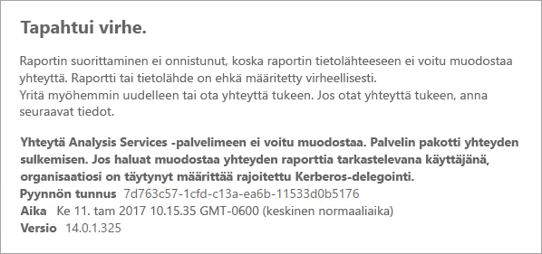
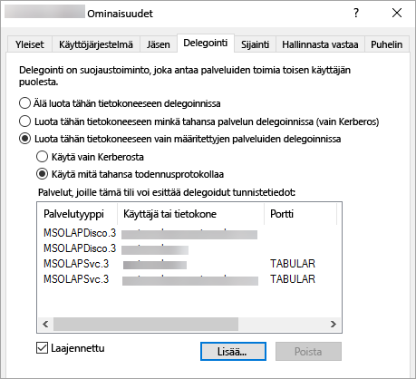

# <a name="configure-kerberos-to-use-power-bi-reports"></a>Kerberoksen määrittäminen Power BI -raporttien käyttöön
<iframe width="640" height="360" src="https://www.youtube.com/embed/vCH8Fa3OpQ0?showinfo=0" frameborder="0" allowfullscreen></iframe>

Opi määrittämään raporttipalvelimen Kerberos-todennus hajautetun ympäristön Power BI -raporteissa käytettyjä tietolähteitä varten.

Power BI -raporttipalvelin sisältää mahdollisuuden isännöidä Power BI -raportteja. Raporttipalvelin tukee useita eri tietolähteitä. Vaikka tässä artikkelissa keskitytään erityisesti SQL Server Analysis Servicesiin, voit hyödyntää samoja periaatteita muihin tietolähteisiin, kuten SQL Serveriin.

Voit asentaa Power BI -raporttipalvelimen, SQL Serverin ja Analysis Servicesin yhteen tietokoneeseen, jolloin kaiken pitäisi toimia ilman muita määrityksiä. Tämä on kätevää testiympäristössä. Saatat kohdata virheitä, jos asennat nämä palvelut erillisiin tietokoneisiin eli hajautettuun ympäristöön. Tässä ympäristössä sinun on käytettävä Kerberos-todennusta. Sen toteuttaminen edellyttää määritystä. 

Erityisesti sinun on määritettävä rajoitettu delegointi. Kerberos voi olla määritetty ympäristössäsi, mutta sitä ei ehkä ole määritetty rajoitettua delegointia varten.

## <a name="error-running-report"></a>Virhe raporttia suoritettaessa
Jos raporttipalvelinta ei ole määritetty oikein, saatat kohdata seuraavan virheen.

    Something went wrong.

    We couldn’t run the report because we couldn’t connect to its data source. The report or data source might not be configured correctly. 

Näet seuraavan viestin teknisissä tiedoissa.

    We couldn’t connect to the Analysis Services server. The server forcibly closed the connection. To connect as the user viewing the report, your organization must have configured Kerberos constrained delegation.



## <a name="configuring-kerberos-constrained-delegation"></a>Kerberoksen rajoitetun delegoinnin määritys
Sinun on määritettävä useita kohteita, jotta Kerberoksen rajoitettu delegointi toimii. Määritettäviä kohteita ovat muun muassa palvelun päänimet (SPN) ja delegoinnin asetukset palvelun tileissä.

> [!NOTE]
> Jotta voit määrittää palvelun päänimet ja delegointiasetukset, sinun on oltava toimialueen järjestelmänvalvoja.
> 
> 

Seuraavat kohteet on määritettävä tai vahvistettava.

1. Todennustyyppi raporttipalvelimen määrityksissä.
2. Palvelun päänimet raporttipalvelimen palvelutiliä varten.
3. Palvelun päänimet Analysis Services -palvelua varten.
4. Palvelun päänimet SQL Browser -palvelua varten Analysis Services -tietokoneessa. Tämä koskee vain nimettyjä esiintymiä.
5. Delegointiasetukset raporttipalvelimen palvelutilissä.

## <a name="authentication-type-within-report-server-configuration"></a>Todennustyyppi raporttipalvelimen määrityksissä
Sinun on määritettävä raporttipalvelimen todennustyyppi sallimaan Kerberoksen rajoitettu delegointi. Tämä tehdään **rsreportserver.config**-tiedostossa. Tämän tiedoston oletussijainti on `C:\Program Files\Microsoft Power BI Report Server\PBIRS\ReportServer`.

Sinun on etsittävä rsreportserver.config-tiedostosta **Authentication/AuthenticationTypes**-osa.

Haluamme varmistaa, että RSWindowsNegotiate on listattu ja että se on ensimmäisenä todennustyyppien luettelossa. Näkymän kuuluu näyttää seuraavankaltaiselta.

```
<AuthenticationTypes>
    <RSWindowsNegotiate/>
    <RSWindowsNTLM/>
</AuthenticationTypes>
```

Jos olet joutunut muuttamaan määritystiedostoa, sinun tulee pysäyttää ja käynnistää raporttipalvelin varmistaaksesi, että muutokset tulevat voimaan.

Lisätietoja on artikkelissa [Windows-todennuksen määrittäminen raporttipalvelimessa](https://docs.microsoft.com/sql/reporting-services/security/configure-windows-authentication-on-the-report-server).

## <a name="spns-for-the-report-server-service-account"></a>Palvelun päänimet raporttipalvelimen palvelutiliä varten
Seuraavaksi sinun täytyy varmistaa, että raporttipalvelimessa on käytettävissä kelvolliset päänimet. Tämä perustuu palvelutiliin, joka on määritetty raporttipalvelimessa.

### <a name="virtual-service-account-or-network-service"></a>Virtuaalinen palvelutili tai verkkopalvelu
Jos raporttipalvelin on määritetty virtuaalista palvelutiliä tai verkkopalvelutiliä varten, sinun ei yleensä tarvitse tehdä mitään. Nämä tiedot koskevat konetiliä. Konetilissä on oletusarvon mukaan isäntäkoneen palvelun päänimet. Ne kattavat HTTP-palvelun ja raporttipalvelin käyttää niitä.

Jos käytät näennäispalvelimen nimeä, joka ei ole sama kuin konetilissä, isäntäsyötteet eivät koske sinua. Tällöin sinun on lisättävä palvelun päänimet manuaalisesti näennäispalvelimen isäntänimeä varten.

### <a name="domain-user-account"></a>Toimialueen käyttäjätili
Jos raporttipalvelin on määritetty käyttämään toimialueen käyttäjätiliä, sinun on luotava manuaalisesti kyseisen tilin HTTP-palvelun päänimet. Tämä voidaan tehdä Windowsiin kuuluvan setspn-työkalun avulla.

> [!NOTE]
> Sinulla on oltava toimialueen järjestelmänvalvojan oikeudet, jotta voit luoda palvelun päänimet.
> 
> 

On suositeltavaa luoda kaksi palvelun päänimeä. Toisessa on NetBIOS-nimi ja toisessa täydellinen toimialuenimi (FQDN). Palvelun päänimen muoto on seuraavanlainen.

    <Service>/<Host>:<port>

Power BI -raporttipalvelin käyttää HTTP-palvelua. HTTP-palvelun päänimissä ei listata porttia. Tässä meitä kiinnostaa HTTP-palvelu. Palvelun päänimen isäntä on nimi, jota käytät URL-osoitteessa. Yleensä tämä on tietokoneen nimi. Jos olet kuormituksentasaimen takana, tämä voi olla näennäinen nimi.

> [!NOTE]
> Voit tarkistaa URL-osoitteen joko selaimen osoiteriviltä tai raporttipalvelimen määritystenhallinnasta WebPortal URL -välilehdellä.
> 
> 

Jos tietokoneen nimi on ContosoRS, palvelun päänimet ovat seuraavat.

| Palvelun päänimen tyyppi | Palvelun päänimi |
| --- | --- |
| Täydellinen toimialuenimi (FQDN) |HTTP/ContosoRS.contoso.com |
| NetBIOS |HTTP/ContosoRS |

### <a name="location-of-spn"></a>Palvelun päänimen sijainti
Mihin siis sijoitat palvelun päänimen? Palvelun päänimi sijoitetaan sen mukaan, mitä käytät palvelutiliä varten. Jos käytössäsi on virtuaalinen palvelutili tai verkkopalvelu, tämä on tietokonetili. Kuten aiemmin kerroimme, tämä on yleensä tehtävä vain virtuaalista URL-osoitetta varten. Jos käytössäsi on toimialueen käyttäjä raporttipalvelimen palvelutiliä varten, sinun on sijoitettava palvelun päänimi kyseisen toimialueen käyttäjätiliin.

Jos käytössä on esimerkiksi verkkopalvelutili ja tietokoneen nimi on ContosoRS, palvelun päänimen sijainti on ContosoRS.

Jos käytössä on RSServicen toimialueen käyttäjätili, palvelun päänimen sijainti on RSService.

### <a name="using-setspn-to-add-the-spn"></a>Palvelun päänimen lisääminen SetSPN-työkalun avulla
Voit lisätä palvelun päänimen SetSPN-työkalun avulla. Käytämme samaa esimerkkiä kuin edellä tietokonetilin ja toimialueen käyttäjätilin kanssa.

Palvelun päänimi sijoitetaan tietokonetilille (sekä FQDN:ssä että NetBIOSissa) seuraavasti, jos käytössä on virtuaalinen URL-osoite contosoreports.

      Setspn -a HTTP/contosoreports.contoso.com ContosoRS
      Setspn -a HTTP/contosoreports ContosoRS

Palvelun päänimi sijoitetaan toimialueen käyttäjätilille (sekä FQDN:ssä että NetBIOSissa) seuraavasti, jos käytössä on tietokoneen nimi palvelun päänimen isäntää varten.

      Setspn -a HTTP/ContosoRS.contoso.com RSService
      Setspn -a HTTP/ContosoRS RSService

## <a name="spns-for-the-analysis-services-service"></a>Palvelun päänimet Analysis Services -palvelua varten
Analysis Services -palvelun päänimet ovat vastaavat kuin aiemmin Power BI -raporttipalvelimen kanssa. Palvelun päänimien muoto on hieman erilainen, jos sinulla on nimetty esiintymä.

Analysis Servicesiä varten käytämme MSOLAPSvc.3-palvelua. Määritämme esiintymän nimen portin sijainnille palvelun päänimessä. Palvelun päänimen isäntäosa on joko tietokoneen nimi tai klusterin virtuaalinen nimi.

Analysis Servicesin palvelun päänimi voi näyttää esimerkiksi seuraavalta.

| Tyyppi | Muoto |
| --- | --- |
| Oletusesiintymä |MSOLAPSvc.3/ContosoAS.contoso.com<br>MSOLAPSvc.3/ContosoAS |
| Nimetty esiintymä |MSOLAPSvc.3/ContosoAS.contoso.com:INSTANCENAME<br>MSOLAPSvc.3/ContosoAS:INSTANCENAME |

Myös palvelun päänimen sijoitus on vastaava kuin edellä mainitun Power BI -raporttipalvelimen kanssa. Se perustuu palvelutiliin.  Jos käytössäsi on paikallinen järjestelmä tai verkkopalvelu, noudata tietokonetiliä koskevia ohjeita. Jos käytössäsi on toimialueen käyttäjätili Analysis Services -esiintymää varten, sinun on sijoitettava palvelun päänimi toimialueen käyttäjätiliin.

### <a name="using-setspn-to-add-the-spn"></a>Palvelun päänimen lisääminen SetSPN-työkalun avulla
Voit lisätä palvelun päänimen SetSPN-työkalun avulla. Tässä esimerkissä tietokoneen nimi on ContosoAS.

Kun palvelun päänimi sijoitetaan tietokonetilille (sekä FQDN:ssä että NetBIOSissa), näkymä on seuraavanlainen.

    Setspn -a MSOLAPSvc.3/ContosoAS.contoso.com ContosoAS
    Setspn -a MSOLAPSvc.3/ContosoAS ContosoAS

Kun palvelun päänimi sijoitetaan toimialueen käyttäjätilille (sekä FQDN:ssä että NetBIOSissa), näkymä on seuraavanlainen.

    Setspn -a MSOLAPSvc.3/ContosoAS.contoso.com OLAPService
    Setspn -a MSOLAPSvc.3/ContosoAS OLAPService

## <a name="spns-for-the-sql-browser-service"></a>SQL Browser -palvelun päänimet
Jos käytössä on Analysis Servicesin nimetty esiintymä, sinun on myös varmistettava, että sinulla on palvelun päänimi Browser-palvelua varten. Tämä on yksilöllinen Analysis Servicesiä varten.

SQL Browser -palvelun päänimet ovat vastaavat kuin aiemmin Power BI -raporttipalvelimen kanssa.

SQL Browseria varten käytämme MSOLAPDisco.3-palvelua. Määritämme esiintymän nimen portin sijainnille palvelun päänimessä. Palvelun päänimen isäntäosa on joko tietokoneen nimi tai klusterin virtuaalinen nimi.
Sinun ei tarvitse määrittää mitään esiintymän nimeä tai porttia.

Analysis Servicesin palvelun päänimi voi näyttää esimerkiksi seuraavalta.

    MSOLAPDisco.3/ContosoAS.contoso.com
    MSOLAPDisco.3/ContosoAS

Myös palvelun päänimen sijoitus on vastaava kuin edellä mainitun Power BI -raporttipalvelimen kanssa. Erona on, että SQL Browser suoritetaan aina paikallisen järjestelmätilin alla. Tämä tarkoittaa, että palvelun päänimet siirtyvät aina tietokonetiliin. 

### <a name="using-setspn-to-add-the-spn"></a>Palvelun päänimen lisääminen SetSPN-työkalun avulla
Voit lisätä palvelun päänimen SetSPN-työkalun avulla. Tässä esimerkissä tietokoneen nimi on ContosoAS.

Kun palvelun päänimi sijoitetaan tietokonetilille (sekä FQDN:ssä että NetBIOSissa), näkymä on seuraavanlainen.

    Setspn -a MSOLAPDisco.3/ContosoAS.contoso.com ContosoAS
    Setspn -a MSOLAPDisco.3/ContosoAS ContosoAS

Lisätietoja on artikkelissa [SQL Server Browser -palvelun päänimi vaaditaan](https://support.microsoft.com/kb/950599).

## <a name="delegation-settings-on-the-report-server-service-account"></a>Delegointiasetukset raporttipalvelimen palvelutilissä
Viimeinen määritettävä osa on raporttipalvelimen palvelutilin delegointiasetukset. Voit suorittaa nämä vaiheet eri työkaluilla. Tässä artikkelissa käytämme Active Directory Users and Computers -työkalua.

Sinun on aloitettava siirtymällä raporttipalvelimen palvelutilin ominaisuuksiin Active Directory Users and Computers -työkalussa. Tämä on tietokonekonetili, jos käytössä on virtuaalinen palvelutili tai verkkopalvelu, tai muussa tapauksessa toimialueen käyttäjätili.

Rajoitettu delegointi on määritettävä protokollan siirtämisellä. Rajoitettu delegointi edellyttää, että sinun on eriteltävä palvelut, jotka haluat delegoida. Lisää sekä Analysis Servicesin palvelun päänimi että SQL Browserin palvelun päänimi luetteloon, johon Power BI -raporttipalvelin voi delegoida.

1. Napsauta raporttipalvelimen palvelutiliä hiiren kakkospainikkeella ja valitse **Ominaisuudet**.
2. Valitse **Delegointi**-välilehti.
3. Valitse **Luota tähän tietokoneeseen vain määritettyihin palveluihin delegointia varten**.
4. Valitse **Käytä mitä tahansa todennusprotokollaa**.
5. Valitse **Palvelut, joille tämä tili voi esittää delegoidut tunnistetiedot:** -kohdassa **Lisää**.
6. Valitse uudessa valintaikkunassa **Käyttäjät tai tietokoneet**.
7. Anna Analysis Services -palvelun palvelutili ja valitse **Ok**.
8. Valitse palvelun päänimi, jonka loit. Sen alussa on `MSOLAPSvc.3`. Jos olet lisännyt sekä FQDN:n että NetBIOSin palvelun päänimen, molemmat on valittuna. Saatat nähdä vain toisen.
9. Valitse **OK**.  Palvelun päänimen pitäisi näkyä nyt luettelossa.
10. Voit myös valita **Laajennettu**, jolloin sekä FQDN:n että NetBIOSin palvelun päänimet näkyvät luettelossa.
11. Valitse **Lisää** uudelleen. Nyt lisäämme SQL Browserin palvelun päänimen.
12. Valitse uudessa valintaikkunassa **Käyttäjät tai tietokoneet**.
13. Anna sen tietokoneen nimi, jossa SQL Browser -palvelu on käytössä, ja valitse **Ok**.
14. Valitse palvelun päänimi, jonka loit. Sen alussa on `MSOLAPDisco.3`. Jos olet lisännyt sekä FQDN:n että NetBIOSin palvelun päänimen, molemmat on valittuna. Saatat nähdä vain toisen.
15. Valitse **Ok**. Valintaikkunan tulee näyttää samalta kuin alla, jos valitsit **Laajennettu**.
    
    
16. Valitse **Ok**.
17. Käynnistä Power BI -raporttipalvelin uudelleen.

## <a name="running-a-power-bi-report"></a>Power BI -raportin suorittaminen
Kun kaikki edellä kuvatut määritykset on tehty, raportin pitäisi näkyä oikein. 


Vaikka nämä määritykset toimivat useimmissa tapauksissa, Kerberosta käytettäessä voi olla erilaisia määrityksiä ympäristön mukaan. Jos raportti ei vieläkään lataudu, voit ottaa yhteyttä toimialueen järjestelmänvalvojaan tai tukeen.

## <a name="next-steps"></a>Seuraavat vaiheet
[Järjestelmänvalvojan yleiskatsaus](admin-handbook-overview.md)  
[Power BI -raporttipalvelimen asentaminen](install-report-server.md)  

Onko sinulla kysyttävää? [Voit esittää kysymyksiä Power BI -yhteisössä](https://community.powerbi.com/)

