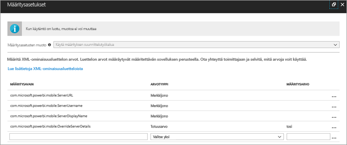
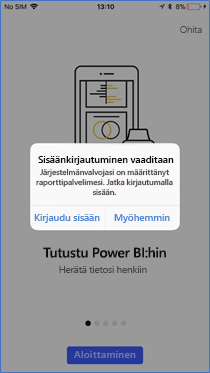
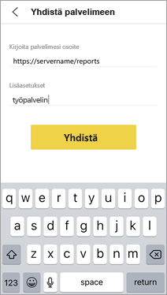
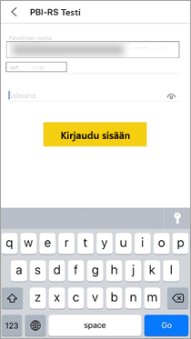

# Raporttipalvelimen käyttöoikeuksien etämäärittäminen Power BI -iOS-mobiilisovellukselle

Tässä artikkelissa kerrotaan, miten voit käyttää organisaatiosi ydintietojen hallintatyökalua määrittääksesi raporttipalvelimen käyttöoikeudet Power BI -iOS-mobiilisovellukselle. Tämän määrittämiseksi IT-järjestelmänvalvojat voivat luoda sovelluksen määrityskäytännön, joka lähettää vaaditut tiedot sovellukseen. 

 Power BI:n iOS-mobiilisovelluksen käyttäjät voivat muodostaa yhteyden organisaationsa raporttipalvelimeen helpommin, koska raporttipalvelimen yhteys on jo määritetty. 

## Sovelluksen määrityskäytännön luominen MDM-työkalussa 

Järjestelmänvalvojat voivat luoda sovelluksen määrityskäytännön Microsoft Intunessa seuraavien vaiheiden mukaisesti. Vaiheet ja sovelluksen määrityskäytännön luominen saattavat olla erilaisia muissa ydintietojen hallintatyökaluissa. 

1. Yhdistä ydintietojen hallintatyökalu. 
2. Luo ja nimeä uusi sovelluksen määrityskäytäntö. 
3. Valitse käyttäjät, joille haluat jakaa tämän sovelluksen määrityskäytännön. 
4. Luo avain-arvoparit. 

Parit on havainnollistettu seuraavassa taulukossa.

|Avain  |Tyyppi  |Kuvaus  |
|---------|---------|---------|
| com.microsoft.powerbi.mobile.ServerURL | Merkkijono | Raporttipalvelimen URL-osoite   Tulee alkaa merkkijonolla http tai https |
| com.microsoft.powerbi.mobile.ServerUsername | Merkkijono | [valinnainen]   Käyttäjänimi, jota käytetään muodostettaessa yhteyttä palvelimeen.   Jos sellaista ei ole, sovellus pyytää käyttäjää antamaan käyttäjänimen yhteyden muodostamista varten.| 
| com.microsoft.powerbi.mobile.ServerDisplayName | Merkkijono | [valinnainen]   Oletusarvo on ”Raporttipalvelin”   Kutsumanimi, joka edustaa palvelinta sovelluksessa | 
| com.microsoft.powerbi.mobile.OverrideServerDetails | Totuusarvo | Oletusarvo on Tosi (True)  Kun arvoksi on määritetty Tosi, se ohittaa mobiililaitteessa jo olevat raporttipalvelimen määritelmät. Tässä yhteydessä poistetaan olemassa olevat palvelimet, jotka on jo määritetty.   Ohituksen Tosi-arvo estää käyttäjää poistamista kyseistä määritystä.   Epätosi-arvo lisää lähetetyt arvot poistamatta olemassa olevia asetuksia.   Jos sama palvelimen URL-osoite on jo määritetty mobiilisovelluksessa, sovellus jättää sen määrityksen ennalleen. Sovellus ei pyydä käyttäjää todentamaan uudelleen samalle palvelimelle. |

Tässä on esimerkki määrityskäytännön asettamisesta Intunen avulla.

## Käyttäjät, jotka muodostavat yhteyttä raporttipalvelimeen

 Oletetaan, että julkaiset jakeluluettelon sovelluksen määrityskäytännön. Kun tässä jakeluluettelossa olevat käyttäjät ja laitteet käynnistävät iOS-mobiilisovelluksen, toimitaan seuraavasti. 

1. Sanomassa ilmoitetaan mobiilisovelluksen olevan määritetty raporttipalvelimen kanssa. Käyttäjä voi **kirjautua sisään** napauttamalla.

    

2.  **Muodosta yhteys palvelimeen** -sivulla raporttipalvelimen tiedot on valmiiksi täytetty. Käyttäjä napauttaa **Yhdistä**.

    

3. Käyttäjä todennetaan salasanalla, minkä jälkeen hän napauttaa **Kirjaudu sisään**. 

    

Nyt käyttäjä voi tarkastella ja käsitellä raporttipalvelimeen tallennettuja suorituskykyilmaisimia ja Power BI -raportteja.

## Seuraavat vaiheet
[Järjestelmänvalvojan yleiskatsaus](admin-handbook-overview.md)  
[Power BI -raporttipalvelimen asentaminen](install-report-server.md)  

Onko sinulla kysyttävää? [Voit esittää kysymyksiä Power BI -yhteisössä](https://community.powerbi.com/)

