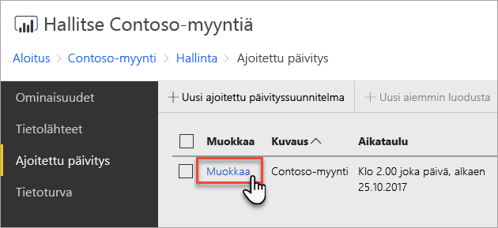
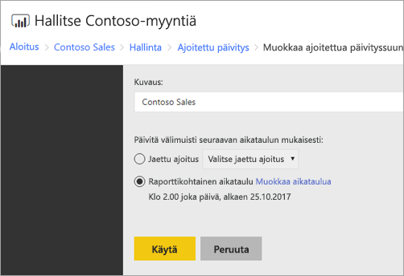

# Power BI -raportin ajoitetun päivityksen määrittäminen
Jotta voit päivittää Power BI -raportin tiedot, sinun on luotava ajoitetun päivityksen malli. Tämä tehdään Power BI -raportin *Hallinta*-alueella.

## Tietolähteen tunnistetietojen määrittäminen
Ennen ajoitetun tietojen päivityksen mallin luomista on määritettävä tunnistetiedot **kullekin tietolähteelle**, jota käytetään Power BI -raportissa.

1. Napsauta hiiren oikealla painikkeella verkkoportaalissa Power BI -raporttia ja valitse **Hallinta**.
   
    
2. Valitse vasemmasta valikosta **Tietolähteet**-välilehti.
3. Valitse näkyviin tulevalle jokaiselle tietolähteelle käytettävä todennustyyppi, kun muodostat yhteyden tähän tietolähteeseen. Anna asianmukaiset tunnistetiedot.
   
    

## Ajoitetun päivityksen mallin luominen
Noudata seuraavia vaiheita ajoitetun päivityksen mallin luomiseksi.

1. Napsauta hiiren oikealla painikkeella verkkoportaalissa Power BI -raporttia ja valitse **Hallinta**.
   
    
2. Valitse vasemmasta valikosta **Ajoitettu päivitys** -välilehti.
3. Valitse **Ajoitettu päivitys** -sivulla **Uusi ajoitetun päivityksen malli**.
   
    
4. Kirjoita **Uusi ajoitettu päivityksen malli** -sivulle kuvaus ja määritä aikataulu tietomallin päivitykselle.
5. Valitse **Luo ajoitettu päivityksen malli**, kun olet valmis.
   
    

## Ajoitetun päivityksen mallin muokkaaminen
Ajoitetun päivityksen mallin muokkaaminen vastaa pitkälti mallin luomista.

1. Napsauta hiiren oikealla painikkeella verkkoportaalissa Power BI -raporttia ja valitse **Hallinta**.
   
    
2. Valitse vasemmasta valikosta **Ajoitettu päivitys** -välilehti.
3. Valitse **Ajoitettu päivitys** -sivulla **Muokkaa** hallittavan päivityksen mallin vieressä.
   
    
4. Kirjoita **Muokkaa ajoitetun päivityksen mallia** -sivulle kuvaus ja määritä aikataulu tietomallin päivitykselle.
5. Valitse **Käytä**, kun olet valmis.
   
    

## Ajoitetun päivityksen mallin tilan tarkasteleminen
Tarkastele ajoitetun päivityksen mallin tilaa verkkoportaalissa.

1. Napsauta hiiren oikealla painikkeella verkkoportaalissa Power BI -raporttia ja valitse **Hallinta**.
   
    
2. Valitse vasemmasta valikosta **Ajoitettu päivitys** -välilehti.
3. **Ajoitettu päivitys** -sivun oikeanpuoleisin sarake näyttää mallin tilan.
   
   | **Tila** | **Kuvaus** |
   | --- | --- |
   | Uusi ajoitetun päivityksen malli |Malli on luotu, mutta sitä ei ole suoritettu. |
   | Päivitetään |Päivitysprosessi on alkanut. |
   | Virtautusmalli Analysis Serveriin |Mallin kopioiminen raporttipalvelimen luettelon tietokannasta isännöityyn Analysis Services -esiintymään. |
   | Tietoja päivitetään |Tietoja päivitetään mallissa. |
   | Tunnistetietoja poistetaan mallista |Tunnistetietojen, joita käytetään yhteyden muodostamiseen tietolähteeseen, poistaminen mallista. |
   | Tallentaa mallia luetteloon |Tietojen päivittäminen on valmis ja päivitetty malli tallennetaan takaisin raporttipalvelimen luettelon tietokantaan. |
   | Valmis: tietojen päivitys |Päivitys on valmis. |
   | Virhe: |Päivityksen aikana tapahtui virhe, joka näytetään. |

Verkkosivu on päivitettävä nykyisen tilan näkemiseksi. Tila ei muutu automaattisesti.

## Seuraavat vaiheet
Saat lisätietoja aikataulujen luomisesta ja muokkaamisesta artikkelista [Aikataulujen luominen, muokkaaminen ja poistaminen](https://docs.microsoft.com/sql/reporting-services/subscriptions/create-modify-and-delete-schedules).

Katso lisätietoja ajoitetun päivityksen vianmäärityksestä artikkelista [Ajoitetun päivityksen vianmääritys Power BI -raporttipalvelimessa](scheduled-refresh-troubleshoot.md).

Onko sinulla muuta kysyttävää? [Voit esittää kysymyksiä Power BI -yhteisössä](https://community.powerbi.com/)

