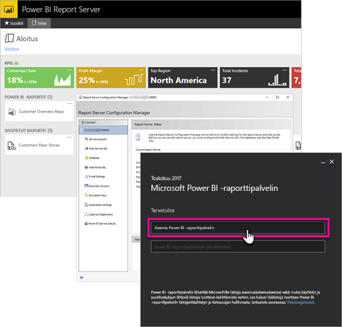

# Yleiskatsaus kehittäjien oppaaseen, Power BI -raporttipalvelin

Tervetuloa käyttämään Microsoft Power BI -raporttipalvelimen kehittäjän opasta. Power BI -raporttipalvelin on raporttien paikallinen tallennustila, jonka kautta voit hallita Power BI- ja mobiiliraportteja sekä sivutettuja raportteja.

Tässä oppaassa kuvataan, millaisia vaihtoehtoja sinulla on kehittäjänä käyttäessäsi Power BI -raporttipalvelinta.

## Upottaminen

Voit upottaa minkä tahansa Power BI -raporttipalvelimella olevan raportin iFrameen lisäämällä URL-osoitteeseen kyselymerkkijonon parametrin `?rs:Embed=true`. Tämä tapa toimii niin Power BI ‑raporteissa kuin muunkin tyyppisissä raporteissa.

### Raporttien katseluohjelman ohjausobjekti

Voit hyödyntää sivutetuissa raporteissa raporttien katseluohjelman ohjausobjektia. Sen avulla ohjausobjektin voi sijoittaa .NET-ikkunoihin tai verkkosovelluksiin. Lisätietoja on artikkelissa [Raporttien katseluohjelman ohjausobjektin käytön aloittaminen](https://docs.microsoft.com/sql/reporting-services/application-integration/integrating-reporting-services-using-reportviewer-controls-get-started).

## Ohjelmointirajapinnat

Power BI -raporttipalvelimen kanssa vuorovaikuttamiseen on käytettävissä useita eri ohjelmointirajapintoja. Tämä tapa sisältää seuraavat.

* [REST APIt](rest-api.md)
* [URL-yhteys](https://docs.microsoft.com/sql/reporting-services/url-access-ssrs)
* [WMI-palvelu](https://docs.microsoft.com/sql/reporting-services/wmi-provider-library-reference/reporting-services-wmi-provider-library-reference-ssrs)

Lisäksi voit hallita raporttipalvelinta myös avoimen lähdekoodin [PowerShell-apuohjelmilla](https://github.com/Microsoft/ReportingServicesTools).

> [!NOTE]
> PowerShell-apuohjelmat eivät tällä hetkellä tue Power BI Desktop ‑tiedostoja (.pbix).

## Mukautetut laajennukset

Laajennuskirjasto on Power BI -raporttipalvelimeen sisältyvä joukko luokkia, liittymiä ja arvotyyppejä. Kirjasto mahdollistaa järjestelmän toiminnallisuuksien käytön, ja se on suunniteltu toimimaan perustana, jolta Microsoft.NET Framework ‑sovelluksia voidaan käyttää Microsoft Power BI -raporttipalvelimen osien laajentamiseen.

Voit luoda useita erilaisia laajennustyyppejä.

* Tietojen käsittelylaajennukset
* Toimituslaajennukset
* Sivutettujen raporttien hahmontamislaajennukset
* Suojauslaajennukset

Lisätietoja on artikkelissa [Laajennuskirjasto](https://docs.microsoft.com/sql/reporting-services/extensions/reporting-services-extension-library).

## Seuraavat vaiheet

[Raporttien katseluohjelman ohjausobjektin käytön aloittaminen](https://docs.microsoft.com/sql/reporting-services/application-integration/integrating-reporting-services-using-reportviewer-controls-get-started)  
[Sovellusten luominen käyttämällä verkkopalveluita ja .NET Frameworkia](https://docs.microsoft.com/sql/reporting-services/report-server-web-service/net-framework/building-applications-using-the-web-service-and-the-net-framework)  
[URL-yhteys](https://docs.microsoft.com/sql/reporting-services/url-access-ssrs)  
[Laajennuskirjasto](https://docs.microsoft.com/sql/reporting-services/extensions/reporting-services-extension-library)  
[WMI-palvelu](https://docs.microsoft.com/sql/reporting-services/wmi-provider-library-reference/reporting-services-wmi-provider-library-reference-ssrs)

Onko sinulla kysyttävää? [Voit esittää kysymyksiä Power BI -yhteisössä](https://community.powerbi.com/)