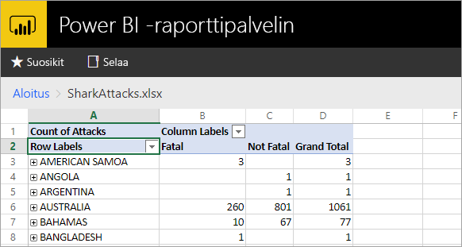
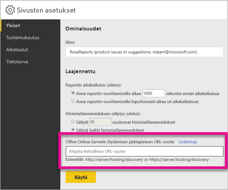

# <a name="configure-your-report-server-to-host-excel-workbooks-using-office-online-server-oos"></a>Määritä raporttipalvelin Excel-työkirjojen isännäksi Office Online Serverin (OOS) avulla

Verkkoportaalissa tapahtuvan Power BI -raporttien tarkastelun lisäksi Power BI -raporttipalvelin voi isännöidä Excel-työkirjoja [Office Online Serverin](https://docs.microsoft.com/officeonlineserver/office-online-server-overview) (OOS) avulla. Raporttipalvelimestasi voit julkaista ja katsella Microsoft BI-sisältöä itsepalveluna.



## <a name="prepare-server-to-run-office-online-server"></a>Valmistele palvelin suorittamaan Office Online Server

Suorita nämä toimenpiteet palvelimessa, joka suorittaa Office Online Serverin. Palvelimen on oltava Windows Server 2012 R2 tai Windows Server 2016. Windows Server 2016 edellyttää Office Online Serverin huhtikuun 2017 versiota tai uudempaa.

### <a name="install-prerequisite-software-for-office-online-server"></a>Asenna Office Online Serverin edellytetty ohjelmisto

1. Asenna tarvittavat roolit ja palvelut avaamalla Windows PowerShellin komentokehote järjestelmänvalvojana ja suorittamalla tämä komento.

    **Windows Server 2012 R2:**

    ```
    Add-WindowsFeature Web-Server,Web-Mgmt-Tools,Web-Mgmt-Console,Web-WebServer,Web-Common-Http,Web-Default-Doc,Web-Static-Content,Web-Performance,Web-Stat-Compression,Web-Dyn-Compression,Web-Security,Web-Filtering,Web-Windows-Auth,Web-App-Dev,Web-Net-Ext45,Web-Asp-Net45,Web-ISAPI-Ext,Web-ISAPI-Filter,Web-Includes,InkandHandwritingServices,NET-Framework-Features,NET-Framework-Core,NET-HTTP-Activation,NET-Non-HTTP-Activ,NET-WCF-HTTP-Activation45,Windows-Identity-Foundation,Server-Media-Foundation
    ```

    **Windows Server 2016:**

    ```
    Add-WindowsFeature Web-Server,Web-Mgmt-Tools,Web-Mgmt-Console,Web-WebServer,Web-Common-Http,Web-Default-Doc,Web-Static-Content,Web-Performance,Web-Stat-Compression,Web-Dyn-Compression,Web-Security,Web-Filtering,Web-Windows-Auth,Web-App-Dev,Web-Net-Ext45,Web-Asp-Net45,Web-ISAPI-Ext,Web-ISAPI-Filter,Web-Includes,NET-Framework-Features,NET-Framework-45-Features,NET-Framework-Core,NET-Framework-45-Core,NET-HTTP-Activation,NET-Non-HTTP-Activ,NET-WCF-HTTP-Activation45,Windows-Identity-Foundation,Server-Media-Foundation
    ```

    Pyydettäessä käynnistä palvelin uudelleen.
2. Asenna seuraavat ohjelmistot:

   * [.NET Framework 4.5.2](https://go.microsoft.com/fwlink/p/?LinkId=510096)
   * [Visual C++ Redistributable Packages for Visual Studio 2013](https://www.microsoft.com/download/details.aspx?id=40784)
   * [Visual C++ Redistributable for Visual Studio 2015](https://go.microsoft.com/fwlink/p/?LinkId=620071)
   * [Microsoft.IdentityModel.Extention.dll](https://go.microsoft.com/fwlink/p/?LinkId=620072)

### <a name="install-office-online-server"></a>Asenna Office Online Server

Jos aiot käyttää Excel Onlinen toimintoja, jotka käyttävät ulkoista tietopalvelua (esimerkiksi Power Pivot), ota huomioon, että Office Online Serverin on sijaittava samassa Active Directory -puuryhmässä kuin sen käyttäjät sekä mitkä tahansa ulkoiset tietolähteet, joita aiot käyttää Windows-todentamisella.

1. Lataa Office Online Server [volyymikäyttöoikeuskeskuksesta (VLSC)](http://go.microsoft.com/fwlink/p/?LinkId=256561). Lataustiedosto sijaitsee Office-tuotteiden kohdalla VLSC-portaalissa. Kehitystarkoituksiin voit ladata OOS:n MSDN-tilaajalatauksista.
2. Suorita Setup.exe.
3. Valitse **Lue Microsoft-ohjelmiston käyttöoikeussopimuksen ehdot** -sivulla **Hyväksyn tämän sopimuksen ehdot** ja valitse **Jatka**.
4. Valitse **Valitse tiedoston sijainti** -sivulla kansio, johon haluat asentaa Office Online Server -tiedostot (esimerkiksi C:\Program Files\Microsoft Office Web Apps\*) ja valitse **Asenna nyt**. Jos määritettyä kansiota ei ole, asennusohjelma luo sen puolestasi.

    On suositeltavaa asentaa Office Online Server järjestelmäasemaan.

5. Kun asennusohjelma on asentanut Office Online Serverin, valitse **Sulje**.

### <a name="install-language-packs-for-office-web-apps-server-optional"></a>Asenna Office Web Apps -palvelimen kielipaketit (valinnainen)

Office Online Server -kielipakettien avulla käyttäjät voivat tarkastella verkkopohjaisia Office-tiedostoja eri kielillä.

Jos haluat asentaa kielipaketit, toimi seuraavasti.

1. Lataa Office Online Serverin kielipaketit [Microsoft Download Centeristä](http://go.microsoft.com/fwlink/p/?LinkId=798136).
2. Suorita **wacserverlanguagepack.exe**.
3. Ohjatussa Office Online Server -kielipakettitoiminnossa valitse **Lue Microsoft-ohjelmiston käyttöoikeussopimuksen ehdot** -sivulla **Hyväksyn tämän sopimuksen ehdot** ja valitse **Jatka**.
4. Kun asennusohjelma on asentanut Office Online Serverin, valitse **Sulje**.

## <a name="deploy-office-online-server"></a>Ota Office Online Server käyttöön

### <a name="create-the-office-online-server-farm-https"></a>Luo Office Online Server -klusteri (HTTPS)

New-OfficeWebAppsFarm-komennon avulla voit luoda uuden Office Online Server -klusterin, joka koostuu yhdestä palvelimesta, seuraavassa esimerkissä kuvatulla tavalla.

```
New-OfficeWebAppsFarm -InternalUrl "https://server.contoso.com" -ExternalUrl "https://wacweb01.contoso.com" -CertificateName "OfficeWebApps Certificate"
```

**Parametrit**

* **–InternalURL** on Office Online Serverin suorittavan palvelimen täydellinen toimialuenimi (FQDN), kuten `http://servername.contoso.com`.
* **–ExternalURL** on täydellinen toimialuenimi, jota voi käyttää Internetissä.
* **– CertificateName** on varmenteen kutsumanimi.

### <a name="create-the-office-online-server-farm-http"></a>Luo Office Online Server -klusteri (HTTP)

New-OfficeWebAppsFarm-komennon avulla voit luoda uuden Office Online Server -klusterin, joka koostuu yhdestä palvelimesta, seuraavassa esimerkissä kuvatulla tavalla.

```
New-OfficeWebAppsFarm -InternalURL "http://servername" -AllowHttp
```

**Parametrit**

* **–InternalURL** on Office Online Severin suorittavan palvelimen nimi, kuten `http://servername`.
* **–AllowHttp** määrittää klusterin käyttämään HTTP:tä.

### <a name="verify-that-the-office-online-server-farm-was-created-successfully"></a>Varmista, että Office Online Server -klusterin luonti onnistui

Klusterin luonnin jälkeen klusterin tiedot näkyvät Windows PowerShell -kehotteessa. Varmistaaksesi, että Office Online Server on asennettu ja määritetty oikein, siirry Office Online Serverin löytö-URL-osoitteeseen verkkoselaimella seuraavassa esimerkissä kuvatulla tavalla. Löytö-URL-osoite on *InternalUrl*-parametri, joka määritettiin, kun määritit Office Online Server -klusterin, jota seuraa */hosting/discovery*, esimerkiksi:

```
<InternalUrl>/hosting/discovery
```

Jos Office Online Server toimii odotetulla tavalla, sinun pitäisi nähdä Web Application Open Platform Interface Protocol (WOPI) -löytö- XML-tiedosto selaimessa. Tiedoston muutaman ensimmäisen rivin pitäisi muistuttaa seuraavaa esimerkkiä:

```
<?xml version="1.0" encoding="utf-8" ?> 
- <wopi-discovery>
- <net-zone name="internal-http">
- <app name="Excel" favIconUrl="<InternalUrl>/x/_layouts/images/FavIcon_Excel.ico" checkLicense="true">
<action name="view" ext="ods" default="true" urlsrc="<InternalUrl>/x/_layouts/xlviewerinternal.aspx?<ui=UI_LLCC&><rs=DC_LLCC&>" /> 
<action name="view" ext="xls" default="true" urlsrc="<InternalUrl>/x/_layouts/xlviewerinternal.aspx?<ui=UI_LLCC&><rs=DC_LLCC&>" /> 
<action name="view" ext="xlsb" default="true" urlsrc="<InternalUrl>/x/_layouts/xlviewerinternal.aspx?<ui=UI_LLCC&><rs=DC_LLCC&>" /> 
<action name="view" ext="xlsm" default="true" urlsrc="<InternalUrl>/x/_layouts/xlviewerinternal.aspx?<ui=UI_LLCC&><rs=DC_LLCC&>" /> 
```

### <a name="configure-excel-workbook-maximum-size"></a>Määritä Excel-työkirjan enimmäiskoko

Power BI -raporttipalvelimen kaikkien tiedostojen enimmäiskoko on 100 megatavua. Rajojen sisällä pysymiseksi sinun on määritettävä asetus manuaalisesti OOS:ssa.

```
Set-OfficeWebAppsFarm -ExcelWorkbookSizeMax 100
```

## <a name="using-effectiveusername-with-analysis-services"></a>EffectiveUserName-kohteen käyttö Analysis Servicesin kanssa

Live-yhteyksien salliminen Analysis Servicesiin, Excel-työkirjan sisäisiä yhteyksiä varten, jotka hyödyntävät EffectiveUserName-kohdetta. OOS:n kohdalla EffectiveUserNamen hyödyntäminen edellyttää OOS-palvelimen tietokonetilin lisäämistä järjestelmänvalvojana Analysis Services -esiintymälle. Tämä edellyttää Management Studio for SQL Server 2016:a tai uudempaa.

Vain upotettuja Analysis Services -yhteyksiä tuetaan tällä hetkellä Excel-työkirjassa. Käyttäjän tilillä on oltava oikeudet luoda yhteys Analysis Servicesiin, sillä välityspalvelimen käyttö ei ole mahdollista.

Suorita seuraavat PowerShell-komennot OOS-palvelimella.

```
Set-OfficeWebAppsFarm -ExcelUseEffectiveUserName:$true
Set-OfficeWebAppsFarm -ExcelAllowExternalData:$true
Set-OfficeWebAppsFarm -ExcelWarnOnDataRefresh:$false
```

## <a name="configure-a-power-pivot-instance-for-data-models"></a>Määritä Power Pivot -esiintymä tietomalleille

Analysis Servicesin Power Pivot -tilaesiintymän asennuksen avulla voit käsitellä Excel-työkirjoja, jotka käyttävät Power Pivotia. Varmista, että esiintymänimi on *POWERPIVOT*. Lisää OOS-palvelimen tietokonetili järjestelmänvalvojana Analysis Servicesin Power Pivot -tilaesiintymälle. Tämä edellyttää Management Studio for SQL Server 2016:a tai uudempaa.

Jotta OOS voi käyttää Power Pivot -tilaesiintymää, suorita seuraava komento.

```
New-OfficeWebAppsExcelBIServer -ServerId <server_name>\POWERPIVOT
```

Jos olet ole jo sallinut ulkoisia tietoja Analysis Services -vaiheessa yllä, suorita seuraava komento.

```
Set-OfficeWebAppsFarm -ExcelAllowExternalData:$true
```

### <a name="firewall-considerations"></a>Huomioitavaa palomuurista

Palomuuriongelmien välttämiseksi voit joutua avaamaan portit 2382 ja 2383. Voit myös lisätä *msmdsrv.exe*:n Power Pivot -esiintymälle sovelluksen palomuurikäytännöksi.

## <a name="configure-power-bi-report-server-to-use-the-oos-server"></a>Määritä Power BI -raporttipalvelin käyttämään OOS-palvelinta

**Sivuston asetukset** -kohdan **Yleiset**-sivulla syötä OOS:n löytö-URL-osoite. OOS:n löytö-URL-osoite on *InternalUrl*, jota käytetään, kun OOS-palvelin otetaan käyttöön, jota seuraa */hosting/discovery*. Esimerkiksi `http://servername/hosting/discovery` HTTP:lle. Ja `https://server.contoso.com/hosting/discovery` HTTPS:lle.

Avaa **Sivuston asetukset** valitsemalla **hammaspyöräkuvake** oikeassa yläkulmassa ja valitsemalla **Sivuston asetukset**.

Vain käyttäjä, jolla on **Järjestelmänvalvoja**-rooli, näkee Office Online Serverin löytö-URL-asetuksen.



Kun olet syöttänyt löytö-URL-osoitteen ja valinnut **Käytä**, Excel-työkirjan valitsemisen verkkoportaalissa pitäisi tuoda esiin työkirjan verkkoportaalin sisällä.

## <a name="limitations-and-considerations"></a>Rajoitukset ja huomioitavat asiat

* Sinulla on vain luku -oikeudet työkirjoissa.

## <a name="next-steps"></a>Seuraavat vaiheet

[Järjestelmänvalvojan yleiskatsaus](admin-handbook-overview.md)  
[Power BI -raporttipalvelimen asentaminen](install-report-server.md)  
[Raportin muodostimen lataaminen](https://www.microsoft.com/download/details.aspx?id=53613)  
[SQL Server Data Tools (SSDT) -työkalujen lataaminen](http://go.microsoft.com/fwlink/?LinkID=616714)

Onko sinulla muuta kysyttävää? [Voit esittää kysymyksiä Power BI -yhteisössä](https://community.powerbi.com/)
