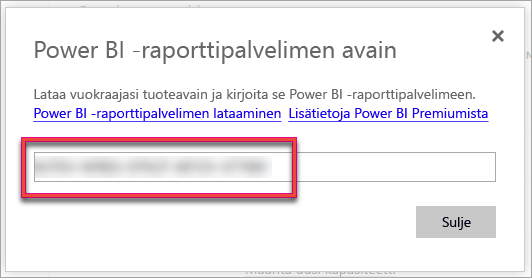

# Raporttipalvelimen tuoteavaimen löytäminen
Lue, miten voit etsiä Power BI -raporttipalvelimen tuoteavaimen asentaaksesi palvelimesi tuotantoympäristöön.

<iframe width="640" height="360" src="https://www.youtube.com/embed/6CQnf-NGtpU?rel=0&amp;showinfo=0" frameborder="0" allowfullscreen></iframe>

Olet ladannut Power BI-raporttipalvelimen ja sinulla on SQL Server Enterprise Software Assurance -sopimus. Tai jos olet ostanut Power BI Premiumin. Haluat asentaa palvelimen tuotantoympäristöösi, mutta tarvitset tuoteavaimen onnistuaksesi siinä. Missä on tuoteavain? 

Tuoteavain on yhdessä kahdesta mahdollisesta paikasta, riippuen siitä mitä olet ostanut.

## Ostit Power BI Premiumin
Jos olet ostanut Power BI Premiumin, löydät Power BI -raporttipalvelimen tuoteavaimen Power BI -hallintaportaalin **kapasiteettiasetukset**-välilehdeltä. Tämä on käytettävissä vain Yleisille järjestelmänvalvojille ja käyttäjille, joille on määritetty Power BI -palvelun järjestelmänvalvojan rooli.

Voit avata tuoteavaimen sisältävän valintaikkunan valitsemalla **Power BI -raporttipalvelimen avain** -kohdan. Voit kopioida sen ja käyttää sitä asennuksessa.

## Jos ostit Software Assurance -sopimuksen
Jos sinulla on SQL Server Enterprise SA -sopimus, saat tuoteavaimen [voluumikäyttöoikeuskeskuksesta](https://www.microsoft.com/Licensing/servicecenter/). Katson uusin SQL-palvelimen uusin versio viimeisimmästä palvelupaketista. Jos sitä ei näy paketissa, katso viimeisimmän SQL-palvelin version RTM-versiota.

> [!NOTE]
> Sinun täytyy katsoa lataukset-kohdasta. Älä katso avaimet-osiota.
> 
> 

## Seuraavat vaiheet
[Pikaopas: Power BI -raporttipalvelimen asentaminen](quickstart-install-report-server.md)  
[Asenna Power BI Desktop (optimoitu Power BI -raporttipalvelimelle)](install-powerbi-desktop.md)  
[Raportin muodostimen asentaminen](https://docs.microsoft.com/sql/reporting-services/install-windows/install-report-builder)  
[SQL Server Data Tools (SSDT) -työkalujen lataaminen](http://go.microsoft.com/fwlink/?LinkID=616714)

Onko sinulla muuta kysyttävää? [Voit esittää kysymyksiä Power BI -yhteisössä](https://community.powerbi.com/)

