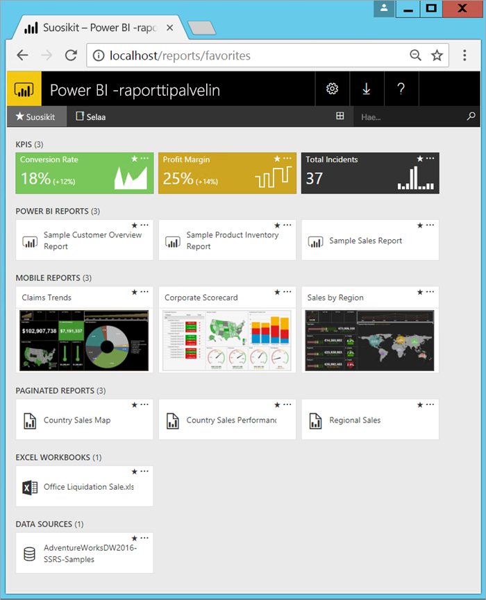

# Mikä on Power BI -raporttipalvelin?

Power BI -raporttipalvelin on paikallinen raporttipalvelin, jonka verkkoportaalissa voit tarkastella ja hallita raportteja ja suorituskykyilmaisimia. Se tarjoaa myös työkalut, joilla voit luoda Power BI -raportteja, sivutettuja raportteja, mobiiliraportteja ja suorituskykyilmaisimia. Käyttäjät voivat käyttää näitä raportteja eri tavoilla: niitä voidaan tarkastella verkkoselaimessa tai mobiililaitteessa tai sähköpostiviesteinä.

## Power BI -raporttipalvelimen vertailu 
Power BI -raporttipalvelin on vastaava kuin SQL Server Reporting Services ja Power BI -verkkopalvelu, mutta se toimii eri tavoilla. Power BI -palvelun tavoin Power BI -raporttipalvelin isännöi Power BI -raportteja (.PBIX) ja Excel-tiedostoja. Reporting Servicesin tavoin Power BI -raporttipalvelin on paikallinen palvelin, joka isännöi sivutettuja raportteja (.RDL). Power BI -raporttipalvelin on Reporting Servicesin yläjoukko: kaikki Reporting Servicesin voidaan tehdä myös Power BI -raporttipalvelimessa, ja myös paljon muuta Power BI -raporttien tuen myötä. Katso lisätietoja kohdasta [Power BI -raporttipalvelimen ja Power BI -palvelun vertailu](compare-report-server-service.md).

## Power BI -raporttipalvelimen käyttöoikeus
Power BI -raporttipalvelin on saatavana kahdella eri käyttöoikeudella: [Power BI Premium](../service-premium.md) ja [SQL Server Enterprise Edition](https://www.microsoft.com/sql-server/sql-server-2017-editions), jossa on Software Assurance. Power BI Premium -käyttöoikeudella voit luoda hybridiratkaisun, jossa yhdistyvät pilvi- ja paikallispalvelut.  

> [!NOTE]
> Power BI Premiumin osalta Power BI -raporttipalvelin sisältyy vain P-varastointiyksiköihin. Se ei sisälly EM-varastointiyksiköihin.

## Verkkoportaali
Power BI -raporttipalvelimen käyttöliittymä on nykyaikainen verkkoportaali, jota voit tarkastella missä tahansa nykyaikaisessa selaimessa. Täällä voit käyttää kaikkia raportteja ja suorituskykyilmaisimia. Verkkoportaalin sisältö on järjestetty perinteiseen kansiohierarkiaan. Kansioiden sisältö on järjestetty tyypin mukaan: Power BI -raportit, mobiiliraportit, sivutetut raportit, suorituskykyilmaisimet ja Excel-työkirjat, sekä raporttien perustana toimivat jaetut tietojoukot ja jaetut tietolähteet. Voit merkitä suosikkisi ja tarkastella niitä yhdessä kansiossa. Lisäksi voit luoda suorituskykyilmaisimia suoraan verkkoportaalista. 

Käyttöoikeuksiesi mukaan voit hallita sisältöä verkkoportaalissa. Voit ajastaa raporttien käsittelyn, käyttää raportteja pyynnöstä sekä tilata julkaistut raportit itsellesi. Voit myös käyttää verkkoportaalissa omia mukautettuja [brändejäsi](https://docs.microsoft.com/sql/reporting-services/branding-the-web-portal). 

Lisätietoja [Power BI -raporttipalvelimen verkkoportaalista](https://docs.microsoft.com/sql/reporting-services/web-portal-ssrs-native-mode).

## Power BI -raportit
Voit luoda Power BI -raportteja (.PBIX) raporttipalvelimelle optimoidulla Power BI Desktop -versiolla. Sitten voit julkaista ne ja tarkastella niitä verkkoportaalissa omassa ympäristössäsi.

Power BI -raportti on usean perspektiivin tietomallinäkymä, jonka visualisoinnit edustavat eri havaintoja ja merkityksellisiä tietoja tietomallista.  Raportilla voi olla yksittäinen visualisointi tai sivuja, jotka ovat täynnä visualisointeja. Roolisi mukaan voit lukea ja tutkia raportteja, tai voit luoda muille raportteja.

Asenna [Power BI Desktop (optimoitu Power BI -raporttipalvelimelle)](quickstart-create-powerbi-report.md).

## Sivutetut raportit
Sivutetut raportit (.RDL)ovat asiakirjatyylisiä, visualisointeja sisältäviä raportteja, joissa taulukot laajentuvat vaaka- ja pystysuunnassa kaikkien tietojen näyttämiseksi, sivulta toiselle jatkuen tarpeen mukaan. Ne sopivat erinomaisesti pikselintarkasti täydellisesti aseteltuihin kiinteisiin raportteihin, jotka on optimoitu tulostettavaksi esimerkiksi PDF- tai Word-tiedostoina.

Voit luoda ulkoasultaan moderneja raportteja käyttämällä [raportin muodostinta](https://docs.microsoft.com/sql/reporting-services/report-builder/report-builder-in-sql-server-2016) tai Report Designeria [SQL Server Data Tools (SSDT)](https://docs.microsoft.com/sql/reporting-services/tools/reporting-services-in-sql-server-data-tools-ssdt) -työkaluista.

## Reporting Servicesin mobiiliraportit
Mobiiliraportit yhdistyvät paikallisiin tietoihin ja niiden reagoiva asettelu sopeutuu eri laitteille ja näytön suunnan mukaisesti. Voit luoda ne SQL Serverin mobiiliraportin julkaisijalla.

Lisätietoa [Reporting Servicesin mobiiliraporteista](https://docs.microsoft.com/sql/reporting-services/mobile-reports/create-mobile-reports-with-sql-server-mobile-report-publisher). 

## Raporttipalvelimen ohjelmointiominaisuudet
Hyödynnä Power BI -raporttipalvelimen ohjelmointiominaisuudet, joiden avulla voit laajentaa ja mukauttaa raporttitoiminnallisuuksia. Ohjelmointirajapintojen kautta voit integroida niitä mukautettuihin sovelluksiin sekä laajentaa tietojen ja raporttien käsittelyä sovelluksissa.

Lisää [ohjeita raporttipalvelinkehittäjälle](https://docs.microsoft.com/sql/reporting-services/reporting-services-developer-documentation).

## Seuraavat vaiheet
[Power BI -raporttipalvelimen asentaminen](install-report-server.md)  
[Raportin muodostimen lataaminen](https://www.microsoft.com/download/details.aspx?id=53613)  

Onko sinulla kysyttävää? [Voit esittää kysymyksiä Power BI -yhteisössä](https://community.powerbi.com/)

