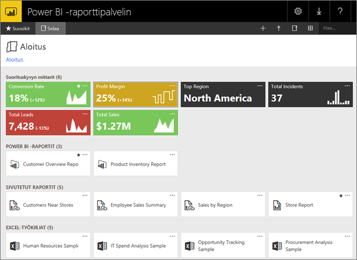
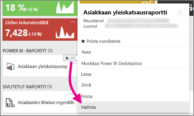
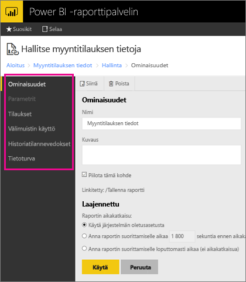

# Hallitse sisältöä verkkoportaalissa 
Power BI -raporttipalvelimen verkkoportaalissa voi tarkastella, tallentaa ja hallita paikallisia Power BI- ja mobiiliraportteja sekä sivutettuja raportteja ja suorituskykyilmaisimia.

Voit käyttää verkkoportaalia millä tahansa modernilla selaimella. Raportit ja suorituskykyilmaisimet on järjestetty kansioihin verkkoportaalissa, ja voit merkitä niitä suosikeiksi. Voit tallentaa sinne myös Excel-työkirjoja. Verkkoportaalista voit käynnistää raporttien luomiseen tarvitsemasi työkalut:

* Power BI Desktopissa luodut **Power BI -raportit**: voit tarkastella niitä verkkoportaalissa ja Power BI -mobiilisovelluksissa.
* Raportin muodostimessa luodut **sivutetut raportit**: modernit, kiinteästi asetellut asiakirjat, jotka on optimoitu tulostamista varten.
* Suoraan verkkoportaalissa luodut **suorituskykyilmaisimet**.

Voit selata verkkoportaalissa raporttipalvelimen kansioita tai etsiä tiettyä raporttia. Voit tarkastella raporttia, sen yleisiä ominaisuuksia ja sen aiempia kopioita, jotka on tallennettu raporttihistoriaan. Käyttöoikeuksistasi riippuen sinulla voi myös olla mahdollisuus tilata raportteja, jotka toimitetaan sähköpostisi Saapuneet-kansioon tai tiedostojärjestelmän jaettuun kansioon.

## Verkkoportaalin roolit ja käyttöoikeudet
Verkkoportaalisovellus toimii selaimessa. Kun käynnistät verkkoportaalin, näkemäsi sivut, linkit ja vaihtoehdot vaihtelevat raporttipalvelimessa sinulle määritettyjen käyttöoikeuksien mukaan. Jos sinulle on määritetty täydet käyttöoikeudet, pääset käyttämään kaikkia raporttipalvelimen hallinnan sovellusvalikoita ja sivuja. Jos sinulle on määritetty raporttien tarkastelu- ja suorittamisoikeudet, näet vain näihin toimintoihin tarvittavat valikot ja sivut. Sinulla voi olla erilaisia roolimäärityksiä eri raporttipalvelimissa tai jopa yhden raporttipalvelimen eri raporteissa ja kansioissa.

## Käynnistä verkkoportaali
1. Avaa selain.
   
    Katso luettelo [tuetuista selaimista ja versioista](browser-support.md).
2. Kirjoita verkkoportaalin URL-osoite osoiteriville.
   
    URL-osoite on oletusarvoisesti <em>http://[ComputerName]/reports</em>.
   
    Raporttipalvelin on ehkä määritetty käyttämään tiettyä porttia. Esimerkiksi <em>http://[ComputerName]:80/reports</em> tai <em>http://[ComputerName]:8080/reports</em>
   
    Näet, että verkkoportaali ryhmittelee kohteet seuraaviin luokkiin:
   
   * Suorituskykyilmaisimet
   * Mobiiliraportit
   * Sivutetut raportit
   * Power BI Desktop -raportit
   * Excel-työkirjat
   * Tietojoukot
   * Tietolähteet
   * Resurssit

## Hallitse kohteita verkkoportaalissa
Power BI -raporttipalvelimen avulla voit hallita verkkoportaaliin tallentamiasi kohteita yksityiskohtaisesti. Voit esimerkiksi määrittää yksittäisten sivutettujen raporttien tilaukset, tallentamisen välimuistiin, tilannevedokset ja suojauksen.

1. Valitse kohteen oikeassa yläkulmassa olevat kolme pistettä (...) ja valitse sitten **Hallitse**.
   
    
2. Valitse ominaisuus, jonka haluat määrittää.
   
    
3. Valitse **Käytä**.

Lue lisää [tilausten käsittelemisestä verkkoportaalissa](https://docs.microsoft.com/sql/reporting-services/working-with-subscriptions-web-portal).

## Seuraavat vaiheet
[Mikä on Power BI -raporttipalvelin?](get-started.md)

Onko sinulla kysyttävää? [Voit esittää kysymyksiä Power BI -yhteisössä](https://community.powerbi.com/)

