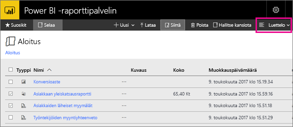

# Siirtyminen Power BI -raporttipalvelimen verkkoportaalissa
Power BI -raporttipalvelimen verkkoportaalissa voi tarkastella, tallentaa ja hallita paikallisia Power BI- ja mobiiliraportteja sekä sivutettuja raportteja ja suorituskykyilmaisimia.

Voit käyttää verkkoportaalia millä tahansa modernilla selaimella. Raportit ja suorituskykyilmaisimet on järjestetty kansioihin verkkoportaalissa, ja voit merkitä niitä suosikeiksi. Voit tallentaa sinne myös Excel-työkirjoja. Verkkoportaalista voit käynnistää raporttien luomiseen tarvitsemasi työkalut:

* Power BI Desktopissa luodut **Power BI -raportit**: voit tarkastella niitä verkkoportaalissa ja Power BI -mobiilisovelluksissa.
* Raportin muodostimessa luodut **sivutetut raportit**: modernit, kiinteästi asetellut asiakirjat, jotka on optimoitu tulostamista varten.
* Suoraan verkkoportaalissa luodut **suorituskykyilmaisimet**.

Voit selata verkkoportaalissa raporttipalvelimen kansioita tai etsiä tiettyä raporttia. Voit tarkastella raporttia, sen yleisiä ominaisuuksia ja sen aiempia kopioita, jotka on tallennettu raporttihistoriaan. Käyttöoikeuksistasi riippuen sinulla voi myös olla mahdollisuus tilata raportteja, jotka toimitetaan sähköpostisi Saapuneet-kansioon tai tiedostojärjestelmän jaettuun kansioon.

## Verkkoportaalin tehtävät
Voit käyttää verkkoportaalia useisiin tehtäviin, joita ovat muun muassa seuraavat:

* Raporttien tarkasteleminen, etsiminen, tulostaminen ja tilaaminen.
* Kansiohierarkian luominen, suojaaminen ja ylläpitäminen kohteiden järjestämiseksi palvelimelle.
* Raportin suoritusominaisuuksien, raporttihistorian ja raportin parametrien määrittäminen.
* Jaettujen aikataulujen ja jaettujen tietolähteiden luominen aikataulujen ja tietolähdeyhteyksien hallinnan helpottamiseksi.
* Aineistoperäisten tilausten luominen raporttien julkaisemiseksi suuriin vastaanottajaluetteloihin.
* Linkitettyjen raporttien luominen aiemmin luodun raportin uudelleen käyttämiseksi eri tavoilla.
* Yleisten työkalujen, kuten Power BI Desktopin (raporttipalvelimen), Raportin muodostimen ja Mobiiliraportin julkaisijan, lataaminen ja avaaminen.
* [Suorituskykyilmaisimien luominen](https://docs.microsoft.com/sql/reporting-services/working-with-kpis-in-reporting-services).
* Palautteen lähettäminen tai ominaisuuspyyntöjen tekeminen.
* [Verkkoportaalin mukautus](https://docs.microsoft.com/sql/reporting-services/branding-the-web-portal)
* [Suorituskykyilmaisimien käyttö](https://docs.microsoft.com/sql/reporting-services/working-with-kpis-in-reporting-services)
* [Jaettujen tietojoukkojen käyttö](https://docs.microsoft.com/sql/reporting-services/work-with-shared-datasets-web-portal)

## Verkkoportaalin roolit ja käyttöoikeudet
Verkkoportaali on verkkosovellus, joka toimii selaimessa. Kun käynnistät verkkoportaalin, näkemäsi sivut, linkit ja vaihtoehdot vaihtelevat raporttipalvelimessa sinulle määritettyjen käyttöoikeuksien mukaan. Jos sinulle on määritetty täydet käyttöoikeudet, pääset käyttämään kaikkia raporttipalvelimen hallinnan sovellusvalikoita ja sivuja. Jos sinulle on määritetty raporttien tarkastelu- ja suorittamisoikeudet, näet vain näihin toimintoihin tarvittavat valikot ja sivut. Sinulla voi olla erilaisia roolimäärityksiä eri raporttipalvelimissa tai jopa yhden raporttipalvelimen eri raporteissa ja kansioissa.

## Käynnistä verkkoportaali
1. Avaa selain.
   
    Katso luettelo [tuetuista selaimista ja versioista](browser-support.md).
2. Kirjoita verkkoportaalin URL-osoite osoiteriville.
   
    URL-osoite on oletusarvoisesti *http://[ComputerName]/reports*.
   
    Raporttipalvelin on ehkä määritetty käyttämään tiettyä porttia. Esimerkiksi *http://[ComputerName]:80/reports* tai *http://[ComputerName]:8080/reports*
   
    Näet, että verkkoportaali ryhmittelee kohteet seuraaviin luokkiin:
   
   * Suorituskykyilmaisimet
   * Mobiiliraportit
   * Sivutetut raportit
   * Power BI Desktop -raportit
   * Excel-työkirjat
   * Tietojoukot
   * Tietolähteet
   * Resurssit

## Luo ja muokkaa Power BI Desktop -raportteja (.pbix-tiedostoja)
Verkkoportaalissa voit tarkastella, ladata, luoda ja järjestää Power BI Desktop -raportteja sekä hallita niiden käyttöoikeuksia.

### Luo Power BI Desktop -raportti
1. Valitse **Uusi** > **Power BI -raportti**.
   
    
   
    Power BI Desktop -sovellus avautuu.
   
    
2. Luo Power BI -raportti. Katso lisätietoja kohdasta [Pikaopas: Power BI -raportit](quickstart-create-powerbi-report.md).
3. Lataa raportti raporttipalvelimeen.

### Muokkaa aiemmin luotua Power BI Desktop -raporttia
1. Valitse raporttiruudun oikeassa yläkulmassa olevat kolme pistettä (**...**) ja **Muokkaa Power BI Desktopissa**.
   
    
   
    Power BI Desktop -sovellus avautuu.
2. Tee haluamasi muutokset ja tallenna... [miten?]

## Luo ja muokkaa sivutettuja raportteja (.rdl-tiedostoja)
Verkkoportaalissa voit tarkastella, ladata, luoda ja järjestää sivutettuja raportteja sekä hallita niiden käyttöoikeuksia.

### Luo sivutettu raportti
1. Valitse **Uusi** > **sivutettu raportti**.
   
    Raportin muodostin -sovellus avautuu.
   
    
2. Luo sivutettu raportti. Katso lisätietoja kohdasta [Pikaopas: sivutetut raportit](quickstart-create-paginated-report.md).
3. Lataa raportti raporttipalvelimeen.

### Muokkaa aiemmin luotua sivutettua raporttia
1. Valitse raporttiruudun oikeassa yläkulmassa olevat kolme pistettä (...) ja **Muokkaa Raportin muodostimessa**.
   
    
   
    Raportin muodostin -sovellus avautuu.
2. Tee haluamasi muutokset ja tallenna.

## Lataa ja järjestä Excel-työkirjat
Voit ladata ja järjestää Power BI Desktop -raportteja ja Excel-työkirjoja sekä hallita niiden käyttöoikeuksia. Ne ryhmitellään yhteen verkkoportaalissa.

Työkirjat tallennetaan Power BI -raporttipalvelimeen, samoin kuin muut resurssitiedostot. Kun valitset jonkin työkirjoista, se latautuu paikallisesti työpöydälle. Voit tallentaa tekemäsi muutokset lataamalla sen uudelleen raporttipalvelimelle.

## Hallitse kohteita verkkoportaalissa
Power BI -raporttipalvelimen avulla voit hallita verkkoportaaliin tallentamiasi kohteita yksityiskohtaisesti. Voit esimerkiksi määrittää yksittäisten sivutettujen raporttien tilaukset, tallentamisen välimuistiin, tilannevedokset ja suojauksen.

1. Valitse kohteen oikeassa yläkulmassa olevat kolme pistettä (...) ja valitse sitten **Hallitse**.
   
    
2. Valitse ominaisuus, jonka haluat määrittää.
   
    
3. Valitse **Käytä**.

Lue lisää [tilausten käsittelemisestä verkkoportaalissa](https://docs.microsoft.com/sql/reporting-services/working-with-subscriptions-web-portal).

## Lisää tunniste suosikkiraportteihisi ja -suorituskykyilmaisimiin
Voit lisätä tunnisteen niihin raportteihin ja suorituskykyilmaisimiin, joiden haluat olevan suosikkeja. Ne on helpompi löytää, sillä ne on kaikki kerätty yhteen Suosikit-kansioon sekä verkkoportaalissa että Power BI -mobiilisovelluksissa. 

1. Valitse kolme pistettä (**...**) sen suorituskykyilmaisimen tai raportin oikeassa yläkulmassa, josta haluat tehdä suosikin, ja valitse **Lisää suosikkeihin**.
   
    
2. Valitse **Suosikit** verkkoportaalin valintanauhasta, niin näet sen verkkoportaalin Suosikit-sivulla olevien muiden suosikkien ohella.
   
    
   
    Power BI -mobiilisovelluksissa näet nyt nämä suosikit Power BI -palvelun suosikkikoontinäyttöjesi ohella.
   
    

## Piilota tai näytä kohteita verkkoportaalissa
Voit piilottaa kohteita verkkoportaalissa, ja voit halutessasi näyttää piilotettuja kohteita.

### Piilota kohde
1. Valitse kohteen oikeassa yläkulmassa olevat kolme pistettä (...) ja valitse sitten **Hallitse**.
   
    
2. Valitse **Piilota tämä kohde**.
   
    
3. Valitse **Käytä**.

### Näytä piilotetut kohteet
1. Valitse **Ruudut** (tai **Luettelo**) oikeassa yläkulmassa, ja valitse **Näytä piilotetut kohteet**.
   
    Kohteet tulevat näkyviin. Ne näkyvät harmaina, mutta voit silti avata ja muokata niitä.
   
    

## Hae kohteita
Voit kirjoittaa hakuehdon, ja näet kaiken mihin sinulla on käyttöoikeus. Tulokset jaetaan suorituskykyilmaisimiin, raportteihin, tietojoukkoihin ja muihin kohteisiin. Voit käsitellä tuloksia ja lisätä niitä suosikkeihin.  

## Siirrä tai poista kohteita luettelonäkymässä
Verkkoportaalin sisältö näkyy oletusarvoisesti ruutunäkymässä.

Voit siirtyä luettelonäkymään, jossa voit helposti siirtää tai poistaa useita kohteita samalla kertaa. 

1. Valitse **Ruudut** > **-luettelo**.
   
    
2. Valitse kohteet ja valitse sitten **Siirrä** tai **Poista**.

## Seuraavat vaiheet
[Käyttöopas](user-handbook-overview.md)  
[Pikaopas: sivutetut raportit](quickstart-create-paginated-report.md)  
[Pikaopas: Power BI -raportit](quickstart-create-powerbi-report.md)

Ilmenikö muuta kysyttävää? [Voit esittää kysymyksiä Power BI -yhteisössä](https://community.powerbi.com/)

