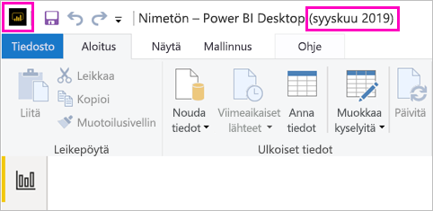

# Asenna Power BI -raporttipalvelimelle optimoitu Power BI Desktop

Jotta voit luoda Power BI -raportteja Power BI -raporttipalvelimelle, sinun on ladattava ja asennettava Power BI -raporttipalvelimelle optimoitu Power BI Desktop -versio. Tämä versio on erilainen kuin Power BI -palvelun kanssa käytettävä Power BI Desktop. Power BI Desktopin versio Power BI -palvelulle sisältää esimerkiksi esiversio-ominaisuuksia, joita Power BI -raporttipalvelinversiossa ei ole ennen niiden yleistä julkaisua. Käyttämällä tätä versiota varmistetaan, että raporttipalvelin voi käsitellä raporttien ja mallin tunnettua versiota. 

Onneksi voit asentaa Power BI Desktopin ja Power BI -raporttipalvelimelle optimoidun Power BI Desktopin rinnakkain samalle tietokoneelle.

## Power BI Desktopin lataaminen ja asentaminen

Helpoin tapa varmistaa, että sinulla on Power BI -raporttipalvelimelle optimoidun Power BI Desktopin uusin versio, on aloittaa raporttipalvelimesi verkkoportaalista.

1. Valitse raporttipalvelimen verkkoportaalissa **Lataa**-nuoli > **Power BI Desktop**.

    

    Voit myös siirtyä [Power BI -raporttipalvelin](https://powerbi.microsoft.com/report-server/) -aloitussivulle ja valita **Lataamisen lisäasetukset**.

2. Valitse Download Center -sivulla ensin kieli ja sitten **Lataa**.

3. Tietokoneestasi riippuen valitse: 

    - **PBIDesktopRS.msi** (32-bittinen versio) tai
    - **PBIDesktopRS_x64.msi** (64-bittinen versio).

1. Kun olet ladannut asennusohjelman, suorita Power BI Desktopin (syyskuu 2019) ohjattu asennus.

2. Asennuksen lopussa valitse **Käynnistä Power BI Desktop**.

    Se käynnistyy automaattisesti ja on valmiina käyttöön.

## Varmista, että käytät oikeaa versiota
Oikean Power BI Desktop -version varmistaminen on helppoa: vilkaise Power BI Desktopin käynnistysruutua tai otsikkoriviä. Tiedät, että sinulla on oikea versio, koska **Power BI Desktop (syyskuu 2019)** lukee otsikkorivillä. Myös Power BI -logon värit ovat päinvastaiset: keltaista mustalla taustalla eikä päinvastoin.

Power BI -palvelun Power BI Desktop -versiossa ei ole kuukautta ja vuotta otsikkorivillä.

## Tiedostotunnisteen kytkentä
Jos asennat sekä Power BI Desktopin että Power BI -raporttipalvelimelle optimoidun Power BI Desktopin samalle koneelle, Power BI Desktopin uusimmassa asennuksessa on tiedostokytkentä .pbix-tiedostoille. Toisin sanoen kun kaksoisnapsautat .pbix-tiedostoa, se avataan viimeksi asennetussa Power BI Desktopissa.

Jos sinulla on Power BI Desktop ja asennat sitten Power BI -raporttipalvelimelle optimoidun Power BI Desktopin, kaikki .pbix-tiedostot avataan oletuksena Power BI -raporttipalvelimelle optimoidussa Power BI Desktopissa. Jos haluat, että .pbix-tiedostot avataan oletusarvoisesti Power BI Desktopissa, asenna [Power BI Desktop uudelleen Microsoft Storesta](http://aka.ms/pbidesktopstore).

Voit myös aina ensin avata sen Power BI Desktopin version, jota haluat käyttää. Ja avata sitten tiedoston Power BI Desktopista.

Power BI -raportin muokkaaminen Power BI -raporttipalvelimesta tai uuden Power BI -raportin luominen verkkoportaalista avaa aina Power BI Desktopin oikean version.

## Huomioitavat asiat ja rajoitukset

Power BI -raporttipalvelimen Power BI -raportit Power BI -palvelussa (http://app.powerbi.com), ja Power BI -mobiilisovelluksissa toimivat lähes täsmälleen samoin, mutta jotkut ominaisuudet ovat erilaisia.

### Kielen valitseminen

Jos Power BI Desktop on optimoitu Power BI -raporttipalvelimelle, voit valita kielen sovellusta asentaessasi. Et voi vaihtaa kieltä sen jälkeen, mutta voit asentaa version toisella kielellä.

### Raportin visualisoinnit selaimessa

Power BI -raporttipalvelimen raportit tukevat lähes kaikkia visualisointeja, mukautetut visualisoinnit mukaan lukien. Power BI -raporttipalvelimen raportit eivät tue seuraavia:

* R-visualisoinnit
* ArcGIS-kartat
* Navigointipolut
* Power BI Desktopin esikatselutoiminnot

### Raportit Power BI -mobiilisovelluksissa

Power BI -raporttipalvelimen raportit tukevat [Power BI -mobiilisovellusten](../consumer/mobile/mobile-apps-for-mobile-devices.md) kaikkia tavallisia toimintoja, mukaan luettuina seuraavat:

* [Puhelimen raporttiasettelu](../desktop-create-phone-report.md): voit optimoida raportin Power BI -mobiilisovelluksia silmällä pitäen. Optimoiduilla raporteilla on matkapuhelimessa erityinen kuvake, , sekä asettelu.
  
    

Power BI -raporttipalvelimen raportit eivät tue näitä ominaisuuksia Power BI -mobiilisovelluksissa:

* R-visualisoinnit
* ArcGIS-kartat
* Mukautetut visualisoinnit
* Navigointipolut
* Maantieteellinen suodatus tai viivakoodit

## Power BI Desktop Power BI -raporttipalvelimen aiempiin versioihin

Jos raporttipalvelimesi on aiempi versio, tarvitset vastaavan version Power BI Desktopista. Tässä on linkki edellisen version lataamiseen.

- Microsoft Power BI Desktop ([optimoitu Power BI -raporttipalvelimelle – tammikuu 2019](https://go.microsoft.com/fwlink/?linkid=2055039))

## Seuraavat vaiheet

Nyt kun sinulla on Power BI Desktop asennettuna, voit aloittaa Power BI -raporttien luomisen.

[Power BI -raportin luominen Power BI -raporttipalvelimeen](quickstart-create-powerbi-report.md)  
[Mikä on Power BI -raporttipalvelin?](get-started.md)

Onko sinulla kysyttävää? [Voit esittää kysymyksiä Power BI -yhteisössä](https://community.powerbi.com/)
