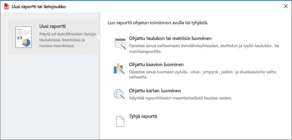

# Raportin muodostimen asentaminen – Power BI-raporttipalvelin

Raportin muodostin on itsenäinen sovellus, jonka sinä tai järjestelmänvalvoja on asentanut tietokoneeseesi. Voit ladata sen Microsoft Download Centeristä tai Power BI -raporttipalvelimelta.  

Tarvitsetko neuvoja Power BI -palvelun Raportin muodostimen asentamiseen? Lue lisätietoja kohdasta [Power BI:n sivutetun raportin muodostin](../report-builder-power-bi.md).
  
Tavallisesti järjestelmänvaloja asentaa ja määrittää Power BI -raporttipalvelimen, myöntää käyttöoikeudet Raportin muodostimen lataamiseen verkkoportaalista, ja hallitsee kansioita ja raporttien käyttöoikeuksia sekä raporttipalvelimelle tallennettuja jaettuja tietojoukkoja. Lisätietoja Power BI -raporttipalvelimesta on artikkelissa [Hallinnan yhteenveto, Power BI -raporttipalvelin](admin-handbook-overview.md).  
  
## Järjestelmävaatimukset
  
 Lisätietoja on Microsoft Download Centerin [Raportin muodostimen lataussivun](https://go.microsoft.com/fwlink/?LinkID=734968) **Järjestelmävaatimukset**-osassa.
 
## Raportin muodostimen asentaminen verkkoportaalin kautta
  
Voit asentaa Raportin muodostimen Power BI-raporttipalvelimen verkkoportaalista. Olet ehkä jo asentanut Raportin muodostimen raporttien luomiseksi SSRS-palvelimelle. Voit käyttää samaa versiota tai Raportin muodostinta Power BI -raporttipalvelimen raporttien luomiseen. Jos et ole vielä asentanut sitä, prosessi on helppo.

1. Valitse Power BI -raporttipalvelimen verkkoportaalissa **Uusi** > **Sivutettu raportti**.
   
    
   
    Jos sinulla ei ole Raportin muodostinta asennettuna, Microsoftin Raportin muodostimen ohjattu toiminto käynnistyy.  
  
3.  Hyväksy käyttöoikeussopimuksen ehdot > **Seuraava**.  
 
5.  Viimeistele Raportin muodostimen asennus valitsemalla **Asenna**.  

2. Asennuksen jälkeen Raportin muodostin aukeaa **Uusi raportti tai tietojoukko** -näyttöön.
   
    
 

##  Raportin muodostimen lataaminen Download Centeristä  
  
1.  Valitse [Microsoft Download Centerin Raportin muodostin -sivulta](https://go.microsoft.com/fwlink/?LinkID=734968) **Lataa**.  
  
2.  Kun Raportin muodostin on latautunut, valitse **Suorita**.  
  
     Microsoft Raportin muodostimen ohjattu toiminto käynnistyy.  
  
3.  Hyväksy käyttöoikeussopimuksen ehdot > **Seuraava**.  
 
5.  Viimeistele Raportin muodostimen asennus valitsemalla **Asenna**.  
 

## Seuraavat vaiheet

[Mikä on Power BI -raporttipalvelin?](get-started.md)
