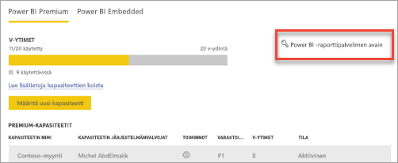
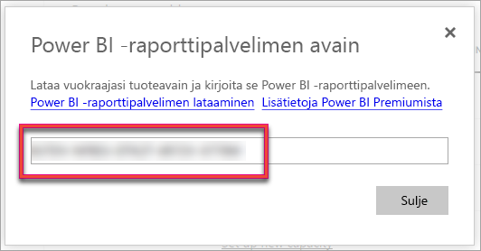
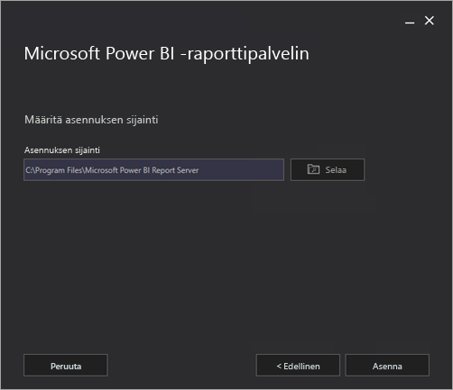
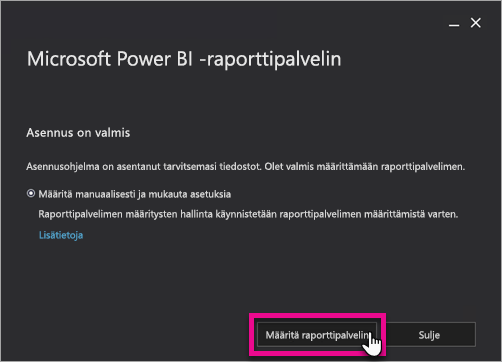

# Asenna Power BI -raporttipalvelin

Opi asentamaan Power BI -raporttipalvelin.

## Power BI -raporttipalvelimen lataaminen

Valitse [Paikallinen raportointi Power BI -raporttipalvelimella](https://powerbi.microsoft.com/report-server/) -sivulta **Lataa ilmainen kokeiluversio**.

Kun suoritat PowerBIReportServer.exe-tiedoston, valitse ilmainen kokeiluversio tai anna tuoteavain. Lisätietoja on alla.

## Ennen asentamista

Microsoft suosittelee ennen Power BI -raporttipalvelimen asentamista tutustumaan [Power BI -raporttipalvelimen asentamisen laitteisto- ja ohjelmistovaatimuksiin](system-requirements.md).

 > [!IMPORTANT]
 > Microsoft Power BI -raporttipalvelin voidaan asentaa ympäristöön, jossa on Vain luku-toimialueen ohjain (RODC), mutta Power BI -raporttipalvelin tarvitsee käyttöoikeuden luku- ja kirjoitus-toimialueen ohjaimelle toimiakseen oikein. Jos Power BI -raporttipalvelin sisältää vain RODC-käyttöoikeuden, voi tulla virheitä, kun yrität hallita palvelua.

### Power BI -raporttipalvelimen tuoteavain

Voit noutaa Power BI -raporttipalvelimen tuoteavaimen kahdesta eri lähteestä:

- Power BI Premium
- SQL Server Enterprise Software Assurance (SA)

Lisätietoja on alla.

#### Power BI Premium

Jos olet ostanut Power BI Premiumin, Power BI -raporttipalvelimen tuoteavain on Power BI -hallintaportaalin **Premium-asetukset**-välilehdellä. Hallintaportaali on käytettävissä vain Yleisille järjestelmänvalvojille ja käyttäjille, joille on määritetty Power BI -palvelun järjestelmänvalvojan rooli.

Voit avata valintaikkunan, joka sisältää tuoteavaimen, valitsemalla **Power BI -raporttipalvelimen avain** -kohdan. Voit kopioida avaimen ja käyttää sitä asennuksessa.

#### SQL Server Enterprise Software Assurance (SA)

Jos sinulla on SQL Server Enterprise SA -sopimus, saat tuoteavaimen [volyymikäyttöoikeuskeskuksesta](https://www.microsoft.com/Licensing/servicecenter/).

## Raporttipalvelimen asentaminen

Power BI -raporttipalvelimen asentaminen on helppoa. Tiedostojen asentaminen onnistuu vain parissa vaiheessa.

SQL Server -tietokantamoduulin palvelimen ei tarvitse olla käytettävissä asennuksen aikana. Palvelin tarvitaan raporttipalvelujen määrittämiseksi asennuksen jälkeen.

1. Paikanna PowerBIReportServer.exe-tiedosto ja käynnistä asennusohjelma.

2. Valitse **Asenna Power BI -raporttipalvelin**.

    
3. Valitse asennettava versio ja valitse sitten **Seuraava**.

    

    Valitse joko Evaluation- tai Developer-versio.

    

    Muussa tapauksessa anna tuoteavain, jonka sait joko Power BI -palvelusta tai Volyymikäyttöoikeuspalvelukeskuksesta. Lisätietoja tuoteavaimen hankkimisesta on yllä olevassa [Ennen asennusta](#before-you-install) -osassa.
4. Lue ja hyväksy käyttöoikeussopimuksen ehdot ja valitse sitten **Seuraava**.

    
5. Tarvitset käytettävissä olevan tietokantamoduulin, johon voit tallentaa raporttipalvelimen tietokannan. Valitse **Seuraava** asentaaksesi vain raporttipalvelimen.

    
6. Määritä raporttipalvelimen asennuspaikka. Jatka valitsemalla **Asenna**.

    

    Oletuspolku on C:\Program Files\Microsoft Power BI Report Server.

7. Onnistuneen määrityksen jälkeen käynnistä Reporting Services Configuration Manager valitsemalla **Määritä raporttipalvelin**.

    

## Määritä raporttipalvelin

Kun valitset asetuksissa **Määritä raporttipalvelin**, näyttöön tulee Reporting Services Configuration Manager. Lisätietoja on artikkelissa [Reporting Services Configuration Manager](https://docs.microsoft.com/sql/reporting-services/install-windows/reporting-services-configuration-manager-native-mode).

[Luo raporttipalvelintietokanta](https://docs.microsoft.com/sql/reporting-services/install-windows/ssrs-report-server-create-a-report-server-database) raporttipalvelujen alkumäärityksen viimeistelemiseksi. SQL Server -tietokantapalvelin vaaditaan tämän vaiheen suorittamiseksi.

### Tietokannan luominen eri palvelimessa

Jos olet luomassa raporttipalvelintietokantaa tietokantapalvelimeen, joka sijaitsee eri tietokoneessa, muuta raporttipalvelimen palvelutili tunnistetiedoiksi, jotka tunnistetaan tietokantapalvelimessa. 

Oletusarvon mukaan raporttipalvelin käyttää virtuaalista palvelutiliä. Jos yrität luoda tietokannan eri palvelimessa, näyttöön saattaa tulla seuraava virhe Otetaan yhteysoikeuksia käyttöön -vaiheessa.

`System.Data.SqlClient.SqlException (0x80131904): Windows NT user or group '(null)' not found. Check the name again.`

Voit kiertää virheen muuttamalla palvelutilin joko verkkopalveluksi tai toimialuetiliksi. Palvelutilin muuttaminen verkkopalveluksi ottaa käyttöön raporttipalvelimen tietokonetilin oikeudet.

Katso lisätietoja kohdasta [Raporttipalvelimen palvelutilin määrittäminen](https://docs.microsoft.com/sql/reporting-services/install-windows/configure-the-report-server-service-account-ssrs-configuration-manager).

## Windows-palvelu

Windows-palvelu luodaan asennuksen osana. Se näkyy muodossa **Power BI -raporttipalvelin**. Palvelunimi on **PowerBIReportServer**.

## Oletus-URL-varaukset

URL-varaukset koostuvat etuliitteestä, isäntänimestä, portista ja näennäishakemistosta:

| Osa | Kuvaus |
| --- | --- |
| Etuliite |Oletusarvoinen etuliite on HTTP. Jos olet aiemmin asentanut Secure Sockets Layer (SSL) -varmenteen, asennusohjelma yrittää luoda URL-varaukset, jotka käyttävät HTTPS-etuliitettä. |
| Isäntänimi |Oletusarvoinen isäntänimi on vahva yleismerkki (+). Se määrittää, että raporttipalvelin hyväksyy minkä tahansa HTTP-pyynnön määritetyssä portissa mille tahansa isäntänimelle, joka viittaa tietokoneeseen, mukaan lukien `https://<computername>/reportserver`, `https://localhost/reportserver` tai `https://<IPAddress>/reportserver.` |
| Portti |Oletusportti on 80. Jos käytät mitä tahansa muuta porttia kuin 80, sinun on lisättävä se URL-osoitteeseen eksplisiittisesti, kun avaat verkkoportaalin selainikkunassa. |
| Näennäishakemisto |Oletusarvon mukaan näennäishakemistot luodaan ReportServer-muodossa raporttipalvelimen verkkopalvelua ja verkkoportaalin raportteja varten. Raporttipalvelimen verkkopalvelun oletusarvoinen näennäishakemisto on **reportserver**. Verkkoportaalin oletusarvoinen näennäishakemisto on **reports**. |

Täydellinen URL-merkkijono voi olla esimerkiksi seuraavanlainen:

* `https://+:80/reportserver`, tarjoaa pääsyn raporttipalvelimeen.
* `https://+:80/reports`, tarjoaa pääsyn verkkoportaaliin.

## Palomuuri

Jos käytät raporttipalvelinta etäkoneesta, varmista, että olet määrittänyt palomuurisäännöt, jos palomuuri on käytössä.

Avaa TCP-portti, jonka olet määrittänyt verkkopalvelun URL-osoitetta ja verkkoportaalin URL-osoitetta varten. Oletusarvon mukaan näille on määritetty TCP-portti 80.

## Lisämääritykset

* Jos haluat lisätietoja Power BI -palvelun integroinnin määrittämisestä, jotta voit kiinnittää raporttikohteita Power BI -raporttinäkymään, katso [Integrointi Power BI -palvelun kanssa](https://docs.microsoft.com/sql/reporting-services/install-windows/power-bi-report-server-integration-configuration-manager).
* Lisätietoja sähköpostin määrittämisestä tilausten käsittelyä varten on kohdissa [Sähköpostiasetukset](https://docs.microsoft.com/sql/reporting-services/install-windows/e-mail-settings-reporting-services-native-mode-configuration-manager) ja [Sähköpostin toimitus raporttipalvelimessa](https://docs.microsoft.com/sql/reporting-services/subscriptions/e-mail-delivery-in-reporting-services).
* Jos haluat määrittää verkkoportaalin niin, että voit käyttää sitä raporttitietokoneessa raporttien tarkastelua ja hallintaa varten, katso [Palomuurin määrittäminen raporttipalvelimen käyttöä varten](https://docs.microsoft.com/sql/reporting-services/report-server/configure-a-firewall-for-report-server-access) ja [Raporttipalvelimen määrittäminen etähallintaa varten](https://docs.microsoft.com/sql/reporting-services/report-server/configure-a-report-server-for-remote-administration).
* Lisätietoja raporttipalvelinjärjestelmän ominaisuuksien määrittämisestä SQL Management Studiossa saat [palvelinominaisuuksien lisäasetussivulta](https://docs.microsoft.com/sql/reporting-services/tools/server-properties-advanced-page-reporting-services). Ellei muuta ole määritetty, asetukset koskevat sekä Power BI -raporttipalvelinta että SQL-palvelimen raportointipalveluja.

## Seuraavat vaiheet

[Järjestelmänvalvojan yleiskatsaus](admin-handbook-overview.md)  
[Raporttipalvelimen tuoteavaimen löytäminen](find-product-key.md)  
[Asenna Power BI Desktop (optimoitu Power BI -raporttipalvelimelle)](install-powerbi-desktop.md)  
[Raporttipalvelujen asennuksen tarkistaminen](https://docs.microsoft.com/sql/reporting-services/install-windows/verify-a-reporting-services-installation)  
[Raporttipalvelimen palvelutilin määrittäminen](https://docs.microsoft.com/sql/reporting-services/install-windows/configure-the-report-server-service-account-ssrs-configuration-manager)  
[Raporttipalvelimen URL-osoitteiden määrittäminen](https://docs.microsoft.com/sql/reporting-services/install-windows/configure-report-server-urls-ssrs-configuration-manager)  
[Raporttipalvelimen tietokantayhteyden määrittäminen](https://docs.microsoft.com/sql/reporting-services/install-windows/configure-a-report-server-database-connection-ssrs-configuration-manager)  
[Raporttipalvelimen alustaminen](https://docs.microsoft.com/sql/reporting-services/install-windows/ssrs-encryption-keys-initialize-a-report-server)  
[Raporttipalvelimen SSL-yhteyksien määrittäminen](https://docs.microsoft.com/sql/reporting-services/security/configure-ssl-connections-on-a-native-mode-report-server)  
[Windowsin palvelutilien ja käyttöoikeuksien määrittäminen](https://docs.microsoft.com/sql/database-engine/configure-windows/configure-windows-service-accounts-and-permissions)  
[Power BI -raporttipalvelimen selaintuki](browser-support.md)

Onko sinulla muuta kysyttävää? [Voit esittää kysymyksiä Power BI -yhteisössä](https://community.powerbi.com/)