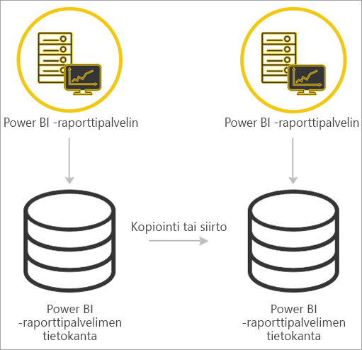

# <a name="migrate-a-report-server-installation"></a>Raporttipalvelimen asennuksen siirtäminen
Opi siirtämään aiemmin luotu SQL Server Reporting Services (SSRS) ‑esiintymä esiintymäksi Microsoft Power BI -raporttipalvelimelle.

Tässä yhteydessä siirtämisellä tarkoitetaan sovellusten datatiedostojen siirtämistä uuteen Power BI -raporttipalvelimen esiintymään. Seuraavassa on yleisiä syitä, miksi asennus saattaa olla tarpeen siirtää:

* Haluat vaihtaa SQL Server Reporting Services ‑palvelun käytöstä Power BI -raporttipalvelimeen.
  
  > [!NOTE]
  > SQL Server Reporting Services ‑palvelusta Power BI -raporttipalvelimeen vaihtavaa päivitystä ei ole saatavilla. Sitä varten on tehtävä siirtoprosessi.
  > 
  > 
* Edessäsi on suuren mittakaavan käyttöönotto tai päivitysvaatimukset.
* Olet uudistamassa asennuksen laitteiston tai topologian.
* Kohtaat ongelman, joka estää päivittämisen uudempaan versioon.

## <a name="migrating-to-power-bi-report-server-from-ssrs-native-mode"></a>Power BI-raporttipalvelimeen siirtyminen SSRS:stä (alkuperäistilassa)
Siirtyminen SSRS:n esiintymästä (alkuperäistilassa) Power BI -raporttipalvelimeen edellyttää muutamia vaiheita.


> [!NOTE]
> Siirtämiselle on tuki SQL Server 2008 Reporting Services ‑palvelusta ja sitä uudemmista versioista.
> 
> 

* Varmuuskopioi tietokanta, sovellus ja määritystiedostot.
* Varmuuskopioi salausavain.
* Kloonaa raporttipalvelintietokanta, jossa raportit ovat.
* Asenna Power BI -raporttipalvelin. Jos aiot käyttää samaa laitteistoa, voit asentaa Power BI -raporttipalvelimen samalle palvelimelle, jolla SSRS-esiintymä on. Katso lisätietoja Power BI -raporttipalvelimen asentamisesta artikkelista [Power BI -raporttipalvelimen asentaminen](install-report-server.md).

> [!NOTE]
> Power BI -raporttipalvelinesiintymän nimeksi tulee *PBIRS*.
> 
> 

* Määritä raporttipalvelin käyttämällä raporttipalvelimen Määritystenhallintaa, ja yhdistä raporttipalvelin kloonattuun tietokantaan.
* Tee alkuperäistilassa olevalle SSRS:n esiintymälle mahdollisesti tarvittavat puhdistustoimet.

## <a name="migration-to-power-bi-report-server-from-ssrs-sharepoint-integrated-mode"></a>Power BI-raporttipalvelimeen siirtyminen SSRS:stä (integroidussa SharePoint-tilassa)
Integroidussa SharePoint-tilassa olevasta SSRS:stä ei ole aivan niin yksinkertaista siirtyä Power BI -raporttipalvelimeen kuin alkuperäistilaisesta. Seuraavissa vaiheissa annetaan ohjeita siirtämiseen, mutta sinulla saattaa olla SharePointissa muitakin tiedostoja ja resursseja, joita sinun pitää hallita näiden ohjeiden lisäksi.


Sinun on siirrettävä SharePointista tietty raporttipalvelinsisältö Power BI -raporttipalvelimelle. Tässä oletetaan, että olet jo asentanut Power BI -raporttipalvelimen jonnekin ympäristöösi. Katso lisätietoja Power BI -raporttipalvelimen asentamisesta artikkelista [Power BI -raporttipalvelimen asentaminen](install-report-server.md).

Jos haluat kopioida raporttipalvelimen sisällön SharePoint-ympäristöstä Power BI -raporttipalvelimelle, sinun on käytettävä sisällön kopiointiin **rs.exe**-työkalun kaltaisia apuvälineitä. Alla on esimerkki siitä, miltä raporttipalvelimen sisällön kopiointiin SharePointista Power BI -raporttipalvelimelle tarvittava komentosarjaa voisi näyttää.

> [!NOTE]
> Esimerkkikomentosarjan pitäisi toimia, jos käytössä on SharePoint 2010 tai uudempi versio sekä SQL Server 2008 Reporting Services tai uudempi versio.
> 
> 

### <a name="sample-script"></a>Esimerkki komentosarjasta
```
Sample Script
rs.exe
-i ssrs_migration.rss -e Mgmt2010
-s http://SourceServer/_vti_bin/reportserver
-v st="sites/bi" -v f="Shared Documents“
-u Domain\User1 -p Password
-v ts=http://TargetServer/reportserver
-v tu="Domain\User" -v tp="Password"
```

## <a name="migrateing-from-one-power-bi-report-server-to-another"></a>Siirtyminen Power BI -raporttipalvelimesta toiseen
Siirtyminen yhdeltä Power BI -raporttipalvelimelta toiselle noudattaa samaa menetelmää kuin siirtyminen alkuperäistilassa olevasta SSRS:stä.



* Varmuuskopioi tietokanta, sovellus ja määritystiedostot.
* Varmuuskopioi salausavain.
* Kloonaa raporttipalvelintietokanta, jossa raportit ovat.
* Asenna Power BI -raporttipalvelin. *Et voi* asentaa Power BI -raporttipalvelinta samalle palvelimelle, jolta olet siirtämässä asennusta pois. Katso lisätietoja Power BI -raporttipalvelimen asentamisesta artikkelista [Power BI -raporttipalvelimen asentaminen](install-report-server.md).

> [!NOTE]
> Power BI -raporttipalvelinesiintymän nimeksi tulee *PBIRS*.
> 
> 

* Määritä raporttipalvelin käyttämällä raporttipalvelimen Määritystenhallintaa, ja yhdistä raporttipalvelin kloonattuun tietokantaan.
* Tee vanhalle Power BI -raporttipalvelimen esiintymälle mahdollisesti tarvittavat puhdistustoimet.

## <a name="next-steps"></a>Seuraavat vaiheet
[Järjestelmänvalvojan yleiskatsaus](admin-handbook-overview.md)  
[Power BI -raporttipalvelimen asentaminen](install-report-server.md)  
[Komentosarjojen luominen rs.exe-apuohjelmaa ja verkkopalvelua käyttämällä](https://docs.microsoft.com/sql/reporting-services/tools/script-with-the-rs-exe-utility-and-the-web-service)

Onko sinulla kysyttävää? [Voit esittää kysymyksiä Power BI -yhteisössä](https://community.powerbi.com/)

