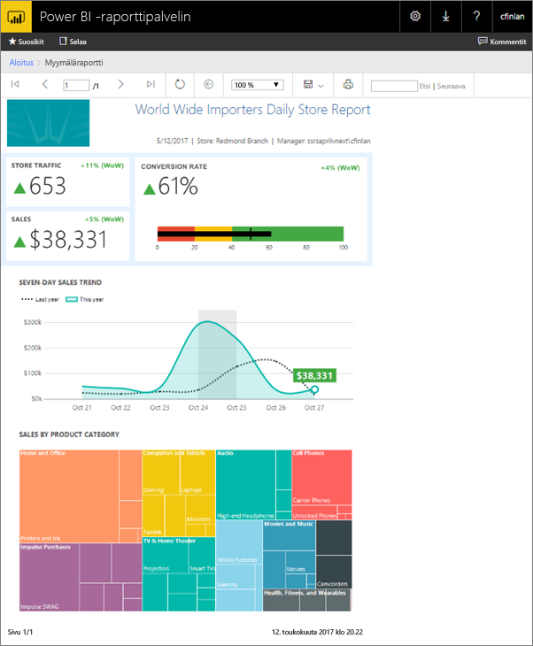
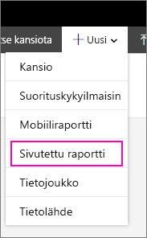
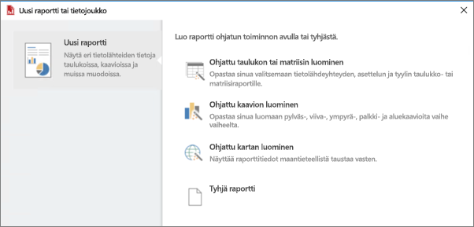
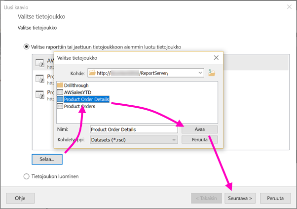
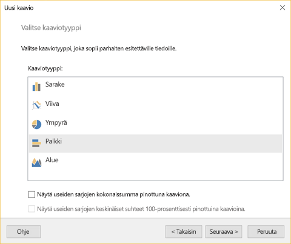
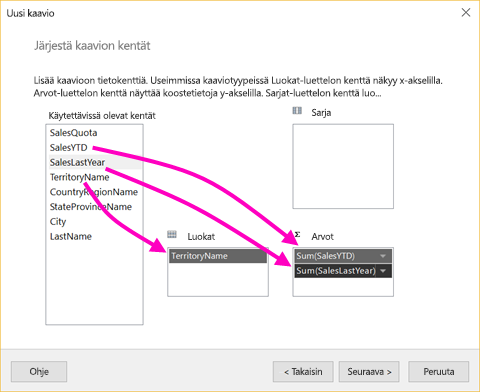
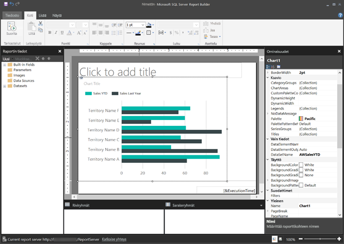
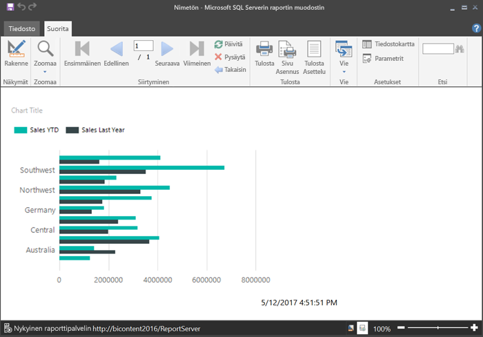
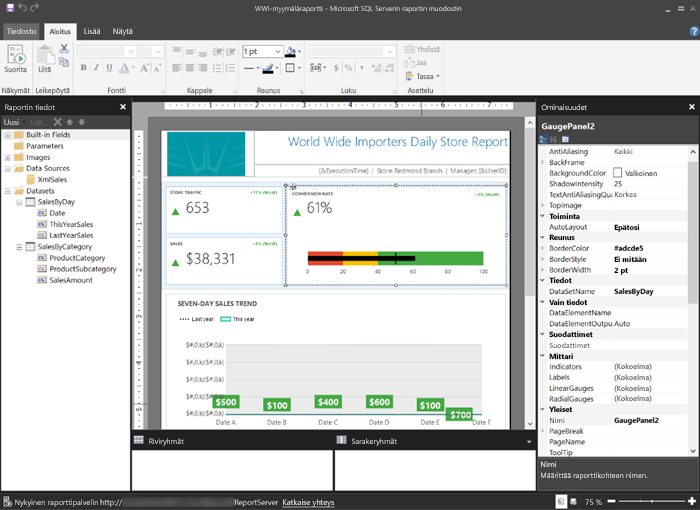

# Sivutetun raportin luominen Microsoft Power BI -raporttipalvelimeen
Nimensä mukaisesti sivutetuissa raporteissa voi olla useita sivuja. Niiden asettelu on kiinteässä muodossa ja ne tarjoavat tarkan mukautuksen. Sivutetut raportit ovat .rdl-tiedostoja.

Voit tallentaa ja käsitellä sivutettuja raportteja Power BI -raporttipalvelimen verkkoportaalissa, samalla tavalla kuin SQL Server Reporting Services (SSRS) -verkkoportaalissa. Voit luoda ja muokata niitä Raportin muodostimessa tai Raportin suunnitteluohjelmassa SQL Server Data Toolsissa (SSDT). Sen jälkeen voit julkaista ne jommankumman verkkoportaalin kautta. Raportin lukijat organisaatiossasi voivat tarkastella niitä selaimessa tai Power BI -mobiilisovelluksessa mobiililaitteillaan.

Jos olet jo luonut sivutettuja raportteja Raportin muodostimessa tai Raportin suunnitteluohjelmassa, niin osaat myös luoda sivutettuja raportteja Power BI -raporttipalvelimelle. Jos et ole, niin seuraavassa on muutamia nopea ohjeita, joiden avulla pääset alkuun.

## Vaihe 1: Asenna ja käynnistä Raportin muodostin
Olet ehkä jo asentanut Raportin muodostimen raporttien luomiseksi SSRS-palvelimelle. Voit käyttää samaa versiota tai Raportin muodostinta Power BI -raporttipalvelimen raporttien luomiseen. Jos et ole vielä asentanut sitä, prosessi on helppo.

1. Valitse Power BI -raporttipalvelimen verkkoportaalissa **Uusi** > **Sivutettu raportti**.
   
    
   
    Jos sinulla ei ole raportin muodostinta asennettuna, se opastaa sinut asennusprosessin läpi nyt.
2. Asennuksen jälkeen Raportin muodostin aukeaa **Uusi raportti tai tietojoukko** -näyttöön.
   
    
3. Valitse ohjattu toiminto sille raporttityypille, jonka haluat luoda:
   
   * Taulukko tai matriisi
   * Kaavio
   * Kartta
   * Tyhjä
4. Aloitetaan ohjatulla kaavion luomisella.
   
    Ohjattu kaavion luominen johdattaa sinut raportin peruskaavion luomisen läpi. Sen jälkeen voit mukauttaa raporttia lähes rajattomasti.

## Vaihe 2: Käy läpi ohjattu kaavion luominen
Ohjattu kaavion luominen johdattaa sinut raportin visualisoinnin luomisen perusvaiheiden läpi.

Sivutetut raportit voidaan yhdistää moniin eri tietolähteisiin, Microsoft SQL Serveristä ja Microsoft Azure SQL -tietokannasta Oracleen, Hyperioniin ja moneen muuhun. Lisätietoja [sivutettujen raporttien tukemista tietolähteistä](connect-data-sources.md).

Ollessasi ohjatun kaavion luomisen ensimmäisellä sivulla **Valitse tietojoukko**, jolloin voit luoda tietojoukon tai valita jaetun tietojoukon palvelimelta. *Tietojoukot* palauttavat raporttitiedot ulkoiselle tietolähteelle tehdystä kyselystä.

1. Valitse **Selaa** > valitse jaettu tietojoukko palvelimelta > **Avaa** > **Seuraava**.
   
    
   
     Tietojoukon luominen Katso [Jaetun tai upotetun tietojoukon luominen](https://docs.microsoft.com/sql/reporting-services/report-data/create-a-shared-dataset-or-embedded-dataset-report-builder-and-ssrs).
2. Valitse kaaviotyyppi – tässä tapauksessa palkkikaavio.
   
    
3. Järjestä kenttiä vetämällä ne **Luokat**-, **Sarjat**- ja **Arvot**-ruutuihin.
   
    
4. Valitse **Seuraava** > **Valmis**.

## Vaihe 3: Suunnittele raportti
Nyt olet Raportin suunnittelunäkymässä. Huomaa, että tiedot ovat paikkamerkkitietoja, eivät sinun tietojasi.

* Jos haluat tarkastella tietojasi, valitse **Suorita**.
  
     
* Siirry takaisin Suunnittelunäkymään valitsemalla **Rakenne**.

Voit muokata juuri luomaasi kaaviota, muuttaa asettelua, arvoja, selitettä... eli lähes mitä tahansa.

Voit lisätä kaikenlaisia muita visualisointeja: mm. mittareita, taulukoita, matriiseja ja karttoja. Voit lisätä ylä- ja alatunnisteita useille sivuille. Katso [Raportin muodostimen opetusohjelmat](https://docs.microsoft.com/sql/reporting-services/report-builder-tutorials), jotta voit kokeilla niitä itse.

## Vaihe 4: Tallenna raportti raporttipalvelimelle
Kun raportti on valmis, tallenna se Power BI -raporttipalvelimelle.

1. Valitse **Tiedosto**-valikosta **Tallenna nimellä** ja tallenna se raporttipalvelimelle. 
2. Nyt voit tarkastella sitä selaimessa.
   
    

## Seuraavat vaiheet
Käytettävissä on useita hyviä resursseja raporttien suunnitteluun Raportin muodostimessa ja Raporttien suunnitteluohjelmassa SQL Server Data Toolsissa. Raportin muodostimen opetusohjelmat ovat hyvä paikka aloittaa.

* [Raportin muodostimen opetusohjelmat](https://docs.microsoft.com/sql/reporting-services/report-builder-tutorials)
* [Mikä on Power BI -raporttipalvelin?](get-started.md)  

Onko sinulla kysyttävää? [Voit esittää kysymyksiä Power BI -yhteisössä](https://community.powerbi.com/)

