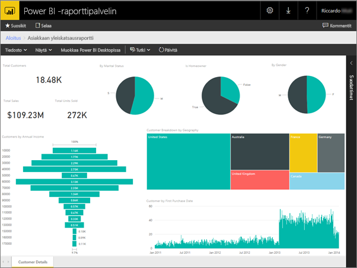
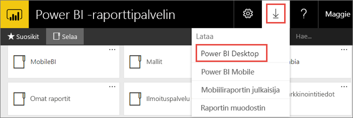
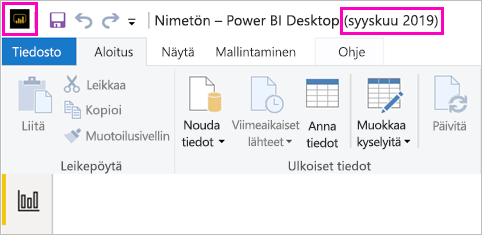
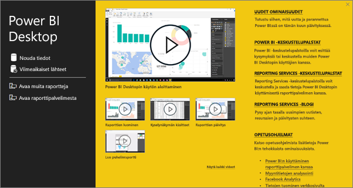
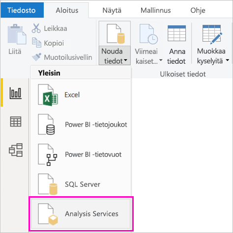
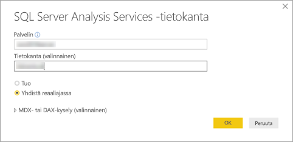
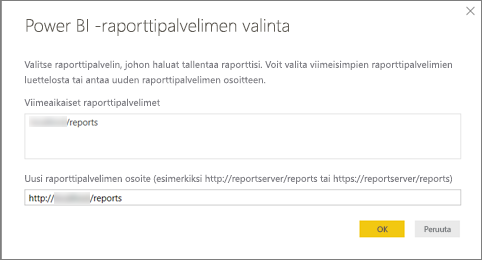
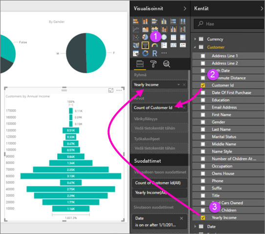
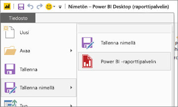

# Power BI -raportin luominen Power BI -raporttipalvelimeen
Voit tallentaa ja hallita Power BI -raportteja Power BI -raporttipalvelimen verkkoportaalissa paikallisesti samalla tavalla kuin voit tallentaa Power BI -raportteja pilveen Power BI -palvelussa (https://powerbi.com). Luo ja muokkaa raportteja Power BI Desktopissa ja julkaise ne verkkoportaalissa. Raportin lukijat organisaatiossasi voivat tarkastella niitä selaimessa tai Power BI -mobiilisovelluksessa mobiililaitteillaan.

Seuraavassa on muutamia nopea ohjeita, joiden avulla pääset alkuun.

## Vaihe 1: Asenna Power BI -raporttipalvelimelle optimoitu Power BI Desktop

Jos olet jo luonut Power BI -raportteja Power BI Desktopissa, olet melkein valmis luomaan Power BI -raportteja Power BI-raporttipalvelimeen. On suositeltavaa asentaa Power BI Desktopin optimoitu versio Power BI-raporttipalvelimelle, jotta tiedät, että palvelin ja sovellus ovat aina synkronoituina. Molemmat Power BI Desktop -versiot voivat olla samassa tietokoneessa.

1. Valitse raporttipalvelimen verkkoportaalissa **Lataa**-nuoli > **Power BI Desktop**.

    

    Voit myös siirtyä [Power BI -raporttipalvelin](https://powerbi.microsoft.com/report-server/) -aloitussivulle ja valita **Lataamisen lisäasetukset**.

2. Valitse Download Center -sivulla **Lataa**.

3. Tietokoneestasi riippuen valitse:

    - **PBIDesktopRS.msi** (32-bittinen versio) tai

    - **PBIDesktopRS_x64.msi** (64-bittinen versio).

4. Kun olet ladannut asennusohjelman, suorita Power BI Desktopin (syyskuu 2019) ohjattu asennus.

2. Asennuksen lopussa valitse **Käynnistä Power BI Desktop nyt**.
   
    Se käynnistyy automaattisesti ja on valmiina käyttöön. Tiedät, että sinulla on oikea versio, koska **Power BI Desktop (syyskuu 2019)** lukee otsikkorivillä.

    

3. Jos et ole tottunut käyttämään Power BI Desktopia, harkitse aloitusnäytön videoiden katselemista.
   
    

## Vaihe 2: Valitse tietolähde
Voit yhdistää useita eri tietolähteitä. Lue lisätietoja [yhdistämisestä tietolähteisiin](connect-data-sources.md).

1. Valitse aloitusnäytöstä **Nouda tiedot**.
   
    Valitse **Aloitus**-välilehdeltä **Nouda tiedot**.
2. Valitse tietolähde, tässä esimerkissä **Analysis Services**.
   
    
3. Täytä **Palvelin** ja valinnaisesti **Tietokanta**. Varmista, että **Connect live** on valittuna > **OK**.
   
    
4. Valitse raporttipalvelin, johon tallentaa raportit.
   
    

## Vaihe 3: Raportin suunnitteleminen
Tässä tulee hauska osuus: saat luoda visualisointeja, jotka kuvaavat tietojasi.

Voit esimerkiksi luoda suppilokaavion asiakkaiden ja ryhmien arvoista vuositulojen mukaan.

1. Valitse kohdasta **Visualisoinnit** **Suppilokaavio**.
2. Vedä laskettava kenttä kohtaan **Arvot**. Jos se ei ole numeerinen kenttä, Power BI Desktop laskee siitä automaattisesti *arvon*.
3. Vedä kenttä ryhmään kohdassa **Ryhmä**.

Lue lisätietoja [Power BI -raportin suunnittelemisesta](../desktop-report-view.md).

## Vaihe 4: Tallenna raportti raporttipalvelimeen
Kun raportti on valmis, tallenna se Power BI -raporttipalvelimelle, jonka valitsit vaiheessa 2.

1. Valitse **Tiedosto**-valikosta **Tallenna nimellä** > **Power BI Report Server**.
   
    
2. Nyt voit tarkastella sitä verkkoportaalissa.
   
    
    
> [!NOTE]
> Jos päätät muokata raporttia myöhemmin, työpöydällä näkyvät raporttitiedot ovat aina välimuistissa olevia tietoja, jotka on tallennettu raportin ensimmäisellä luontikerralla.  Jos haluat tarkastella uusimpia tietoja raportin muokkaamisen aikana, sinun on päivitettävä tiedot Power BI Desktop -sovelluksessasi.

## Seuraavat vaiheet
### Power BI Desktop
Power BI Desktop -raporttien luomiseen on olemassa runsaasti resursseja. Tämä linkki on hyvä aloituskohta.

* [Aloita Power BI Desktopin käyttö](../desktop-getting-started.md)
* Ohjattu oppiminen: [Tutustuminen Power BI Desktopiin](/learn/modules/get-data-power-bi/2-getting-started-power-bi-desktop)

### Power BI -raporttipalvelin
* [Asenna Power BI Desktop (optimoitu Power BI -raporttipalvelimelle)](install-powerbi-desktop.md)  
* [Mikä on Power BI -raporttipalvelin?](get-started.md)  

Onko sinulla kysyttävää? [Voit esittää kysymyksiä Power BI -yhteisössä](https://community.powerbi.com/)
