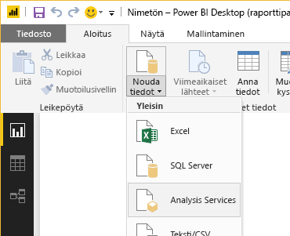

# Pikaopas: Power BI -raportin luominen Power BI -raporttipalvelimeen
Voit tallentaa ja hallita Power BI -raportteja Power BI -raporttipalvelimen verkkoportaalissa paikallisesti samalla tavalla kuin voit tallentaa Power BI -raportteja pilveen Power BI -palvelussa (https://powerbi.com). Luo ja muokkaa raportteja Power BI Desktopissa ja julkaise ne verkkoportaalissa. Raportin lukijat organisaatiossasi voivat tarkastella niitä selaimessa tai Power BI -mobiilisovelluksessa mobiililaitteillaan.

Seuraavassa on muutamia nopea ohjeita, joiden avulla pääset alkuun.

## Vaihe 1: Asenna Power BI -raporttipalvelimelle optimoitu Power BI Desktop

Jos olet jo luonut Power BI -raportteja Power BI Desktopissa, olet melkein valmis luomaan Power BI -raportteja Power BI-raporttipalvelimeen. On suositeltavaa asentaa Power BI Desktopin optimoitu versio Power BI-raporttipalvelimelle, jotta tiedät, että palvelin ja sovellus ovat aina synkronoituina. Molemmat Power BI Desktop -versiot voivat olla samassa tietokoneessa.

1. Valitse raporttipalvelimen verkkoportaalissa **Lataa**-nuoli > **Power BI Desktop**.

    

    Voit myös siirtyä suoraan kohtaan [Microsoft Power BI Desktop](https://www.microsoft.com/download/details.aspx?id=56723) (optimoitu Power BI -raporttipalvelimelle – maaliskuu 2018) Microsoft Download Centerissä.

2. Valitse Download Center -sivulla **Lataa**.

3. Tietokoneestasi riippuen valitse:

    - **PBIDesktopRS.msi** (32-bittinen versio) tai

    - **PBIDesktopRS_x64.msi** (64-bittinen versio).

4. Kun olet ladannut asennusohjelman, suorita Power BI Desktopin (maaliskuu 2018) ohjattu asennus.

2. Asennuksen lopussa valitse **Käynnistä Power BI Desktop nyt**.
   
    Se käynnistyy automaattisesti ja on valmiina käyttöön. Tiedät, että sinulla on oikea versio, koska ”Power BI Desktop (maaliskuu 2018)” lukee otsikkorivillä.

    

3. Jos et ole tottunut käyttämään Power BI Desktopia, harkitse aloitusnäytön videoiden katselemista.
   
    

## Vaihe 2: Valitse tietolähde
Voit yhdistää useita eri tietolähteitä. Lue lisätietoja [yhdistämisestä tietolähteisiin](connect-data-sources.md).

1. Valitse aloitusnäytöstä **Nouda tiedot**.
   
    Valitse **Aloitus**-välilehdeltä **Nouda tiedot**.
2. Valitse tietolähde, tässä esimerkissä **Analysis Services**.
   
    
3. Täytä **Palvelin** ja valinnaisesti **Tietokanta**. Varmista, että **Connect live** on valittuna > **OK**.
   
    
4. Valitse raporttipalvelin, johon tallentaa raportit.
   
    

## Vaihe 3: Suunnittele raportti
Tässä tulee hauska osa: Saat luoda visualisointeja, jotka kuvaavat tietojasi.

Voit esimerkiksi luoda suppilokaavion asiakkaiden ja ryhmien arvoista vuositulojen mukaan.

1. Valitse kohdasta **Visualisoinnit** **Suppilokaavio**.
2. Vedä laskettava kenttä kohtaan **Arvot**. Jos se ei ole numeerinen kenttä, Power BI Desktop laskee siitä automaattisesti *arvon*.
3. Vedä kenttä ryhmään kohdassa **Ryhmä**.

Lue lisätietoja [Power BI -raportin suunnittelemisesta](../desktop-report-view.md).

## Vaihe 4: Tallenna raportti raporttipalvelimelle
Kun raportti on valmis, tallenna se Power BI -raporttipalvelimelle, jonka valitsit vaiheessa 2.

1. Valitse **Tiedosto**-valikosta **Tallenna nimellä** > **Power BI Report Server**.
   
    
2. Nyt voit tarkastella sitä verkkoportaalissa.
   
    

## Huomioitavat asiat ja rajoitukset
Power BI -raporttipalvelimen ja Power BI -palvelun raportit (http://powerbi.com) toimivat lähes täsmälleen samoin, mutta jotkut ominaisuudet ovat erilaisia.

### Selaimessa
Power BI -raporttipalvelimen raportit tukevat kaikkia visualisointeja, mukaan luettuina seuraavat:

* Mukautetut visualisoinnit

Power BI -raporttipalvelimen raportit eivät tue seuraavia:

* R-visualisoinnit
* ArcGIS-kartat
* Navigointipolut
* Power BI Desktopin esikatselutoiminnot

### Power BI -mobiilisovelluksissa
Power BI -raporttipalvelimen raportit tukevat [Power BI -mobiilisovellusten](../mobile-apps-for-mobile-devices.md) kaikkia tavallisia toimintoja, mukaan luettuina seuraavat:

* [Puhelimen raporttiasettelu](../desktop-create-phone-report.md): voit optimoida raportin Power BI -mobiilisovelluksia silmällä pitäen. Optimoiduilla raporteilla on matkapuhelimessa erityinen kuvake, , sekä asettelu.
  
    

Power BI -raporttipalvelimen raportit eivät tue näitä ominaisuuksia Power BI -mobiilisovelluksissa:

* R-visualisoinnit
* ArcGIS-kartat
* Mukautetut visualisoinnit
* Navigointipolut
* Geo-suodatus tai viivakoodit

## Seuraavat vaiheet
### Power BI Desktop
Power BI Desktop -raporttien luomiseen on olemassa runsaasti resursseja. Nämä linkit ovat hyvä kohta aloittaa.

* [Aloita Power BI Desktopin käyttö](../desktop-getting-started.md)
* Ohjattu oppiminen: [Power BI Desktopin käytön aloittaminen](../guided-learning/gettingdata.yml#step-2)

### Power BI -raporttipalvelin
* [Asenna Power BI Desktop (optimoitu Power BI -raporttipalvelimelle)](install-powerbi-desktop.md)  
* [Power BI -raporttipalvelimen käyttöopas](user-handbook-overview.md)  

Onko sinulla muuta kysyttävää? [Voit esittää kysymyksiä Power BI -yhteisössä](https://community.powerbi.com/)
