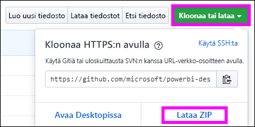

# <a name="quickstart-embed-a-power-bi-report-server-report-using-an-iframe-in-sharepoint-server"></a>Pikaopas: Power BI -raporttipalvelimen raportin upottaminen iFramella SharePoint-palvelimessa

Tässä pikaoppaassa opit upottamaan Power BI -raporttipalvelimen raportin iFramella SharePoint-sivuun. Jos käytät SharePoint Onlinea, Power BI -raporttipalvelimen on oltava julkisesti käytettävissä. SharePoint Onlinessa Power BI:n verkko-osa, joka toimii Power BI -palvelun kanssa, ei toimi Power BI -raporttipalvelimen kanssa. 


## <a name="prerequisites"></a>Edellytykset
* Sinulla on oltava [Power BI -raporttipalvelin](https://powerbi.microsoft.com/report-server/) asennettuna ja määritettynä.
* Sinulla on oltava asennettuna [Power BI -raporttipalvelimelle optimoitu Power BI Desktop](install-powerbi-desktop.md).
* Sinulla on oltava [SharePoint](https://docs.microsoft.com/sharepoint/install/install)-ympäristö asennettuna ja määritettynä.

## <a name="creating-the-power-bi-report-server-report-url"></a>Power BI -raporttipalvelimen raportin URL-osoitteen luominen

1. Lataa malli GitHubista – [blogiesittely](https://github.com/Microsoft/powerbi-desktop-samples).

    

2. Avaa PBIX-mallitiedosto GitHubista **Power BI -raporttipalvelimelle optimoidussa Power BI Desktopissa**.

    

3. Tallenna raportti **Power BI -raporttipalvelimeen**. 

    

4. Tarkastele raporttia **verkkoportaalissa**.

    

### <a name="capturing-the-url-parameter"></a>URL-parametrin sieppaaminen

Kun sinulla on URL-osoite, voit luoda SharePoint-sivulla iFramen, jonka sisällä raportti isännöidään. Voit lisätä mitä tahansa Power BI -raporttipalvelimen raportin URL-osoitetta varten querystring-parametrin `?rs:embed=true` upottaaksesi raportin iFrameen. 

   Esimerkki:
    ``` 
    http://myserver/reports/powerbi/Sales?rs:embed=true
    ```
## <a name="embedding-a-power-bi-report-server-report-in-a-sharepoint-iframe"></a>Power BI -raporttipalvelimen raportin upottaminen iFrameen SharePointissa

1. Siirry SharePointin **Sivuston sisältö** -sivulle.

    

2. Valitse sivu, johon haluat lisätä raporttiin.

    

3. Valitse hammasrataskuvake ylimpänä oikealla ja valitse **Muokkaa sivua**.

    

4. Valitse **Lisää verkko-osa**.

    

5. Valitse **Luokat**-kohdasta **Media ja sisältö**, valitse **Osat**-kohdasta **Sisällön muokkaus**, ja valitse sitten **Lisää** .

     

6. Valitse **Lisää uutta sisältöä napsauttamalla tästä**.

    

7. Valitse valintanauhasta **Muotoile tekstiä** -välilehti ja valitse sitten **Muokkaa lähdettä**.

     

8. Liitä iFrame-koodi Muokkaa lähdettä -ikkunaan ja valitse OK.

    

     Esimerkki:
     ```html
     <iframe width="800" height="600" src="http://myserver/reports/powerbi/Sales?rs:embed=true" frameborder="0" allowFullScreen="true"></iframe>
     ```

9. Valitse valintanauhasta **Sivu**-välilehti ja valitse **Lopeta muokkaaminen**.

    

10. Raportin pitäisi nyt näkyä sivulla.

    

## <a name="next-steps"></a>Seuraavat vaiheet

[Pika-aloitus: Power BI -raportin luominen Power BI -raporttipalvelimeen](quickstart-create-powerbi-report.md)  
[Pika-aloitus: Sivutetun raportin luominen Power BI -raporttipalvelimeen](quickstart-create-paginated-report.md)  

Onko sinulla kysyttävää? [Voit esittää kysymyksiä Power BI -yhteisössä](https://community.powerbi.com/) 