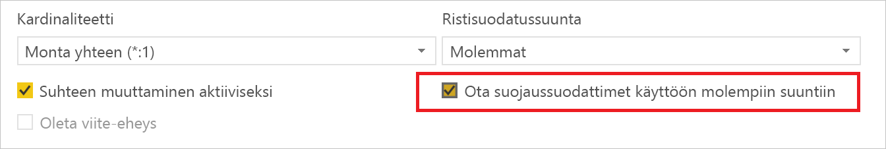
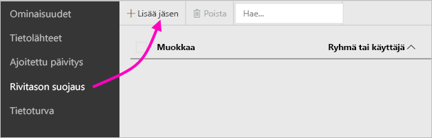
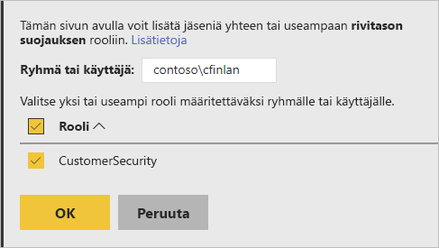
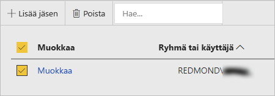

# Rivitason suojaus (RLS) Power BI -raporttipalvelimessa

Tietojen käyttöä voidaan Power BI -raporttipalvelimessa rajoittaa tietyille käyttäjille määrittämällä rivitason suojaus (RLS). Suodattimet rajoittavat tietojen käyttöä rivitasolla ja voit määrittää roolien sisäisiä suodattimia.  Jos käytät Power BI -raporttipalvelimessa oletuskäyttöoikeuksia, kaikki käyttäjät, joilla on Power BI -raportin julkaisu- tai sisällönhallintaoikeudet, voivat määrittää käyttäjille raporttia koskevia rooleja.    

Voit määrittää rivitason suojauksen raporteille, jotka on tuotu Power BI:hin Power BI Desktopin avulla. Voit määrittää rivitason suojauksen myös raporteille, joissa käytetään DirectQueryä, kuten SQL Serveriä.  Huomioi, että rivitason suojausta ei käytetä, jos DirectQuery-yhteytesi käyttää raportin lukijoiden integroitua todentamista. Analysis Servicesin reaaliaikaisille yhteyksille rivitason suojaus määritetään paikallisessa mallissa. Tätä suojausvaihtoehtoa ei näy reaaliaikaisen yhteyden tietojoukoille. 

[!INCLUDE [rls-desktop-define-roles](../includes/rls-desktop-define-roles.md)]

## Kaksisuuntainen ristiinsuodatus

Oletuksena rivitason suojauksen suodatuksessa käytetään yksisuuntaisia suodattimia riippumatta siitä, onko suhteet määritetty yksi- vai kaksisuuntaisiksi. Voit ottaa rivitason suojauksessa kaksisuuntaisen ristiinsuodatuksen käyttöön manuaalisesti.

- Valitse suhde ja sitten **Ota suojaussuodattimet käyttöön molempiin suuntiin** -valintaruutu. 

    

Valitse tämä ruutu, jos otat käyttöön käyttäjänimeen tai kirjautumistunnukseen perustuvan [dynaamisen rivitason suojauksen](https://docs.microsoft.com/analysis-services/tutorial-tabular-1200/supplemental-lesson-implement-dynamic-security-by-using-row-filters). 

Lisätietoja on artikkelissa [Kaksisuuntainen ristiinsuodatus käyttämällä DirectQueryä Power BI Desktopissa](../desktop-bidirectional-filtering.md) ja teknisessä raportissa [Taulukkomuotoisen liiketoimintatietojen semanttisen mallin suojaaminen](http://download.microsoft.com/download/D/2/0/D20E1C5F-72EA-4505-9F26-FEF9550EFD44/Securing%20the%20Tabular%20BI%20Semantic%20Model.docx).

[!INCLUDE [rls-desktop-view-as-roles](../includes/rls-desktop-view-as-roles.md)]

## Roolien lisääminen jäsenille 

Kun olet tallentanut raportin Power BI -raporttipalvelimeen, voit määrittää suojauksen ja lisätä tai poistaa jäseniä palvelimessa. Rivitason suojaus on käytettävissä ainoastaan niiden käyttäjien kohdalla, joilla on raporttiin joko julkaisu- tai sisällönhallintaoikeudet. Muiden käyttäjien kohdalla vaihtoehto näkyy harmaana.

 Jos raportissa ei ole tarvittavia rooleja, sinun on avattava raportti Power BI Desktopissa, lisättävä tai muokattava rooleja siellä ja tallennettava raportti sitten uudelleen Power BI -raporttipalvelimeen. 

1. Tallenna raportti Power BI Desktopissa Power BI -raporttipalvelimeen. Sinulla on käytettävä Power BI -raporttipalvelimelle optimoitua Power BI Desktop -versiota.
2. Valitse Power BI -raporttipalvelussa raportin vieressä oleva kolmen pisteen kuvake ( **…** ). 

3. Valitse **hallinta** > **Rivitason suojaus**. 

     

    **Rivitason suojaus** -sivulla voit lisätä jäseniä rooliin, jonka loit Power BI Desktopissa.

5. Lisää jäsen valitsemalla **Lisää jäsen**.

1. Lisää käyttäjä tai ryhmä tekstiruutuun Käyttäjänimi-muodossa (TOIMIALUE\käyttäjä) ja valitse roolit, jotka haluat käyttäjälle antaa. Jäsenen on kuuluttava organisaatioosi.   

    

    Active Directoryn määrityksestä riippuen myös täydellisen käyttäjätunnuksen kirjoittaminen voi toimia. Jos näin on, raporttipalvelin näyttää luettelossa tunnusta vastaavan käyttäjänimen.

1. Ota asetukset käyttöön napsauttamalla **OK**.   

8. Jos haluat poistaa jäseniä, valitse jäsenen nimen vieressä oleva ruutu ja sitten **Poista**.  Voit poistaa useita jäseniä kerrallaan. 

    

## username() ja userprincipalname()

Voit hyödyntää tietojoukossa DAX-funktioita username() tai userprincipalname(). Niitä voi käyttää lausekkeissa Power BI Desktopissa. Kun julkaiset mallin, Power BI -raporttipalvelin käyttää niitä.

Power BI Desktopissa username() palauttaa käyttäjän muodossa TOIMIALUE\Käyttäjä ja userprincipalname() muodossa user@contoso.com.

Power BI -raporttipalvelimessa sekä username() että userprincipalname() palauttavat käyttäjän täydellisen käyttäjätunnuksen (UPN), joka näyttää sähköpostiosoitteelta.

Jos käytät Power BI -raporttipalvelimessa mukautettua todentamista, funktiot palauttavat käyttäjänimen siinä muodossa, jonka olet määrittänyt käyttäjille.  

## Rajoitukset 

Seuraavassa on luettelo Power BI -mallien rivitason suojauksen tämänhetkisistä rajoituksista. 

Käyttäjät, joiden raporteissa käytettiin username()-DAX-funktiota, huomaavat funktion uuden toimintatavan, jossa funktio palauttaa täydellisen käyttäjätunnuksen PAITSI JOS DirectQuerya käytetään yhdessä integroidun suojauksen kanssa.  Koska rivitason suojaus ei kyseisessä skenaariossa päde, skenaarioon ei tule muutoksia.

Voit määrittää rivitason suojauksen vain tietojoukoille, jotka on luotu Power BI Desktopin avulla. Jos haluat ottaa rivitason suojauksen käyttöön tietojoukoille, jotka on luotu Excelin avulla, sinun on ensin muunnettava tiedostosi Power BI Desktop (PBIX) -tiedostoiksi. Lue lisätietoja artikkelista [Excel-tiedostojen muuntaminen](../desktop-import-excel-workbooks.md).

Toiminto tukee ainoastaan keräämistä, muuntamista ja lataamista (ETL) sekä DirectQuery-yhteyksiä, joissa käytetään tallennettuja tunnistetietoja. Analysis Servicesiin muodostettavat reaaliaikaiset yhteydet ja DirectQuery-yhteydet, joissa käytetään integroitua todentamista, käsitellään pohjana olevassa tietolähteessä. 

Jos käytät DirectQueryssä integroitua suojausta, käyttäjät voivat huomata seuraavia asioita:
- Rivitason suojaus on poistettu käytöstä ja kaikki tiedot palautetaan.
- Käyttäjät eivät voi päivittää roolimäärityksiään ja saavat virheilmoituksen rivitason suojauksen hallintasivulla.
- username-DAX-funktio palauttaa edelleen käyttäjänimen muodossa TOIMIALUE\KÄYTTÄJÄ. 

Raporttien tekijöillä ei ole raporttitietojen tarkasteluoikeutta Power BI -raporttipalvelimessa, elleivät he määritä itselleen sopivia rooleja raportin lataamisen jälkeen. 

 

## Usein kysytyt kysymykset 

### Voinko luoda nämä roolit Analysis Services -tietolähteille? 

Voit, jos tiedot on tuotu Power BI Desktopiin. Jos käytät reaaliaikaista yhteyttä, et pysty määrittämään rivitason suojausta Power BI -palvelun sisällä. Se määritetään Analysis Services -mallissa paikallisesti. 

### Voinko käyttää rivitason suojausta rajoittamaan käyttäjien käytössä olevia sarakkeita tai mittareita? 

Ei. Jos käyttäjällä on tietyn tietorivin käyttöoikeus, hän voi nähdä kaikki kyseisen rivin tietosarakkeet. 

### Salliiko rivitason suojaus tarkkojen tietojen piilottamisen ja samalla visualisoinneissa olevien yhteenvetotietojen käytön? 

Ei, voit suojata yksittäisiä tietorivejä, mutta käyttäjät voivat aina nähdä tarkat tiedot tai yhteenvetotiedot. 

### Voinko lisätä uusia rooleja Power BI Desktopissa, jos olen jo määrittänyt rooleja ja jäseniä? 

Kyllä voit. Jos olet jo määrittänyt rooleja ja jäseniä Power BI -raporttipalvelimessa, voit luoda lisää rooleja ja julkaista raportin uudelleen muuttamatta aiempia määrityksiä. 
 

## Seuraavat vaiheet

[Mikä onPower BI -raporttipalvelin?](get-started.md) 
[Järjestelmänvalvojien opas](admin-handbook-overview.md)  

Onko sinulla kysyttävää? [Voit esittää kysymyksiä Power BI -yhteisössä](https://community.powerbi.com/)
