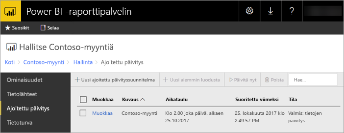

# Power BI -raportin ajoitettu päivitys Power BI -raporttipalvelimessa
Power BI -raporttien ajoitetun päivityksen avulla raportin tiedot pysyvät ajan tasalla.

Ajoitettu päivitys on tarkoitettu nimenomaan niille Power BI -raporteille, jotka käyttävät upotettua mallia. Mikä tarkoittaa, että raporttiin on tuotu tietoja reaaliaikaisen yhteyden tai DirectQuery käyttämisen sijasta. Yhteys alkuperäiseen tietolähteeseen katkeaa tietoja tuotaessa ja tiedot tarvitsee päivittää, jotta ne pysyvät ajan tasalla. Ajoitettu päivitys pitää tietosi ajan tasalla.

Ajoitettu päivitys asetetaan raportin hallintaosiosta. Saadaksesi lisätietoja ajoitetun päivityksen asettamisesta, katso [Power BI -raportin ajoitetun päivityksen asettaminen](configure-scheduled-refresh.md).

## Miten se toimii
Power BI -raporttien ajoitetun päivityksen käyttöön liittyy useita eri osia.

* SQL Server -agentti toimii ajoitettujen tapahtumien ajastimena.
* Ajoitetut työt lisätään tapahtumajonoon ja ilmoitukset raporttipalvelintietokantaan. Skaalauskäyttöönotossa jono jaetaan kaikkien käytössä olevien raporttipalvelinten kanssa.
* Kaikki raporttien käsittely, joka tapahtuu ajoitetun tapahtuman myötä, toteutetaan taustaprosesseina.
* Tietomalli ladataan Analysis Services -esiintymään.
* Jotkin tietolähteet käyttävät Power Queryn -koostemoduulia muodostaessaan yhteyttä tietolähteisiin ja tietoja siirtäessään. Toiset tietolähteet voivat olla suoraan yhteydessä Analysis Services -palvelimeen, jotka ylläpitävät Power BI -raporttipalvelimen tietomalleja.
* Uudet tiedot ladataan tietomalliin Analysis Services -palvelimessa.
* Skaalaus kokoonpanossa tietomallin voidaan jäljentää alueelta solmut.
* Analysis Services prosessoi tietoja ja suorittaa tarvittavat laskutoimitukset.

Power BI -raporttipalvelin ylläpitää tapahtumajonoa kaikista ajoitetuista toiminnoista. Uudet tapahtumat tarkistetaan säännöllisesti jonon kyselyllä. Jono tarkistetaan oletuksena kymmenen sekunnin välein. Voit muuttaa aikaväliä muokkaamalla **PollingInterval**, **IsNotificationService** ja **IsEventService** -asetuksia RSReportServer.config -tiedostossa. **IsDataModelRefreshService** -asetuksen avulla voidaan myös määrittää, käsitteleekö raporttipalvelu ajoitettuja tapahtumia.

### Analysis Services
Power BI -raportin hahmontaminen, kuten myös ajoitetun päivityksen suorittaminen, edellyttää Power BI -raportin tietomallin latausta Analysis Services -palvelimelle. Analysis Services -prosessi on käynnissä Power BI -raporttipalvelimen kanssa.

## Huomioitavat asiat ja rajoitukset
### Milloin ajoitettua päivitystä ei voida käyttää
Kaikille Power BI -raporteille ei voi luoda ajoitettua päivitysmallia. Seuraavassa on listattu sellaiset Power BI -raportit, joille ei voi luoda ajoitettua päivitysmallia.

* Raportti sisältää yhden tai useamman Analysis Services -tietolähteen, joka käyttää reaaliaikaista yhteyttä.
* Raportti sisältää yhden tai useamman tietolähteen, joka käyttää DirectQueryä.
* Raportti ei sisällä yhtään tietolähdettä. Tiedot on syötetty joko manuaalisesti *Syötä tiedot* -ominaisuuden avulla tai raportti sisältää vain staattista sisältöä, kuten kuvia, tekstiä, jne.

Edellä kuvatun listan lisäksi on olemassa tiettyjä tilanteita, joissa tietolähteet ovat *vienti*-tilassa, jolloin päivitysmallien luonti ei ole mahdollista.

* Jos tietolähteenä käytetään *Tiedostoa* tai *Kansiota*, jolla on paikallinen polku (esim. C:\Käyttäjät\käyttäjä\Tiedostot), päivitysmallin luonti ei ole mahdollista. Polun on oltava sellainen, johon raporttipalvelin voi muodostaa yhteyden, kuten jaettu verkkoresurssi. Esimerkiksi *\\omaresurssi\Tiedostot*.
* Jos tietolähteeseen voi muodostaa yhteyden vain OAuth:ia käyttämällä (esim. Facebook, Google, Analytics, Salesforce, jne.), ei välimuistin päivitysmallin luominen ole mahdollista. RS ei tällä hetkellä tue OAuth-todentamista millekään tietolähteelle, oli se sitten sivutettu, mobiili tai Power BI -raportti.

### Muistirajoitukset
Raporttipalvelimen perinteinen kuormitus on ollut saman suuruinen verkkosovelluksen kanssa. Raporttien lataaminen tuoduista tiedoista tai DirectQuerystä ja ajoitettujen päivitysten suorittaminen ovat riippuvaisia Analysis Services esiintymistä, joita isännöidään samanaikaisesti raporttipalvelimella. Tämä saattaa johtaa siihen, että palvelimen muisti saattaa äkillisesti loppua. Palvelinten käyttö tulee suunnitella niin, että myös Analysis Services -prosessit voivat kuluttaa muistia raporttipalvelimen rinnalla.

Lisätietoja Analysis Services -esiintymän seurannasta on kohdassa [Analysis Services -esiintymän seuranta](https://docs.microsoft.com/sql/analysis-services/instances/monitor-an-analysis-services-instance).

Katso Analysis Services -muistiasetuksia koskevia tietoja kohdasta [Muistin ominaisuudet](https://docs.microsoft.com/sql/analysis-services/server-properties/memory-properties).

## Seuraavat vaiheet
Power BI -raportin [ajoitetun päivityksen](configure-scheduled-refresh.md) määrittäminen.

Onko sinulla kysyttävää? [Voit esittää kysymyksiä Power BI -yhteisössä](https://community.powerbi.com/)

