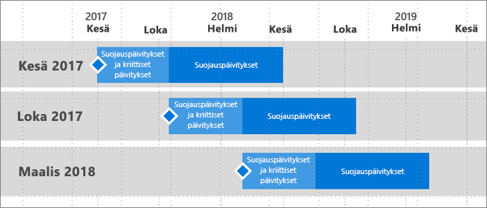

# Power BI -raporttipalvelimen tuen aikajana
Power BI -raporttipalvelimen versioita julkaistaan muutaman kerran vuodessa. Tietoturvapäivityksiä ja tärkeitä päivityksiä on saatavilla, kunnes seuraava versio tulee yleiseen jakeluun. Seuraavan version julkaisemisen jälkeen edelliseen versioon julkaistaan tietoturvapäivityksiä version 12 kuukauden elinkaaren loppuosan ajan.

Tämän tukikäytännön ansiosta voimme tarjota asiakkaillemme uusia innovaatioita nopealla tahdilla siten, että asiakkaat voivat ottaa niitä käyttöön joustavasti omassa aikataulussaan.

* Tietoturvapäivitysten ja tärkeiden päivitysten palvelujakso: kun käytössäsi on Power BI -raporttipalvelimen uusin nykyinen versio, saat sekä tietoturvapäivitykset että tärkeät päivitykset.
* Tietoturvapäivitysten (ainoastaan) palvelujakso: kun uusi versio on julkaistu, vanhempien versioiden tuki rajataan ainoastaan tietoturvapäivityksiin versioiden 12 kuukauden elinkaaren loppuosan ajaksi (kuva 1).

    

## Versiohistoria
| **Versio** | **Julkaisupäivä** | **Tuen päättymispäivä** |
| --- | --- | --- |
| Kesäkuu 2017 |12. kesäkuuta 2017 |12. kesäkuuta 2018 |
| Lokakuu 2017 |31. lokakuuta 2017 |31. lokakuuta 2018 |
| Maaliskuu 2018 | 19. maaliskuuta 2018 | 19. maaliskuuta 2019 |

Lataa Power BI -raporttipalvelin ja Power BI -raporttipalvelimelle optimoitu Power BI Desktop tutustumalla ohjeaiheeseen [Paikallinen raportointi Power BI -raporttipalvelimella](https://powerbi.microsoft.com/report-server/).

## Seuraavat vaiheet
[Power BI -raporttipalvelinten uudet ominaisuudet](whats-new.md)  
[Käyttöopas](user-handbook-overview.md)  
[Järjestelmänvalvojien opas](admin-handbook-overview.md)  
[Pikaopas: Power BI -raporttipalvelimen asentaminen](quickstart-install-report-server.md)  

Onko sinulla muuta kysyttävää? [Voit esittää kysymyksiä Power BI -yhteisössä](https://community.powerbi.com/)

