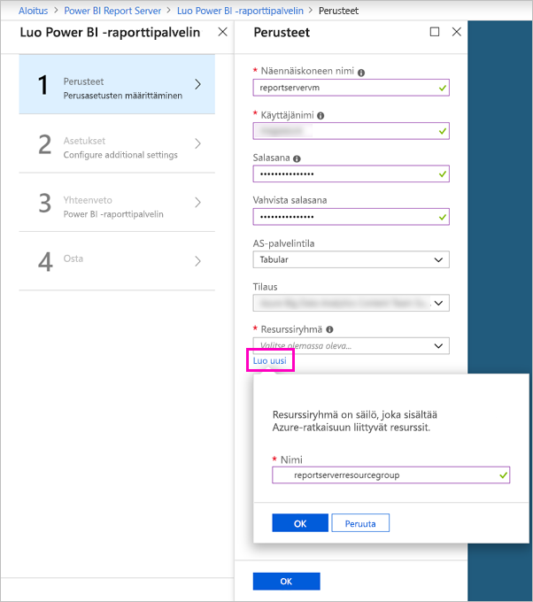
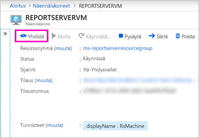

# Opetusohjelma: Power BI -raporttipalvelimen verkkoportaaliin tutustuminen näennäiskoneella
Tässä opetusohjelmassa luot Azure-virtuaalikoneen Power BI -raporttipalvelimen ollessa jo asennettu, jotta voit tutustua Power BI- ja sivutettujen näyteraporttien ja suorituskykyilmaisimien tarkasteluun, muokkaamiseen ja hallintaan.

Tässä opetusohjelmassa suoritettavat tehtävät:

> [!div class="checklist"]
> * Näennäiskoneen luominen ja siihen yhdistäminen
> * Power BI -raporttipalvelimen verkkoportaaliin tutustuminen
> * Suosikkikohteen merkitseminen tunnisteella
> * Power BI -raportin tarkastelu ja muokkaaminen
> * Sivutetun raportin tarkastelu, hallinta ja muokkaaminen
> * Excel-työkirjan tarkastelu Excel Onlinessa

Tämä opetusohjelma edellyttää, että sinulla on Azure-tilaus. Jos sinulla ei ole tilausta, [luo ilmainen tili](https://azure.microsoft.com/free/?WT.mc_id=A261C142F) ennen aloittamista.

## Power BI -raporttipalvelimen näennäiskoneen luominen

Power BI -tiimi on onneksi luonut näennäiskoneen, johon Power BI -raporttipalvelin on jo asennettu.

1. Avaa [Power BI -raporttipalvelin](https://azuremarketplace.microsoft.com/marketplace/apps/reportingservices.technical-preview?tab=Overview) Azure Marketplacessa.  

2. Valitse **Hanki se nyt**.
3. Hyväksy tarjoajan käyttöehdot ja tietosuojakäytäntö valitsemalla **Jatka**.

    

4. Kirjoita **Vaihe 1 Perusteet** -kohdassa **Näennäiskoneen nimi** -kentän arvoksi **reportservervm**.

5. Luo käyttäjänimi ja salasana.

6. Säilytä **Resurssiryhmä**-kohdan **Luo uusi** -valinta ja anna sen nimeksi **reportserverresourcegroup**.

    Jos seuraat opetusohjelmaa useamman kuin yhden kerran, sinun on annettava resurssiryhmälle eri nimi ensimmäisen kerran jälkeen. Et voi käyttää resurssiryhmän nimeä kahdesti samassa tilauksessa. 

7. Säilytä muut oletusarvot > **OK**.

    

8. Säilytä **Vaihe 2 Asetukset** -kohdan oletusasetukset > **OK**.

9. **Vaihe 3 Yhteenveto** > **OK**.

10. Tarkista **Vaihe 4** -kohdassa käyttöehdot ja tietosuojakäytäntö > **Luo**.

    **Käyttöönottoa lähetetään Power BI -raporttipalvelimeen** -käsittely kestää muutamia minuutteja.

## Muodosta yhteys näennäiskoneeseen

1. Valitse Azuren vasemmasta siirtymisruudusta **Näennäiskoneet**. 

2. Kirjoita **Suodata nimen mukaan** -ruutuun ”raportti”. 

3. Valitse näennäiskone, jonka nimi on **REPORTSERVERVM**.

    

4. Valitse REPORTSERVERVM-näennäiskoneen kohdalta **Yhdistä**.

    

5. Valitse Etätyöpöytäyhteys-valintaikkunasta **Yhdistä**.

6. Anna näennäiskonetta varten luomasi käyttäjänimi ja salasana > **OK**.

7. Seuraavassa valintaikkunassa ilmoitetaan, että etätietokonetta ei tunnisteta. Valitse **Kyllä**.

   Uusi näennäiskone avautuu.

## Power BI -raporttipalvelin näennäiskoneella

Kun näennäiskone avautuu, näet työpöydällä seuraavat kohteet.

|Luku  |Merkitys  |
|---------|---------|
| | Käynnistää SQL Server Data Tools -työkalun sivutettujen (. RDL) raporttien luomista varten |
| | Power BI -malliraportit (.PBIX)  |
| | Linkki Power BI -raporttipalvelimen ohjeisiin   |
| | Käynnistää Power BI -raporttipalvelimelle optimoidun Power BI Desktopin (maaliskuu 2018)  |
| | Avaa Power BI -raporttipalvelimen verkkoportaalin selaimessa   |

Kaksoisnapsauta **Raporttipalvelimen verkkoportaali** -kuvaketta. http://localhost/reports/browse avataan selaimella. Verkkoportaalista näet tyypin mukaan ryhmitellyt tiedostot. 

|Luku  |Merkitys  |
|---------|---------|
| | Verkkoportaalissa luodut suorituskykyilmaisimet |
| |  Power BI -malliraportit (.PBIX)  |
| | SQL Serverin mobiiliraportin julkaisijassa luodut mobiiliraportit  |
| |  Raportin muodostimessa tai SQL Server Data Tools -työkalussa luodut sivutetut raportit  |
| | Excel-työkirjat   | 
| | Sivutettujen raporttien tietolähteet | 

## Merkitse suosikkisi tunnisteella
Voit lisätä tunnisteen niihin raportteihin ja suorituskykyilmaisimiin, joiden haluat olevan suosikkeja. Ne on helpompi löytää, sillä ne on kaikki kerätty yhteen Suosikit-kansioon sekä verkkoportaalissa että Power BI -mobiilisovelluksissa. 

1. Valitse kolme pistettä (**…**) **Kate**-suorituskykyilmaisimen oikeasta yläkulmasta > **Lisää suosikkeihin**.
   
    
2. Valitse **Suosikit** verkkoportaalin valintanauhasta, niin näet sen verkkoportaalin Suosikit-sivulla olevien muiden suosikkien ohella.
   
    

3. Palaa verkkoportaaliin valitsemalla **Selaa**.
   
## Näytä kohteet luettelonäkymässä
Verkkoportaalin sisältö näkyy oletusarvoisesti ruutunäkymässä.

Voit siirtyä luettelonäkymään, jossa voit helposti siirtää tai poistaa useita kohteita samalla kertaa. 

1. Valitse **Ruudut** > **-luettelo**.
   
    

2. Siirry takaisin ruutunäkymään: Valitse **Luettelo** > **Ruudut**.

## Power BI -raportit

Verkkoportaalin kautta voit käynnistää Power BI Desktopin ja tarkastella ja käsitellä Power BI -raportteja.

### Power BI -raporttien tarkastelu

1. Valitse verkkoportaalissa **Power BI -raportit** kohdasta **Asiakkaan yleiskatsausraportin malli**. Raportti avautuu selaimessa.

1. Valitse puukartasta Yhdysvallat, niin näet, miten toisiinsa liittyvät arvot korostetaan muissa visualisoinneissa.

    

### Muokkaa Power BI Desktopissa

1. Valitse **Muokkaa Power BI Desktopissa**.

1. Valitse **Salli**, jotta verkkosivusto voidaan avata tietokoneelle asennetulla ohjelmalla. 

     Raportti avataan Power BI Desktopissa. Huomaa yläpalkissa oleva nimi ”Power BI Desktop (maaliskuu 2018)”. Kyseessä on Power BI -raporttipalvelimelle optimoitu versio.

    

     Käytä näennäiskoneelle asennettua Power BI Desktop -versiota. Et voi siirtyä toimialueiden välillä ladataksesi raportin palvelimelle.

3. Laajenna Asiakkaat-taulukko Kentät-ruudussa ja vedä Ammatti-kenttä Raporttitason suodattimiin.

    

1. Tallenna raportti.

1. Palaa raporttiin selaimella ja valitse selaimen **Päivittä**-kuvake.

    

8. Laajenna oikealla oleva **Suodattimet**-ruutu, jotta voit nähdä lisäämäsi **Ammatti**-suodattimen. Valitse **Ammattilainen**.

    

3. Palaa verkkoportaaliin valitsemalla **Selaa**.

## Sivutetut raportit (.RDL)

Voit tarkastella ja hallita sivutettuja raportteja ja käynnistää Raportin muodostimen verkkoportaalista.

### Sivutetun raportin hallinta

1. Valitse verkkoportaalissa **Myyntitilaus** > **Hallinta** -kohdan viereisestä **Sivutetut raportit** -kohdasta kolme pistettä (...).

1. Valitse **Parametrit**, muuta **SalesOrderNumber**-arvon oletukseksi **SO50689** > **Käytä**.

   

3. Palaa verkkoportaaliin valitsemalla **Selaa**.

### Tarkastele sivutettua raporttia

1. Valitse **Myyntitilaus** verkkoportaalissa.
 
3.  Se avaa asettamasi **Tilaus**-parametrin **SO50689**. 

    

    Voit muuttaa kyseisen parametrin ja muut parametrit tästä muuttamatta oletusasetuksia.

1. Valitse **Tilaus** **SO48339** > **Näytä raportti**.

4. Huomaa, että tämä on sivu 1/2. Voit siirtyä toiselle sivulle valitsemalla oikean nuolen. Taulukko jatkuu toisella sivulla.

    

5. Palaa verkkoportaaliin valitsemalla **Selaa**.

### Sivutetun raportin muokkaaminen

Voit muokata sivutettuja raportteja Raportin muodostimessa, jonka voit käynnistää suoraan selaimesta.

1. Valitse verkkoportaalissa **Myyntitilaus** > **Muokkaa raportin muodostimessa** -kohdan vierestä kolme pistettä (...).

1. Valitse **Salli**, jotta verkkosivusto voidaan avata tietokoneelle asennetulla ohjelmalla.

1. Myyntitilausraportti avautuu raportin muodostimen suunnittelunäkymässä.

    

1. Esikatsele raporttia valitsemalla **Suorita**.

    

5. Sulje Raportin muodostin ja palaa selaimeen.

## Excel-työkirjojen tarkastelu

Voit tarkastella ja käsitellä Excel-työkirjoja Excel Onlinessa Power BI -raporttipalvelimella. 

1. Valitse Excel-työkirja **Office Liquidation Sale.xlsx**. Työkirja saattaa pyytää tunnistetietoja. Valitse **Peruuta**. 
    Työkirja avautuu verkkoportaalissa.
1. Valitse osittajasta **Laite**.

    

1. Palaa verkkoportaaliin valitsemalla **Selaa**.

## Resurssien tyhjentäminen

Opetusohjelma on nyt valmis. Poista vielä resurssiryhmä, näennäiskone ja kaikki niihin liittyvät resurssit. 

- Voit tehdä tämän valitsemalla näennäiskoneen resurssiryhmän ja valitsemalla sitten **Poista**.

## Seuraavat vaiheet

Loit tässä opetusohjelmassa näennäiskoneen Power BI -raporttipalvelimella. Kokeilit joitain verkkoportaalin toiminnoista ja avasit Power BI -raportin ja sivutetun raportin asianmukaisissa muokkaustyökaluissa. Tälle näennäiskoneelle on asennettu SQL Server Analysis Services -tietolähteitä, joten voit yrittää luoda omia Power BI- ja sivutettuja raportteja samoista tietolähteistä. 

Jatkamalla saat lisätietoja raporttien luomisesta Power BI -raporttipalvelimeen.

> [!div class="nextstepaction"]
> [Power BI -raportin luominen Power BI -raporttipalvelimeen](./quickstart-create-powerbi-report.md)

