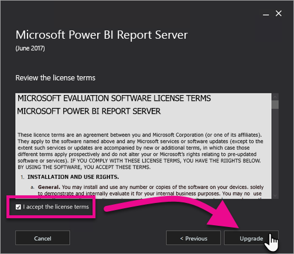

# Power BI -raporttipalvelimen päivittäminen

Opi päivittämään Power BI -raporttipalvelin.

 **Lataa** 

Lataa Power BI -raporttipalvelin ja Power BI -raporttipalvelimelle optimoitu Power BI Desktop tutustumalla ohjeaiheeseen [Paikallinen raportointi Power BI -raporttipalvelimella](https://powerbi.microsoft.com/report-server/).

## Alkutoimet

Ennen kuin päivität raporttipalvelimen, raporttipalvelin kannattaa varmuuskopioida seuraavien ohjeiden avulla.

### Salausavaimien varmuuskopioiminen

Salausavaimien kannattaa varmuuskopioida, kun määrität raporttipalvelimen asennuksen ensimmäistä kertaa. Voit myös Varmuuskopioi avaimet aina, kun muutat palvelutilien käyttäjätietoja tai nimeät tietokoneen uudelleen. Lisätietoja on ohjeaiheessa [Raporttipalvelimen salausavaimien varmuuskopiointi ja palauttaminen](https://docs.microsoft.com/sql/reporting-services/install-windows/ssrs-encryption-keys-back-up-and-restore-encryption-keys).

### Raporttipalvelimen tietokantojen varmuuskopioiminen

Koska raporttipalvelin on tilaton palvelin, kaikki sovellustiedot tallennetaan **reportserver**- ja **reportservertempdb**-tietokantoihin, jotka toimivat SQL Server -tietokantamoduulin esiintymässä. Voit varmuuskopioida **reportserver** ja **reportservertempdb** tietokannat käyttämällä jotakin tuetuista tavoista SQL Server-tietokantojen varmuuskopiointiin. Seuraavassa on raporttipalvelintietokannoille tarkoitettuja suosituksia:

* Täysi palautustila avulla voit varmuuskopioida **reportserver** tietokannan.
* Yksinkertaista palautusmallia käyttävissä varmuuskopioi **reportservertempdb** tietokannan.
* Voit käyttää tietokannoille eri varmuuskopiointiaikatauluja. Ainoa syy varmuuskopioida **reportservertempdb** on luoda uudelleen, jos laitteistovirheen ilmetessä. Laitteistovirheen tapauksessa **reportservertempdb**-tietokannan tietoja ei ole välttämätöntä palauttaa, mutta sen taulukkorakenne on tarpeellinen. Jos **reportservertempdb**-tietokanta menetetään, ainoa tapa saada se takaisin on luoda raporttipalvelintietokanta uudelleen. Jos luot **reportservertempdb**-tietokannan uudelleen, sille on annettava sama nimi kuin ensisijaiselle raporttipalvelintietokannalle.

Lisätietoja SQL Server -relaatiotietokantojen varmuuskopioinnista ja palauttamisesta on ohjeaiheessa [SQL Server -tietokantojen varmuuskopiointi ja palauttaminen](https://docs.microsoft.com/sql/relational-databases/backup-restore/back-up-and-restore-of-sql-server-databases).

### Määritystiedostojen varmuuskopioiminen

Power BI -raporttipalvelin käyttää määritystiedostoja sovellusasetusten tallentamiseen. Varmuuskopioi tiedostot, kun määrität palvelimen ensimmäistä ja sen jälkeen, kun otat käyttöön mukautettuja laajennuksia. Varmuuskopioitavia tiedostoja:

* config.json
* RSHostingService.exe.config
* Rsreportserver.config
* Rssvrpolicy.config
* Reportingservicesservice.exe.config
* Web.config raporttipalvelimen ASP.NET-sovelluksille
* ASP.NETin Machine.config

## Raporttipalvelimen päivittäminen

Power BI -raporttipalvelimen päivittäminen on helppoa. Tiedostojen asentaminen onnistuu vain parissa vaiheessa.

1. Paikanna PowerBIReportServer.exe-tiedosto ja käynnistä asennusohjelma.

2. Valitse **Päivitä Power BI -raporttipalvelin**.

    

3. Lue ja hyväksy käyttöoikeussopimuksen ehdot ja valitse sitten **Päivitä**.

    

4. Onnistuneen päivityksen jälkeen voit avata raporttipalvelujen kokoonpanon hallinnan valitsemalla **Määritä raporttipalvelin** tai sulkea asennusohjelman valitsemalla **Sulje**.

    

## Power BI Desktopin päivittäminen

Kun raporttipalvelin on päivitetty, kannattaa varmistaa, että kaikki Power BI -raporttien tekijät päivittävät palvelimen versiota vastaavaan Power BI -raporttipalvelimelle optimoituun Power BI Desktopiin.

## Seuraavat vaiheet

* [Järjestelmänvalvojan yleiskatsaus](admin-handbook-overview.md)  
* [Asenna Power BI Desktop (optimoitu Power BI -raporttipalvelimelle)](install-powerbi-desktop.md)  
* [Raporttipalvelujen asennuksen tarkistaminen](https://docs.microsoft.com/sql/reporting-services/install-windows/verify-a-reporting-services-installation)  
* [Raporttipalvelimen palvelutilin määrittäminen](https://docs.microsoft.com/sql/reporting-services/install-windows/configure-the-report-server-service-account-ssrs-configuration-manager)  
* [Raporttipalvelimen URL-osoitteiden määrittäminen](https://docs.microsoft.com/sql/reporting-services/install-windows/configure-report-server-urls-ssrs-configuration-manager)  
* [Raporttipalvelimen tietokantayhteyden määrittäminen](https://docs.microsoft.com/sql/reporting-services/install-windows/configure-a-report-server-database-connection-ssrs-configuration-manager)  
* [Raporttipalvelimen alustaminen](https://docs.microsoft.com/sql/reporting-services/install-windows/ssrs-encryption-keys-initialize-a-report-server)  
* [Raporttipalvelimen SSL-yhteyksien määrittäminen](https://docs.microsoft.com/sql/reporting-services/security/configure-ssl-connections-on-a-native-mode-report-server)  
* [Windowsin palvelutilien ja käyttöoikeuksien määrittäminen](https://docs.microsoft.com/sql/database-engine/configure-windows/configure-windows-service-accounts-and-permissions)  
* [Power BI -raporttipalvelimen selaintuki](browser-support.md)

Onko sinulla muuta kysyttävää? [Voit esittää kysymyksiä Power BI -yhteisössä](https://community.powerbi.com/)