# Asiakkaan tuottavuuden malli Power BI:lle: aloita esittely

Asiakkaan tuottavuuden malli -sisältöpaketti sisältää koontinäytön, raportin ja tietojoukon yritykselle, joka valmistaa markkinointimateriaalia. Talousjohtaja loi tämän koontinäytön nähdäkseen tärkeitä arvoja viidestä liiketoimintayksikön johtajasta, tuotteista, asiakkaista ja myyntikatteista. Hän näkee yhdellä vilkaisulla, mitkä tekijät vaikuttavat kannattavuuteen.

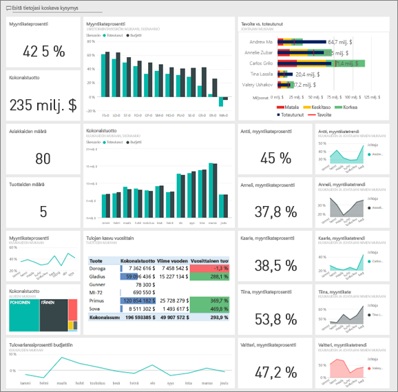

Tämä malli kuuluu sarjaan, jossa esitellään, miten Power BI:tä voidaan käyttää liiketoimintaan suuntautuneiden tietojen, raporttien ja koontinäyttöjen kanssa. Sen luomiseen on käytetty obviEnceltä ([www.obvience.com](http://www.obvience.com/)) saatuja oikeita tietoja, jotka on muunnettu nimettömään muotoon. Tiedot ovat käytettävissä useissa muodoissa: sisältöpaketti/sovellus, Power BI Desktopin .pbix-tiedosto tai Excel-työkirja. Tutustu [Power BI:n malleihin](sample-datasets.md). 

Tässä opetusohjelmassa käytetään Power BI -palvelua ja Asiakkaan tuottavuuden malli -sisältöpakettia. Koska raportin käyttökokemukset ovat hyvin samankaltaisia, voit myös seurata käyttäen Power BI Desktopia ja mallin PBIX-tiedostoa. 

## Edellytykset

Ennen kuin voit käyttää mallia, se on ensin ladattava [sisältöpakettina](#get-the-content-pack-for-this-sample), [.pbix-tiedostona](#get-the-pbix-file-for-this-sample) tai [Excel-työkirjana](#get-the-excel-workbook-for-this-sample).

### Mallin sisältöpaketin noutaminen

1. Avaa Power BI -palvelu (app.powerbi.com), kirjaudu sisään ja avaa työtila, johon haluat tallentaa mallin.

2. Valitse vasemmasta alakulmasta **Nouda tiedot**.

   
3. Valitse avautuvalta **Nouda tiedot** -sivulta **Mallit**.

4. Valitse **Asiakkaan tuottavuuden malli** ja valitse sitten **Yhdistä**.  

    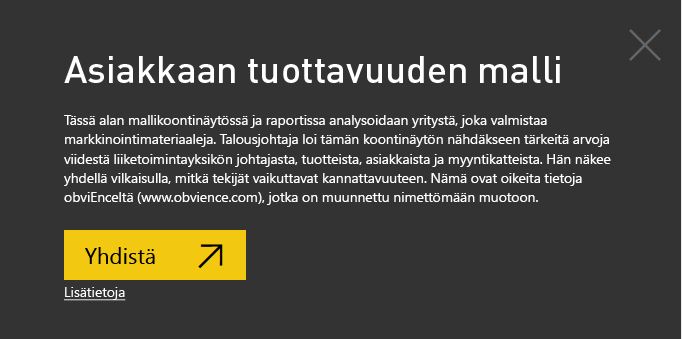
5. Power BI tuo sisältöpaketin ja lisää sitten uuden koontinäytön, raportin ja tietojoukon senhetkiseen työtilaasi.

    

### Hae tämän mallin .pbix-tiedosto

Vaihtoehtoisesti voit ladata Asiakkaan tuottavuuden mallin [.pbix-tiedostona](http://download.microsoft.com/download/6/A/9/6A93FD6E-CBA5-40BD-B42E-4DCAE8CDD059/Customer%20Profitability%20Sample%20PBIX.pbix), joka on suunniteltu käytettäväksi Power BI Desktopilla.

### Hae tämän näytteen Excel-työkirja

Jos haluat perehtyä tämän mallin tietolähteeseen, se on saatavana myös [Excel-työkirjana](http://go.microsoft.com/fwlink/?LinkId=529781). Työkirja sisältää Power View -taulukoita, joita voit tarkastella ja muokata. Saat raakatiedot näkyviin ottamalla käyttöön Tietojen analysointi -apuohjelmat ja valitsemalla sitten **Power Pivot > Hallinta**. Voit ottaa Power View- ja Power Pivot -apuohjelmat käyttöön [tutustumalla Excelin sisältämien Excel-mallien](sample-datasets.md#optional-take-a-look-at-the-excel-samples-from-inside-excel-itself) lisätietoihin.

## Mitä koontinäyttö kertoo?

Avaa työtila, johon tallensit mallin, etsi Asiakkaan tuottavuuden malli ja valitse se:

### Koko yrityksen laajuiset koontinäytön ruudut
1. Avaa koontinäyttö Power BI -palvelussa. Koontinäytön ruutujen avulla talousjohtaja saa kuvan korkean tason yritysarvoista, jotka ovat tärkeitä hänelle. Kun hän näkee jotakin mielenkiintoista, hän voi valita ruudun ja perehtyä tietoihin tarkemmin.

2. Tarkista koontinäytön vasemmalla puolella olevat ruudut.

    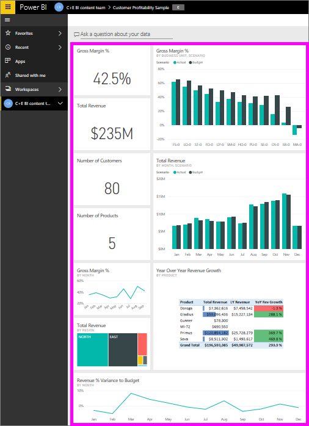

   Huomioi seuraavat tiedot:
   - Yrityksen myyntikate on 42,5 %.
   - Sillä on 80 asiakasta.
   - Se myy viittä eri tuotetta.
   - Budjetointiin verrattuna tuoton varianssiprosentti oli pienin helmikuussa ja suurin maaliskuussa.
   - Valtaosa tuotosta tulee itäisiltä ja pohjoisilta alueilta. Myyntikate ei ole koskaan ylittänyt budjettia. ER-0 ja MA-0-liiketoimintayksiköt edellyttävät lisätutkimuksia.
   - Vuoden kokonaistuotto on lähellä budjetoitua.

### Esimieskohtaiset koontinäytön ruudut
Koontinäytön oikeassa reunassa olevat ruudut sisältävät tiimin tuloskortin. Talousjohtajan on seurattava esimiehiä ja näiden ruutujen kautta hän näkee tuotosta korkean tason yleiskatsauksen käyttämällä myyntikatetta. Jos myyntikatetrendi on odottamaton kenelle tahansa esimiehelle, hän voi tutkia asiaa tarkemmin.

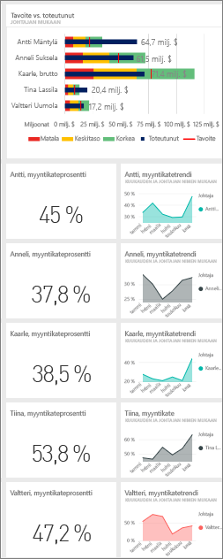

Esimieskohtaisia koontinäyttöruutuja analysoimalla voimme tehdä seuraavat havainnot:

- Kaikki johtajat Carlosta lukuun ottamatta ovat jo ylittäneet myyntitavoitteensa. Carloksen toteutunut myynti on kuitenkin suurin.
- Annelien myyntikate on pienin, mutta kasvu oli tasaista maaliskuun jälkeen.
- Toisaalta Valeryn myyntikate on pudonnut huomattavasti.
- Andrew’n vuosi sisälsi heilahtelua.

## Koontinäytön pohjana oleviin tietoihin perehtyminen
Tämä koontinäyttö sisältää ruutuja, jotka on yhdistetty raporttiin ja Excel-työkirjaan.

### Excel Online -tietolähteen avaaminen
Kaksi tämän koontinäytön ruutua, **Tavoite vs. toteutunut** ja **Tulojen kasvu vuosittain**, on kiinnitetty Excel-työkirjasta. Kun valitset jommankumman näistä ruuduista, Power BI avaa tietolähteen, eli tässä tapauksessa Excel Onlinen.

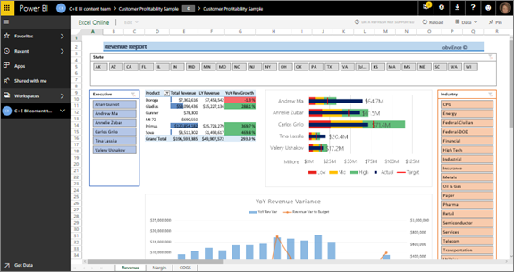

1. Valitse kumpi tahansa Excelistä kiinnitetyistä ruuduista. Excel Online avautuu Power BI -palvelussa.
2. Huomaa, että työkirjan tiedot ovat kolmessa välilehdessä. Avaa **Tuotto**.
3. Selvitetäänpä, miksi Carlos ei ole vielä saavuttanut tavoitettaan:  

    a. Valitse **Johtaja**-liukusäätimestä **Carlos Grilo**.   

    b. Ensimmäisen Pivot-taulukon mukaan Carloksen parhaan tuotteen Primuksen tuotto on pudonnut 152 % edellisestä vuodesta. **Vuosittaisessa tuoton varianssikaaviossa** näkyy, että hän jää budjetin alle useimpina kuukausina.  

    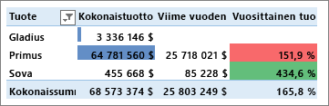

    

4. Jatka tutustumista. Jos löydät jotakin mielenkiintoista, valitse **Kiinnitä**  oikeasta yläkulmasta ja [kiinnitä se koontinäyttöön](service-dashboard-pin-tile-from-excel.md).

5. Palaa koontinäyttöön selaimen taaksepäin osoittavalla nuolella.

### Pohjana olevan Power BI -raportin avaaminen
Monet Asiakkaan tuottavuuden mallin koontinäytön ruuduista on kiinnitetty pohjana olevasta Asiakkaan tuottavuuden mallin raportista.

1. Avaa raportti lukutilassa valitsemalla jokin näistä ruuduista.

   Jos ruutu luotiin Q&A:ssa, sen valitseminen avaa Q&A-ikkunan. Valitse **Poistu Q&A:sta** palataksesi koontinäyttöön, ja kokeile sitten toista ruutua.

2. Raportissa on kolme sivua. Raportin alareunan kukin välilehti edustaa yhtä sivua.

    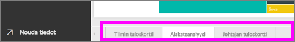

    * **Tiimin tuloskortissa** keskitytään viiden johtajan suoritukseen ja asiakaskokoonpanoon.
    * **Alakateanalyysin** avulla on helppo analysoida kannattavuutta verrattuna koko alan kannattavuuteen.
    * **Johtajan tuloskortti** tarjoaa kutakin johtajaa koskevan näkymän muodossa, jota voidaan tarkastella Cortanassa.

### Tiimin tuloskortti -sivu
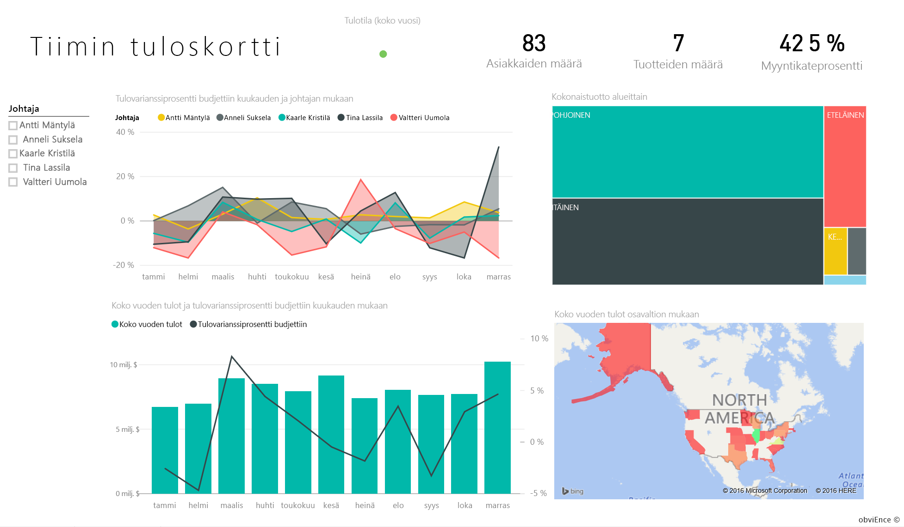

Seuraavaksi tarkastellaan kahta tiimin jäsentä yksityiskohtaisesti, jotta näemme, mitä merkityksellistä tietoa voidaan saada: 

1. Valitse vasemmalla olevasta **Johtaja**-osittajasta Andrew’n nimi, jotta raporttisivusta suodatetaan esiin vain Andrew'n tiedot:

   * Voit mitata suorituskykyä nopeasti Andrew'n **Tulotila (koko vuosi)** -tiedoista: se näkyy vihreänä, mikä tarkoittaa, että hän on suoriutunut hyvin.
   * **Tulovarianssiprosentti budjettiin kuukauden ja johtajan mukaan** -kaavio näyttää, että helmikuun pudotusta lukuun ottamatta Andrew tekee työnsä kaiken kaikkiaan melko hyvin. Hänen vahvin alueensa on itä ja hän käsittelee 49 asiakasta ja viittä tuotetta seitsemästä. Hänen myyntikatteensa ei ole suurin eikä pienin.
   * **Koko vuoden tulot ja tuottoprosentin varianssi budjettiin kuukausittain** -kaavio näyttää, että hänen tuottonsa on vakaata. Jos suodatat valitsemalla **keski**-alueen ruudun puukartassa, huomaat, että Andrew’lla on ollut tuottoa vain maaliskuussa ja ainoastaan Indianassa. Onko tämä tarkoituksellista vai pitääkö tähän perehtyä tarkemmin?

2. Siirrytään Valeryyn. Valitse **Johtaja**-osittajasta Valeryn nimi, jotta raporttisivusta suodatetaan esiin vain Valeryn tiedot. 

   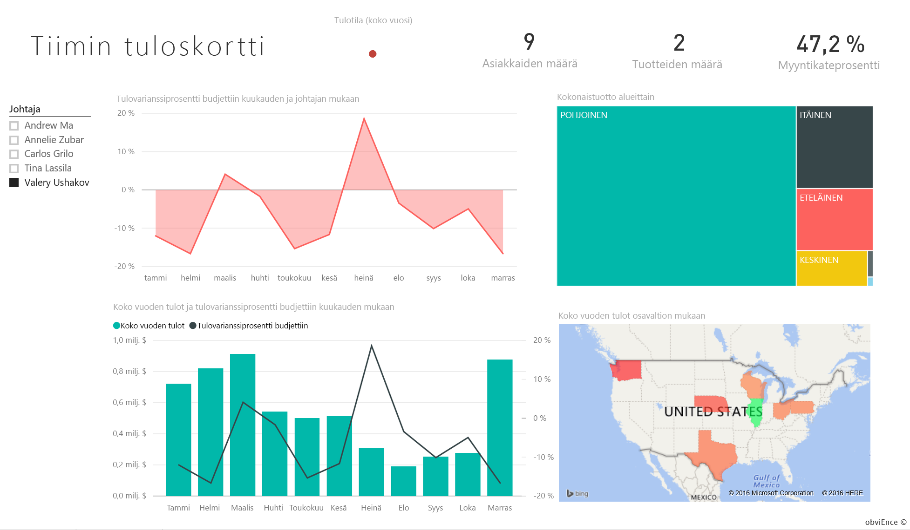

   * Huomaa punainen suorituskykyilmaisin **Koko vuoden tulojen tilassa**. Tätä on ehdottomasti tutkittava tarkemmin.
   * Hänen tulovarianssinsa antaa myös aihetta huoleen – hän ei saavuta myyntikatettaan.
   * Valerylla on vain yhdeksän asiakasta, hän käsittelee vain kahta tuotetta ja hän työskentelee lähes yksinomaan pohjoisella myyntialueella olevien asiakkaiden parissa. Tämä erikoistuminen saattaa selittää laajan vaihtelun hänen arvoissaan.
   * Kun puukartasta valitaan **Pohjoinen**-ruutu, huomataan, että Valeryn myyntikate pohjoisessa vastaa hänen yleistä katettaan.
   * Jos valitset jonkin muun **Kokonaistuotto alueittain** -ruudun, huomaat jotain kiinnostavaa: hänen tuottoprosenttinsa vaihtelee 23 %:n ja 79 %:n välillä. Hänen tulolukunsa muilla alueilla kuin pohjoisessa vaihtelevat runsaasti kausittain.

3. Jatketaan tietojen tutkimista, jotta saamme selville, miksi Valeryn alueella on hankaluuksia. Tarkastele alueita, muita liiketoimintayksiköitä ja raportin seuraavaa sivua: **Alakateanalyysia**.

### Alakateanalyysi
Tällä raporttisivulla tiedot ovat eri sektorista. Sivulla tarkastellaan koko alan myyntikatetta eriteltynä segmenteittäin. Talousjohtaja käyttää tätä sivua yrityksen ja liiketoimintayksikön arvojen vertaamiseen koko alan arvoihin. Tietojen avulla voidaan tutkia trendejä ja kannattavuutta. Saatat ihmetellä, miksi **Myyntikate kuukauden ja johtajan mukaan** -kaavio on tällä sivulla, koska se on tiimikohtainen. Kun se on täällä, voimme suodattaa sivun liiketoimintayksikön johtajan mukaan.  

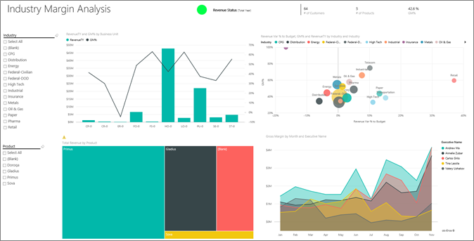

1. Miten kannattavuus vaihtelee aloittain? Miten tuotteet ja asiakkaat voidaan eritellä alan mukaan? Vastaa näihin kysymyksiin valitsemalla vasemmasta yläkulmasta ainakin yksi toimiala (aloita CPG-toimialasta). Voit tyhjentää suodattimen valitsemalla pyyhinkuvakkeen.

2. **Tulovarianssiprosentti budjettiin, myyntikate ja koko vuoden tulot alan mukaan** -kuplakaaviosta talousjohtaja etsii suurimmat kuplat, sillä niillä on suurin vaikutus tuottoon. Kun sivu suodatetaan valitsemalla vuorotellen kunkin johtajan nimi aluekaaviossa, on helppo nähdä kunkin johtajan vaikutus toimialan segmentin mukaan.

3. Kun valitset kunkin johtajan kaaviossa, huomaa seuraavat tiedot:
   * Andrew'n vaikutusala kattaa useita eri toimialasegmenttejä erittäin vaihtelevilla myyntikatteilla (useimmat positiivisen puolella) ja varianssiprosenteilla.
   * Annelien kaavio on samankaltainen sillä poikkeuksella, että hän keskittyy vain muutamiin toimialasegmentteihin (Valtio-segmentti ja Gladius-tuote).
   * Carlos on selvästi keskittynyt Palvelut-segmenttiin ja tuotto on hyvällä tasolla. Hän on parantanut huomattavasti varianssiprosenttiaan korkean teknologian segmentissä ja hänelle uusi segmentti, Teollisuus, on toiminut poikkeuksellisen hyvin verrattuna budjetoituun.
   * Tina tekee työtä useilla segmenteillä ja hänellä on korkein myyntikate, mutta hänen kupliensa pääosin pieni koko osoittaa, että hänen vaikutuksensa yrityksen tulokseen on vähäinen.
   * Valery, jonka vastuulla on vain yksi tuote, toimii vain viidellä toimialasegmentillä. Hänen toimialavaikutuksensa on kausittaista, mutta tuloksena on aina suuri kupla, mikä osoittaa, että vaikutus yrityksen tulokseen on merkittävä. Selittyykö hänen negatiivinen suoriutumisensa toimialasegmenteillä?

### Johtajan tuloskortti
Tämä sivu on muotoiltu Cortana-vastaussivuksi. Lisätietoja on artikkelissa [Mukautettujen vastaussivujen luominen Cortanalle](service-cortana-answer-cards.md).

## Tietoihin perehtyminen esittämällä kysymyksiä Q&A:ssa
Analyysia varten olisi hyödyllistä määrittää, mikä toimiala tuottaa eniten tuloja Valerylle. Käytetään Q&A-toimintoa.

1. Avaa raportti Muokkausnäkymässä valitsemalla **Muokkaa raporttia**. Muokkausnäkymä on käytettävissä vain, jos olet raportin omistaja. Tätä näkymää kutsutaan joskus *tekijä*tilaksi. Jos tämä raportti on sen sijaan jaettu kanssasi, et voi avata sitä muokkausnäkymässä.

2.  Valitse koontinäytön yläreunasta **Esitä kysymys**, jolloin Q&A-kysymysruutu avautuu.

    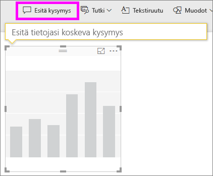

3. Kirjoita kysymysruutuun *kokonaistulot alan mukaan: Valery*. Huomaa, miten visualisointi päivittyy, kun kirjoitat kysymyksen.

    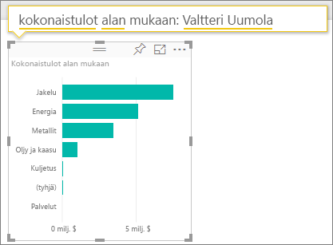

   Huomaat, että Valeryn tuloista suurin osa tulee jakelualalta.

### Pureudutaan syvemmälle lisäämällä suodattimia.
Tutustutaan Jakelualaan.  

1. Avaa **Alakateanalyysi**-raporttisivu.
2. Laajenna oikeassa reunassa oleva suodatinruutu (jos sitä ei ole vielä laajennettu) valitsematta mitään raporttisivun visualisointia. **Suodattimet**-ruudussa pitäisi näkyä vain **Sivutason suodattimet**.  

   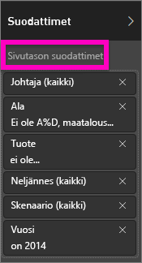
3. Etsi **Toimiala**-suodatin ja laajenna luettelo valitsemalla nuoli. Lisätään Jakelu-alaan sivutason suodatin. Poista ensin kaikki valinnat tyhjentämällä **Valitse kaikki** -valintaruutu. Valitse sitten vain **Jakelu**.  

   
4. **Myyntikateprosentti kuukauden ja johtajan mukaan**  -kaavio näyttää, että vain Valerylla ja Tinalla on asiakkaita tällä toimialalla. Vain Valery on työskennellyt tämän toimialan parissa kesäkuusta marraskuuhun.   
5. Valitse **Tina** ja valitse sitten **Valery** **Myyntikate kuukauden ja johtajan nimen mukaan** -kaavion selitteestä. Huomaa, että Tinan osuus **Kokonaistuotto tuotteittain** -arvosta on erittäin pieni verrattuna Valeryyn.
6. Näet todelliset tulot valitsemalla Q&A-ruudun koontinäytössä ja kirjoittamalla *kokonaistulot johtajan mukaan: jakauma skenaariokohtaisesti*.  

     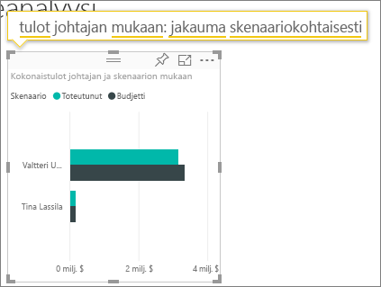

    Voimme tutkia vastaavasti muita aloja ja jopa lisätä asiakkaita visualisointeihin, jotta ymmärrämme Valeryn suorituskyvyn syyt.

## Seuraavat vaiheet: Yhdistä tietoihisi
Tässä ympäristössä on turvallista tehdä kokeiluja, koska voit jättää tekemäsi muutokset tallentamatta. Jos kuitenkin tallennat ne, voit aina siirtyä **Nouda tiedot** -kohtaan, jolloin saat mallista uuden kopion.

Toivomme, että tämä esittely on osoittanut, miten Power BI -koontinäytöt, kysymysosio ja raportit voivat tarjota uusia näkökulmia asiakastietoihin. Nyt on sinun vuorosi – muodosta yhteys omiin tietoihisi. Power BI:n avulla voit yhdistää useisiin eri tietolähteisiin. Lisätietoja on artikkelissa [Power BI -palvelun käytön aloittaminen](service-get-started.md).

