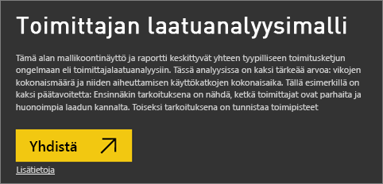
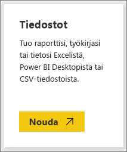

# Hanki Power BI:n malleja
Olet ehkä aloittanut vasta Power BI:n käytön ja haluat kokeilla sen toimintaa, mutta sinulla ei ole vielä tietoja, joilla testata sitä.  Kukaties haluaisit nähdä raportteja, jotka kuvaavat joitakin Power BI:n ominaisuuksia. Me autamme sinua tässä.

Power BI sisältää erilaisia malleja eri tarkoituksiin: 
- **[Power BI raportti](#sales--returns-sample-pbix-file) (. pbix-tiedosto)** , jota voit tarkastella Data Stories Galleryssa, avata ja tutkia Power BI Desktopissa tai ladata Power BI -palveluun.
- **[Esimerkki sovellus](#sample-app-from-appsource)** , jonka lataat AppSourcesta myös suoraan Power BI -palveluun. Sovelluksia ovat koontinäytöt, raportit ja tietojoukot. Voit muokata niitä ja sitten jaella niitä työtovereillesi.
- **[Kahdeksan alkuperäistä sisäistä mallia](#eight-original-samples)** Power BI -palvelussa *sisältöpaketteina* koontinäyttöjen, raporttien ja tietojoukkojen kanssa. Asennat ne suoraan Power BI -palveluun. Sisäiset mallit ovat saatavilla myös Power BI -raportteina (. pbix) ja Excel-työkirjoina (. xlsx).
- Sisäisten mallien **[Excel-työkirja](#download-sample-excel-files)** -versiot, jotka sisältävät tietomallin ja Power View -taulukot. Voit tarkastella tai muokata tietomallia Excelissä käyttämällä Excel-työkirjaa Power BI -raportin tietolähteenä. Voit myös ladata työkirjan Excel-tiedostona ja näyttää Excelin visualisoinnit ja pivot-taulukot Power BI -raporteissa. 
- Ladattavissa on myös **[taloudellisten tietojen mallityökirja](sample-financial-download.md)** , joka on ulkoasultaan litteä, yksinkertainen taulukko Excel-tiedostossa. Se sisältää anonyymeja tietoja, joissa on kuvitteellisia tuotteita, ja myynti jakautuu segmentteihin ja maihin/alueisiin. Se toimii hyödyllisenä Power BI -raporttien perustietolähteenä.

Online-ohjeidemme opetusohjelmissa ja esimerkeissä käytetään näitä samoja malleja, joten pystyt hyvin seuraamaan mukana.

## Myynnin ja palautusten .pbix-mallitiedosto

:::image type="content" source="media/sample-datasets/sales-returns-sample-pbix.png" alt-text="Myynnin ja palautusten .pbix-mallitiedosto":::

*Myynnin ja palautusten malliraportti*

Power BI -raporttien suunnittelijat Miguel Myers ja Chris Hamall loivat Myynti ja palautukset.pbix -tiedoston, joka esittelee monia Power BI:n uusia ominaisuuksia, kuten painikkeita, porautumista, ehdollista muotoilua, entä jos -analyysia ja mukautettuja työkaluvihjeitä. 

Tämän raportin skenaario on yritys, joka myy Microsoft-aiheisia rullalautoja. Yritys haluaa tarkastella myyntiään ja palautuksiaan sekä analysoida, miten heidän pitäisi muuttaa toimintojaan. 

Voit tutustua siihen seuraavilla tavoilla:

- Tarkastele ja käytä sitä Power BI -yhteisön [Data Stories Galleryssa](https://community.powerbi.com/t5/Data-Stories-Gallery/Sales-amp-Returns-Sample-Report/m-p/876607).
- Lataa .pbix-tiedosto ja tutki sitä perusteellisesti. Katso ”kulissien taakse”, miten Miguel teki sen. Tämän linkin valitseminen lataa tiedoston automaattisesti: [Myynnin ja palautusten malliraportti](https://go.microsoft.com/fwlink/?linkid=2113239).
- Lue tietoja raportista Power BI -blogikirjoituksesta [Tutustu uuteen Myynnin ja palautusten malliraporttiin](https://powerbi.microsoft.com/blog/take_a_tour_of_the_new_sales_returns_sample_report/).

## Mallisovellus AppSourcesta

Markkinointi ja myynti *-sovellus* on saatavilla Microsoft AppSourcessa. Sovellus on Power BI:n sisältötyyppi, joka kokoaa toisiinsa liittyvät koontinäytöt ja raportit. Sovelluksessa voi olla yksi tai useampia koontinäyttöjä ja yksi tai useampia raportteja, jotka on koottu yhteen. Voit ladata Markkinointi-ja myynti -sovelluksen Power BI -palvelun **Sovellukset**-alueelta tai siirtymällä selaimella AppSourceen.

- Artikkelissa [Sovellusten asentaminen ja käyttäminen](consumer/end-user-app-view.md) kerrotaan, miten voit ladata sovelluksen Power BI -palvelusta.
- Tämän linkin avulla pääset [Myynti ja markkinointi -sovellukseen](https://appsource.microsoft.com/product/power-bi/microsoft-retail-analysis-sample.salesandmarketingsample?tab=Overview) AppSourcessa.

Kun olet asentanut sen, näet sen sovelluskokoelmassasi.

:::image type="content" source="media/sample-datasets/power-bi-sales-marketing-app.png" alt-text="Myynti ja markkinointi -sovellusruutu":::

Kun avaat sen, valitse **Tutustu näytetietojen avulla**. 

:::image type="content" source="media/sample-datasets/power-bi-explore-app.png" alt-text="Tutustu sovellukseen":::

Näkyviin tulee sovellusnäkymä, jossa näkyy koontinäyttö ja erilliset raporttisivut siirtymisruudussa. 

:::image type="content" source="media/sample-datasets/power-bi-sales-marketing-app-navigation.png" alt-text="Sovelluksen siirtymisruutu":::

Koska asensit sovelluksen, voit myös avata *työtilan* ja muokata sovelluksen elementtejä. Avaa työtila valitsemalla **Muokkaa**-kynäkuvake.

:::image type="content" source="media/sample-datasets/power-bi-app-edit-pencil.png" alt-text="Muokkaa sovellusta":::

Nyt näet koontinäytön, raportin ja tietojoukon sovelluksesta työtilan luettelonäkymässä. Tässä työtilassa voit muokata jokaista niistä.

:::image type="content" source="media/sample-datasets/power-bi-sales-marketing-workspace.png" alt-text="Myynti ja markkinointi -työtila":::

Jos haluat, voit jaella tätä sovellusta kenelle tahansa organisaatiossasi. Valitse **Päivitä sovellus**.

:::image type="content" source="media/sample-datasets/power-bi-update-app.png" alt-text="Päivitä sovellus -painike":::

Viimeistele **Asetukset**-välilehti, ja valitse myös **Sovelluksen teeman väri**. 

:::image type="content" source="media/sample-datasets/power-bi-app-setup.png" alt-text="Valitse sovelluksen asetukset":::

Viimeistele **Siirtyminen**- ja **Käyttöoikeus**-välilehdet ja valitse **Päivitä sovellus**.

:::image type="content" source="media/sample-datasets/power-bi-select-update-app.png" alt-text="Julkaise sovellus valitsemalla Päivitä sovellus":::

Lue lisää [sovellusten julkaisemisesta Power BI:ssä](service-create-distribute-apps.md).

## Kahdeksan alkuperäistä mallia
Käytettävissäsi on kahdeksan alkuperäistä mallia. Eri mallit edustavat eri aloja. Voit käyttää niitä kaikkia eri muodoissa:

- Asenna [sisäiset sisältöpaketit](#install-built-in-content-packs) Power BI -palvelussa.
- Lataa [Power BI -raporttitiedostot](#download-original-sample-power-bi-files) (.pbix).
- Lataa [Excel-työkirjatiedostot](#download-sample-excel-files) (.xlsx) ja lataa ne sitten Power BI -palveluun.
- Tutustu Excelin [Excel-tiedostoihin Excelissä](#explore-excel-samples-inside-excel) itsessään.

Yritys nimeltä obviEnce ([www.obvience.com](http://www.obvience.com/)) ja Microsoft loivat yhdessä malleja, joita voit käyttää Power BI:n kanssa.  Tiedot ovat anonyymejä ja edustavat eri aloja, muun muassa talous-, henkilöstö-, myyntialaa. 

Nämä mallit ovat saatavilla useissa eri muodoissa: sisältöpakettina, Excel-työkirjana ja Power BI:n .pbix-tiedostona. Jos et tiedä, mitä edellä mainitut ovat tai miten pääset niihin käsiksi – ei hätää. Ne on kuvattu tässä artikkelissa. Olemme luoneet jokaisesta mallista *esittelyn*. Esittelyt ovat artikkeleita, jotka kertovat mallin taustasta ja joissa käydään läpi erilaisia skenaarioita. Skenaarioita voivat olla esimerkiksi sellaiset, että sinun pitäisi vastata johtajan kysymyksiin, etsiä kilpailun kannalta merkityksellisiä tietoja, luoda muille jaettavia raportteja ja koontinäyttöjä tai selittää muutos liiketoiminnassa.

Ennen kuin aloitamme, lue läpi nämä oikeudelliset ohjeet mallien käyttämisestä. Sen jälkeen esittelemme mallit ja näytämme, miten niitä käytetään.

### Ohjeet Excel-työkirjamallien käytöstä

&copy;2015 Microsoft Corporation. All rights reserved. Asiakirjat ja työkirjat tarjotaan ”sellaisinaan”. Työkirjoissa ilmaistuja tietoja ja näkymiä, mukaan lukien URL-osoitteet ja muut viittaukset verkkosivuihin internetissä, voidaan muuttaa ilman erillistä ilmoitusta. Käytöstä aiheutuvat riskit ovat omalla vastuullasi. Jotkin esimerkit on annettu vain kuvitusta varten, ja ne ovat fiktiivisiä. Niitä ei ole tarkoitettu viittaamaan todelliseen maailmaan, eikä niitä pidä niin tulkita. Microsoft ei myönnä tässä esitettyihin tietoihin liittyen mitään suoria tai epäsuoria takuita.

Työkirjat eivät anna sinulle mitään immateriaalioikeuksia mihinkään Microsoft-tuotteeseen. Asiakas saa kopioida ja käyttää työkirjaa vain viittaustarkoituksiin sisäisesti.

Työkirjat ja niihin liittyvät tiedot on toimittanut obviEnce. [www.obvience.com](http://www.obvience.com)

ObviEnce on Microsoftin liiketoimintatiedon hallintaan keskittynyt riippumaton ohjelmistokehitysyritys sekä immateriaalisten hyödykkeiden hautomo. ObviEnce tekee tiivistä yhteistyötä Microsoftin kanssa kehittääkseen parhaita käytäntöjä ja ajatusjohtajuutta edistääkseen Microsoftin liiketoiminnan hallintaratkaisujen käyttöönottoa.

Työkirjat ja tiedot ovat obviEnce LLC:n omaisuutta, ja ne on jaettu ainoastaan siihen tarkoitukseen, että niiden avulla voi esitellä Power BI:n toimintaa yhdessä alan mallitietojen kanssa.

Työkirjojen ja/tai tietojen kaikkeen käyttöön on sisällytettävä edellä mainittu merkintä alkuperästä (saatavilla myös kunkin työkirjan mukana tulevasta Info-laskentataulukosta). Työkirjaan ja kaikkiin visualisointeihin on merkittävä tekijänoikeusilmoitus: obviEnce &copy;.

Kun napsautat mitä tahansa seuraavista linkeistä ladataksesi Excel-työkirjatiedostoja tai .pbix-tiedostoja, hyväksyt edellä esitetyt ehdot.

### Asiakkaan tuottavuuden malli  
[Asiakkaan tuottavuuden mallin esittely](sample-customer-profitability.md)

Tässä toimialamallissa analysoidaan yrityksen avainmetriikkaa liikkeenjohdosta, tuotteista ja asiakkaista. Voit tutkia, mitkä tekijät vaikuttavat yrityksen tuottavuuteen.

### Henkilöstöhallintomalli 
[Henkilöstöhallintomallin esittely](sample-human-resources.md)

Tämä toimialamalli keskittyy yrityksen rekrytointistrategiaan analysoimalla uusia rekrytoituja, aktiivisia työntekijöitä ja pois lähteneitä työntekijöitä.  Tietoja tutkimalla voit tunnistaa irtisanoutumisen trendejä sekä vinoutumia rekrytointistrategioissa.

### IT-kulutusanalyysimalli 
[IT-kulutusanalyysimallin esittely](sample-it-spend.md)

Tässä toimialamallissa analysoidaan yrityksen IT-osaston suunniteltuja ja toteutuneita kuluja. Tämän vertailun avulla voi arvioida sitä, kuinka hyvin yritys suunnitteli vuoden, sekä tutkia osa-alueita, jotka poikkeavat merkittävästi suunnitelmasta. Esimerkin yritys käyttää vuosittaista ennustejaksoa ja tuottaa neljännesvuosittain uusimman arvion, jonka avulla voidaan analysoida IT-osaston kuluissa tilivuoden aikana tapahtuneita muutoksia.

### Mahdollisuusanalyysimalli 
[Mahdollisuusanalyysimallin esittely](sample-opportunity-analysis.md)

Tässä toimialamallissa tarkastellaan ohjelmistoyrityksen myyntikanavaa. Myyntipäälliköt valvovat suoria myyntikanaviaan sekä kumppaneiden myyntikanavia seuraamalla mahdollisuuksia ja tuottoa alueittain sekä tehtyjen kauppojen koon ja kanavan mukaan.

### Hankinta-analyysimalli  
[Hankinta-analyysimallin esittely](sample-procurement.md)

Tässä toimialamallissa analysoidaan yrityksen avainmetriikkaa liikkeenjohdosta, tuotteista ja asiakkaista. Voit tutkia, mitkä tekijät vaikuttavat yrityksen tuottavuuteen.

### Jälleenmyyntianalyysimalli  
[Jälleenmyyntianalyysimallin esittely](sample-retail-analysis.md)

Tässä toimialamallissa analysoidaan useiden myymälöiden ja alueiden myytyjen tuotteiden tietoja. Metriikan avulla vertaillaan tätä ja viime vuotta seuraavien arvojen osalta: myynti, tuotemäärät, myyntikate ja varianssi, sekä analysoidaan uusia myymälöitä.

### Myynti- ja markkinointimalli  
[Myynti- ja markkinointimallin esittely](sample-sales-and-marketing.md)

Tässä toimialamallissa analysoidaan teollisuusyritys VanArsdelia. Tietojen avulla markkinointipäällikkö voi tarkastella toimialaa ja VanArsdelin markkinaosuutta.  Tätä mallia tutkimalla löydät yrityksen markkinaosuuden, tuotantomäärän, myynnin ja markkinoiden mielialan.

### Toimittajan laatuanalyysimalli  
[Toimittajan laatuanalyysimallin esittely](sample-supplier-quality.md)

Tässä toimialamallissa keskitytään yhteen tyypilliseen toimitusketjun haasteeseen: toimittajan laadun analysointiin. Tässä analyysissa on kaksi tärkeää arvoa: vikojen kokonaismäärä ja niiden aiheuttamisen käyttökatkojen kokonaisaika. Mallilla on kaksi päätavoitetta: auttaa ymmärtämään, mitkä toimittajista ovat laadun kannalta parhaita ja mitkä heikoimpia, sekä tunnistaa tehtaat, jotka löytävät parhaiten viat ja ennaltaehkäisevät niitä minimoiden käyttökatkot.

### Asenna sisäiset sisältöpaketit

Aloitetaan *sisältöpaketeista*. Sisäiset mallit ovat käytettävissä Power BI -palvelussa, joten löydät ne poistumatta Power BI:stä. Sisältöpaketti on vähintään yhdestä koontinäytöstä, tietojoukosta ja raportista koostuva paketti, jonka joku kokoaa Power BI -palvelussa käytettäväksi. Jokainen Power BI -mallisisältöpaketti sisältää tietojoukon, raportin ja koontinäytön.  Sisältöpaketit ovat edelleen käytettävissä, mutta ne poistetaan vähitellen käytöstä. Ne eivät ole käytettävissä Power BI Desktopissa.

1. Avaa Power BI -palvelu (app.powerbi.com) ja kirjaudu sisään.
2. Siirry Omaan työtilaan tai muuhun työtilaan, johon haluat asentaa mallin. 
2. Valitse vasemmasta alakulmasta **Nouda tiedot**.

    
3. Valitse avautuvalta Nouda tiedot -sivulta **Mallit**.

   
4. Valitse jokin malleista, jolloin näkyviin tulee kuvaus mallista, ja valitse **Yhdistä**.  

   
5. Power BI tuo sisältöpaketin ja lisää uuden koontinäytön, raportin ja tietojoukon senhetkiseen työtilaasi. Kokeile Power BI:n käyttöä mallien avulla.  

   

Nyt kun sinulla on tietoja, olet jo päässyt hyvään alkuun.  Katso joitakin opetusohjelmia ja kokeile samoja toimia käyttämällä mallisisältöpaketteja – tai avaa vain Power BI -palvelu ja ryhdy tutkimaan sitä.

### Lataa alkuperäiset Power BI -mallitiedostot
Kaikki mallisisältöpaketit ovat saatavilla myös Power BI:n .pbix-tiedostoina. .pbix-tiedostot on suunniteltu käytettäväksi yhdessä Power BI Desktopin kanssa.  

1. Lataa tiedostot yksitellen alla olevista linkeistä. Näiden linkkien valitseminen tallentaa tiedoston automaattisesti Lataukset-kansioon. 

   - [Asiakkaan tuottavuuden malli PBIX](https://download.microsoft.com/download/6/A/9/6A93FD6E-CBA5-40BD-B42E-4DCAE8CDD059/Customer%20Profitability%20Sample%20PBIX.pbix)
   - [Henkilöstöhallintomalli PBIX](https://download.microsoft.com/download/6/9/5/69503155-05A5-483E-829A-F7B5F3DD5D27/Human%20Resources%20Sample%20PBIX.pbix)
   - [Hankinta-analyysimalli PBIX](https://download.microsoft.com/download/D/5/3/D5390069-F723-413B-8D27-5888500516EB/Procurement%20Analysis%20Sample%20PBIX.pbix)
   - [Jälleenmyyntianalyysimalli PBIX](https://download.microsoft.com/download/9/6/D/96DDC2FF-2568-491D-AAFA-AFDD6F763AE3/Retail%20Analysis%20Sample%20PBIX.pbix)
   - [Myynti- ja markkinointimalli PBIX](https://download.microsoft.com/download/9/7/6/9767913A-29DB-40CF-8944-9AC2BC940C53/Sales%20and%20Marketing%20Sample%20PBIX.pbix)
   - [Toimittajan laatuanalyysimalli PBIX](https://download.microsoft.com/download/8/C/6/8C661638-C102-4C04-992E-9EA56A5D319B/Supplier-Quality-Analysis-Sample-PBIX.pbix)

1. Valitse Power BI Desktopissa **Tiedosto > Avaa** ja siirry sijaintiin, johon tallensit .pbix-mallitiedoston.

4. Avaa .pbix-tiedosto Power BI Desktopissa valitsemalla tiedosto.

### Lataa Excel-mallitiedostot
Kaikki mallisisältöpaketit ovat saatavilla myös Excel-työkirjoina. Excel-työkirjat on suunniteltu käytettäväksi yhdessä Power BI -palvelun kanssa.  

1. Lataa tiedostot yksitellen alla olevista linkeistä tai [lataa zip-tiedosto, jossa on mukana kaikki mallitiedostot](https://go.microsoft.com/fwlink/?LinkId=535020). Jos olet kokenut käyttäjä, haluat ehkä ladata Excel-työkirjat päästäksesi tutkimaan tai muokkaamaan tietomalleja.

   - [Asiakkaan tuottavuuden malli](https://go.microsoft.com/fwlink/?LinkId=529781)
   - [Henkilöstöhallintomalli](https://go.microsoft.com/fwlink/?LinkId=529780)
   - [Mahdollisuuksien seurantamalli](https://go.microsoft.com/fwlink/?LinkId=529782)
   - [Hankinta-analyysimalli](https://go.microsoft.com/fwlink/?LinkId=529784)
   - [Jälleenmyyntianalyysimalli](https://go.microsoft.com/fwlink/?LinkId=529778)
   - [Myynti- ja markkinointimalli](https://go.microsoft.com/fwlink/?LinkId=529785)
   - [Toimittajan laatuanalyysimalli](https://go.microsoft.com/fwlink/?LinkId=529779)

2. Tallenna ladattu tiedosto. Sillä on merkitystä, minne tallennat tiedoston.

      **Paikallisesti** – Jos tallennat tiedoston tietokoneesi paikalliselle asemalle tai muuhun organisaatiosi sijaintiin, voit tuoda Power BI:n kautta tiedostosi Power BI:hin. Tiedostosi säilyy paikallisella kiintolevyllä, joten koko tiedostoa ei tuoda Power BI:hin. Käytännössä Power BI -sivustolle luodaan uusi tietojoukko, johon tiedot – ja joissakin tapauksissa tietomalli – ladataan. Jos tiedostossa on raportteja, ne näkyvät Power BI -sivuston Raportit-kohdassa.
    
     **OneDrive – yritys** – Jos sinulla on OneDrive for Business ja olet kirjautunut siihen sisään käyttämällä samaa tiliä, jolla kirjaudut Power BI:hin, OneDrive for Business on selvästi paras paikka synkronoida Excelissä, Power BI:ssä ja .csv-tiedostoissa olevat työsi Power BI:ssä olevien tietojoukkojen, raporttien ja raporttinäkymien kanssa. Koska sekä Power BI että OneDrive toimivat pilvipalvelussa, Power BI muodostaa yhteyden OneDrivessa sijaitsevaan tiedostoon noin tunnin välein. Jos muutoksia löytyy, Power BI:n tietojoukko, raportit ja raporttinäkymät päivitetään automaattisesti.
    
     **SharePoint – työryhmäsivustot** – Power BI ‑tiedostojen tallentaminen SharePointin työryhmäsivustoille muistuttaa pitkälti tallentamista OneDrive for Business ‑palveluun. Suurin ero on siinä, miten yhteys Power BI:stä tiedostoon muodostetaan. Voit määrittää URL-osoitteen tai muodostaa yhteyden pääkansioon.
1. Avaa Power BI -palvelu (app.powerbi.com) ja kirjaudu sisään.

1. Siirry Omaan työtilaan tai muuhun työtilaan, tai luo työtila pelkästään mallia varten.

4. Valitse siirtymisruudun vasemmassa alakulmassa **Nouda tiedot**.

    
5. Valitse näyttöön tulevalta **Nouda tiedot** -sivulta **Tiedostot > Nouda**.

    
6. Valitse sijainti, johon latasit ja tallensit mallin.

    
7. Valitse tiedosto. Valitse **Yhdistä** tai **Avaa**sen mukaan, minne tallensit tiedoston.

8. Valitse, haluatko tuoda tiedot vai tarkastella työkirjaa Power BI:ssä tismalleen sellaisena kuin se on Excel Onlinessa.

    
9. Jos valitset **Tuo**, Power BI tuo mallityökirjan järjestelmään ja lisää sen uutena koontinäyttönä, raporttina ja tietojoukkona, joiden kaikkien nimi tässä tapauksessa on **Hankinta-analyysimalli**.

    - Koska työkirjassa on Power View -taulukoita, Power BI luo raportin, jossa on sivu jokaista Power BI -taulukkoa varten. 
    - Power BI luo uuden koontinäytön, jossa on uusi tyhjä ruutu.  Kun valitset ruudun, pääset juuri lisäämääsi raporttiin.

10. Ava raportti. Valitse raportin eri osia ja tutki niiden vuorovaikutuksia. 

    

### Excel-mallien tutkiminen Excelin sisällä

(Valinnainen) Haluatko ymmärtää, miten Excel-työkirjassa olevat tiedot muunnetaan Power BI -tietojoukoiksi ja -raporteiksi? Excel-mallien avaaminen *Excelissä* ja työkirjojen tutkiminen saattaa tarjota vastauksia.

- Kun avaat mallityökirjan Excelissä ensimmäistä kertaa, esiin saattaa tulla kaksi varoitusta. Ensimmäinen varoitus ilmoittaa, että työkirjassa käytössä suojattu näkymä. Valitse **Ota muokkaaminen käyttöön**. Toinen varoitus saattaa sanoa, että työkirjassa on ulkoisia tietoyhteyksiä. Valitse **Ota sisältö käyttöön**.
- Kussakin työkirjassa on useita Power View -laskentataulukoita. Jos haluat nähdä Power View-taulukoita Excelissä, sinun pitää [ottaa käyttöön Power View -apuohjelma](https://support.office.com/article/flash-silverlight-and-shockwave-controls-blocked-in-microsoft-office-55738f12-a01d-420e-a533-7cef1ff6aeb1) lataamalla rekisteriavainpaketti.
- Missä siis varsinaiset tiedot ovat? Ne ovat PowerPivot-tietomallissa. Et tarvitse Power View-laskentataulukoita tietojen näkemiseen. Valitse **PowerPivot** -välilehden **Hallinta**.

    Etkö näe **PowerPivot**-välilehteä? [Ota käyttöön PowerPivot-apuohjelma](https://support.office.com/article/Start-Power-Pivot-in-Microsoft-Excel-2013-add-in-A891A66D-36E3-43FC-81E8-FC4798F39EA8).

    Power Pivotissa voit-nähdä kaikkien pohjana olevien taulukoiden tiedot ja kaikki DAX-kaavat. 

- Tiedot-välilehti sisältää tietoja obviEncesta, mallin luoneesta yrityksestä.

## Seuraavat vaiheet
[Power BI -palvelun peruskäsitteitä suunnittelijoille](service-basic-concepts.md)

[Opetusohjelma: Yhteyden muodostaminen Power BI:n malleihin](sample-tutorial-connect-to-the-samples.md)

[Power BI:n tietolähteet](service-get-data.md)

Onko sinulla kysyttävää? [Kokeile Power BI -yhteisöä](https://community.powerbi.com/)
