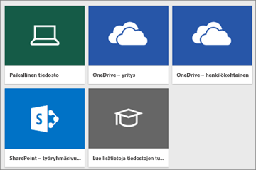
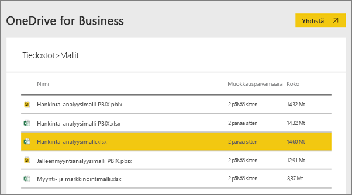
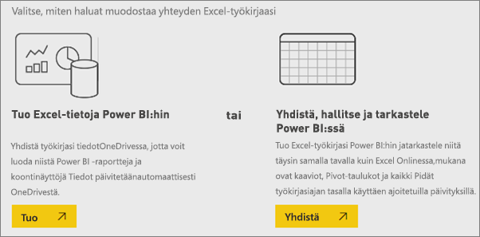
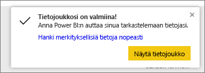
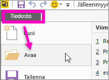

# Millaista mallidataa Power BI:tä varten on saatavilla?
Olet ehkä aloittanut vasta Power BI:n käytön ja haluat kokeilla sen toimintaa, mutta sinulla ei ole vielä tietoja, joilla testata sitä.  Tai ehkäpä sinulla on tietojoukon. Koska et ymmärrä (vielä) Power BI-toiminta, voit aiheuttavasi voit ehkä tietojoukon?

Älä huoli! ObviEnce ([www.obvience.com](http://www.obvience.com/)) ja Microsoft ovat luoneet malleja, joita voit käyttää Power BI:ssä, kunnes tunnet olosi vähän luottavaisemmaksi.  Tiedot ovat anonyymejä ja edustavat eri aloja, muun muassa talous-, henkilöstö-, myyntialaa. Lisäksi online ohjeissamme käyttää samoja malleja opetusohjelmia ja esimerkkejä, jotta pystyt seurataksesi.      

   

Kaikki mallit ovat saatavilla useissa eri muodoissa: sisältöpakettina, yksittäisenä Excel-työkirjana ja .pbix-tiedostona. Jos et tiedä, mitä edellä mainitut ovat tai miten pääset niihin käsiksi – ei hätää. Kaikki kerrotaan jäljempänä tässä artikkelissa. Olemme luoneet jokaisesta mallista *esittely*. Esittelyt artikkeleita, joka kertoo Tarinan takana mallin ja käydään läpi erilaisia skenaarioita. Skenaarioita voivat olla esimerkiksi sellaiset, että sinun pitäisi vastata johtajan kysymyksiin, etsiä kilpailun kannalta merkityksellisiä tietoja, luoda muille jaettavia raportteja ja koontinäyttöjä tai selittää muutos liiketoiminnassa.   

Ennen kuin Aloitamme, tässä on oikeudelliset ohjeet mallien käyttämisestä. Tämän jälkeen voimme jälkeen esittelemme malleja ja käyttää niitä.   

## Ohjeet Power BI:n Excel-työkirjamallien käytöstä

©2015 Microsoft Corporation. Kaikki oikeudet pidätetään. Asiakirjat ja työkirjat tarjotaan ”sellaisinaan”. Työkirjoissa ilmaistuja tietoja ja näkymiä, mukaan lukien URL-osoitteet ja muut viittaukset verkkosivuihin internetissä, voidaan muuttaa ilman erillistä ilmoitusta. Käytöstä aiheutuvat riskit ovat omalla vastuullasi. Jotkin esimerkit on annettu vain kuvitusta varten, ja ne ovat fiktiivisiä. Niitä ei ole tarkoitettu viittaamaan todelliseen maailmaan, eikä niitä pidä niin tulkita. Microsoft ei myönnä tässä esitettyihin tietoihin liittyen mitään suoria tai epäsuoria takuita.

Työkirjat eivät anna sinulle mitään immateriaalioikeuksia mihinkään Microsoft-tuotteeseen. Asiakas saa kopioida ja käyttää työkirjaa vain viittaustarkoituksiin sisäisesti.

Työkirjat ja niihin liittyvät tiedot on toimittanut obviEnce. [www.obvience.com](http://www.obvience.com)

ObviEnce on Microsoftin liiketoimintatiedon hallintaan keskittynyt riippumaton ohjelmistokehitysyritys sekä immateriaalisten hyödykkeiden hautomo. ObviEnce tekee tiivistä yhteistyötä Microsoftin kanssa kehittääkseen parhaita käytäntöjä ja ajatusjohtajuutta edistääkseen Microsoftin liiketoiminnan hallintaratkaisujen käyttöönottoa.

Työkirjat ja tiedot ovat obviEnce LLC, ja on jaettu ainoastaan siihen, jossa esitellään Power BI-toimintoa yhdessä alan mallitietojen kanssa.

Työkirjojen ja/tai tietojen kaikkeen käyttöön on sisällytettävä edellä mainittu merkintä alkuperästä (saatavilla myös kunkin työkirjan mukana tulevasta Info-laskentataulukosta). Työkirjaan ja kaikkiin visualisointeihin on merkittävä tekijänoikeusilmoitus: obviEnce ©.

Kun napsautat mitä tahansa alla olevista linkeistä ladataksesi Excel-työkirjatiedostoja tai .pbix-tiedostoja, hyväksyt edellä esitetyt ehdot.

## Käytettävissä olevat mallit
Käytettävissäsi on kahdeksan mallia.  Ne edustavat eri aloja.

### Asiakkaan tuottavuuden malli  
[Asiakkaan tuottavuuden mallin esittely](sample-customer-profitability.md)

Tässä toimialamallissa analysoidaan yrityksen johto, tuotteet ja asiakkaat Talousjohtaja tärkeitä mittareita. Voit tutkia, mitkä tekijät vaikuttavat yrityksen tuottavuuteen.

### Henkilöstöhallintomalli  
[Henkilöstöhallintomallin esittely](sample-human-resources.md)

Tässä toimialamallissa keskittyy palkkausstrategian yrityksen rekrytointistrategiaan analysoimalla uusia rekrytoituja, aktiivisia työntekijöitä ja työntekijöille, jotka on jäljellä.  Tietoja tutkimalla voit tunnistaa irtisanoutumisen trendejä sekä vinoutumia rekrytointistrategioissa.

### IT-kulutusanalyysimalli 
[IT-kulutusanalyysimallin esittely](sample-it-spend.md)

Valitse tässä toimialamallissa analysoidaan yrityksen IT-osastosi-ja toteutuneita kuluja. Tämän vertailun avulla voi arvioida sitä, kuinka hyvin yritys suunnitteli vuoden, sekä tutkia osa-alueita, jotka poikkeavat merkittävästi suunnitelmasta. Esimerkin yritys käyttää vuosittaista ennustejaksoa ja tuottaa neljännesvuosittain uusimman arvion, jonka avulla voidaan analysoida IT-osaston kuluissa tilivuoden aikana tapahtuneita muutoksia.

### Mahdollisuusanalyysimalli  
[Mahdollisuusanalyysimallin esittely](sample-opportunity-analysis.md)

Tässä toimialamallissa tarkastellaan ohjelmistoyrityksen myyntikanavaa. Myyntipäälliköt valvovat suoria myyntikanaviaan sekä kumppaneiden myyntikanavia seuraamalla mahdollisuuksia ja tuottoa alueittain sekä tehtyjen kauppojen koon ja kanavan mukaan.

### Hankinta-analyysimalli  
[Hankinta-analyysimallin esittely](sample-procurement.md)

Tässä toimialamallissa analysoidaan yrityksen johto, tuotteet ja asiakkaat Talousjohtaja tärkeitä mittareita. Voit tutkia, mitkä tekijät vaikuttavat yrityksen tuottavuuteen.

### Jälleenmyyntianalyysimalli  
[Jälleenmyyntianalyysimallin esittely](sample-retail-analysis.md)

Tässä toimialamallissa analysoidaan useiden myymälöiden ja alueiden myytyjen tuotteiden tietoja. Metriikan avulla vertaillaan tätä ja viime vuotta seuraavien arvojen osalta: myynti, tuotemäärät, myyntikate ja varianssi, sekä analysoidaan uusia myymälöitä.

### Myynti- ja markkinointimalli  
[Myynti- ja markkinointimallin esittely](sample-sales-and-marketing.md)

Tässä toimialamallissa analysoidaan teollisuusyritys VanArsdelia. Tietojen avulla markkinointipäällikkö voi tarkastella toimialaa ja VanArsdelin markkinaosuutta.  Tätä mallia tutkimalla löydät yrityksen markkinaosuuden, tuotantomäärän, myynnin ja markkinoiden mielialan.

### Toimittajan laatuanalyysimalli  
[Toimittajan laatuanalyysimallin esittely](sample-supplier-quality.md)

Tässä toimialamallissa keskitytään yhteen tyypilliseen toimitusketjun haasteeseen: toimittajan laadun analysointiin. Tässä analyysissa on kaksi tärkeää arvoa: vikojen kokonaismäärä ja niiden aiheuttamisen käyttökatkojen kokonaisaika. Mallilla on kaksi päätavoitetta: auttaa ymmärtämään, mitkä toimittajista ovat laadun kannalta parhaita ja mitkä heikoimpia, sekä tunnistaa tehtaat, jotka löytävät parhaiten viat ja ennaltaehkäisevät niitä minimoiden käyttökatkot.

Nyt tiedät, mitä kaikkea käytettävissäsi on. Seuraavaksi opit, miten saat ne käsiisi.  

## Mallien hankkiminen
Kuten edellä jo kerrottiin, mallit ovat saatavilla useissa muodoissa: sisältöpaketteina, Excel-työkirjoina ja .pbix-tiedostoina. Olemme kuvataan, miten voit käyttää näitä muotoja Sisältöpaketit alkaen.

## Power BI ‑mallit sisältöpaketteina
Sisältöpaketit ovat ainoa mallien muoto, joka on saatavilla suoraan Power BI:stä – sinun ei tarvitse poistua Power BI:stä saadaksesi ne. Sisältöpaketti on käytännössä paketti, yksi tai useampi koontinäyttöjä, tietojoukkoja ja raportteja, jotka joku luo ja jota voidaan käyttää Power BI-palvelun kanssa. Sisältöpaketin luoja voi jakaa paketin työtovereilleen. Jokainen Power BI ‑mallisisältöpaketti sisältää tietojoukon, raportin ja koontinäytön.  Sisältöpaketteja eivät ole käytettävissä Power BI Desktopissa. Lisätietoja sisältöpaketeista saat lukemalla artikkelin [Johdatus Power BI:n sisältöpaketteihin](service-organizational-content-pack-introduction.md).

### Mallisisältöpaketin noutaminen ja avaaminen Power BI -palvelussa
1. Avaa Power BI-palvelussa (app.powerbi.com) ja kirjaudu sisään.
2. Valitse vasemmassa yläkulmassa **Nouda tiedot**.

    
3. Valitse ilmestyvältä Nouda tiedot -sivulta **Mallit**-kuvake.

   
4. Valitse jokin malleista, jolloin näkyviin tulee kuvaus mallista. Valitse sitten **Yhdistä**.  

   
5. Power BI tuo sisältöpaketin ja lisää uuden koontinäytön, raportin ja tietojoukon senhetkiseen työtilaasi. Uusi sisältö merkitään keltaisella tähdellä. Kokeile Power BI:n käyttöä mallien avulla.  

   

Nyt kun sinulla on tietoja, olet jo päässyt hyvään alkuun.  Katso joitakin opetusohjelmia ja kokeile samoja toimia käyttämällä mallisisältöpaketteja – tai avaa vain Power BI -palvelu ja ryhdy tutkimaan sitä.

## Power BI ‑mallit Excel-tiedostoina
Kaikki mallisisältöpaketit ovat saatavilla myös Excel-työkirjoina. Excel-työkirjat on suunniteltu käytettäväksi yhdessä Power BI -palvelun kanssa.  

1. Lataa tiedostot yksitellen alla olevista linkeistä tai [lataa zip-tiedosto, jossa on mukana kaikki mallitiedostot](http://go.microsoft.com/fwlink/?LinkId=535020). Jos olet kokenut käyttäjä, haluat ehkä ladata Excel-työkirjat päästäksesi tutkimaan tai muokkaamaan tietomalleja.

   * [Jälleenmyyntianalyysimalli](http://go.microsoft.com/fwlink/?LinkId=529778)
   * [Toimittajan laatuanalyysimalli](http://go.microsoft.com/fwlink/?LinkId=529779)
   * [Henkilöstöhallintomalli](http://go.microsoft.com/fwlink/?LinkId=529780)
   * [Asiakkaan tuottavuuden malli](http://go.microsoft.com/fwlink/?LinkId=529781)
   * [Mahdollisuuksien seurantamalli](http://go.microsoft.com/fwlink/?LinkId=529782)
   * [IT-kulutusanalyysimalli](http://go.microsoft.com/fwlink/?LinkId=529783)
   * [Hankinta-analyysimalli](http://go.microsoft.com/fwlink/?LinkId=529784)
   * [Myynti- ja markkinointimalli](http://go.microsoft.com/fwlink/?LinkId=529785)
2. Tallenna ladattu tiedosto. Sillä on merkitystä, minne tallennat tiedoston.

   *  **Paikallisesti** – Jos tallennat tiedoston tietokoneesi paikalliselle asemalle tai muuhun organisaatiosi sijaintiin, voit tuoda Power BI:n kautta tiedostosi Power BI:hin. -Todellisuudessa tiedosto säilyy paikallisessa asemassa, joten koko tiedostoa ei ole tuoda Power BI. Mitä tapahtuu, on uusi tietojoukko luodaan Power BI-sivustoon ja tiedot, ja joissakin tapauksissa tietomalli, ladataan tietojoukkoon. Jos tiedostossa on raportteja, kyseiset raportit näkyvät Power BI-sivuston raportit-kohdassa.
   *  **OneDrive – yritys** – Jos sinulla on OneDrive for Businessia ja kirjautua siihen sisään samalla tilillä olet kirjautunut sisään Power BI-ja OneDrive for Business on hyvä pitää työsi Excelissä Power BI- tai. CSV tiedoston synkronoituna tietojoukko, raportit ja koontinäytöt Power BI. Koska sekä Power BI että OneDrive toimivat pilvipalvelussa, Power BI muodostaa yhteyden OneDrivessa sijaitsevaan tiedostoon noin tunnin välein. Jos muutoksia löytyy, Power BI:n tietojoukko, raportit ja raporttinäkymät päivitetään automaattisesti.
   *  **OneDrive – henkilökohtainen** – Jos tallennat tiedostot henkilökohtaiseen OneDrive-tiliisi, saat monia samoja etuja kuin käyttäessäsi OneDrive for Businessia. Suurin ero on, että sinun on kirjauduttava sisään OneDriveen käyttämällä Microsoft-tiliäsi, kun muodostat ensimmäisen kerran yhteyden tiedostoon (Nouda tiedot > Tiedostot > OneDrive - henkilökohtainen). Yleensä Microsoft-tili on eri kuin tili, jota käytetään Power BI:hin kirjautumiseen. Kun kirjaudut sisään OneDriveen käyttämällä Microsoft-tiliäsi, muista valita asetus Pidä minut sisäänkirjautuneena. Näin Power BI voi muodostaa yhteyden tiedostoon noin tunnin välein ja varmistaa, että Power BI:n tietojoukko on synkronoitu.
   *  **SharePoint – työryhmäsivustot** – Power BI ‑tiedostojen tallentaminen SharePointin työryhmäsivustoille muistuttaa pitkälti tallentamista OneDrive for Business ‑palveluun. Suurin ero on siinä, miten yhteys Power BI:stä tiedostoon muodostetaan. Voit määrittää URL-osoitteen tai muodostaa yhteyden pääkansioon.
1. Avaa Power BI-palvelussa (app.powerbi.com) ja kirjaudu sisään.

   > [!TIP]
   > Tässä vaiheessa sinun kannattaa ehkä luoda uusi koontinäyttö ja antaa sille sama nimi kuin tiedostolla, jonka aiot tuoda.  Jos et tee niin, Power BI ei luo uutta, mallin mukaan nimettyä koontinäyttöä, kun tuot Excel-tietojoukon, vaan lisää sillä hetkellä avattuna olevaan koontinäyttöön uuden ruudun. Kun valitset kyseisen ruudun, siirryt tietojoukon raporttiin. Se ei ole iso ongelma, sillä voit aina luoda uuden koontinäytön myöhemmin, mutta jos aloitat luomalla uuden koontinäytön, säästyt ylimääräiseltä vaiheelta tai parilta.
   >
   >
4. Valitse vasemmassa yläkulmassa **Nouda tiedot**.

    
5. Valitse ilmestyvältä Nouda tiedot -sivulta **Tiedostot > Nouda**.

     
6. Siirry sijaintiin, johon latasit ja tallensit mallin.

   
7. Valitse tiedosto, tässä tapauksessa **hankinta-Analyysimalli.xlsx**, joka on tallennettu onedrive for Businessissa, ja valitse **Yhdistä**.

   
8. Valitse, haluatko tuoda tiedot vai tarkastella työkirjaa Power BI:ssä tismalleen sellaisena kuin se on Excel Onlinessa.

    
9. Jos valitset **Tuo**, Power BI tuo mallityökirjan järjestelmään ja lisää sen uutena tietojoukkona, jonka nimi on **Hankinta-analyysimalli**.  Jos työkirjassa on yhtään Power View ‑taulukoita tai -alueita tai jokin tietomalli, Power BI luo myös samannimisen raportin. Ja ellei sinulla ole vielä koontinäyttöä avattuna, Power BI luo uuden koontinäytön. (Jos sinulla oli koontinäyttö avattuna, kun valitsit **Nouda tiedot**, kyseiseen koontinäyttöön ilmestyy uusi tyhjä ruutu.  Napsauttamalla ruutua siirryt juuri lisäämäsi tietojoukon raporttiin). Uudella sisällöllä on sama nimi kuin mallilla, ja se on merkitty keltaisella tähdellä.
10. Kun näytölle ilmestyy **Tietojoukkosi on valmiina!** näyttö tulee näkyviin, valitse **Näytä tietojoukko** tai **Hanki nopeita merkityksellisiä tietoja** tai Etsi ja avaa liittyvän raportin tai koontinäytön Power BI vasemmassa siirtymisruudussa.  

     

### (Valinnainen) Excel-mallien tarkastelu suoraan Excelistä
Haluatko ymmärtää, miten Excel-työkirjassa olevat tiedot muunnetaan Power BI ‑tietojoukoiksi ja ‑raporteiksi? Excel-mallien avaaminen ***Excelissä*** ja työkirjojen tutkiminen saattaa tarjota vastauksia.

* Kun avaat mallityökirjan Excelissä ensimmäistä kertaa, esiin saattaa tulla kaksi varoitusta. Ensimmäinen varoitus ilmoittaa, että työkirjassa käytössä suojattu näkymä. Valitse **Ota muokkaaminen käyttöön**. Toisen varoituksen saattaa sanoa, että työkirjassa on ulkoisia tietoyhteyksiä. Valitse **Ota sisältö käyttöön**.
* Kunkin työkirja sisältää useita Power View-taulukoita. Jos haluat nähdä Excelin Power View-taulukoita, sinun on [ottaa käyttöön Power View ‑apuohjelma](https://support.office.com/article/flash-silverlight-and-shockwave-controls-blocked-in-microsoft-office-55738f12-a01d-420e-a533-7cef1ff6aeb1) lataamalla rekisteriavaimet paketin.
* Missä siis varsinaiset tiedot ovat? Ne ovat PowerPivot-tietomallissa. Et tarvitse Power View-laskentataulukoiden tiedot. Valitse **PowerPivot** -välilehden **hallinta**.

    Näe **Power Pivot-** välilehti? [Ota käyttöön PowerPivot-apuohjelma](https://support.office.com/article/Start-Power-Pivot-in-Microsoft-Excel-2013-add-in-A891A66D-36E3-43FC-81E8-FC4798F39EA8).

    Power Pivot-näet tietojen pohjana olevat taulukot ja kaikki DAX-kaavat. 

* Tiedot-välilehti sisältää tietoja obviEncesta, mallin luoneesta yrityksestä.

## Power BI ‑mallit .pbix-tiedostoina
Kaikki mallisisältöpaketit ovat saatavilla myös Power BI:n .pbix-tiedostoina. .pbix-tiedostot on suunniteltu käytettäväksi yhdessä Power BI Desktopin kanssa.  

1. Lataa tiedostot yksitellen alla olevista linkeistä. Näiden linkkien valitseminen tallentaa tiedoston automaattisesti Lataukset-kansioon. 

   * [Jälleenmyyntianalyysimalli PBIX](http://download.microsoft.com/download/9/6/D/96DDC2FF-2568-491D-AAFA-AFDD6F763AE3/Retail%20Analysis%20Sample%20PBIX.pbix)
   * [Toimittajan laatuanalyysimalli PBIX](http://download.microsoft.com/download/8/C/6/8C661638-C102-4C04-992E-9EA56A5D319B/Supplier-Quality-Analysis-Sample-PBIX.pbix)
   <!-- Previous link doesn't work -->
   * [Henkilöstöhallintomalli PBIX](http://download.microsoft.com/download/6/9/5/69503155-05A5-483E-829A-F7B5F3DD5D27/Human%20Resources%20Sample%20PBIX.pbix)
   * [Asiakkaan tuottavuuden malli PBIX](http://download.microsoft.com/download/6/A/9/6A93FD6E-CBA5-40BD-B42E-4DCAE8CDD059/Customer%20Profitability%20Sample%20PBIX.pbix)
   * [Mahdollisuuksien seurantamalli PBIX](http://download.microsoft.com/download/9/1/5/915ABCFA-7125-4D85-A7BD-05645BD95BD8/Opportunity%20Analysis%20Sample%20PBIX.pbix)
   * [IT-kulutusanalyysimalli PBIX](http://download.microsoft.com/download/E/9/8/E98CEB6D-CEBB-41CF-BA2B-1A1D61B27D87/IT%20Spend%20Analysis%20Sample%20PBIX.pbix)
   * [Hankinta-analyysimalli PBIX](http://download.microsoft.com/download/D/5/3/D5390069-F723-413B-8D27-5888500516EB/Procurement%20Analysis%20Sample%20PBIX.pbix)
   * [Myynti- ja markkinointimalli PBIX](http://download.microsoft.com/download/9/7/6/9767913A-29DB-40CF-8944-9AC2BC940C53/Sales%20and%20Marketing%20Sample%20PBIX.pbix)

1. Valitse Power BI Desktopissa **Tiedosto > Avaa** ja siirry sijaintiin, johon tallensit mallin .pbix-tiedoston.

   
4. Avaa .pbix-tiedosto Power BI Desktopissa valitsemalla tiedosto.

## Seuraavat vaiheet
[Power BI:n peruskäsitteet](consumer/end-user-basic-concepts.md)

[Opetusohjelma: Yhteyden muodostaminen Power BI:n malleihin](sample-tutorial-connect-to-the-samples.md)

[Power BI:n tietolähteet](service-get-data.md)

Onko sinulla muuta kysyttävää? [Kokeile Power BI -yhteisöä](http://community.powerbi.com/)
