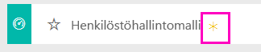

# Power BI:n henkilöstöhallintomalli: aloita esittely

## Yleiskuva henkilöstöhallintomallista
Henkilöstöosasto käyttää samaa raportointimallia eri yrityksissä toimialasta tai koosta riippumatta. Tässä mallissa tarkastellaan uusia palkkauksia, aktiivisia työntekijöitä ja lähteneitä työntekijöitä sekä yritetään tuoda esiin palkkausstrategian trendejä. Päätavoitteemme on ymmärtää seuraavat asiat:

* Keitä palkkaamme
* Vääristymät palkkausstrategiassamme
* Trendit vapaaehtoisissa irtisanoutumisissa

Tämä malli kuuluu sarjaan, jossa esitellään, miten Power BI:tä voidaan käyttää liiketoimintaan suuntautuneiden tietojen, raporttien ja koontinäyttöjen kanssa. Nämä ovat oikeita tietoja obviEnceltä ([www.obvience.com](http://www.obvience.com/)), jotka on muunnettu nimettömään muotoon. Tiedot ovat käytettävissä useissa muodoissa: sisältöpaketti/sovellus, Excel-työkirja tai Power BI Desktopin .pbix-tiedosto. Lisätietoja on artikkelissa [Mallitietojoukot](sample-datasets.md).

## Edellytykset

 Ennen kuin voit käyttää mallia, se on ensin ladattava [sisältöpakettina](https://docs.microsoft.com/power-bi/sample-human-resources#get-the-content-pack-for-this-sample), [.pbix-tiedostona](http://download.microsoft.com/download/6/9/5/69503155-05A5-483E-829A-F7B5F3DD5D27/Human%20Resources%20Sample%20PBIX.pbix) tai [Excel-työkirjana](http://go.microsoft.com/fwlink/?LinkId=529780).

### Mallin sisältöpaketin noutaminen

1. Avaa Power BI -palvelu (app.powerbi.com) ja kirjaudu sisään.
2. Valitse vasemmasta alakulmasta **Nouda tiedot**.
   
    
3. Valitse ilmestyvältä Nouda tiedot -sivulta **Mallit**-kuvake.
   
   
4. Valitse **Jälleenmyyntianalyysimalli** ja **Yhdistä**.  
   
   
5. Power BI tuo sisältöpaketin ja lisää uuden koontinäytön, raportin ja tietojoukon senhetkiseen työtilaasi. Uusi sisältö merkitään keltaisella tähdellä. 
   
   
  
### Hae tämän mallin .pbix-tiedosto

Vaihtoehtoisesti voit ladata näytteen .pbix-tiedostona, joka on suunniteltu käytettäväksi Power BI Desktopilla. 

 * [Henkilöstöhallintomalli PBIX](http://download.microsoft.com/download/6/9/5/69503155-05A5-483E-829A-F7B5F3DD5D27/Human%20Resources%20Sample%20PBIX.pbix)

### Hae tämän näytteen Excel-työkirja
Voit myös [ladata vain tietojoukon (Excel-työkirjan)](http://go.microsoft.com/fwlink/?LinkId=529780) tälle mallille. Työkirja sisältää Power View -taulukoita, joita voit tarkastella ja muokata. Raakatiedot saa näkyviin valitsemalla **Power Pivot > Hallinta**.

## Uudet palkkaukset
Tutustutaan ensin uusiin palkkauksiin.

1. Työtilalla valitse **Koontinäytöt**-välilehti ja avaa Henkilöstöhallinto-koontinäyttö.
2. Koontinäytöllä valitse **Uusien palkkausten määrä, uusien palkkausten määrä samana aikana viime vuonna, aktiivisten muutos vuodesta toiseen** **Kuukauden mukaan** -ruutu.  
     

   Henkilöstöhallintomalli-raportin **Uuden palkkaukset** -sivu avautuu.  

   

Huomaa seuraava:

* **Uusien palkkausten määrä, uusien palkkausten määrä samana aikana viime vuonna, aktiivisten muutos vuodesta toiseen kuukauden mukaan** -yhdistelmäkaavio näyttää, että olemme palkanneet enemmän ihmisiä joka kuukausi tänä vuonna viime vuoteen verrattuna sekä huomattavasti enemmän ihmisiä joinakin kuukausina.
* Yhdistelmäkaaviossa **Uusien palkkausten määrä ja aktiivisten työntekijöiden määrä alueen ja etnisen taustan mukaan** voidaan huomata, että olemme palkanneet vähemmän ihmisiä **Itä**-alueella.
* **Uusien palkkausten vuosivarianssi ikäryhmän mukaan** -vesiputouskaavio näyttää, että palkkaamme pääasiassa nuorempia henkilöitä. Tämä voi johtua siitä, että työt ovat pääasiassa osa-aikaisia.
* **Uusien palkkausten määrä sukupuolen mukaan** -ympyräkaavio näyttää melko tasaiselta.

Löydätkö enemmän tietoa; esimerkiksi alueen, jolla sukupuolijakauma ei ole tasainen? Valitse eri ikäryhmiä ja sukupuolia kaavioissa iän, sukupuolen, alueen ja etisen taustan välisten suhteiden löytämiseksi.

Valitsemalla koontinäytön nimen yläreunan siirtymispalkista voit palata koontinäyttöön.

## Vertaa nykyisiä aktiivisia ja entisiä työntekijöitä
Tutustutaan nykyisten aktiivisten työntekijöiden tietoihin sekä niiden työntekijöiden tietoihin, jotka eivät enää työskentele yrityksessä.

Koontinäytössä valitse **Aktiivisten työntekijöiden määrä ikäryhmän mukaan** -ruutu.  

Henkilöstöhallintomalli-raportin **Aktiiviset työntekijät verrattuna irtisanoutumisiin** -sivu avautuu.  

**Kiinnostuksen kohteet**:

* Yhdistelmäkaaviot vasemmalla osoittavat muutoksen vuodesta toiseen aktiivisille työntekijöille ja irtisanoutuneille. Meillä on enemmän aktiivisia työntekijöitä tänä vuonna nopean palkkaamistahdin vuoksi, mutta myös enemmän irtisanoutuneita kuin viime vuonna.
* Elokuussa meillä oli enemmän irtisanoutuneita verrattuna muihin kuukausiin. Valitse eri ikäryhmiä, sukupuolia tai alueita nähdäksesi, löytyykö tiedoista poikkeavia arvoja.
* Kun katsomme ympyräkaavioita, voimme huomata, että aktiivisten työntekijöiden sukupuoli- ja ikäryhmäjakauma on melko tasainen. Valitse eri ikäryhmät nähdäksesi sukupuolijakauman erot iän perusteella. Onko sukupuolijakauma tasainen kaikissa ikäryhmissä?

## Irtisanoutumisen syyt
Tutustutaan raporttiin muokkausnäkymässä. Valitse **Muokkaa raporttia** vasemmassa yläkulmassa.

Muuta ympyräkaavioita siten, että ne näyttävät irtisanoutuneiden tiedot aktiivisten sijaan.

1. Valitse **Aktiivisten työntekijöiden määrä ikäryhmän mukaan** -ympyräkaavio.
2. **Kentät**-kohdassa laajenna Työntekijät-taulukkoa **Työntekijät**-kohdan vieressä olevan nuolen avulla. Poista kyseinen kenttä poistamalla valintaruudun valinta kohdan **Aktiivisten työntekijöiden määrä** vieressä.
3. Valitsemalla valintaruudun kohdan **Irtisanoutumisten määrä** -vieressä Työntekijät-taulukossa voit lisätä sen **Arvot**-ruutuun kentässä.
4. Raporttipohjalla valitse **Vapaaehtoinen**-palkki **Irtisanoutumisten määrä irtisanoutumisen syyn mukaan** -palkkikaaviossa. Tämä korostaa henkilöt, jotka lähtivät vapaaehtoisesti, raportin muissa visualisoinneissa.
5. Napsauta Irtisanoutumisten määrä ikäryhmittäin -ympyräkaavion 50+-sektoria.

   Katso Irtisanoutumiset syyn mukaan -viivakaaviota oikeassa alakulmassa. Tämä kaavio on suodatettu näyttämään vapaaehtoiset irtisanoutumiset.  
   

   Huomaatko 50+-ikäryhmän trendin? Vuoden loppupuolella suurempi määrä yli 50-vuotiaita työntekijöitä irtisanoutuu vapaaehtoisesti. Tämä on alue, jota kannattaisi tutkia tarkemmin suuremman tietomäärän kanssa.
6. Voit toimia samoin myös **Aktiivisten työntekijöiden määrä sukupuolen mukaan** -ympyräkaaviossa ja tarkastella irtisanoutuneita aktiivisten työntekijöiden sijaan. Tutustu vapaaehtoisesti irtisanoutuneiden tietoihin ja katso, löydätkö muita tietoja.
7. Palaa takaisin koontinäytötön valitsemalla **Power BI** yläreunan siirtymispalkissa. Voit joko tallentaa raporttiin tekemäsi muutokset tai jättää ne tallentamatta.

## Huonot palkkaukset
Viimeinen tutustuttava alue ovat huonot palkkaukset. Huonoiksi palkkauksiksi määritellään työntekijät, joiden palkkaus kesti alle 60 päivää. Palkkaamme nopeasti. Palkkaammeko hyviä ehdokkaita?

1. Valitse **Huonojen palkkausten prosenttimäärä aktiivisista ikäryhmän mukaan** -koontinäyttöruutu. Raportin sivu 3, ”Huonot palkkaukset”, avautuu.

     
2. Valitse **Luode**-valintaruutu Alue-sektorissa vasemmalla ja **Miespuolinen**-sektori Huonojen palkkausten määrä sukupuolen mukaan -rengaskaaviossa.  Tutustu muihin kaavioihin ”Huonot palkkaukset” -sivulla. Enemmän miespuolisia huonoja palkkauksia kuin naispuolisia, ja paljon ryhmän A huonoja palkkauksia.
     
3. Kun tarkastelemme **Huonot palkkaukset sukupuolen mukaan** -rengaskaaviota ja napsautamme **Alue**-sektorin kohtia voimme huomata, että Itä on ainoa alue, jossa naispuolisia huonoja palkkauksia on miespuolisia enemmän.  
4. Valitsemalla koontinäytön nimen yläreunan siirtymispalkista voit palata koontinäyttöön.

## Kysymyksen kysyminen Q&A-ruudussa
[Q&A-kysymysruudun](power-bi-tutorial-q-and-a.md) kautta voit esittää kysymyksiä luonnollisella kielellä. Q&A tunnistaa kirjoittamasi sanat ja etsii niiden avulla vastauksen tietojoukosta.

1. Napsauta Q&A-kysymysruutua. Voit huomata, että ennen kuin edes alat kirjoittaa, Q&A-ruutu sisältää ehdotuksia:

   
2. Voit valita yhden näistä ehdotuksia tai kirjoittaa: **näytä ikäryhmä, sukupuoli ja huonot palkkaukset, kun alue on Itä**.  

   

   Huomaa, että suurin osa naispuolisista huonoista palkkauksista on alle 30-vuotiaita.

Tämä on turvallinen ympäristö kaikenlaisille kokeiluille. Voit aina jättää tekemäsi muutokset tallentamatta. Jos kuitenkin tallennat ne, voit aina siirtyä **Nouda tiedot** -kohtaan, jolloin saat mallista uuden kopion.

## Seuraavat vaiheet: Yhdistä tietoihisi
Toivomme, että tämä esittely on osoittanut, miten Power BI -koontinäytöt, Q&A ja raportit voivat tarjota uusia näkökulmia henkilöstötietoihin. Nyt sinun vuorosi – muodosta yhteys omiin tietoihisi. Power BI:n avulla voit yhdistää useita eri tietolähteitä. Lisätietoja [Power BI:n käytön aloittamisesta](service-get-started.md).  
