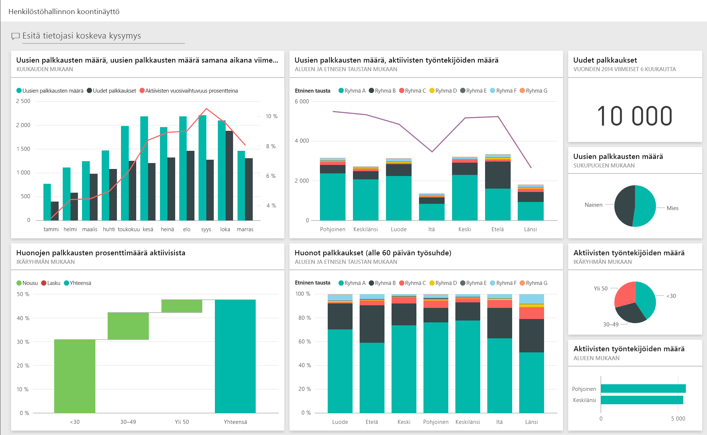
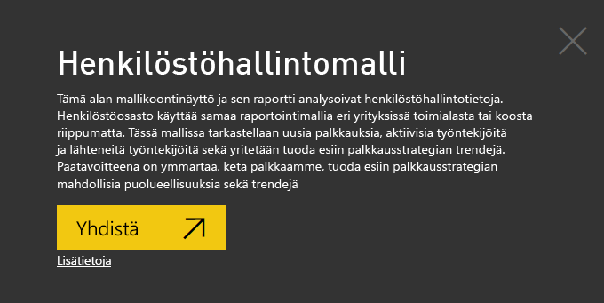
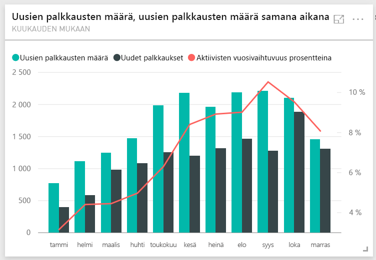
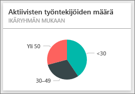
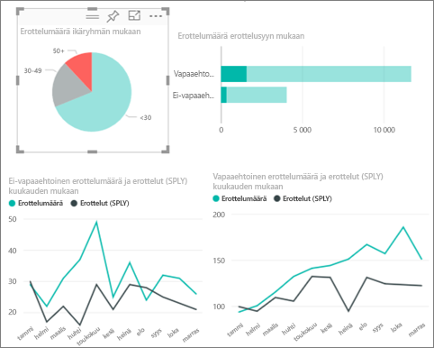
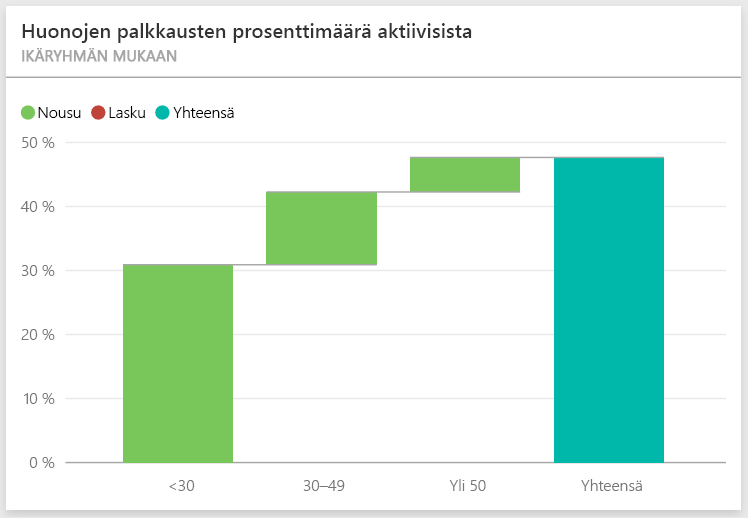
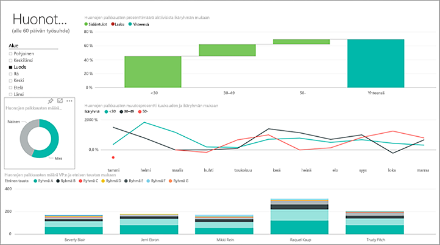
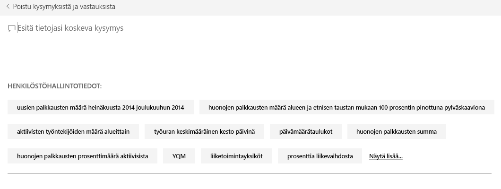

# Power BI:n henkilöstöhallintomalli: aloita esittely

Henkilöstöhallintomallin sisältöpaketti sisältää henkilöstöhallinto-osaston koontinäytön, raportin ja tietojoukon. Tässä mallissa henkilöstöhallinto-osasto käyttää samaa raportointimallia eri yrityksissä toimialasta tai koosta riippumatta. Tämä malli tarkastelee vastikään rekrytoituja työntekijöitä, aktiivisia työntekijöitä ja yrityksestä lähteneitä työntekijöitä. Se pyrkii selvittämään palkkausstrategian mahdolliset trendit. Päätavoitteemme on ymmärtää seuraavat asiat:

* Keitä palkkaamme
* Vääristymät palkkausstrategiassamme
* Trendit vapaaehtoisissa irtisanoutumisissa

Tämä malli kuuluu sarjaan, jossa esitellään, miten Power BI:tä voidaan käyttää liiketoimintaan suuntautuneiden tietojen, raporttien ja koontinäyttöjen kanssa. [ObviEnce](http://www.obvience.com/) on luonut sen käyttämällä oikeita tietoja, jotka on muunnettu nimettömään muotoon. Tiedot ovat käytettävissä useissa muodoissa: sisältöpaketti, Power BI Desktopin .pbix-tiedosto tai Excel-työkirja. Tutustu [Power BI:n malleihin](sample-datasets.md). 

Tässä opetusohjelmassa tutustutaan Power BI -palvelun henkilöstöhallintomallin sisältöpakettiin. Koska raportin käyttökokemus on hyvin samankaltainen Power BI Desktopissa ja palvelussa, voit seurata ohjelmaa myös käyttämällä Power BI Desktopin mallin .pbix-tiedostoa. 

Et tarvitse Power BI -käyttöoikeutta Power BI Desktopin malleihin tutustumiseen. Jos sinulla ei ole Power BI Pro -käyttöoikeutta, voit tallentaa mallin omaan työtilaasi Power BI -palvelussa. 

## Hanki malli

Ennen kuin voit käyttää mallia, se on ensin ladattava [sisältöpakettina](#get-the-content-pack-for-this-sample), [.pbix-tiedostona](#get-the-pbix-file-for-this-sample) tai [Excel-työkirjana](#get-the-excel-workbook-for-this-sample).

### Mallin sisältöpaketin noutaminen

1. Avaa Power BI -palvelu (app.powerbi.com), kirjaudu sisään ja avaa työtila, johon haluat tallentaa mallin.

   Jos sinulla ei ole Power BI Pro -käyttöoikeutta, voit tallentaa mallin omaan työtilaasi.

2. Valitse vasemmasta alakulmasta **Nouda tiedot**.
   
   
3. Valitse avautuvalta **Nouda tiedot** -sivulta **Mallit**.
   
4. Valitse **Henkilöstöhallintomalli** ja valitse sitten **Yhdistä**.  
   
   

5. Power BI tuo sisältöpaketin ja lisää sitten uuden koontinäytön, raportin ja tietojoukon senhetkiseen työtilaasi.
   
   
  
### Hae tämän mallin .pbix-tiedosto

Vaihtoehtoisesti voit ladata henkilöstöhallintomallin [.pbix-tiedostona](https://download.microsoft.com/download/6/9/5/69503155-05A5-483E-829A-F7B5F3DD5D27/Human%20Resources%20Sample%20PBIX.pbix), joka on suunniteltu käytettäväksi Power BI Desktopilla.

### Hae tämän näytteen Excel-työkirja

Jos haluat perehtyä tämän mallin tietolähteeseen, se on saatavana myös [Excel-työkirjana](https://go.microsoft.com/fwlink/?LinkId=529780). Työkirja sisältää Power View -taulukoita, joita voit tarkastella ja muokata. Saat raakatiedot näkyviin ottamalla käyttöön Tietojen analysointi -apuohjelmat ja valitsemalla sitten **Power Pivot > Hallinta**. Voit ottaa Power View- ja Power Pivot -apuohjelmat käyttöön [tutustumalla Excelin sisältämien Excel-mallien](sample-datasets.md#optional-take-a-look-at-the-excel-samples-from-inside-excel-itself) lisätietoihin.

## Uudet palkkaukset
Tutustutaan ensin uusiin palkkauksiin.

1. Valitse työtilassa **Koontinäytöt**-välilehti ja avaa **Henkilöstöhallintomalli**-koontinäyttö.
2. Valitse koontinäytössä **Uusien palkkausten määrä, uusien palkkausten määrä samana aikana viime vuonna, aktiivisten muutos vuodesta toiseen % kuukauden mukaan** -ruutu.  

     

   Henkilöstöhallintomalli-raportin **Uuden palkkaukset** -sivu avautuu.  

   

3. Katso seuraavia kiinnostavia kohteita:

    * **Uusien palkkausten määrä, uusien palkkausten määrä samana aikana viime vuonna, aktiivisten muutos vuodesta toiseen % kuukauden mukaan** -yhdistelmäkaavio näyttää, että olemme palkanneet enemmän ihmisiä joka kuukausi tänä vuonna viime vuoteen verrattuna sekä huomattavasti enemmän ihmisiä joinakin kuukausina.
    * Yhdistelmäkaaviossa **Uusien palkkausten määrä ja aktiivisten työntekijöiden määrä alueen ja etnisen taustan mukaan** voidaan huomata, että olemme palkanneet vähemmän ihmisiä **Itä**-alueella.
    * **Uusien palkkausten vuosivarianssi ikäryhmän mukaan** -vesiputouskaavio näyttää, että palkkaamme pääasiassa nuorempia henkilöitä. Tämä trendi voi johtua siitä, että työt ovat pääasiassa osa-aikaisia.
    * **Uusien palkkausten määrä sukupuolen mukaan** -ympyräkaavio näyttää melko tasaiselta.

    Löydätkö enemmän merkityksellistä tietoa? Esimerkiksi alueen, jolla sukupuolijakauma ei ole tasainen. 

4. Valitse eri ikäryhmiä ja sukupuolia kaavioissa iän, sukupuolen, alueen ja etisen taustan välisten suhteiden löytämiseksi.

5. Valitse **Henkilöstöhallintomalli** yläreunan siirtymisruudusta koontinäyttöön palaamiseksi.

   

## Vertaa nykyisiä aktiivisia ja entisiä työntekijöitä
Tutustutaan nykyisten aktiivisten työntekijöiden tietoihin sekä niiden työntekijöiden tietoihin, jotka eivät enää työskentele yrityksessä.

1. Koontinäytössä valitse **Aktiivisten työntekijöiden määrä ikäryhmän mukaan** -ruutu.

   

   Henkilöstöhallintomalli-raportin **Aktiiviset työntekijät verrattuna irtisanoutumisiin** -sivu avautuu.  

   

 2. Katso seuraavia kiinnostavia kohteita:

    * Kaksi yhdistelmäkaaviota vasemmalla osoittavat muutoksen vuodesta toiseen aktiivisille työntekijöille ja irtisanoutuneille. Meillä on enemmän aktiivisia työntekijöitä tänä vuonna nopean palkkaamistahdin vuoksi, mutta myös enemmän irtisanoutuneita kuin viime vuonna.
    * Elokuussa meillä oli enemmän irtisanoutuneita verrattuna muihin kuukausiin. Valitse eri ikäryhmiä, sukupuolia tai alueita nähdäksesi, löytyykö tiedoista poikkeavia arvoja.
    * Kun katsomme ympyräkaavioita, voimme huomata, että aktiivisten työntekijöidemme sukupuoli- ja ikäryhmäjakauma on tasainen. Valitse eri ikäryhmät nähdäksesi sukupuolijakauman erot iän mukaan. Onko sukupuolijakauma tasainen kaikissa ikäryhmissä?

## Irtisanoutumisen syyt
Tutustutaan raporttiin muokkausnäkymässä. Voit muuttaa ympyräkaavioita näyttämään työntekijän irtisanoutumistiedot aktiivisten työntekijöiden tietojen sijasta.

1. Valitse **Muokkaa raporttia** vasemmassa yläkulmassa.

2. Valitse **Aktiivisten työntekijöiden määrä ikäryhmän mukaan** -ympyräkaavio.

3. **Kentät**-kohdassa laajenna **Työntekijät**-kohtaa **Työntekijät**-taulukon laajentamiseksi. Poista tämä kenttä poistamalla **Aktiivisten työntekijöiden määrä** -kohdan valinta.

4. Valitse **Irtisanoutumisten määrä** **Työntekijät**-taulukossa sen lisäämiseksi **Arvot**-ruutuun **Kentät**-alueella.

5. Valitse raporttipohjalla **Vapaaehtoinen**-palkki **Irtisanoutumisten määrä irtisanoutumisen syyn mukaan** -palkkikaaviossa. 

   Tämä palkki korostaa henkilöt, jotka lähtivät vapaaehtoisesti, raportin muissa visualisoinneissa.

6. Valitse **Irtisanoutumisten määrä ikäryhmittäin** -ympyräkaavion 50+-sektori.

7. Katso viivakaaviota oikeassa alakulmassa. Tämä kaavio on suodatettu näyttämään vapaaehtoiset irtisanoutumiset.  

   

   Pane merkille 50+-ikäryhmän trendi. Vuoden loppupuolella suurempi määrä yli 50-vuotiaita työntekijöitä irtisanoutui vapaaehtoisesti. Tämä trendi on alue, jota kannattaa tutkia tarkemmin suuremman tietomäärän avulla.

8. Voit toimia samoin myös **Aktiivisten työntekijöiden määrä sukupuolen mukaan** -ympyräkaaviossa ja tarkastella irtisanoutuneita aktiivisten työntekijöiden sijaan. Tutustu vapaaehtoisesti irtisanoutuneiden tietoihin ja katso, löydätkö muita tietoja.

9. Valitse **Henkilöstöhallintomalli** yläreunan siirtymisruudusta koontinäyttöön palaamiseksi. Voit halutessasi tallentaa raporttiin tekemäsi muutokset.

## Huonot palkkaukset
Viimeinen tutustuttava alue ovat huonot palkkaukset. Huonoiksi palkkauksiksi määritellään työntekijät, joiden palkkaus kesti alle 60 päivää. Palkkaamme nopeasti, mutta palkkaammeko hyviä ehdokkaita?

1. Valitse **Huonojen palkkausten prosenttimäärä aktiivisista ikäryhmän mukaan** -koontinäyttöruutu. Raportti avautuu kolmannen välilehden, **Huonot palkkaukset**, kohdalla.

     
2. Valitse **Luode** **Alue**-sektorissa vasemmalla ja valitse **Miespuolinen** **Huonojen palkkausten määrä sukupuolen mukaan** -rengaskaaviossa. Tutustu muihin kaavioihin **Huonot palkkaukset** -sivulla. Huomaa, että miespuolisia huonoja palkkauksia on enemmän kuin naispuolisia, ja ryhmässä A on paljon huonoja palkkauksia.

     

3. Jos tarkastelet **Huonojen palkkausten määrä sukupuolen mukaan** -rengaskaaviota ja valitset eri alueet **Alue**-osittajassa, huomaat, että Itä-alue on ainoa alue, jossa naispuolisia huonoja palkkauksia on enemmän kuin miespuolisia huonoja palkkauksia.  

4. Valitsemalla koontinäytön nimen yläreunan siirtymisruudusta voit palata koontinäyttöön.

## Esitä kysymys koontinäytön Q&A-ruudussa
Koontinäytön [Q&A-kysymysruudussa](power-bi-tutorial-q-and-a.md) koontinäytössä voit esittää kysymyksen tiedoista luonnollisen kielen avulla. Q&A tunnistaa kirjoittamasi sanat ja etsii niiden avulla vastauksen tietojoukosta.

1. Valitse Q&A-kysymysruutu. Huomaa, että jo ennen kuin alat kirjoittaa, Q&A näyttää ehdotuksia kysymyksen muodostamisen auttamiseksi.

   

2. Voit valita yhden näistä ehdotuksista tai kirjoittaa: *näytä ikäryhmä, sukupuoli ja huonot palkkaukset SPLY, kun alue on Itä*.  

   

   Huomaa, että suurin osa naispuolisista huonoista palkkauksista on alle 30-vuotiaita.

## Seuraavat vaiheet: Yhdistä tietoihisi
Tässä ympäristössä on turvallista tehdä kokeiluja, koska voit jättää tekemäsi muutokset tallentamatta. Jos kuitenkin tallennat ne, voit aina siirtyä **Nouda tiedot** -kohtaan, jolloin saat tästä mallista uuden kopion.

Toivomme, että tämä esittely on osoittanut, miten Power BI -raporttinäkymät, Q&A ja raportit voivat tarjota uusia näkökulmia mallitietoihin. Nyt on sinun vuorosi – muodosta yhteys omiin tietoihisi. Power BI:n avulla voit yhdistää useisiin eri tietolähteisiin. Lisätietoja on artikkelissa [Power BI -palvelun käytön aloittaminen](service-get-started.md).
