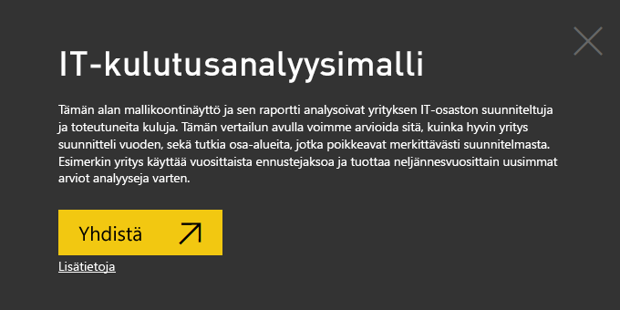
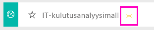
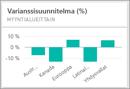
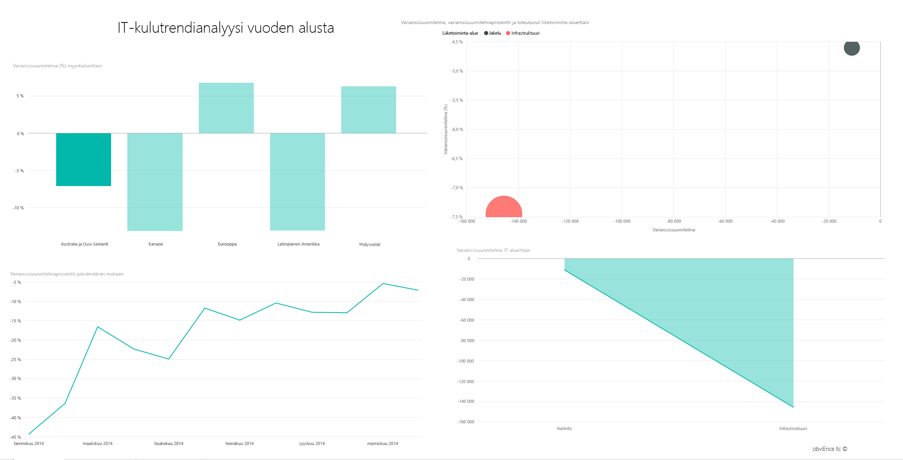
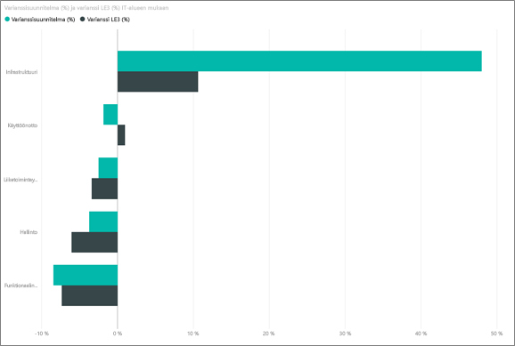
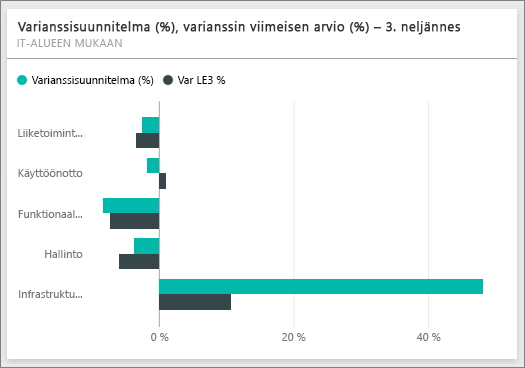
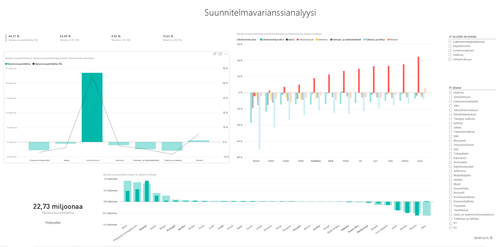

# IT-kulutusanalyysimalli Power BI:lle: aloita esittely

## IT-kulutusanalyysimallin yleiskuva
IT-kulutusanalyysin [sisältöpaketti](service-organizational-content-pack-introduction.md) (koontinäyttö, raportti ja tietojoukko) analysoi IT-osaston suunnitellut ja todelliset kulut. Tämän vertailun avulla voi arvioida sitä, kuinka hyvin yritys suunnitteli vuoden, sekä tutkia osa-alueita, jotka poikkeavat merkittävästi suunnitelmasta. Esimerkin yritys käyttää vuosittaista ennustejaksoa ja tuottaa neljännesvuosittain uusimman arvion, jonka avulla voidaan analysoida IT-osaston kuluissa tilivuoden aikana tapahtuneita muutoksia.

Tämä malli kuuluu sarjaan, jossa esitellään, miten Power BI:tä voidaan käyttää liiketoimintaan suuntautuneiden tietojen, raporttien ja koontinäyttöjen kanssa. Nämä ovat oikeita tietoja obviEnceltä (<http://obvience.com/>), jotka on muunnettu nimettömään muotoon.

## Edellytykset

 Ennen kuin voit käyttää mallia, se on ensin ladattava [sisältöpakettina](https://docs.microsoft.com/power-bi/sample-it-spend#get-the-content-pack-for-this-sample), [.pbix-tiedostona](http://download.microsoft.com/download/E/9/8/E98CEB6D-CEBB-41CF-BA2B-1A1D61B27D87/IT%20Spend%20Analysis%20Sample%20PBIX.pbix) tai [Excel-työkirjana](http://go.microsoft.com/fwlink/?LinkId=529783).

### Mallin sisältöpaketin noutaminen

1. Avaa Power BI -palvelu (app.powerbi.com) ja kirjaudu sisään.
2. Valitse vasemmasta alakulmasta **Nouda tiedot**.
   
    
3. Valitse ilmestyvältä Nouda tiedot -sivulta **Mallit**-kuvake.
   
   
4. Valitse **IT-kulutusanalyysimalli** ja **Yhdistä**.  
  
   
   
5. Power BI tuo sisältöpaketin ja lisää uuden koontinäytön, raportin ja tietojoukon senhetkiseen työtilaasi. Uusi sisältö merkitään keltaisella tähdellä. 
   
   
  
### Hae tämän mallin .pbix-tiedosto

Vaihtoehtoisesti voit ladata näytteen .pbix-tiedostona, joka on suunniteltu käytettäväksi Power BI Desktopilla. 

 * [IT-kulutusanalyysimalli](http://download.microsoft.com/download/E/9/8/E98CEB6D-CEBB-41CF-BA2B-1A1D61B27D87/IT%20Spend%20Analysis%20Sample%20PBIX.pbix)

### Hae tämän näytteen Excel-työkirja
Voit myös [ladata vain tietojoukon (Excel-työkirjan)](http://go.microsoft.com/fwlink/?LinkId=529783) tälle mallille. Työkirja sisältää Power View -taulukoita, joita voit tarkastella ja muokata. Raakatiedot saa näkyviin valitsemalla **Power Pivot > Hallinta**.

## IT-kulutusanalyysimallin koontinäyttö
Koontinäytön kaksi numeroruutua, **Varianssisuunnitelma %** ja **Varianssin uusin arvio % 3. vuosineljännes**, antavat yleiskuvan siitä, miten yritys on suoriutunut verrattuna suunnitelmaan ja uusimpaan vuosineljännesarvioon (LE3 = uusin arvio 3. vuosineljännes). Yhteensä ero suunnitelmaan on noin 6 prosenttia. Tutkitaan, mistä varianssi johtuu – milloin, missä ja missä luokassa?

## ”IT-kulutrendianalyysi vuoden alusta” -sivu
**Varianssisuunnitelma % myyntialueittain** -koontinäyttöruudun valitseminen siirtää sinut IT-kulutusanalyysimallin raportin ”IT-kulutrendianalyysi” -sivulle. Näemme yhdellä silmäyksellä, että varianssi on positiivinen Yhdysvalloissa ja Euroopassa sekä negatiivinen Kanadassa, Latinalaisessa Amerikassa ja Australiassa. Yhdysvalloissa on noin 6 % +LE-varianssi ja Australiassa on noin 7 % -LE-varianssi.

Mutta vain tämän kaavion katsominen ja päätelmien tekeminen sen perusteella voi olla harhaanjohtavaa. Meidän on tutustuttava todellisiin rahamääriin, jos haluamme todellisen kuvan asioista.

1. Valitse **Aus ja NZ** Varianssisuunnitelma % myyntialueittain -kaaviossa ja katso Varianssisuunnitelma IT-alueittain -kaaviota.

   
2. Valitse seuraavaksi **USA**. Näet, miten asiat ovat – Australia vastaa hyvin pienestä osasta kokonaiskulutuksestamme Yhdysvaltoihin verrattuna.

    Joten, rajoitamme analyysin Yhdysvaltoihin, mitä nyt? Katsotaan, mikä luokka Yhdysvalloissa aiheuttaa varianssin.

## Kysymysten kysyminen tiedoista
1. Valitse **IT-kulutusanalyysimalli** yläreunan siirtymispalkista ja palaa koontinäyttöihin.
2. Kirjoita kysymysruutuun ”Näytä IT alueiden, varianssisuunnitelman % ja le3-varianssin % palkkikaavio”.

   

   Ensimmäisellä IT-alueella (**infrastruktuuri**) prosenttiosuus on muuttunut huomattavasti alkuperäisen varianssisuunnitelman ja varianssisuunnitelman uusimman arvion välillä.

## ”YTD-kulutus kustannustasoittain” -sivu
Siirry takaisin koontinäytölle ja katso **Varianssisuunnitelma %, Varianssi LE3 %** -koontinäyttöruutua.

Infrastruktuuri erottuu joukosta suurella positiivisella varianssilla suunnitelmaan verrattuna.

1. Napsauttamalla tätä ruutua voit siirtyä ”YTD-kulutus kustannustasoittain” -sivulle IT-kulutusanalyysimalli-raportissa.
2. Napsauta **Infrastruktuuri**-palkkia vasemmassa alakulmassa olevassa ”Varianssisuunnitelma ja varianssi LE3 % IT-alueittain”-kaaviossa ja katso, mikä on varianssi suunnitelmaan verrattuna ”Varianssisuunnitelma % myyntialueittain” -kohdassa vasemmalla.

    
3. Napsauta kunkin kustannustasoryhmän nimeä sektorissa löytääksesi kustannustasot suurella varianssilla.
4. Kun **Muu** on valittuna, valitse **Infrastruktuuri** IT-alueella ja napsauta alialuetta IT-alialue-sektorissa suurimmalla varianssilla varustetun alialueen löytämiseksi.  

   Huomaamme, että varianssi on suurta **Verkkopalveluissa**.

   Ilmeisesti yritys päätti antaa työntekijöilleen puhelinpalveluita etuutena, mutta tekoa ei suunniteltu.

## ”Suunnitelmavarianssianalyysi”-sivu
Raportissa siirry raportin sivulle 3 napsauttamalla ”Suunnitelmavarianssianalyysi”-välilehteä raportin alareunassa.

”Varianssisuunnitelma ja Varianssisuunnitelma % liiketoiminta-alueittain” -yhdistelmäkaaviossa vasemmalla korosta muualla sivulla olevat infrastruktuuriarvot napsauttamalla infrastruktuurisaraketta.

Voit huomata ”Varianssisuunnitelma % kuukausittain ja liiketoiminta-alueittain” -kaaviossa, että infrastruktuurissa alkoi olla positiivista varianssia suunnilleen helmikuussa, minkä jälkeen se on jatkanut kasvamistaan. Voit myös huomata, miten varianssi infrastruktuurin suunnitelma-arvoon vaihtelee maan mukaan, verrattuna kaikkien liiketoiminta-alueiden arvoon. Oikealla olevien ”IT-alue”- ja ”IT-alialueet” -sektoreiden avulla voit suodattaa muualla sivulla olevia arvoja niiden korostamisen sijaan. Tutki tietoja toisella tavalla napsauttamalla eri IT-alueita oikealla. Voit myös napsauttaa IT-alialueita ja nähdä varianssin kyseisellä tasolla.

## Muokkaa raporttia
Valitse **Muokkaa raporttia** vasemmassa yläkulmassa ja tutustu muokkausnäkymään.

* Katso, miten sivut muodostetaan – kunkin kaavion kentät, sivuilla olevat suodattimet
* Lisää sivuja ja kaavioita perustuen samoihin tietoihin
* Muuta kunkin kaavion visualisointityyppiä
* Kiinnitä ne koontinäyttöösi

Tämä on turvallinen ympäristö kaikenlaisille kokeiluille. Voit aina jättää tekemäsi muutokset tallentamatta. Jos kuitenkin tallennat ne, voit aina siirtyä Nouda tiedot -kohtaan, jolloin saat mallista uuden kopion.

## Seuraavat vaiheet: Yhdistä tietoihisi
Toivomme, että tämä esittely on osoittanut, miten Power BI -koontinäytöt, Q&A ja raportit voivat tarjota uusia näkökulmia IT-kulutustietoihin. Nyt sinun vuorosi – muodosta yhteys omiin tietoihisi. Power BI:n avulla voit yhdistää useita eri tietolähteitä. Lisätietoja [Power BI:n käytön aloittamisesta](service-get-started.md).
