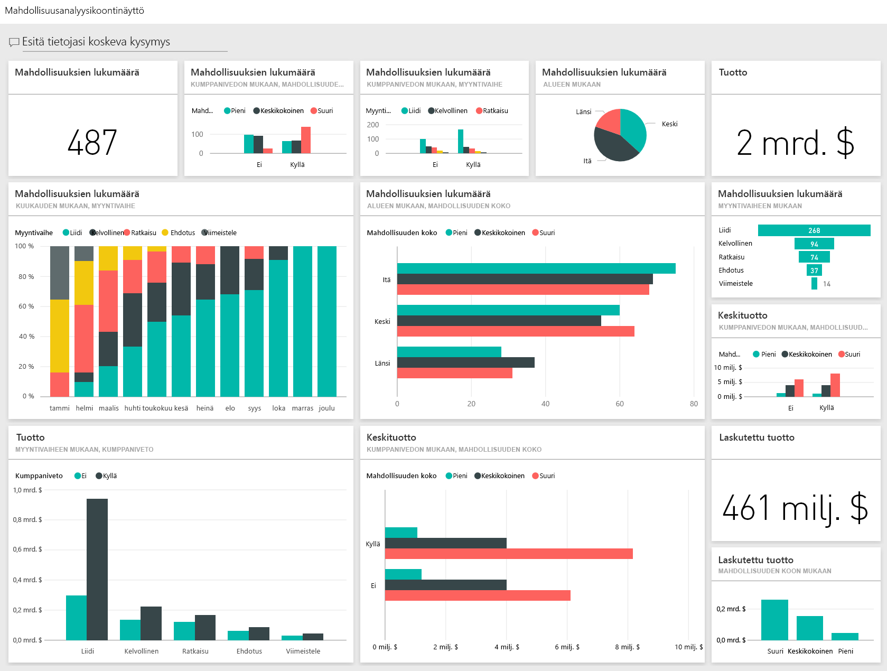
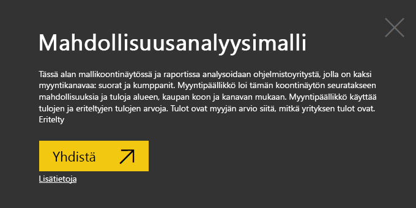
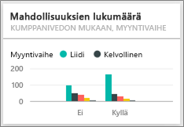

# Mahdollisuusanalyysimalli Power BI:lle: aloita esittely

## Mahdollisuusanalyysimallin yleiskatsaus
**Mahdollisuusanalyysimalli** sisältää koontinäytön (ja siihen liittyvän raportin) ohjelmistoyritykselle, jolla on 2 myyntikanavaa: *suora* ja *kumppani*. Myyntipäällikkö loi tämän koontinäytön seuratakseen mahdollisuuksia ja tuloja alueen, kaupan koon ja kanavan mukaan.

Myyntipäällikkö käyttää kahta tuottoa koskevaa mittaria:

* **Tuotto** – tämä on myyjän arvio siitä, mikä tuotto on.
* **Laskutettu tuotto** – tämä lasketaan kaavalla Tuotto X Todennäköisyysprosentti, ja sen hyväksytään yleisesti olevan tarkempi ennuste todellisesta myyntituotosta. Todennäköisyyden määrittää kaupan senhetkinen ***myynnin vaihe***.
  * Liidi – 10 %  
  * Kvalifioidut – 20 %  
  * Ratkaisu – 40 %  
  * Ehdotus – 60 %  
  * Viimeistely – 80 %

  

Tämä malli kuuluu sarjaan, jossa esitellään, miten Power BI:tä voidaan käyttää liiketoimintaan suuntautuneiden tietojen, raporttien ja koontinäyttöjen kanssa. Nämä ovat obviEnceltä ([www.obvience.com)](http://www.obvience.com/) saatuja oikeita tietoja, jotka on tehty nimettömiksi.

## Edellytykset

 Ennen kuin voit käyttää mallia, se on ensin ladattava [sisältöpakettina](https://docs.microsoft.com/power-bi/sample-opportunity-analysis#get-the-content-pack-for-this-sample), [.pbix-tiedostona](http://download.microsoft.com/download/9/1/5/915ABCFA-7125-4D85-A7BD-05645BD95BD8/Opportunity%20Analysis%20Sample%20PBIX.pbix) tai [Excel-työkirjana](http://go.microsoft.com/fwlink/?LinkId=529782).

### Mallin sisältöpaketin noutaminen

1. Avaa Power BI -palvelu (app.powerbi.com) ja kirjaudu sisään.
2. Valitse vasemmasta alakulmasta **Nouda tiedot**.
   
    
3. Valitse ilmestyvältä Nouda tiedot -sivulta **Mallit**-kuvake.
   
   
4. Valitse **Mahdollisuusanalyysimalli** ja valitse sitten **Yhdistä**.  
  
   
   
5. Power BI tuo sisältöpaketin ja lisää uuden koontinäytön, raportin ja tietojoukon senhetkiseen työtilaasi. Uusi sisältö merkitään keltaisella tähdellä. 
   
   
  
### Hae tämän mallin .pbix-tiedosto

Vaihtoehtoisesti voit ladata näytteen .pbix-tiedostona, joka on suunniteltu käytettäväksi Power BI Desktopilla. 

 * [Mahdollisuusanalyysimalli](http://download.microsoft.com/download/9/1/5/915ABCFA-7125-4D85-A7BD-05645BD95BD8/Opportunity%20Analysis%20Sample%20PBIX.pbix)

### Hae tämän näytteen Excel-työkirja
Voit myös [ladata vain tietojoukon (Excel-työkirjan)](http://go.microsoft.com/fwlink/?LinkId=529782) tälle mallille. Työkirja sisältää Power View -taulukoita, joita voit tarkastella ja muokata. Raakatiedot saa näkyviin valitsemalla **Power Pivot > Hallinta**.

## Mitä koontinäyttö kertoo?
Myyntipäällikkö on luonut koontinäytön itselleen tärkeimpien arvojen seuraamista varten. Kun hän näkee jotakin mielenkiintoista, hän voi valita ruudun ja perehtyä tietoihin tarkemmin.

1. Yrityksen tuotto on 2 miljardia dollaria ja laskutettu tuotto on 461 miljoonaa dollaria.
2. Mahdollisuuksien lukumäärä ja tuotto seuraavat tunnettua suppilomallia siten, että kokonaismäärät pienenevät kussakin myöhemmässä vaiheessa.
3. Useimmat mahdollisuudet ovat itäisellä alueella.
4. Suuret mahdollisuudet tuottavat enemmän tuottoa kuin keskikokoiset tai pienet mahdollisuudet.
5. Kumppanin suuret sopimukset tuottavat enemmän tuottoa: keskimäärin 8 miljoonaa dollaria verrattuna suoran myynnin 6 miljoonaan dollariin.

Koska panostus sopimuksen saamiseen on sama riippumatta siitä, onko sopimus luokiteltu suureksi, keskikokoiseksi vai pieneksi, yrityksemme pitää perehtyä tietoihin, jotta saamme lisätietoa suurista mahdollisuuksista.

Valitse **Mahdollisuuksien lukumäärä kumppanivedon ja myyntivaiheen mukaan** -ruutua, jotta raportin sivu 1 avautuu.  

## Raportin sivujen tutkiminen
### Raportin sivun 1 otsikko on Mahdollisuuksien lukumäärän yleiskatsaus.

* Itä on suurin alueemme mahdollisuuksien lukumäärällä mitattuna.  
* Valitse ympyräkaaviosta kukin alue yksi kerrallaan sivun suodattamiseksi. Kunkin alueen kumppanit tavoittelevat merkittävästi enemmän suuria mahdollisuuksia.   
* Mahdollisuuksien lukumäärä kumppanivedon ja mahdollisuuden koon mukaan -pylväskaavio näyttää selvästi, että valtaosa suurista mahdollisuuksista on kumppanivetoisia ja isompi osa pienistä ja keskisuurista mahdollisuuksista ei ole kumppanivetoisia.
* Valitse kukin myyntivaihe vasemman alakulman palkkikaaviosta nähdäksesi aluekohtaisen lukumääräeron. Huomaa, että vaikka Itä on suurin alueemme lukumäärän mukaan mitattuna, Ratkaisu-, Ehdotus- ja Viimeistely-vaiheissa kaikilla 3 alueella on verrattavissa olevat lukumäärät. Tämä tarkoittaa sitä, että sopimusten viimeistelyn prosenttiosuus on suurempi maan keski- ja länsiosissa.

### Raportin sivun 2 otsikko on Tuoton yleiskatsaus.
Tällä sivulla tietoja tarkastellaan samankaltaisella tavalla, mutta lukumäärän sijaan perspektiivinä on tuotto.  

* Itä on suurin alueemme mahdollisuuksien lukumäärän lisäksi myös tuotolla mitattuna.  
* Kumppanivedon perusteella suodattaminen (valitse **Kyllä** oikean yläkulman selitteessä) paljastaa, että tuotto on 1,5 miljardia dollaria ja 294 miljoonaa dollaria. Muussa kuin kumppanivedossa tuotto on 644 miljardia dollaria ja 166 miljoonaa dollaria.  
* Suurten tilien keskimääräinen tuotto on suurempi (8 miljoonaa), jos mahdollisuus on kumppanivetoinen, verrattuna muuhun kuin kumppanivetoon, jossa keskimääräinen tuotto on 6 miljoonaa.  
* Kumppanivetoisessa liiketoiminnassa suurten mahdollisuuksien keskimääräinen tuotto on lähes kaksinkertainen keskikokoisiin mahdollisuuksiin verrattuna (4 miljoonaa).  
* Pienten ja keskisuurten liiketoimien keskimääräinen tuotto on vastaava sekä kumppanivetoisessa että muussa kuin kumppanivetoisessa liiketoiminnassa.   

Kumppanit onnistuvat selvästi paremmin myynnissä asiakkaille.  Sopimusten kanavoiminen entistä enemmän kumppaneiden kautta voisi olla järkevää.

### Raportin sivun 3 otsikko on Aluevaiheen lukumäärät.
Tällä sivulla tutkitaan samankaltaisia tietoja, mutta tiedot eritellään alueen ja vaiheen mukaan.  

* Suodattaminen idän mukaan (valitse **Itä** ympyräkaaviosta) paljastaa, että idässä mahdollisuudet jakautuvat lähes tasan kumppanivetoisiin ja muihin kuin kumppanivetoisiin.
* Suuri mahdollisuudet ovat yleisimpiä keskialueella, pienet mahdollisuudet ovat yleisimpiä idässä ja keskisuuret mahdollisuudet ovat yleisimpiä lännessä.

### Raportin sivun 4 otsikko on Tulevat mahdollisuudet.
Tarkastelemme jälleen samankaltaisia tekijöitä, mutta tällä kertaa perspektiivinä on päivämäärä/aika.  

Talousjohtajamme käyttää tätä sivua kuormitusten hallintaan. Perehtymällä tuottomahdollisuuksiin myyntivaiheen ja kuukauden mukaan hän voi suunnitella työt asianmukaisesti.

* Viimeistely-vaiheessa keskimääräinen tuotto on suurin. Näiden sopimusten saaminen on etusijalla.
* Suodatus kuukauden mukaan (valitsemalla vasemmanpuoleisessa osittajassa kuukauden nimi) näyttää, että tammikuussa suuria sopimuksia on suhteellisesti eniten Viimeistely-vaiheessa ja laskutettu tuotto on 75 miljoonaa dollaria. Helmikuussa sen sijaan keskikokoisia sopimuksia on eniten Ratkaisu- ja Ehdotus-vaiheissa.
* Yleensä laskutetun tuoton luvut vaihtelevat myyntivaiheen, mahdollisuuksien lukumäärän ja sopimuksen koon mukaan. Saat näkyviin lisää merkityksellisiä tietoja lisäämällä näihin tekijöihin suodattimia (käyttämällä oikeassa reunassa olevaa suodatinruutua).

Tämä on turvallinen ympäristö kaikenlaisille kokeiluille. Voit aina jättää tekemäsi muutokset tallentamatta. Jos kuitenkin tallennat ne, voit aina siirtyä **Nouda tiedot** -kohtaan, jolloin saat mallista uuden kopion.

## Seuraavat vaiheet: Yhdistä tietoihisi
Toivomme, että tämä esittely on osoittanut, miten Power BI -koontinäytöt, kysymysosio ja raportit voivat tarjota uusia näkökulmia mahdollisuuksien seurantatietoihin. Nyt sinun vuorosi – muodosta yhteys omiin tietoihisi. Power BI:n avulla voit muodostaa yhteyden useisiin eri tietolähteisiin. Lisätietoja [Power BI:n käytön aloittamisesta](service-get-started.md).

[Lataa mallit](sample-datasets.md)  
