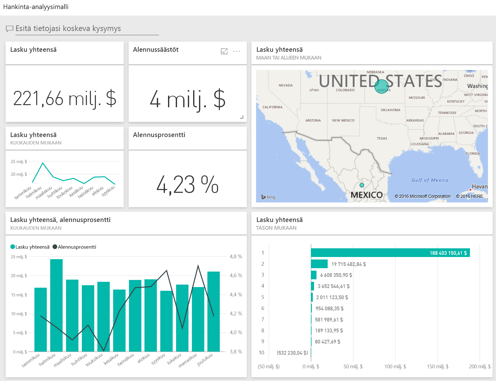
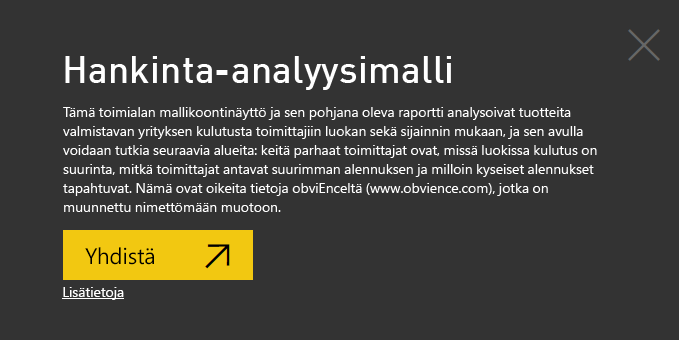
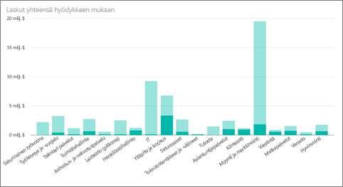
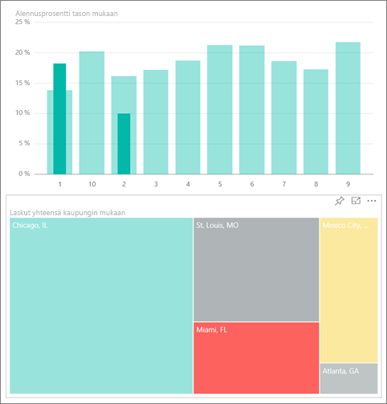
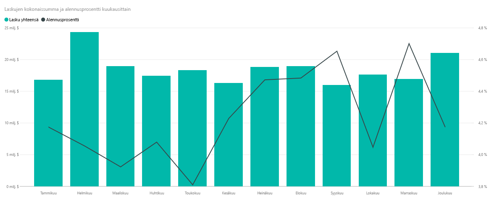
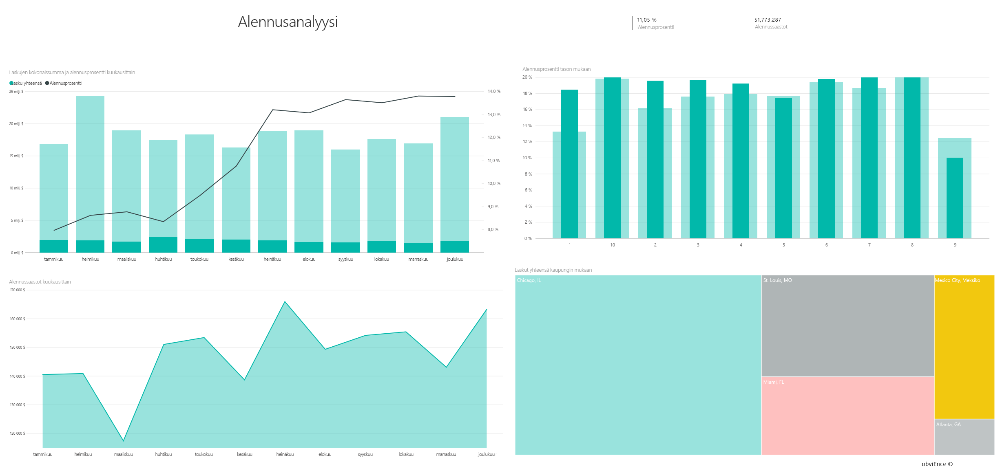

# Hankinta-analyysimalli Power BI:lle: aloita esittely

Hankinta-analyysimallin sisältöpaketti sisältää koontinäytön, raportin ja tietojoukon, joka analysoi valmistavan yrityksen toimittajiin kohdistuvaa kulutusta luokan sekä sijainnin mukaan. Mallissa tutustumme seuraaviin alueisiin:

* Keitä parhaat toimittajat ovat
* Mihin luokkiin kulutamme eniten
* Mitkä toimittajat antavat meille suurimman alennuksen ja milloin

Tämä malli kuuluu sarjaan, jossa esitellään, miten Power BI:tä voidaan käyttää liiketoimintaan suuntautuneiden tietojen, raporttien ja koontinäyttöjen kanssa. [ObviEnce](http://www.obvience.com/) on luonut sen käyttämällä oikeita tietoja, jotka on muunnettu nimettömään muotoon. Tiedot ovat käytettävissä useissa muodoissa: sisältöpaketti, Power BI Desktopin .pbix-tiedosto tai Excel-työkirja. Tutustu [Power BI:n malleihin](sample-datasets.md). 

Tässä opetusohjelmassa tutustutaan Power BI -palvelun hankinta-analyysimallin sisältöpakettiin. Koska raportin käyttökokemus on hyvin samankaltainen Power BI Desktopissa ja palvelussa, voit seurata ohjelmaa myös käyttämällä Power BI Desktopin mallin .pbix-tiedostoa. 

Et tarvitse Power BI -käyttöoikeutta Power BI Desktopin malleihin tutustumiseen. Jos sinulla ei ole Power BI Pro -käyttöoikeutta, voit tallentaa mallin omaan työtilaasi Power BI -palvelussa. 

## Hanki malli

Ennen kuin voit käyttää mallia, se on ensin ladattava [sisältöpakettina](#get-the-content-pack-for-this-sample), [.pbix-tiedostona](#get-the-pbix-file-for-this-sample) tai [Excel-työkirjana](#get-the-excel-workbook-for-this-sample).

### Mallin sisältöpaketin noutaminen

1. Avaa Power BI -palvelu (app.powerbi.com), kirjaudu sisään ja avaa työtila, johon haluat tallentaa mallin. 

    Jos sinulla ei ole Power BI Pro -käyttöoikeutta, voit tallentaa mallin omaan työtilaasi.

2. Valitse vasemmasta alakulmasta **Nouda tiedot**.

    
3. Valitse avautuvalta **Nouda tiedot** -sivulta **Mallit**.

4. Valitse **Hankinta-analyysimalli** ja sitten **Yhdistä**.  
  
   
   
5. Power BI tuo sisältöpaketin ja lisää sitten uuden koontinäytön, raportin ja tietojoukon senhetkiseen työtilaasi.
   
   
  
### Hae tämän mallin .pbix-tiedosto

Vaihtoehtoisesti voit ladata hankinta-analyysimallin [.pbix-tiedostona](https://download.microsoft.com/download/D/5/3/D5390069-F723-413B-8D27-5888500516EB/Procurement%20Analysis%20Sample%20PBIX.pbix), joka on suunniteltu käytettäväksi Power BI Desktopilla. 

### Hae tämän näytteen Excel-työkirja

Jos haluat perehtyä tämän mallin tietolähteeseen, se on saatavana myös [Excel-työkirjana](https://go.microsoft.com/fwlink/?LinkId=529784). Työkirja sisältää Power View -taulukoita, joita voit tarkastella ja muokata. Saat raakatiedot näkyviin ottamalla käyttöön Tietojen analysointi -apuohjelmat ja valitsemalla sitten **Power Pivot > Hallinta**. Voit ottaa Power View- ja Power Pivot -apuohjelmat käyttöön [tutustumalla Excelin sisältämien Excel-mallien](sample-datasets.md#optional-take-a-look-at-the-excel-samples-from-inside-excel-itself) lisätietoihin.

## Kulutuksen trendit
Aloitetaan tutustumalla kulutuksen trendeihin luokan ja sijainnin mukaan.  

1. Avaa **Koontinäytöt**-välilehti työtilassa, johon tallensit mallin, etsi sitten **Hankinta-analyysimalli**-koontinäyttö ja valitse se. 
2. Valitse koontinäytön ruutu, **Laskut yhteensä maan ja alueen mukaan**, joka avaa **Hankinta-analyysimalli** -raportin **Kulujen yleiskatsaus**-sivun.

    

Huomioi seuraavat tiedot:

* **Laskut yhteensä kuukauden ja luokan mukaan**  -viivakaaviossa **Suora**-luokassa on yhtenäinen kulutus, **Logistiikka** on huipussaan joulukuussa ja  **Muut** on huipussaan helmikuussa.
* **Laskut yhteensä maan ja alueen mukaan** -kartassa suurin osa kulutuksesta tapahtuu Yhdysvalloissa.
* **Laskut yhteensä alaluokan mukaan** -pylväskaaviossa **Laitteistot** ja **Epäsuorat hyödykkeet ja palvelut** ovat suurimmat kulutusluokat.
* **Laskut yhteensä tason mukaan** -pylväskaaviossa suurin osa liiketoiminnasta tapahtuu 1. tason (Top 10) toimittajien kanssa. Näin voimme parantaa toimittajasuhteiden hallintaa.

## Kulutus Meksikossa
Tutustutaan Meksikon kulutusalueisiin.

1. Valitse **Laskutus yhteensä maan ja alueen mukaan** -kartasta **Meksiko**-kupla. Huomaa, että **Laskut yhteensä alaluokan mukaan** -pylväskaaviossa suurin osa kulutuksesta on **Epäsuorat hyödykkeet ja palvelut** -alaluokassa.

   
2. Poraudu alaspäin **Epäsuorat hyödykkeet ja palvelut** -sarakkeeseen:

   * Valitse **Laskut yhteensä alaluokan mukaan** -kaaviossa porautumisnuoli  kaavion oikeasta yläkulmasta.
   * Valitse **Epäsuorat hyödykkeet ja palvelut** -sarake.

      Kuten näet, selvästi suurin kulutus on **Myynti ja markkinointi** -aliluokassa.
   * Valitse **Meksiko** kartassa uudelleen.

      Meksikossa suurin kulutus on **Ylläpito ja korjaus** -aliluokassa.

      
3. Kun haluat porautua takaisin ylös, valitse kaavion vasemmassa yläkulmassa näkyvä ylöspäin osoittava nuoli.
4. Valitse porautumisnuoli uudelleen poistaaksesi porautumisen alaspäin käytöstä.  
5. Valitse **Hankinta-analyysimalli** yläreunan siirtymisruudusta ja palaa koontinäyttöihin.

## Arvioi eri kaupunkeja
Voimme arvioida eri kaupunkeja korostuksen avulla.

1. Valitse koontinäytön ruutu, **Lasku yhteensä, alennusprosentti kuukauden mukaan**, joka avaa **Hankinta-analyysimalli** -raportin **Alennusanalyysi**-sivun.
2. Vertaile kaupunkeja valitsemalla kukin niistä vuorollaan **Laskut yhteensä kaupungin mukaan** -puukartasta. Huomaa, että lähes kaikki Miamin laskut ovat 1. tason toimittajilta.

   

## Toimittaja-alennukset
Katsotaan myös toimittajilta saatavat alennukset ja ajankohdat, jolloin saamme eniten alennuksia:
* Onko alennuksissa eroa kuukausittain vai pysyvätkö ne samoina?
* Saavatko jotkut kaupungit enemmän alennuksia kuin toiset?

### Alennus kuukauden mukaan
Jos katsot **Laskujen kokonaissumma ja alennusprosentti kuukausittain** -yhdistelmäkaaviota, huomaamme, että helmikuu on kiireisin kuukausi ja syyskuu vähiten kiireinen kuukausi. 

Katso Alennusprosenttia näiltä kuukausilta: kun määrä suurenee, alennus pienenee, ja kun määrä on pieni, alennus suurenee. Mitä enemmän tarvitsemme alennusta, sitä huonomman sopimuksen saamme.

### Alennus kaupungin mukaan
Voit tutkia myös alennusta kaupungin mukaan. Valitse kukin kaupunki vuorollaan puukartassa ja katso, miten muut kaaviot muuttuvat:

* St. Louisissa oli kokonaislaskutuksen huippulukema helmikuussa ja suuri alennussäästöjen notkahdus huhtikuussa.
* Mexico Cityssä on korkein alennusprosentti (11,05 %) ja Atlantassa on pienin (0,08 %).

### Muokkaa raporttia
Valitse **Muokkaa raporttia** vasemmasta yläkulmasta ja tutustu muokkausnäkymään:

* Katso, miten sivut luodaan.
* Lisää sivuja ja kaavioita samojen tietojen perusteella.
* Muuta kaavion visualisointityyppiä – voit esimerkiksi muuttaa puukartan rengaskaavioksi.
* Kiinnitä kaavioita koontinäyttöösi.

## Seuraavat vaiheet: Yhdistä tietoihisi
Tässä ympäristössä on turvallista tehdä kokeiluja, koska voit jättää tekemäsi muutokset tallentamatta. Jos kuitenkin tallennat ne, voit aina siirtyä **Nouda tiedot** -kohtaan, jolloin saat tästä mallista uuden kopion.

Toivomme, että tämä esittely on osoittanut, miten Power BI -raporttinäkymät, Q&A ja raportit voivat tarjota uusia näkökulmia mallitietoihin. Nyt on sinun vuorosi – muodosta yhteys omiin tietoihisi. Power BI:n avulla voit yhdistää useisiin eri tietolähteisiin. Lisätietoja on artikkelissa [Power BI -palvelun käytön aloittaminen](service-get-started.md).

