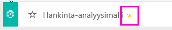

# Hankinta-analyysimalli Power BI:lle: esittely

## Hankinta-analyysimallin esittely
Tämä toimialan malliraporttinäkymä ja sen pohjana oleva raportti analysoivat valmistusyrityksen kulutusta toimittajiin luokan sekä sijainnin mukaan. Mallissa tutustumme seuraaviin alueisiin:

* Keitä parhaat toimittajat ovat
* Mihin luokkiin kulutamme eniten
* Mitkä toimittajat antavat meille suurimman alennuksen ja milloin

Tämä malli kuuluu sarjaan, jossa esitellään, miten Power BI:tä voidaan käyttää liiketoimintaan suuntautuneiden tietojen, raporttien ja raporttinäkymien kanssa. Nämä ovat oikeita tietoja obviEnceltä ([www.obvience.com)](http://www.obvience.com/) nimettömään muotoon muunnettuna.

## Edellytykset

 Ennen kuin voit käyttää mallia, se on ensin ladattava [sisältöpakettina](https://docs.microsoft.com/power-bi/sample-procurement#get-the-content-pack-for-this-sample), [.pbix-tiedostona](http://download.microsoft.com/download/D/5/3/D5390069-F723-413B-8D27-5888500516EB/Procurement%20Analysis%20Sample%20PBIX.pbix) tai [Excel-työkirjana](http://go.microsoft.com/fwlink/?LinkId=529784).

### Mallin sisältöpaketin noutaminen

1. Avaa Power BI -palvelu (app.powerbi.com) ja kirjaudu sisään.
2. Valitse vasemmasta alakulmasta **Nouda tiedot**.
   
    
3. Valitse ilmestyvältä Nouda tiedot -sivulta **Mallit**-kuvake.
   
   
4. Valitse **Hankinta-analyysimalli** ja **Yhdistä**.  
  
   
   
5. Power BI tuo sisältöpaketin ja lisää uuden koontinäytön, raportin ja tietojoukon senhetkiseen työtilaasi. Uusi sisältö merkitään keltaisella tähdellä. 
   
   
  
### Hae tämän mallin .pbix-tiedosto

Vaihtoehtoisesti voit ladata mallin .pbix-tiedostona, joka on suunniteltu käytettäväksi Power BI Desktopilla. 

 * [Hankinta-analyysimalli](http://download.microsoft.com/download/D/5/3/D5390069-F723-413B-8D27-5888500516EB/Procurement%20Analysis%20Sample%20PBIX.pbix)

### Hae tämän mallin Excel-työkirja
Voit myös [ladata vain tietojoukon (Excel-työkirjan)](http://go.microsoft.com/fwlink/?LinkId=529784) tälle mallille. Työkirja sisältää Power View -taulukoita, joita voit tarkastella ja muokata. Raakatiedot saa näkyviin valitsemalla **Power Pivot > Hallinta**.

## Kulutuksen trendit
Aloitetaan tutustumalla kulutuksen trendeihin luokan ja sijainnin mukaan.  

1. Avaa työtilasta **Raporttinäkymät**-välilehti ja valitse Hankinta-analyysi-raporttinäkymä.
2. Valitse raporttinäkymäruudussa **Kokonaislaskutus maan ja alueen mukaan**. Näyttöön avautuu Hankinta-analyysimalli-raportin Kulutuksen yleiskatsaus -sivu.

    

Huomaa muutama asia:

* **Laskut yhteensä kuukauden ja luokan mukaan**  -viivakaaviossa: **Suora**-luokassa on melko yhtenäinen kulutus, **Logistiikka** on huipussaan joulukuussa ja  **Muut** on huipussaan helmikuussa.
* **Laskut yhteensä maan ja alueen mukaan** -kartassa: suurin osa kulutuksesta tapahtuu Yhdysvalloissa.
* **Laskut yhteensä alaluokan mukaan** -pylväskaaviossa: **Laitteistot** ja **Epäsuorat hyödykkeet ja palvelut** ovat suurimmat kulutusluokat.
* Laskut yhteensä tason mukaan -pylväskaaviossa: suurin osa liiketoiminnasta tapahtuu 1. tason (Top 10) toimittajien kanssa. Tämä auttaa hallitsemaan paremmin toimittajasuhteita.

## Kulutus Meksikossa
Tutustutaan Meksikon kulutusalueisiin.

1. Valitse ympyräkaaviossa **Meksiko**-kupla. Huomaa, että Laskut yhteensä alaluokan mukaan -pylväskaaviossa suurin osa kulutuksesta on **Epäsuorat hyödykkeet ja palvelut** -alaluokassa.

   
2. Poraudu alaspäin **Epäsuorat hyödykkeet ja palvelut** -sarakkeeseen:

   * Valitse porautumisnuoli  kaavion oikeassa yläkulmassa.
   * Valitse **Epäsuorat hyödykkeet ja palvelut** -sarake.

      Suurin kulutus on selkeästi Myynti ja markkinointi -luokassa.
   * Valitse **Meksiko** kartassa uudelleen.

      Suurin kulutus tässä Meksikon luokassa on kohdassa Ylläpito ja korjaus.

      
3. Kun haluat porautua takaisin ylös, valitse kaavion vasemmassa yläkulmassa näkyvä ylöspäin osoittava nuoli.
4. Valitse nuoli uudelleen poistaaksesi porautumisen alaspäin käytöstä.  
5. Palaa takaisin työtilaan valitsemalla **Power BI** yläreunan siirtymispalkissa.

## Arvioi eri kaupunkeja
Voimme arvioida eri kaupunkeja korostuksen avulla.

1. Valitse raporttinäkymäruudussa **Lasku yhteensä, alennusprosentti kuukauden mukaan**. Raportti avautuu Alennusanalyysi-sivulle.
2. Valitse eri kaupunkeja **Laskut yhteensä kaupungin mukaan** -puukartasta vertaillaksesi niitä. Lähes kaikki Miamin laskut ovat 1. tason toimittajilta.

   

## Toimittaja-alennukset
Katsotaan myös toimittajilta saatavat alennukset ja ajankohdat, jolloin saamme eniten alennuksia.

Tarkemmin ottaen perehdymme näihin kysymyksiin:

* Onko alennuksissa eroa kuukausittain vai ovatko ne samoja joka kuukausi?
* Saavatko jotkut kaupungit enemmän alennuksia kuin toiset?

### Alennus kuukauden mukaan
Kun katsomme **Laskujen kokonaissumma ja alennusprosentti kuukausittain** -yhdistelmäkaaviota, huomaamme, että **helmikuu** on kiireisin kuukausi ja **syyskuu** vähiten kiireinen kuukausi. Katso nyt alennusprosenttia näiltä kuukausilta.
Huomaa, että kun määrä suurenee, alennus pienenee, ja kun määrä pienenee, alennus suurenee. Mitä enemmän tarvitsemme alennusta, sitä huonomman sopimuksen saamme.

### Alennus kaupungin mukaan
Voit tutkia myös alennusta kaupungin mukaan. Valitse kukin kaupunki puukartassa ja katso, miten muut kaaviot muuttuvat.

* St. Louisissa (MO) oli kokonaislaskutuksen huippulukema helmikuussa ja suuri alennussäästöjen notkahdus huhtikuussa.
* Mexico Cityssä (Meksiko) on korkein alennusprosentti (11,05 %) ja Atlantassa (GA) on pienin (0,08 %).

### Muokkaa raporttia
Valitse **Muokkaa raporttia** vasemmasta yläkulmasta ja tutustu muokkausnäkymään.

* Katso, miten sivut luodaan
* Lisää sivuja ja saman tietoihin perustuvia kaavioita
* Muuta kaavion visualisointityyppiä – voit esimerkiksi muuttaa puukartan rengaskaavioksi
* Kiinnitä ne raporttinäkymään

Tämä on turvallinen ympäristö kaikenlaisille kokeiluille. Voit aina jättää tekemäsi muutokset tallentamatta. Jos kuitenkin tallennat ne, voit aina siirtyä **Nouda tiedot** -kohtaan, jolloin saat mallista uuden kopion.

## Seuraavat vaiheet: muodosta yhteys tietoihisi
Toivomme, että tämä esittely on osoittanut, miten Power BI -raporttinäkymät ja raportit voivat tarjota uusia näkökulmia hankintatietoihin. Nyt sinun vuorosi – muodosta yhteys omiin tietoihisi. Power BI:n avulla voit yhdistää useisiin eri tietolähteisiin. Lisätietoja [Power BI:n käytön aloittamisesta](service-get-started.md).
